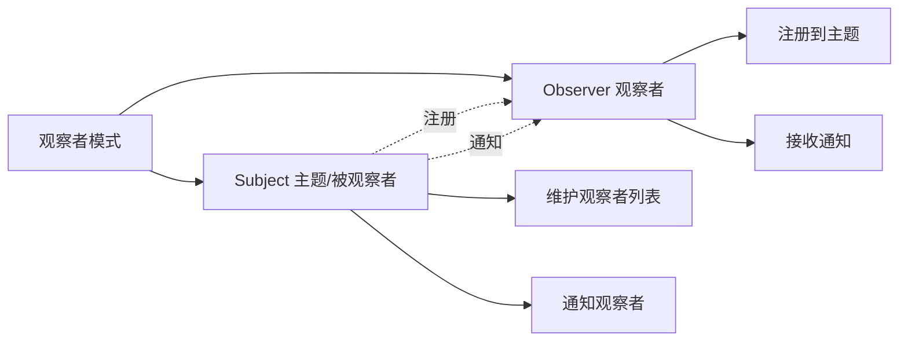
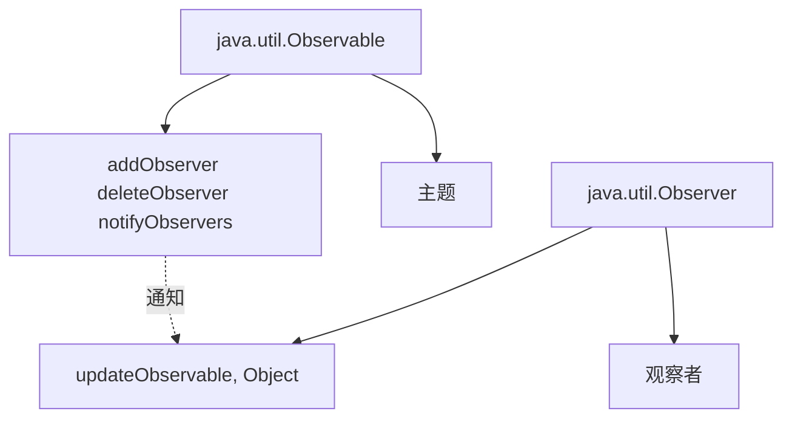
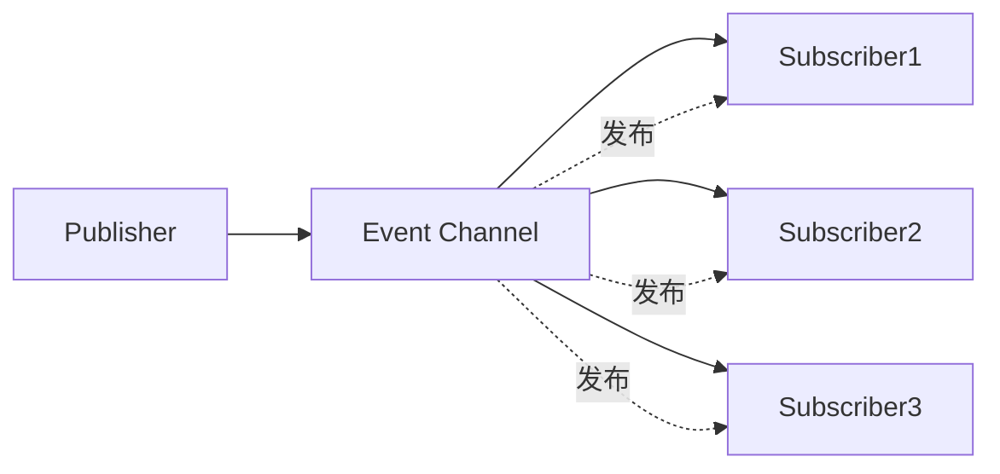
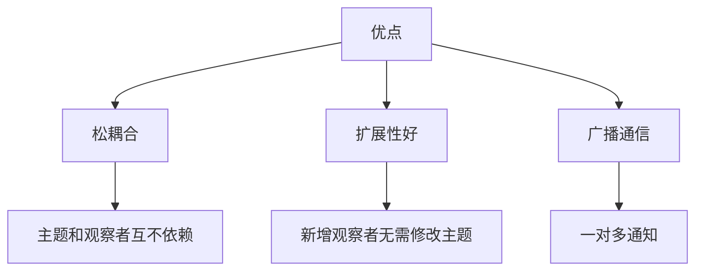
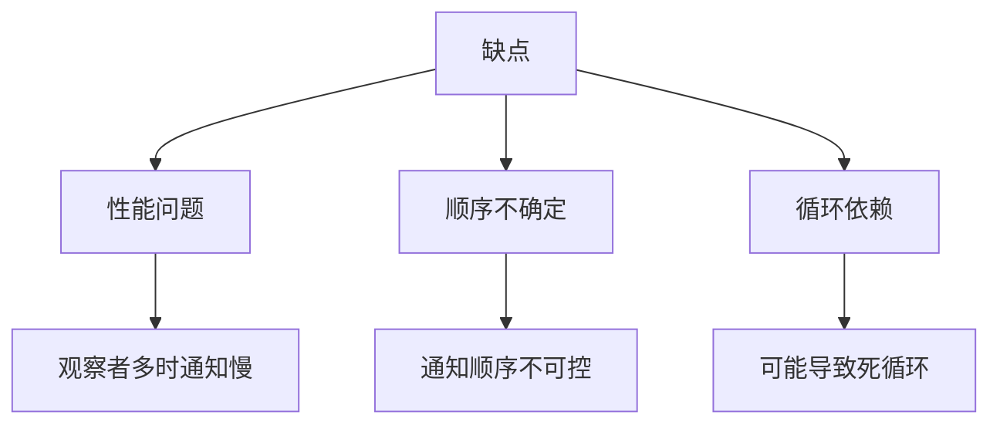

# 观察者模式

观察者模式（Observer Pattern）是一种**行为型模式**，它定义了对象之间的一对多依赖关系，当一个对象状态发生改变时，所有依赖它的对象都会得到通知。

## 观察者模式概述

### 什么是观察者模式



**观察者模式**：
- **一对多关系**：一个主题对应多个观察者
- **松耦合**：主题和观察者互不依赖
- **广播机制**：主题状态变化时通知所有观察者

::: tip 观察者模式应用场景

| 场景 | 示例 |
|------|------|
| **GUI 事件** | 按钮点击、鼠标移动 |
| **消息通知** | 邮件订阅、RSS 订阅 |
| **事件驱动** | Spring 事件、Android 广播 |
| **发布订阅** | Redis Pub/Sub、消息队列 |

:::

## 基本实现

### 自定义观察者模式

```java
import java.util.*;

// 观察者接口
interface Observer {
    void update(String message);
}

// 主题接口
interface Subject {
    void registerObserver(Observer observer);
    void removeObserver(Observer observer);
    void notifyObservers(String message);
}

// 具体主题：公众号
class WeChatAccount implements Subject {
    private String name;
    private List<Observer> observers = new ArrayList<>();
    
    public WeChatAccount(String name) {
        this.name = name;
    }
    
    @Override
    public void registerObserver(Observer observer) {
        observers.add(observer);
        System.out.println(observer + " 订阅了 " + name);
    }
    
    @Override
    public void removeObserver(Observer observer) {
        observers.remove(observer);
        System.out.println(observer + " 取消订阅 " + name);
    }
    
    @Override
    public void notifyObservers(String message) {
        System.out.println("\n" + name + " 发布文章: " + message);
        for (Observer observer : observers) {
            observer.update(message);
        }
    }
    
    // 发布文章
    public void publishArticle(String article) {
        notifyObservers(article);
    }
}

// 具体观察者：用户
class User implements Observer {
    private String name;
    
    public User(String name) {
        this.name = name;
    }
    
    @Override
    public void update(String message) {
        System.out.println(name + " 收到了新文章: " + message);
    }
    
    @Override
    public String toString() {
        return name;
    }
}

// 使用
public class ObserverDemo {
    public static void main(String[] args) {
        // 创建主题（公众号）
        WeChatAccount account = new WeChatAccount("技术干货");
        
        // 创建观察者（用户）
        User user1 = new User("张三");
        User user2 = new User("李四");
        User user3 = new User("王五");
        
        // 订阅
        account.registerObserver(user1);
        account.registerObserver(user2);
        account.registerObserver(user3);
        
        // 发布文章（所有订阅者都会收到通知）
        account.publishArticle("Java 设计模式详解");
        account.publishArticle("深入理解 Spring IOC");
        
        // 取消订阅
        account.removeObserver(user2);
        
        // 再次发布（user2 不会收到）
        account.publishArticle("实战 MyBatis 源码");
    }
}
```

## Java 内置观察者

### Observable 和 Observer



```java
import java.util.*;

// 具体主题（使用 Observable）
class NewsPublisher extends Observable {
    private String name;
    
    public NewsPublisher(String name) {
        this.name = name;
    }
    
    public void publishNews(String news) {
        System.out.println("\n" + name + " 发布新闻: " + news);
        setChanged();  // 标记状态已改变
        notifyObservers(news);  // 通知所有观察者
    }
}

// 具体观察者（实现 Observer 接口）
class NewsReader implements Observer {
    private String name;
    
    public NewsReader(String name) {
        this.name = name;
    }
    
    @Override
    public void update(Observable o, Object arg) {
        if (arg instanceof String) {
            System.out.println(name + " 收到新闻: " + arg);
        }
    }
}

// 使用
public class BuiltInObserverDemo {
    public static void main(String[] args) {
        // 创建主题
        NewsPublisher publisher = new NewsPublisher("央视新闻");
        
        // 创建观察者
        NewsReader reader1 = new NewsReader("张三");
        NewsReader reader2 = new NewsReader("李四");
        
        // 注册观察者
        publisher.addObserver(reader1);
        publisher.addObserver(reader2);
        
        // 发布新闻
        publisher.publishNews("今日头条：Java 观察者模式详解");
        publisher.publishNews("国内新闻：某地举办编程大赛");
        
        // 删除观察者
        publisher.deleteObserver(reader2);
        
        // 再次发布
        publisher.publishNews("国际新闻：AI 技术取得突破");
    }
}
```

::: warning 注意

`java.util.Observer` 和 `java.util.Observable` 已在 Java 9 中**被废弃**，推荐使用自定义观察者模式或 PropertyChangeSupport。

:::

## 发布订阅模式

### 基本实现



```java
import java.util.*;

// 事件
class Event {
    private String type;
    private String data;
    
    public Event(String type, String data) {
        this.type = type;
        this.data = data;
    }
    
    public String getType() { return type; }
    public String getData() { return data; }
}

// 订阅者接口
interface Subscriber {
    void onEvent(Event event);
}

// 发布者（主题）
class Publisher {
    private Map<String, List<Subscriber>> subscribers = new HashMap<>();
    
    // 订阅
    public void subscribe(String eventType, Subscriber subscriber) {
        subscribers.computeIfAbsent(eventType, k -> new ArrayList<>()).add(subscriber);
        System.out.println("订阅事件: " + eventType);
    }
    
    // 取消订阅
    public void unsubscribe(String eventType, Subscriber subscriber) {
        if (subscribers.containsKey(eventType)) {
            subscribers.get(eventType).remove(subscriber);
        }
    }
    
    // 发布事件
    public void publish(Event event) {
        String eventType = event.getType();
        if (subscribers.containsKey(eventType)) {
            for (Subscriber subscriber : subscribers.get(eventType)) {
                subscriber.onEvent(event);
            }
        }
    }
}

// 具体订阅者
class EmailSubscriber implements Subscriber {
    private String email;
    
    public EmailSubscriber(String email) {
        this.email = email;
    }
    
    @Override
    public void onEvent(Event event) {
        System.out.println("发送邮件到 " + email + ": " + event.getData());
    }
}

class SMSSubscriber implements Subscriber {
    private String phone;
    
    public SMSSubscriber(String phone) {
        this.phone = phone;
    }
    
    @Override
    public void onEvent(Event event) {
        System.out.println("发送短信到 " + phone + ": " + event.getData());
    }
}

// 使用
public class PubSubDemo {
    public static void main(String[] args) {
        Publisher publisher = new Publisher();
        
        // 创建订阅者
        EmailSubscriber emailSub = new EmailSubscriber("user@example.com");
        SMSSubscriber smsSub = new SMSSubscriber("13800138000");
        
        // 订阅不同事件
        publisher.subscribe("email", emailSub);
        publisher.subscribe("sms", smsSub);
        publisher.subscribe("email", new SMSSubscriber("13900139000"));  // 多个订阅者
        
        // 发布事件
        System.out.println("\n--- 发布 email 事件 ---");
        publisher.publish(new Event("email", "欢迎注册"));
        
        System.out.println("\n--- 发布 sms 事件 ---");
        publisher.publish(new Event("sms", "验证码：123456"));
    }
}
```

## 实际应用

### GUI 事件监听

```java
import javax.swing.*;
import java.awt.*;
import java.awt.event.*;

public class GUIEventDemo {
    public static void main(String[] args) {
        JFrame frame = new JFrame("事件监听示例");
        JButton button = new JButton("点击我");
        
        // 方式1：匿名内部类
        button.addActionListener(new ActionListener() {
            @Override
            public void actionPerformed(ActionEvent e) {
                System.out.println("按钮被点击（匿名内部类）");
            }
        });
        
        // 方式2：Lambda 表达式
        button.addActionListener(e -> System.out.println("按钮被点击（Lambda）"));
        
        frame.add(button);
        frame.setSize(300, 200);
        frame.setDefaultCloseOperation(JFrame.EXIT_ON_CLOSE);
        frame.setVisible(true);
    }
}
```

### Spring 事件机制

```java
import org.springframework.context.*;
import org.springframework.context.event.*;
import org.springframework.stereotype.Component;

// 自定义事件
class CustomEvent extends ApplicationEvent {
    private String message;
    
    public CustomEvent(Object source, String message) {
        super(source);
        this.message = message;
    }
    
    public String getMessage() {
        return message;
    }
}

// 事件发布者
@Component
class EventPublisher implements ApplicationContextAware {
    private ApplicationContext context;
    
    @Override
    public void setApplicationContext(ApplicationContext context) {
        this.context = context;
    }
    
    public void publishEvent(String message) {
        context.publishEvent(new CustomEvent(this, message));
    }
}

// 事件监听者
@Component
class EventListener {
    @EventListener
    public void handleCustomEvent(CustomEvent event) {
        System.out.println("收到事件: " + event.getMessage());
    }
}
```

## 观察者模式优缺点

### 优点



### 缺点



## 观察者模式 vs 其他模式

### 对比

| 模式 | 一对多 | 解耦 | 使用场景 |
|------|--------|------|----------|
| **观察者模式** | ✅ | ✅ | 对象状态变化通知 |
| **发布订阅模式** | ✅ | ✅✅ | 异步消息传递 |
| **中介者模式** | ✅ | ✅✅ | 复杂交互协调 |

## 小结

::: tip 核心要点

1. **观察者模式**：定义对象间一对多依赖关系
2. **核心角色**：
   - Subject（主题）：被观察者，维护观察者列表
   - Observer（观察者）：接收主题通知
3. **工作流程**：
   - 观察者注册到主题
   - 主题状态变化时通知所有观察者
   - 观察者收到通知后执行相应操作
4. **应用场景**：GUI 事件、消息通知、事件驱动
5. **实现方式**：
   - 自定义观察者模式
   - Java 内置 Observable（已废弃）
   - 发布订阅模式

:::

::: warning 注意事项

1. **避免循环依赖**：观察者和主题相互观察可能导致死循环
2. **性能考虑**：观察者过多时通知可能很慢
3. **通知顺序**：默认情况下通知顺序不确定
4. **内存泄漏**：注意及时取消订阅，避免内存泄漏

:::

::: info 延伸学习

- **Spring 事件**：ApplicationEvent、@EventListener
- **消息队列**：RabbitMQ、Kafka 发布订阅
- **响应式编程**：RxJava 观察者模式实现

:::
