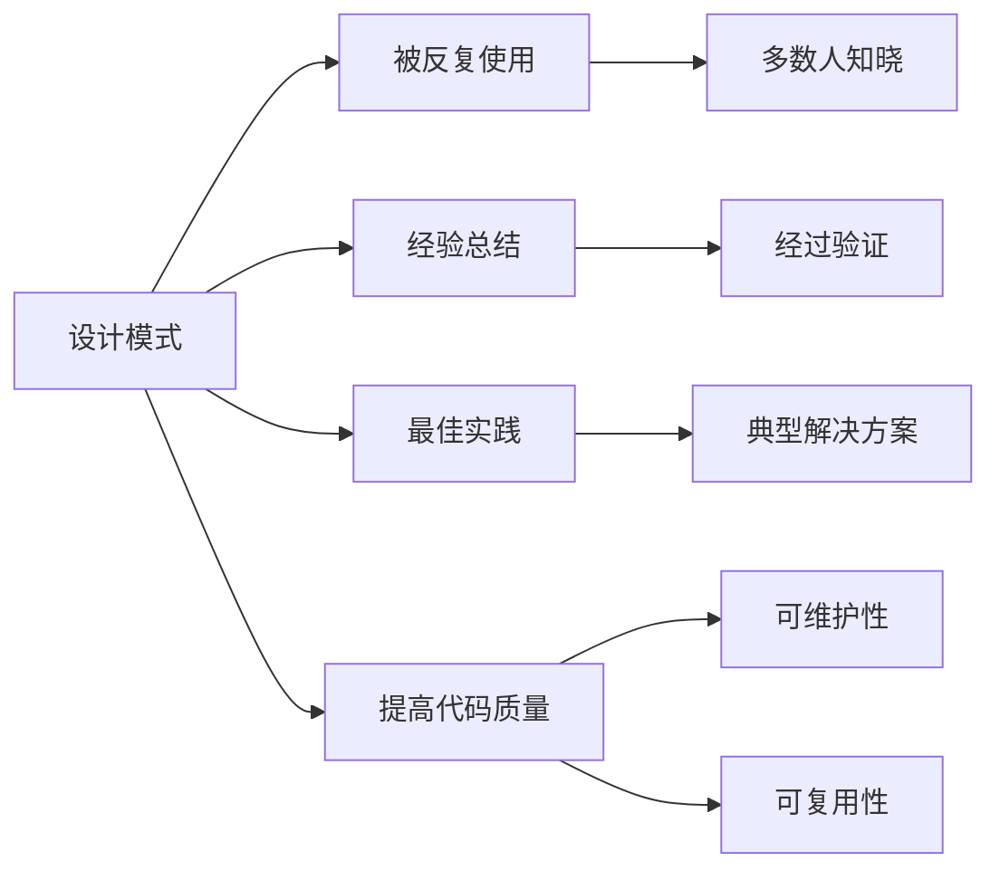
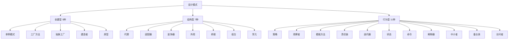
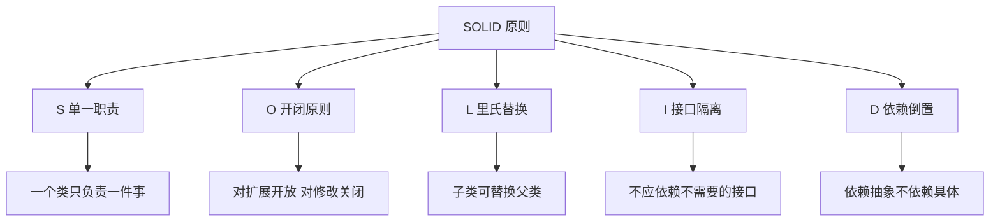
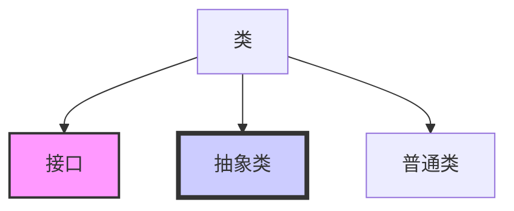
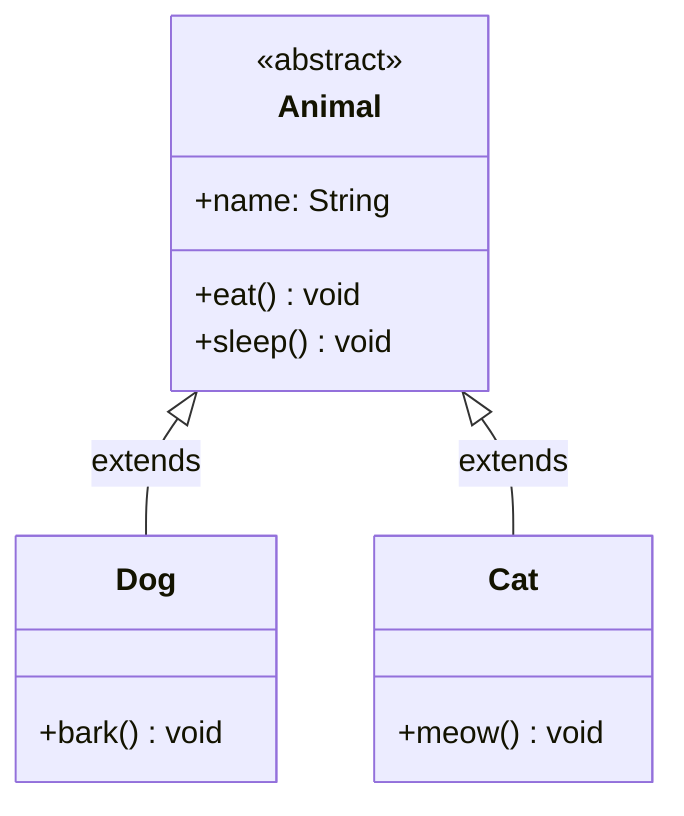
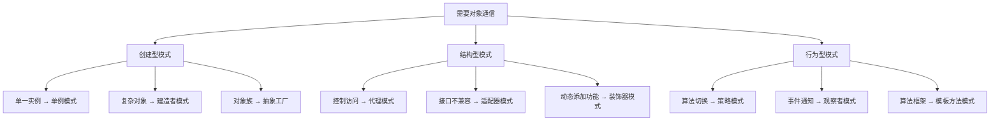

# 设计模式概述

设计模式是软件开发中**常见问题的典型解决方案**。本节介绍设计模式的基本概念和分类。

## 设计模式简介

### 什么是设计模式



**设计模式**：
- **被反复使用**：在软件开发中被广泛使用
- **经验总结**：前人经验的结晶
- **最佳实践**：经过验证的解决方案
- **提高质量**：使代码更易维护和复用

::: tip 设计模式不是什么

设计模式不是：
- ❌ 代码模板，不能直接套用
- ❌ 具体算法，而是解决问题的思路
- ❌ 适用于所有场景，需要根据情况选择

:::

### 设计模式的起源

**GoF（Gang of Four）**：
- **Erich Gamma**、**Richard Helm**、**Ralph Johnson**、**John Vlissides**
- 1994 年合著《设计模式：可复用面向对象软件的基础》
- 提出了 **23 种经典设计模式**

## 设计模式分类

### 三大类设计模式



### 创建型模式

**目的**：**对象的创建**和使用分离

| 模式 | 说明 | 使用场景 |
|------|------|----------|
| **单例模式** | 确保一个类只有一个实例 | 配置管理器、连接池 |
| **工厂方法** | 由子类决定创建什么类 | 日志记录器、数据库驱动 |
| **抽象工厂** | 创建相关对象族 | 跨平台 UI 组件 |
| **建造者** | 分步骤创建复杂对象 | 构建复杂对象 |
| **原型** | 通过复制创建对象 | 创建成本较高的对象 |

### 结构型模式

**目的**：**类和对象的组合**

| 模式 | 说明 | 使用场景 |
|------|------|----------|
| **代理模式** | 控制对象访问 | 远程代理、虚拟代理 |
| **适配器模式** | 接口转换 | 兼容旧接口 |
| **装饰器模式** | 动态添加功能 | IO 流、GUI 组件 |
| **外观模式** | 简化接口 | 复杂系统的简化入口 |
| **桥接模式** | 分离抽象和实现 | 跨平台实现 |
| **组合模式** | 树形结构 | 文件系统、菜单 |
| **享元模式** | 共享对象 | 字符串常量池、缓存 |

### 行为型模式

**目的**：**对象之间的通信**

| 模式 | 说明 | 使用场景 |
|------|------|----------|
| **策略模式** | 算法封装 | 排序算法、支付方式 |
| **观察者模式** | 一对多依赖 | 事件监听、发布订阅 |
| **模板方法** | 算法框架 | Servlet、JUnit |
| **责任链模式** | 链式处理 | 日志记录、审批流程 |
| **迭代器模式** | 遍历集合 | 集合框架 |
| **状态模式** | 状态切换 | 订单状态、工作流 |
| **命令模式** | 请求封装 | 宏命令、撤销操作 |
| **解释器模式** | 语法解释 | 正则表达式、SQL |
| **中介者模式** | 集中通信 | 聊天室、MVC |
| **备忘录模式** | 状态保存 | 撤销操作 |
| **访问者模式** | 操作分离 | 编译器、文档处理 |

## 设计原则

### SOLID 原则



#### S - 单一职责原则（SRP）

**定义**：一个类只负责一件事

```java
// ❌ 违反单一职责
class User {
    public void save() { /* 保存用户 */ }
    public void sendEmail() { /* 发送邮件 */ }
}

// ✅ 遵循单一职责
class User {
    public void save() { /* 保存用户 */ }
}

class EmailService {
    public void sendEmail() { /* 发送邮件 */ }
}
```

#### O - 开闭原则（OCP）

**定义**：对扩展开放，对修改关闭

```java
// ❌ 违反开闭原则
class AreaCalculator {
    public double area(Object shape) {
        if (shape instanceof Rectangle) {
            // ...
        } else if (shape instanceof Circle) {
            // ...
        }
        return 0;
    }
}

// ✅ 遵循开闭原则
interface Shape {
    double area();
}

class Rectangle implements Shape {
    @Override
    public double area() { return width * height; }
}

class Circle implements Shape {
    @Override
    public double area() { return Math.PI * radius * radius; }
}
```

#### L - 里氏替换原则（LSP）

**定义**：子类可以替换父类

```java
// ❌ 违反里氏替换
class Bird {
    public void fly() { }
}

class Penguin extends Bird {
    @Override
    public void fly() {
        throw new UnsupportedOperationException("企鹅不会飞");
    }
}

// ✅ 遵循里氏替换
abstract class Bird {
    public abstract void move();
}

class Sparrow extends Bird {
    @Override
    public void move() { fly(); }
}

class Penguin extends Bird {
    @Override
    public void move() { swim(); }
}
```

#### I - 接口隔离原则（ISP）

**定义**：不应依赖不需要的接口

```java
// ❌ 违反接口隔离
interface Worker {
    void work();
    void eat();
}

class Robot implements Worker {
    @Override
    public void work() { }
    
    @Override
    public void eat() {
        throw new UnsupportedOperationException();
    }
}

// ✅ 遵循接口隔离
interface Workable {
    void work();
}

interface Eatable {
    void eat();
}

class Human implements Workable, Eatable {
    @Override
    public void work() { }
    
    @Override
    public void eat() { }
}

class Robot implements Workable {
    @Override
    public void work() { }
}
```

#### D - 依赖倒置原则（DIP）

**定义**：依赖抽象，不依赖具体

```java
// ❌ 违反依赖倒置
class Light {
    public void on() { }
}

class Switch {
    private Light light = new Light();  // 依赖具体
    
    public void toggle() {
        light.on();
    }
}

// ✅ 遵循依赖倒置
interface Switchable {
    void on();
    void off();
}

class Light implements Switchable {
    @Override
    public void on() { }
    
    @Override
    public void off() { }
}

class Switch {
    private Switchable device;  // 依赖抽象
    
    public Switch(Switchable device) {
        this.device = device;
    }
    
    public void toggle() {
        device.on();
    }
}
```

## UML 类图

### 基本关系



| 关系 | 符号 | 说明 |
|------|------|------|
| **继承** | `extends` | 实线三角箭头，指向父类 |
| **实现** | `implements` | 虚线三角箭头，指向接口 |
| **关联** | `has-a` | 实线，指向被关联类 |
| **聚合** | `owns-a` | 空心菱形，整体-部分 |
| **组合** | `contains-a` | 实心菱形，强整体-部分 |
| **依赖** | `uses-a` | 虚线箭头，指向被依赖类 |

### UML 示例



## 设计模式的应用

### 在 Java 中的应用

```java
// 1. 单例模式：Runtime 类
Runtime runtime = Runtime.getRuntime();

// 2. 工厂模式：Collections.unmodifiableList()
List<String> list = Collections.unmodifiableList(Arrays.asList("A", "B"));

// 3. 观察者模式：java.util.Observer
Observable observable = new Observable();
Observer observer = new Observer() {
    @Override
    public void update(Observable o, Object arg) {
        // 处理更新
    }
};

// 4. 装饰器模式：IO 流
BufferedReader reader = new BufferedReader(new FileReader("file.txt"));

// 5. 迭代器模式：集合框架
List<String> list = Arrays.asList("A", "B", "C");
Iterator<String> iterator = list.iterator();
while (iterator.hasNext()) {
    System.out.println(iterator.next());
}

// 6. 策略模式：Comparator
Collections.sort(list, Comparator.naturalOrder());
```

### 在 Spring 中的应用

```java
// 1. 单例模式：Spring Bean（默认）
@Service
public class UserService { }

// 2. 工厂模式：BeanFactory
ApplicationContext context = new ClassPathXmlApplicationContext("beans.xml");

// 3. 代理模式：AOP
@Aspect
public class LoggingAspect {
    @Before("execution(* com.example.*.*(..))")
    public void logBefore() {
        // 前置通知
    }
}

// 4. 模板方法模式：JdbcTemplate
jdbcTemplate.query("SELECT * FROM users", new RowMapper<User>() {
    @Override
    public User mapRow(ResultSet rs, int rowNum) {
        return new User();
    }
});

// 5. 观察者模式：ApplicationEvent
context.publishEvent(new CustomEvent("事件数据"));
```

## 设计模式选择

### 根据场景选择



## 小结

::: tip 核心要点

1. **设计模式分类**：创建型（5种）、结构型（7种）、行为型（11种）
2. **SOLID 原则**：单一职责、开闭、里氏替换、接口隔离、依赖倒置
3. **UML 类图**：掌握类之间的基本关系
4. **模式应用**：理解在 Java 和框架中的应用
5. **灵活运用**：根据场景选择合适的设计模式

:::

::: warning 注意事项

1. **不要过度设计**：不是所有情况都需要设计模式
2. **不要生搬硬套**：理解模式的思想，灵活应用
3. **优先简单**：简单方案能解决就不要用复杂模式
4. **持续重构**：设计模式是重构的结果，不是预先设计

:::

::: info 下一步
- [单例模式](/java/base/12-design-patterns/singleton.md) - 学习单例模式详解
- [工厂模式](/java/base/12-design-patterns/factory.md) - 学习工厂模式详解
:::
