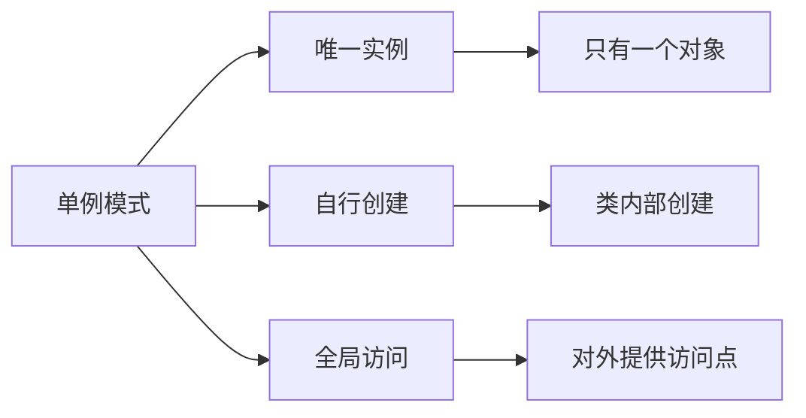
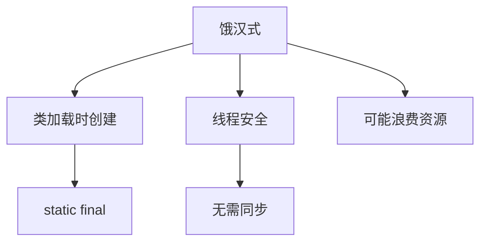
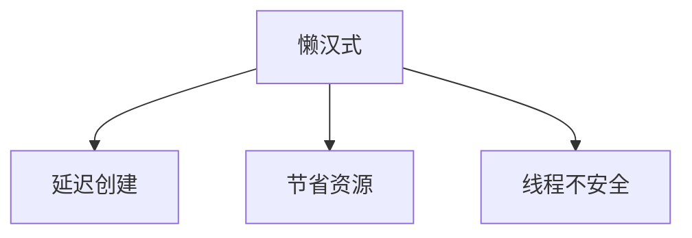
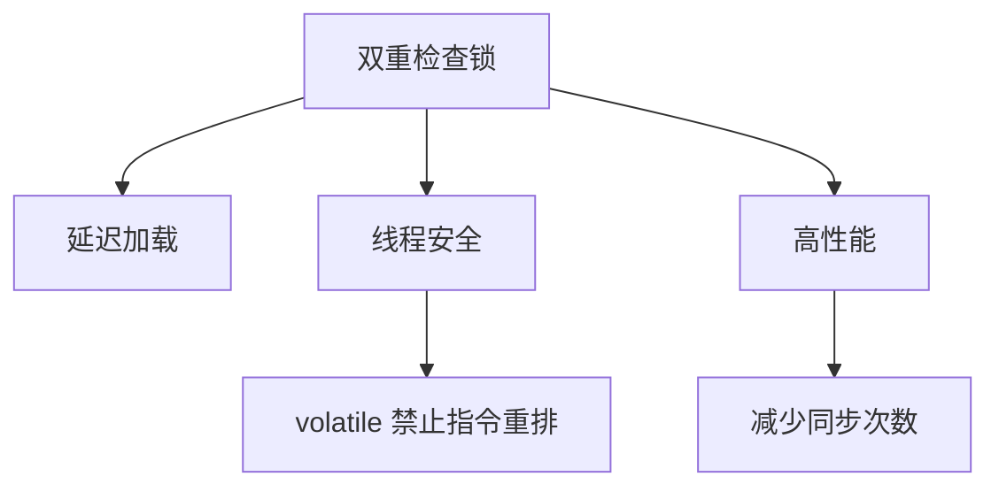
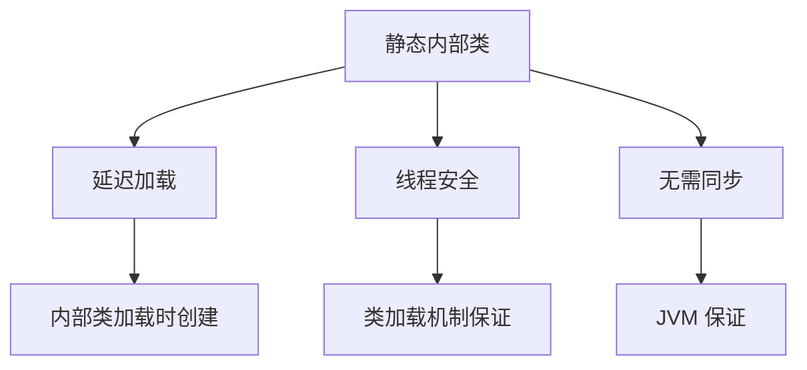
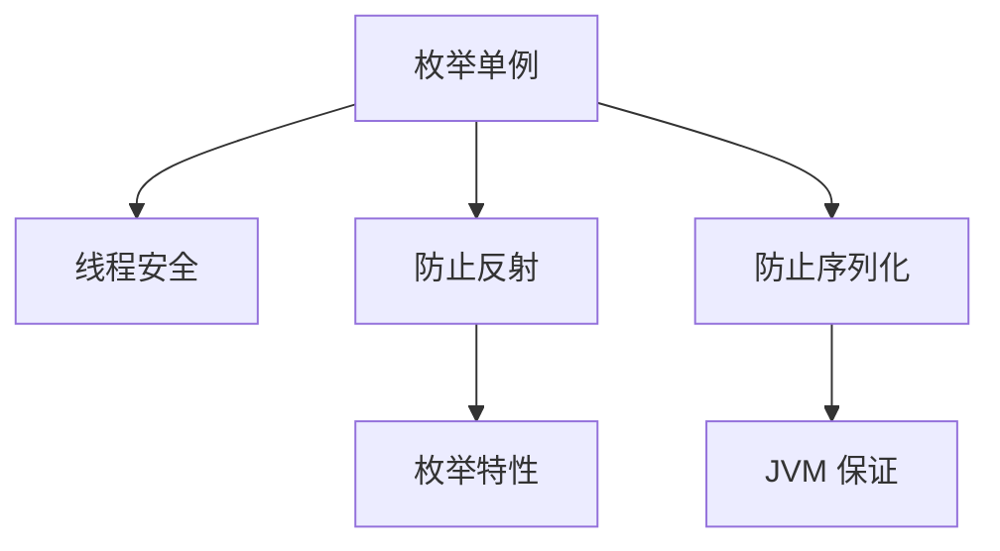

# 单例模式

单例模式（Singleton Pattern）是最简单的设计模式之一，它保证一个类**只有一个实例**，并提供全局访问点。

## 单例模式概述

### 什么是单例模式



**单例模式特点**：
- **唯一实例**：整个系统中只有一个实例
- **自行创建**：在类内部创建实例
- **全局访问**：提供全局访问点
- **延迟初始化**：可以延迟创建实例

::: tip 单例模式应用场景

| 场景 | 示例 |
|------|------|
| **配置管理** | 系统配置、环境变量 |
| **资源管理** | 连接池、线程池、缓存 |
| **日志记录** | 日志记录器 |
| **设备管理** | 打印机、显卡驱动 |

:::

## 饿汉式

### 基本实现



```java
/**
 * 饿汉式单例
 * 优点：线程安全，简单
 * 缺点：类加载时就创建，可能浪费资源
 */
public class HungrySingleton {
    // 1. 私有构造器
    private HungrySingleton() {
        System.out.println("饿汉式单例创建");
    }
    
    // 2. 类加载时创建实例
    private static final HungrySingleton INSTANCE = new HungrySingleton();
    
    // 3. 提供全局访问点
    public static HungrySingleton getInstance() {
        return INSTANCE;
    }
    
    // 其他方法
    public void doSomething() {
        System.out.println("执行业务逻辑");
    }
}

// 使用
class HungryDemo {
    public static void main(String[] args) {
        HungrySingleton s1 = HungrySingleton.getInstance();
        HungrySingleton s2 = HungrySingleton.getInstance();
        
        System.out.println(s1 == s2);  // true
        s1.doSomething();
    }
}
```

### 静态代码块方式

```java
/**
 * 饿汉式：静态代码块
 * 适用于需要复杂初始化的场景
 */
public class HungryStaticSingleton {
    private static final HungryStaticSingleton INSTANCE;
    
    // 静态代码块初始化
    static {
        try {
            INSTANCE = new HungryStaticSingleton();
        } catch (Exception e) {
            throw new RuntimeException("创建单例失败");
        }
    }
    
    private HungryStaticSingleton() {
        // 复杂初始化
    }
    
    public static HungryStaticSingleton getInstance() {
        return INSTANCE;
    }
}
```

## 懒汉式

### 基本实现（不推荐）



```java
/**
 * 懒汉式单例（线程不安全）
 * 优点：延迟加载，节省资源
 * 缺点：线程不安全
 */
public class LazySingleton {
    private static LazySingleton instance;
    
    private LazySingleton() { }
    
    // ❌ 线程不安全
    public static LazySingleton getInstance() {
        if (instance == null) {
            instance = new LazySingleton();
        }
        return instance;
    }
}
```

### 同步方法方式

```java
/**
 * 懒汉式：同步方法
 * 优点：线程安全
 * 缺点：每次获取都要同步，性能差
 */
public class LazySyncSingleton {
    private static LazySyncSingleton instance;
    
    private LazySyncSingleton() { }
    
    // ✅ 线程安全，但性能差
    public static synchronized LazySyncSingleton getInstance() {
        if (instance == null) {
            instance = new LazySyncSingleton();
        }
        return instance;
    }
}
```

## 双重检查锁（DCL）

### 推荐实现



```java
/**
 * 双重检查锁（DCL）
 * 优点：延迟加载、线程安全、高性能
 * 注意：必须使用 volatile
 */
public class DCLSingleton {
    // volatile 禁止指令重排
    private static volatile DCLSingleton instance;
    
    private DCLSingleton() { }
    
    public static DCLSingleton getInstance() {
        // 第一次检查（不加锁）
        if (instance == null) {
            synchronized (DCLSingleton.class) {
                // 第二次检查（加锁）
                if (instance == null) {
                    instance = new DCLSingleton();
                }
            }
        }
        return instance;
    }
    
    public void doSomething() {
        System.out.println("执行业务逻辑");
    }
}
```

### 为什么需要 volatile

```java
/**
 * volatile 的作用
 * 1. 保证可见性：一个线程修改，其他线程立即可见
 * 2. 禁止指令重排：防止 new 对象时指令重排
 */
public class VolatileDemo {
    private static volatile VolatileDemo instance;
    
    private VolatileDemo() {
        // 创建对象分为三步：
        // 1. 分配内存
        // 2. 初始化对象
        // 3. 将引用指向内存
        // 如果没有 volatile，可能发生重排：1 -> 3 -> 2
    }
}
```

## 静态内部类

### 推荐实现



```java
/**
 * 静态内部类单例
 * 优点：延迟加载、线程安全、无需同步、性能好
 * 推荐：这是最优实现之一
 */
public class StaticInnerSingleton {
    
    // 私有构造器
    private StaticInnerSingleton() {
        System.out.println("静态内部类单例创建");
    }
    
    // 静态内部类
    private static class Holder {
        // JVM 保证线程安全
        private static final StaticInnerSingleton INSTANCE = new StaticInnerSingleton();
    }
    
    // 提供全局访问点
    public static StaticInnerSingleton getInstance() {
        return Holder.INSTANCE;
    }
    
    public void doSomething() {
        System.out.println("执行业务逻辑");
    }
}

// 使用
class StaticInnerDemo {
    public static void main(String[] args) {
        StaticInnerSingleton s1 = StaticInnerSingleton.getInstance();
        StaticInnerSingleton s2 = StaticInnerSingleton.getInstance();
        
        System.out.println(s1 == s2);  // true
        s1.doSomething();
    }
}
```

::: tip 静态内部类优势

1. **延迟加载**：只有在调用 `getInstance()` 时才加载内部类
2. **线程安全**：JVM 保证类加载时的线程安全
3. **无需同步**：不需要 synchronized，性能好
4. **简洁优雅**：代码简洁，易理解

:::

## 枚举单例

### 最佳实现



```java
/**
 * 枚举单例
 * 优点：线程安全、防止反射攻击、防止序列化破坏
 * 推荐：这是《Effective Java》推荐的方式
 */
public enum EnumSingleton {
    
    // 单例实例
    INSTANCE;
    
    // 可以添加字段
    private String data;
    
    // 可以添加方法
    public void doSomething() {
        System.out.println("执行业务逻辑");
    }
    
    public String getData() {
        return data;
    }
    
    public void setData(String data) {
        this.data = data;
    }
    
    // 其他业务方法
    public void businessMethod() {
        System.out.println("业务方法执行");
    }
}

// 使用
class EnumDemo {
    public static void main(String[] args) {
        EnumSingleton s1 = EnumSingleton.INSTANCE;
        EnumSingleton s2 = EnumSingleton.INSTANCE;
        
        System.out.println(s1 == s2);  // true
        
        s1.setData("Hello");
        s2.doSomething();
        System.out.println(s2.getData());  // Hello
    }
}
```

::: tip 枚举单例优势

1. **自动序列化机制**：JVM 保证枚举的序列化安全
2. **防止反射攻击**：反射无法创建枚举实例
3. **线程安全**：JVM 保证枚举实例的线程安全
4. **简洁明了**：代码最简洁

:::

## 单例模式对比

### 各种实现方式对比

| 实现方式 | 优点 | 缺点 | 推荐指数 |
|----------|------|------|----------|
| **饿汉式** | 简单、线程安全 | 类加载时创建，可能浪费资源 | ⭐⭐⭐ |
| **懒汉式（同步方法）** | 线程安全、延迟加载 | 性能差 | ⭐⭐ |
| **双重检查锁** | 延迟加载、线程安全、高性能 | 稍微复杂 | ⭐⭐⭐⭐ |
| **静态内部类** | 延迟加载、线程安全、高性能 | 无法传参初始化 | ⭐⭐⭐⭐⭐ |
| **枚举** | 线程安全、防反射、防序列化 | 无法延迟加载 | ⭐⭐⭐⭐⭐ |

::: tip 选择建议

- **简单场景**：饿汉式
- **需要延迟加载**：静态内部类
- **需要传参初始化**：双重检查锁
- **严格要求单例**：枚举单例

:::

## 单例模式问题

### 反射攻击

```java
import java.lang.reflect.Constructor;

public class ReflectionAttack {
    public static void main(String[] args) throws Exception {
        // 获取单例
        DCLSingleton s1 = DCLSingleton.getInstance();
        
        // 通过反射创建新实例
        Constructor<DCLSingleton> constructor = 
            DCLSingleton.class.getDeclaredConstructor();
        constructor.setAccessible(true);
        DCLSingleton s2 = constructor.newInstance();
        
        System.out.println(s1 == s2);  // false（被破坏）
    }
}
```

**防御反射攻击**：

```java
public class SecureSingleton {
    private static volatile SecureSingleton instance;
    
    private SecureSingleton() {
        // 防止反射攻击
        if (instance != null) {
            throw new RuntimeException("不允许创建多个实例");
        }
    }
    
    public static SecureSingleton getInstance() {
        if (instance == null) {
            synchronized (SecureSingleton.class) {
                if (instance == null) {
                    instance = new SecureSingleton();
                }
            }
        }
        return instance;
    }
}
```

### 序列化攻击

```java
import java.io.*;

public class SerializationAttack {
    public static void main(String[] args) throws Exception {
        // 获取单例
        DCLSingleton s1 = DCLSingleton.getInstance();
        
        // 序列化
        ByteArrayOutputStream bos = new ByteArrayOutputStream();
        ObjectOutputStream oos = new ObjectOutputStream(bos);
        oos.writeObject(s1);
        
        // 反序列化
        ByteArrayInputStream bis = new ByteArrayInputStream(bos.toByteArray());
        ObjectInputStream ois = new ObjectInputStream(bis);
        DCLSingleton s2 = (DCLSingleton) ois.readObject();
        
        System.out.println(s1 == s2);  // false（被破坏）
    }
}
```

**防御序列化攻击**：

```java
import java.io.Serializable;

public class SecureSingleton implements Serializable {
    private static volatile SecureSingleton instance;
    
    private SecureSingleton() {
        if (instance != null) {
            throw new RuntimeException("不允许创建多个实例");
        }
    }
    
    public static SecureSingleton getInstance() {
        if (instance == null) {
            synchronized (SecureSingleton.class) {
                if (instance == null) {
                    instance = new SecureSingleton();
                }
            }
        }
        return instance;
    }
    
    // 防止序列化破坏
    private Object readResolve() {
        return instance;
    }
}
```

## 实际应用

### 配置管理器

```java
import java.util.Properties;

public class ConfigManager {
    private static volatile ConfigManager instance;
    private Properties config;
    
    private ConfigManager() {
        config = new Properties();
        // 加载配置
        loadConfig();
    }
    
    private void loadConfig() {
        try {
            config.load(ConfigManager.class.getResourceAsStream("/config.properties"));
        } catch (Exception e) {
            e.printStackTrace();
        }
    }
    
    public static ConfigManager getInstance() {
        if (instance == null) {
            synchronized (ConfigManager.class) {
                if (instance == null) {
                    instance = new ConfigManager();
                }
            }
        }
        return instance;
    }
    
    public String getProperty(String key) {
        return config.getProperty(key);
    }
    
    public void setProperty(String key, String value) {
        config.setProperty(key, value);
    }
}
```

### 数据库连接池

```java
import java.sql.Connection;
import java.util.ArrayDeque;
import java.util.Deque;

public class ConnectionPool {
    private static volatile ConnectionPool instance;
    private final Deque<Connection> pool;
    private final int maxSize;
    
    private ConnectionPool(int maxSize) {
        this.maxSize = maxSize;
        this.pool = new ArrayDeque<>(maxSize);
        initializePool();
    }
    
    private void initializePool() {
        for (int i = 0; i < maxSize; i++) {
            pool.add(createConnection());
        }
    }
    
    private Connection createConnection() {
        // 创建数据库连接
        return null;
    }
    
    public static ConnectionPool getInstance() {
        if (instance == null) {
            synchronized (ConnectionPool.class) {
                if (instance == null) {
                    instance = new ConnectionPool(10);
                }
            }
        }
        return instance;
    }
    
    public Connection getConnection() {
        return pool.poll();
    }
    
    public void releaseConnection(Connection conn) {
        pool.offer(conn);
    }
}
```

## 小结

::: tip 核心要点

1. **单例模式特点**：唯一实例、自行创建、全局访问
2. **实现方式**：
   - 饿汉式：简单但可能浪费资源
   - 懒汉式：延迟加载但需要同步
   - 双重检查锁：高性能的延迟加载
   - 静态内部类：最优实现之一
   - 枚举：最安全的方式
3. **安全问题**：反射攻击、序列化攻击
4. **选择建议**：根据场景选择合适的实现方式

:::

::: warning 注意事项

1. **不要滥用**：不是所有对象都需要单例
2. **注意内存泄漏**：单例长期持有对象可能导致内存泄漏
3. **测试困难**：单例模式不利于单元测试
4. **多线程**：必须考虑线程安全问题

:::

::: info 下一步
- [工厂模式](/java/base/12-design-patterns/factory.md) - 学习工厂模式详解
- [观察者模式](/java/base/12-design-patterns/observer.md) - 学习观察者模式详解
:::
