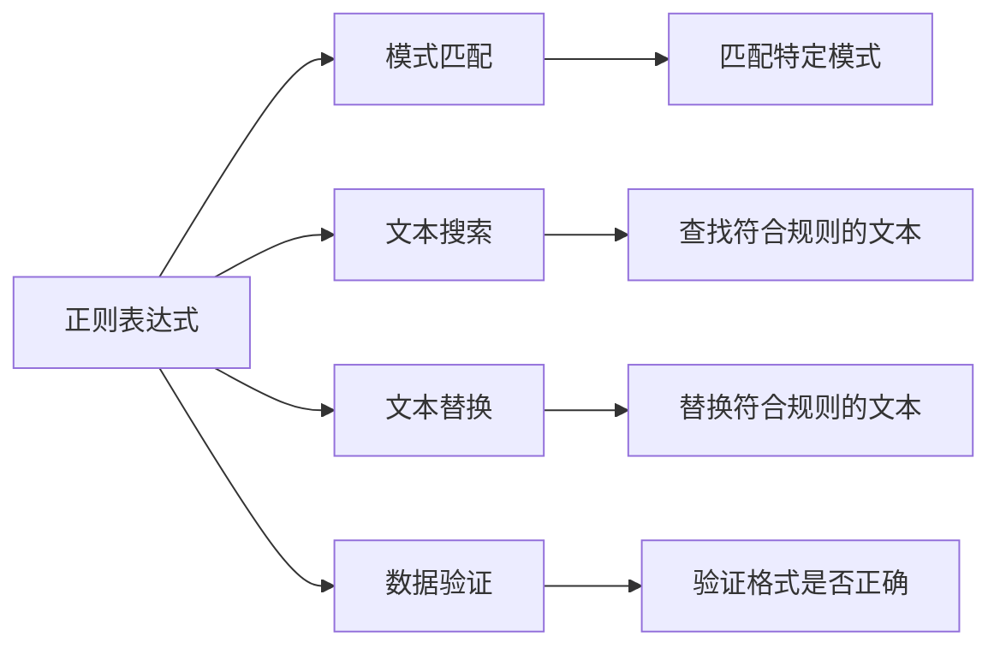

# 正则表达式

正则表达式（Regular Expression）是一种**强大的文本匹配工具**，用于在字符串中**搜索、替换、验证**特定模式的文本。

## 正则表达式概述

### 什么是正则表达式



**正则表达式的用途**：
- **验证**：邮箱、手机号、身份证号等格式验证
- **搜索**：在文本中查找符合规则的内容
- **替换**：批量替换符合规则的文本
- **提取**：从文本中提取需要的信息

::: tip 正则表达式的优缺点

| 优点 | 缺点 |
|------|------|
| 强大灵活 | 学习曲线陡峭 |
| 代码简洁 | 可读性差 |
| 功能丰富 | 调试困难 |

:::

## 正则表达式语法

### 字符类

| 符号 | 说明 | 示例 |
|------|------|------|
| `.` | 任意字符 | `a.c` 匹配 abc、adc、a1c |
| `\d` | 数字（等同于 [0-9]） | `\d{3}` 匹配 3个数字 |
| `\D` | 非数字 | `\D+` 匹配多个非数字 |
| `\w` | 单词字符（字母、数字、下划线） | `\w+` 匹配多个单词字符 |
| `\W` | 非单词字符 | `\W+` 匹配多个非单词字符 |
| `\s` | 空白字符（空格、制表符、换行符） | `\s+` 匹配多个空白 |
| `\S` | 非空白字符 | `\S+` 匹配多个非空白 |
| `[abc]` | 字符集（a、b、c 中的任一个） | `[abc]` 匹配 a、b、c |
| `[^abc]` | 否定字符集（非 a、b、c） | `[^abc]` 匹配除 a、b、c |
| `[a-z]` | 范围（a 到 z） | `[a-z]` 匹配小写字母 |
| `[a-zA-Z]` | 多个范围 | `[a-zA-Z]` 匹配所有字母 |

### 量词

| 符号 | 说明 | 示例 |
|------|------|------|
| `*` | 0次或多次 | `a*` 匹配 ""、a、aa、aaa |
| `+` | 1次或多次 | `a+` 匹配 a、aa、aaa |
| `?` | 0次或1次 | `a?` 匹配 ""、a |
| `{n}` | 恰好n次 | `\d{6}` 匹配 6个数字 |
| `{n,}` | 至少n次 | `\d{6,}` 匹配至少6个数字 |
| `{n,m}` | n到m次 | `\d{6,8}` 匹配 6-8个数字 |
| `贪婪` | 默认贪婪，匹配尽可能多 | `a.*b` |
| `非贪婪` | 匹配尽可能少 | `a.*?b` |

### 边界匹配

| 符号 | 说明 | 示例 |
|------|------|------|
| `^` | 行首 | `^Hello` 匹配行首的 Hello |
| `$` | 行尾 | `World$` 匹配行尾的 World |
| `\b` | 单词边界 | `\bHello\b` 匹配完整单词 Hello |
| `\B` | 非单词边界 | `\BHello\B` |

### 分组和引用

| 符号 | 说明 | 示例 |
|------|------|------|
| `(abc)` | 分组，捕获 | `(ab)+` 匹配 ab、abab、ababab |
| `(?:abc)` | 非捕获分组 | `(?:ab)+` |
| `\1` | 反向引用第1个分组 | `(a)\1` 匹配 aa |
| `\2` | 反向引用第2个分组 | `(a)(b)\2` 匹配 abb |

### 预定义字符类

| 符号 | 说明 | 等价于 |
|------|------|--------|
| `\d` | 数字 | `[0-9]` |
| `\D` | 非数字 | `[^0-9]` |
| `\s` | 空白字符 | `[ \t\n\x0B\f\r]` |
| `\S` | 非空白字符 | `[^ \t\n\x0B\f\r]` |
| `\w` | 单词字符 | `[a-zA-Z_0-9]` |
| `\W` | 非单词字符 | `[^a-zA-Z_0-9]` |

## Java 正则 API

### Pattern 和 Matcher

```java
import java.util.regex.*;

public class RegexBasics {
    public static void main(String[] args) {
        String text = "Hello123World456";
        
        // 1. 编译正则表达式
        Pattern pattern = Pattern.compile("\\d+");
        
        // 2. 创建 Matcher
        Matcher matcher = pattern.matcher(text);
        
        // 3. 查找匹配
        while (matcher.find()) {
            System.out.println("匹配: " + matcher.group());
            System.out.println("位置: " + matcher.start() + "-" + matcher.end());
        }
        
        // 输出：
        // 匹配: 123，位置: 5-8
        // 匹配: 456，位置: 13-16
    }
}
```

### String 正则方法

```java
public class StringRegex {
    public static void main(String[] args) {
        String text = "Hello123World456";
        
        // 1. matches()：整个字符串匹配
        boolean isMatch1 = text.matches("\\w+");  // true
        boolean isMatch2 = text.matches("\\d+");  // false
        
        // 2. split()：分割字符串
        String[] parts = "a,b,c".split(",");  // ["a", "b", "c"]
        
        // 3. replaceFirst()：替换第一个
        String result1 = "Hello123World".replaceFirst("\\d+", "***");
        // "Hello***World"
        
        // 4. replaceAll()：替换所有
        String result2 = "Hello123World456".replaceAll("\\d+", "***");
        // "Hello***World***"
    }
}
```

## 常用正则表达式

### 数字验证

```java
public class NumberRegex {
    public static void main(String[] args) {
        // 正整数
        String positiveInteger = "^\\+?[1-9]\\d*$";
        System.out.println("123".matches(positiveInteger));  // true
        
        // 负整数
        String negativeInteger = "^-[1-9]\\d*$";
        System.out.println("-123".matches(negativeInteger));  // true
        
        // 整数（正、负、零）
        String integer = "^[+-]?[1-9]\\d*$";
        
        // 浮点数
        String floatNumber = "^[+-]?\\d+\\.\\d+$";
        System.out.println("3.14".matches(floatNumber));  // true
        System.out.println("-3.14".matches(floatNumber));  // true
        
        // 数字（整数和浮点数）
        String number = "^[+-]?(\\d+\\.?\\d*|\\.\\d+)$";
        System.out.println("123".matches(number));  // true
        System.out.println("3.14".matches(number));  // true
        System.out.println(".5".matches(number));  // true
    }
}
```

### 字符串验证

```java
public class StringRegex {
    public static void main(String[] args) {
        // 手机号（1开头，11位数字）
        String mobile = "^1[3-9]\\d{9}$";
        System.out.println("13800138000".matches(mobile));  // true
        
        // 座机号
        String phone = "^0\\d{2,3}-?\\d{7,8}$";
        System.out.println("010-12345678".matches(phone));  // true
        
        // 邮箱
        String email = "^[a-zA-Z0-9_-]+@[a-zA-Z0-9_-]+(\\.[a-zA-Z0-9_-]+)+$";
        System.out.println("user@example.com".matches(email));  // true
        
        // URL
        String url = "^(https?|ftp)://[^\\s/$.?#].[^\\s]*$";
        System.out.println("https://www.example.com".matches(url));  // true
        
        // IPv4
        String ipv4 = "^((25[0-5]|2[0-4]\\d|[01]?\\d\\d?)\\.){3}(25[0-5]|2[0-4]\\d|[01]?\\d\\d?)$";
        System.out.println("192.168.1.1".matches(ipv4));  // true
        
        // 身份证号（18位）
        String idCard = "^[1-9]\\d{5}(18|19|20)\\d{2}(0[1-9]|1[0-2])(0[1-9]|[12]\\d|3[01])\\d{3}[\\dXx]$";
        System.out.println("110101199001011234".matches(idCard));  // true
        
        // 日期（yyyy-MM-dd）
        String date = "^\\d{4}-\\d{2}-\\d{2}$";
        System.out.println("2024-01-01".matches(date));  // true
        
        // 时间（HH:mm:ss）
        String time = "^([01]\\d|2[0-3]):[0-5]\\d:[0-5]\\d$";
        System.out.println("23:59:59".matches(time));  // true
        
        // 邮政编码（6位数字）
        String zipCode = "^\\d{6}$";
        System.out.println("100000".matches(zipCode));  // true
        
        // 密码（8-16位，包含字母和数字）
        String password = "^(?=.*[A-Za-z])(?=.*\\d)[A-Za-z\\d]{8,16}$";
        System.out.println("password123".matches(password));  // true
    }
}
```

### 文本处理

```java
import java.util.regex.*;

public class TextProcessing {
    public static void main(String[] args) {
        String text = "电话：13800138000，邮箱：user@example.com";
        
        // 提取手机号
        Pattern mobilePattern = Pattern.compile("1[3-9]\\d{9}");
        Matcher mobileMatcher = mobilePattern.matcher(text);
        while (mobileMatcher.find()) {
            System.out.println("手机号: " + mobileMatcher.group());
        }
        
        // 提取邮箱
        Pattern emailPattern = Pattern.compile("[a-zA-Z0-9_-]+@[a-zA-Z0-9_-]+(\\.[a-zA-Z0-9_-]+)+");
        Matcher emailMatcher = emailPattern.matcher(text);
        while (emailMatcher.find()) {
            System.out.println("邮箱: " + emailMatcher.group());
        }
        
        // HTML 标签去除
        String html = "<p>Hello</p><p>World</p>";
        String noHtml = html.replaceAll("<[^>]+>", "");
        System.out.println(noHtml);  // "HelloWorld"
        
        // 敏感词替换
        String content = "这是一个测试，测试内容";
        String filtered = content.replaceAll("测试", "***");
        System.out.println(filtered);  // "这是一个***，***内容"
    }
}
```

## 高级用法

### 分组捕获

```java
import java.util.regex.*;

public class GroupCapture {
    public static void main(String[] args) {
        String text = "姓名：张三，年龄：25";
        
        // 提取姓名和年龄
        Pattern pattern = Pattern.compile("姓名：(\\w+)，年龄：(\\d+)");
        Matcher matcher = pattern.matcher(text);
        
        if (matcher.find()) {
            System.out.println("完整匹配: " + matcher.group(0));  // 整个匹配
            System.out.println("分组1: " + matcher.group(1));  // 张三
            System.out.println("分组2: " + matcher.group(2));  // 25
        }
        
        // 多个分组
        String date = "2024-01-01";
        Pattern datePattern = Pattern.compile("(\\d{4})-(\\d{2})-(\\d{2})");
        Matcher dateMatcher = datePattern.matcher(date);
        
        if (dateMatcher.find()) {
            String year = dateMatcher.group(1);  // 2024
            String month = dateMatcher.group(2);  // 01
            String day = dateMatcher.group(3);  // 01
            System.out.println(year + "年" + month + "月" + day + "日");
        }
    }
}
```

### 非贪婪匹配

```java
import java.util.regex.*;

public class GreedyVsLazy {
    public static void main(String[] args) {
        String text = "<div>内容1</div><div>内容2</div>";
        
        // 贪婪匹配（默认）：匹配尽可能多
        String greedyRegex = "<div>.*</div>";
        Pattern greedyPattern = Pattern.compile(greedyRegex);
        Matcher greedyMatcher = greedyPattern.matcher(text);
        if (greedyMatcher.find()) {
            System.out.println("贪婪匹配: " + greedyMatcher.group());
            // <div>内容1</div><div>内容2</div>
        }
        
        // 非贪婪匹配：匹配尽可能少
        String lazyRegex = "<div>.*?</div>";
        Pattern lazyPattern = Pattern.compile(lazyRegex);
        Matcher lazyMatcher = lazyPattern.matcher(text);
        while (lazyMatcher.find()) {
            System.out.println("非贪婪匹配: " + lazyMatcher.group());
            // <div>内容1</div>
            // <div>内容2</div>
        }
    }
}
```

### 前瞻断言

```java
import java.util.regex.*;

public class Lookahead {
    public static void main(String[] args) {
        String text = "apple banana orange grape";
        
        // 正向先行断言：匹配后面是 " apple" 的单词
        String pattern1 = "\\w+(?= apple)";
        Pattern p1 = Pattern.compile(pattern1);
        Matcher m1 = p1.matcher(text);
        while (m1.find()) {
            System.out.println("匹配: " + m1.group());  // banana
        }
        
        // 负向先行断言：匹配后面不是 " apple" 的单词
        String pattern2 = "\\w+(?! apple)";
        Pattern p2 = Pattern.compile(pattern2);
        Matcher m2 = p2.matcher(text);
        while (m2.find()) {
            System.out.println("匹配: " + m2.group());
            // apple, orange, grape
        }
    }
}
```

## 性能优化

### 优化建议

```java
import java.util.regex.*;

public class RegexOptimization {
    public static void main(String[] args) {
        // 1. 预编译正则表达式（多次使用时）
        Pattern pattern = Pattern.compile("\\d+");
        // 而不是每次都 Pattern.compile()
        
        // 2. 使用非贪婪匹配
        String text = "<div>test</div><div>test2</div>";
        String lazy = "<div>.*?</div>";  // ✅ 非贪婪
        String greedy = "<div>.*</div>";  // ❌ 贪婪
        
        // 3. 避免回溯
        // ❌ 容易回溯
        String bad1 = ".*.*.*";
        String bad2 = "(a+)+";
        
        // ✅ 避免回溯
        String good1 = ".{3,10}";  // 限制范围
        String good2 = "a{3,10}";  // 明确次数
        
        // 4. 使用字符类而非或
        // ❌ 慢
        String slow = "[a|b|c|d|e]";
        
        // ✅ 快
        String fast = "[a-e]";
        
        // 5. 使用原子组（防止回溯）
        String atomic = "(?>a+)+b";  // 原子组
        
        // 6. 使用占有量词（防止回溯）
        String possessive = "a++b";  // 占有量词
    }
}
```

## 常见问题

### 转义字符

```java
public class EscapeCharacter {
    public static void main(String[] args) {
        // Java 字符串中需要转义的反斜杠
        String regex1 = "\\d+";  // 匹配数字
        String regex2 = "\\w+";  // 匹配单词字符
        
        // 正则表达式中需要转义的字符
        String special = "\\$\\(\\)\\*\\+\\.\\[\\]\\?\\\\\\^\\$\\|\\{\\}";
        
        // 示例：匹配点号
        String text1 = "example.com";
        boolean match1 = text1.matches("example\\.com");  // true
        boolean match2 = text1.matches("example.com");  // true（. 匹配任意字符）
        
        // 示例：匹配反斜杠
        String text2 = "C:\\Users";
        boolean match3 = text2.matches("C:\\\\Users");  // true
    }
}
```

## 小结

::: tip 核心要点

1. **字符类**：`.` `\d` `\w` `\s` `[abc]` `[^abc]`
2. **量词**：`*` `+` `?` `{n}` `{n,}` `{n,m}`
3. **边界**：`^` `$` `\b` `\B`
4. **分组**：`(abc)` `(?:abc)` `\1` `\2`
5. **Java API**：
   - `Pattern.compile()`：编译正则
   - `Matcher`：匹配器
   - `String.matches()`：匹配
   - `String.split()`：分割
   - `String.replaceAll()`：替换
6. **优化**：预编译、非贪婪、避免回溯

:::

::: warning 注意事项

1. **转义**：Java 字符串中 `\\` 表示一个反斜杠
2. **性能**：复杂正则可能影响性能，需要优化
3. **可读性**：正则表达式可读性差，需要注释
4. **测试**：使用正则测试工具验证表达式

:::

::: info 相关资源

- **在线工具**：https://regex101.com/
- **测试工具**：Regex Tester, RegexBuddy
- **参考文档**：java.util.regex 包文档

:::
