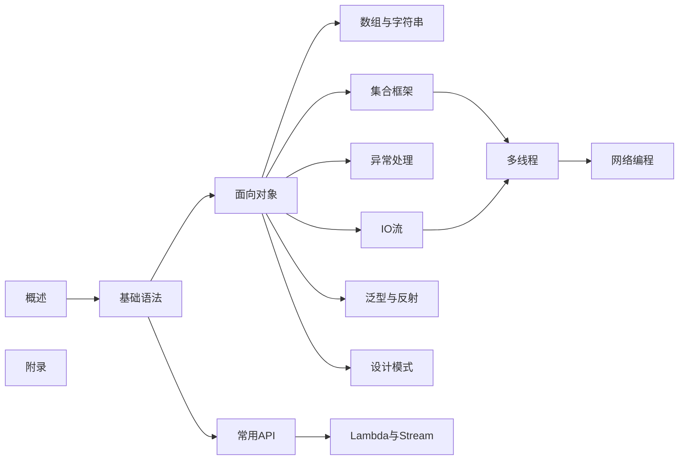

# Java基础篇

::: tip 学习目标
本系列文档系统介绍 Java 编程语言的核心基础知识，帮助读者从零开始掌握 Java 开发必备技能。
:::

## 内容概览

Java基础篇涵盖从入门到精通的完整知识体系，共分为14个模块：

<VPCard
  title="00-概述"
  desc="Java语言简介、环境配置、第一个程序"
  logo="https://api.iconify.design/ri/information-line.svg"
  link="/java/base/00-overview/"
/>

<VPCard
  title="01-基础语法"
  desc="变量、数据类型、运算符、控制流、关键字"
  logo="https://api.iconify.design/ri/code-s-slash-line.svg"
  link="/java/base/01-syntax/"
/>

<VPCard
  title="02-面向对象"
  desc="类与对象、封装、继承、多态、抽象、接口"
  logo="https://api.iconify.design/ri/git-branch-line.svg"
  link="/java/base/02-oop/"
/>

<VPCard
  title="03-数组与字符串"
  desc="数组操作、String、StringBuilder、正则表达式"
  logo="https://api.iconify.design/ri/function-line.svg"
  link="/java/base/03-array-string/"
/>

<VPCard
  title="04-集合框架"
  desc="List、Set、Map、Queue 及其实现类"
  logo="https://api.iconify.design/ri/database-2-line.svg"
  link="/java/base/04-collections/"
/>

<VPCard
  title="05-异常处理"
  desc="异常类型、try-catch-finally、自定义异常"
  logo="https://api.iconify.design/ri/error-warning-line.svg"
  link="/java/base/05-exception/"
/>

<VPCard
  title="06-IO流"
  desc="文件操作、字节流、字符流、缓冲流、NIO"
  logo="https://api.iconify.design/ri/file-text-line.svg"
  link="/java/base/06-io/"
/>

<VPCard
  title="07-多线程"
  desc="线程创建、线程同步、线程池、并发工具"
  logo="https://api.iconify.design/ri/git-merge-line.svg"
  link="/java/base/07-thread/"
/>

<VPCard
  title="08-常用API"
  desc="包装类、日期时间、System、Math、Objects"
  logo="https://api.iconify.design/ri/tools-line.svg"
  link="/java/base/08-common-api/"
/>

<VPCard
  title="09-泛型与反射"
  desc="泛型使用、类型擦除、反射机制、注解"
  logo="https://api.iconify.design/ri/lightbulb-flash-line.svg"
  link="/java/base/09-generic-reflection/"
/>

<VPCard
  title="10-网络编程"
  desc="Socket、ServerSocket、UDP、HTTP"
  logo="https://api.iconify.design/ri/global-line.svg"
  link="/java/base/10-network/"
/>

<VPCard
  title="11-Lambda与Stream"
  desc="Lambda表达式、Stream API、Optional"
  logo="https://api.iconify.design/ri/function-line.svg"
  link="/java/base/11-lambda-stream/"
/>

<VPCard
  title="12-设计模式"
  desc="单例、工厂、代理、策略等常用设计模式"
  logo="https://api.iconify.design/ri/layout-masonry-line.svg"
  link="/java/base/12-design-patterns/"
/>

<VPCard
  title="13-附录"
  desc="常见问题、速查表、参考资料"
  logo="https://api.iconify.design/ri/bookmark-line.svg"
  link="/java/base/13-appendix/"
/>

## 学习路径建议

::: center
**图：Java基础篇学习路径图**
:::

## 适合人群

- **编程初学者**：从零开始学习编程，选择 Java 作为入门语言
- **在校学生**：计算机相关专业学生，系统学习 Java 基础
- **转行开发者**：从其他语言转向 Java 开发
- **面试准备**：巩固基础，应对技术面试

## 学习建议

1. **循序渐进**：按照学习路径图逐步学习，不要跳跃
2. **动手实践**：每个知识点都要亲自编写代码验证
3. **及时总结**：学习后及时整理笔记，加深理解
4. **练习巩固**：配合练习题巩固所学知识

## 版本说明

本系列文档基于 **JDK 17 LTS** 编写，内容兼容 JDK 8+ 版本。
