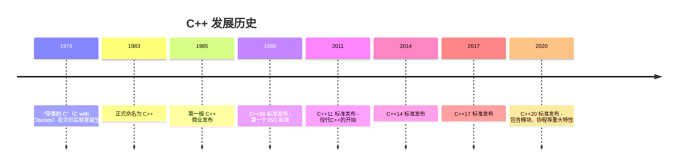
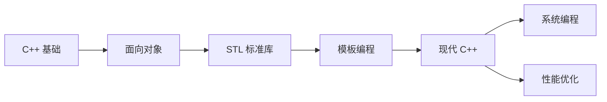

# C++ 概述

## 什么是 C++？

C++ 是一种通用的编程语言，由 Bjarne Stroustrup 于 1979 年在贝尔实验室开始开发。它是 C 语言的超集，增加了面向对象编程、泛型编程和现代语言特性。

## C++ 的历史



## C++ 的核心特性

### 1. 面向对象编程
- **封装**：数据和方法绑定在一起
- **继承**：可以从现有类派生新类
- **多态**：通过虚函数实现运行时多态

### 2. 泛型编程
- 模板允许编写与类型无关的代码
- STL（标准模板库）提供了丰富的泛型容器和算法

### 3. 内存管理
- 手动内存管理：通过 `new`/`delete` 操作符
- 智能指针：`std::unique_ptr`, `std::shared_ptr`, `std::weak_ptr`
- RAII（资源获取即初始化）惯用法

### 4. 零开销抽象
- "你不需要为你不使用的东西付出代价"
- 抽象不会带来运行时性能损失

## C++ vs 其他语言

| 特性 | C++ | Java | Python | Rust |
|------|-----|------|--------|------|
| 性能 | ⭐⭐⭐⭐⭐ | ⭐⭐⭐ | ⭐⭐ | ⭐⭐⭐⭐⭐ |
| 内存安全 | ⭐⭐ | ⭐⭐⭐⭐⭐ | ⭐⭐⭐⭐⭐ | ⭐⭐⭐⭐⭐ |
| 学习曲线 | 陡峭 | 中等 | 平缓 | 陡峭 |
| 编译速度 | ⭐⭐ | ⭐⭐⭐ | ⭐⭐⭐⭐⭐ | ⭐⭐ |
| 生态 | 成熟 | 丰富 | 丰富 | 成长中 |

## C++ 的应用领域

### 游戏开发
- Unreal Engine 4/5
- Unity C++ SDK
- 自研游戏引擎

### 系统编程
- 操作系统
- 驱动程序
- 嵌入式系统

### 高性能计算
- 量化交易系统
- 科学计算
- 实时图像处理

### 浏览器引擎
- Chrome V8（JavaScript 引擎）
- WebKit
- Firefox SpiderMonkey

## 学习路线图



## 环境搭建

### 编译器选择

::: tabs

@tab GCC (推荐)

GNU Compiler Collection，开源免费，跨平台支持

```bash
# Ubuntu/Debian
sudo apt install build-essential

# macOS
brew install gcc

# 验证安装
g++ --version
```

@tab Clang (推荐)

LLVM 项目的一部分，编译速度快，错误信息友好

```bash
# Ubuntu/Debian
sudo apt install clang

# macOS (通常已预装)
clang --version
```

@tab MSVC (Windows)

Microsoft Visual C++，Windows 平台最佳选择

下载 [Visual Studio](https://visualstudio.microsoft.com/)

:::

### 第一个程序

```cpp
#include <iostream>

int main() {
    std::cout << "Hello, C++!" << std::endl;
    return 0;
}
```

编译运行：

```bash
g++ -std=c++20 hello.cpp -o hello
./hello
```

## 推荐资源

### 书籍
- **《C++ Primer》** - Stanely B. Lippman（入门经典）
- **《Effective C++》** - Scott Meyers（进阶必读）
- **《Effective Modern C++》** - Scott Meyers（现代C++）
- **《Inside the C++ Object Model》** - Stanley B. Lippman（深入底层）

### 在线资源
- [C++ Reference](https://zh.cppreference.com/)
- [LearnCpp.com](https://www.learncpp.com/)
- [Compiler Explorer](https://godbolt.org/) - 在线编译器

---

::: tip 为什么选择 C++？
如果你追求极致性能，需要底层控制，或者从事系统编程、游戏开发，C++ 是不二之选。
:::
