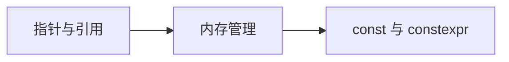

# 核心概念

C++ 的核心概念是理解这门语言的关键，包括指针、引用、内存管理等。

## 学习内容

<VPCard
  title="指针与引用"
  desc="指针的本质、指针运算、引用与指针的区别"
  logo="https://api.iconify.design/ri:focus-3-line.svg"
  link="/langs/cpp/02-core-concepts/pointer-reference/"
/>

<VPCard
  title="内存管理"
  desc="栈与堆、new/delete、智能指针、内存泄漏"
  logo="https://api.iconify.design/ri/database-2-line.svg"
  link="/langs/cpp/02-core-concepts/memory/"
/>

<VPCard
  title="const 与 constexpr"
  desc="常量、常量表达式、编译期计算"
  logo="https://api.iconify.design/ri/lock-2-line.svg"
  link="/langs/cpp/02-core-concepts/const/"
/>

## 学习路径

::: center
**图：C++ 核心概念学习路径**
:::
