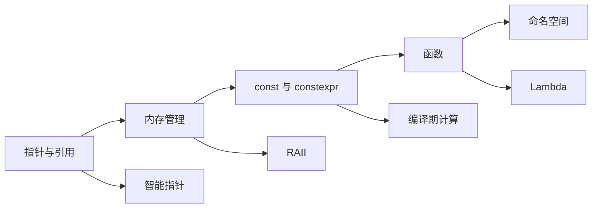

# 核心概念

C++ 的核心概念是理解这门语言的关键，包括指针、引用、内存管理、const/constexpr、函数、命名空间等。

## 学习内容

<VPCard
  title="指针与引用"
  desc="指针的本质、指针运算、引用与指针的区别、智能指针"
  logo="https://api.iconify.design/ri/cursor-line.svg"
  link="/langs/cpp/02-core-concepts/pointers-references.md"
/>

<VPCard
  title="内存管理"
  desc="栈与堆、new/delete、智能指针、RAII、内存泄漏"
  logo="https://api.iconify.design/ri/database-2-line.svg"
  link="/langs/cpp/02-core-concepts/memory-management.md"
/>

<VPCard
  title="const 与 constexpr"
  desc="常量、常量表达式、编译期计算、consteval、constinit"
  logo="https://api.iconify.design/ri/lock-line.svg"
  link="/langs/cpp/02-core-concepts/const-constexpr.md"
/>

<VPCard
  title="函数"
  desc="函数声明与定义、参数传递、函数重载、Lambda 表达式"
  logo="https://api.iconify.design/ri/function-line.svg"
  link="/langs/cpp/02-core-concepts/functions.md"
/>

<VPCard
  title="命名空间"
  desc="命名空间定义、using 声明、匿名命名空间"
  logo="https://api.iconify.design/ri/layout-grid-line.svg"
  link="/langs/cpp/02-core-concepts/namespaces.md"
/>

## 学习路径

::: center
**图：C++ 核心概念学习路径**
:::

## 学习建议

::: tabs

@tab 循序渐进

1. **先学指针与引用**：理解 C++ 的内存模型
2. **再学内存管理**：掌握栈、堆和 RAII
3. **掌握 const**：理解常量和编译期计算
4. **深入函数**：学习参数传递、重载和 Lambda
5. **组织代码**：使用命名空间避免冲突

@tab 重点难点

- **指针与引用的区别**：引用是别名，指针是地址
- **内存泄漏**：使用智能指针自动管理
- **const 正确性**：尽量使用 const 引用传递参数
- **函数重载**：根据参数类型选择正确的函数

@tab 实践建议

- 多使用 `const T&` 传递大对象参数
- 优先使用 `std::unique_ptr` 和 `std::make_unique`
- 使用 Lambda 简化代码
- 合理使用命名空间组织代码
- 使用 `constexpr` 实现编译期计算

:::
