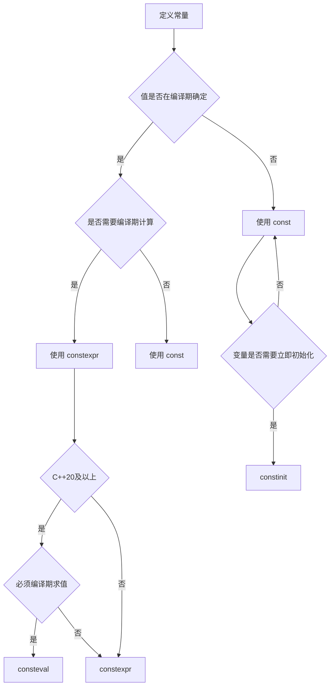

# const 与 constexpr

`const` 和 `constexpr` 是 C++ 中用于定义常量的关键字，它们在编译期和运行期行为上有所不同。

::: tip 核心要点
- **const**：运行期常量，值不可修改
- **constexpr**：编译期常量，值在编译时确定
- **consteval**：C++20，强制编译期求值
- **constinit**：C++20，强制编译期初始化
:::

## const 基础

### const 变量

```cpp
#include <iostream>

int main() {
    // const 整数
    const int max = 100;
    // max = 200;  // 错误：不能修改 const 变量

    // const 引用
    int x = 10;
    const int& ref = x;
    // ref = 20;  // 错误
    x = 20;      // OK：可以通过原变量修改
    std::cout << "ref = " << ref << std::endl;  // 20

    // const 指针
    int y = 30;
    const int* ptr1 = &y;  // 指向常量的指针
    // *ptr1 = 40;  // 错误
    ptr1 = nullptr;        // OK：可以改变指针指向

    int z = 50;
    int* const ptr2 = &z;  // 常量指针
    *ptr2 = 60;            // OK：可以修改指向的值
    // ptr2 = nullptr;     // 错误：不能改变指针

    // 既是 const 指针又指向 const
    const int* const ptr3 = &y;
    // *ptr3 = 70;   // 错误
    // ptr3 = nullptr;  // 错误

    return 0;
}
```

### const 与函数

```cpp
#include <iostream>
#include <string>

// const 参数：不会修改传入的对象
void printString(const std::string& str) {
    std::cout << str << std::endl;
    // str = "new";  // 错误
}

// const 返回值：返回的对象不能被修改
const std::string& getString() {
    static std::string s = "Hello";
    return s;
}

// const 成员函数：不修改对象状态
class MyClass {
private:
    int value;

public:
    MyClass(int v) : value(v) {}

    // const 成员函数
    int getValue() const {
        // value = 10;  // 错误：const 函数不能修改成员
        return value;
    }

    // 非 const 成员函数
    void setValue(int v) {
        value = v;
    }

    // const 重载
    void display() const {
        std::cout << "const 版本: " << value << std::endl;
    }

    void display() {
        std::cout << "非 const 版本: " << value << std::endl;
    }
};

int main() {
    const MyClass obj1(42);
    obj1.display();        // 调用 const 版本
    // obj1.setValue(50);  // 错误

    MyClass obj2(100);
    obj2.display();        // 调用非 const 版本

    return 0;
}
```

### mutable 关键字

```cpp
#include <iostream>

class Counter {
private:
    mutable int count = 0;  // mutable 可以在 const 函数中修改

public:
    int getCount() const {
        count++;  // OK：mutable 成员可以修改
        return count;
    }
};

int main() {
    const Counter c;
    std::cout << c.getCount() << std::endl;  // 1
    std::cout << c.getCount() << std::endl;  // 2
    std::cout << c.getCount() << std::endl;  // 3

    return 0;
}
```

## constexpr

### constexpr 变量

```cpp
#include <iostream>

int main() {
    // constexpr：编译期常量
    constexpr int size = 10;
    int arr[size];  // OK：编译期已知大小

    // const：运行期常量
    const int runtimeSize = getSize();
    // int arr2[runtimeSize];  // 错误：运行期才确定

    // constexpr 函数
    constexpr int square(int x) {
        return x * x;
    }

    constexpr int result = square(5);  // 编译期计算
    int arr3[square(3)];               // OK

    return 0;
}

int getSize() {
    return 20;
}
```

### constexpr 函数

```cpp
#include <iostream>

// C++11：constexpr 函数只能有一条 return 语句
constexpr int square1(int x) {
    return x * x;
}

// C++14：constexpr 函数可以有更多语句
constexpr int factorial(int n) {
    int result = 1;
    for (int i = 1; i <= n; ++i) {
        result *= i;
    }
    return result;
}

// constexpr 类方法
class Point {
public:
    constexpr Point(double xVal, double yVal) : x(xVal), y(yVal) {}

    constexpr double getX() const { return x; }
    constexpr double getY() const { return y; }

    constexpr double distance() const {
        return x * x + y * y;
    }

private:
    double x, y;
};

int main() {
    // 编译期计算
    constexpr int fact5 = factorial(5);
    std::cout << "5! = " << fact5 << std::endl;  // 120

    // 运行期计算（constexpr 函数也是普通函数）
    int n;
    std::cin >> n;
    std::cout << n << "! = " << factorial(n) << std::endl;

    // constexpr 对象
    constexpr Point p(3.0, 4.0);
    constexpr double dist = p.distance();
    std::cout << "距离平方: " << dist << std::endl;  // 25

    return 0;
}
```

### constexpr 构造函数

```cpp
#include <iostream>
#include <array>

class Complex {
public:
    constexpr Complex(double r, double i) : real(r), imag(i) {}

    constexpr double getReal() const { return real; }
    constexpr double getImag() const { return imag; }

    constexpr Complex operator+(const Complex& other) const {
        return Complex(real + other.real, imag + other.imag);
    }

private:
    double real, imag;
};

int main() {
    // 编译期构造和计算
    constexpr Complex c1(1.0, 2.0);
    constexpr Complex c2(3.0, 4.0);
    constexpr Complex c3 = c1 + c2;

    std::cout << "c3 = " << c3.getReal() << " + " << c3.getImag() << "i" << std::endl;

    // constexpr 可以用于数组大小
    std::array<int, static_cast<int>(c3.getReal())> arr;
    std::cout << "数组大小: " << arr.size() << std::endl;  // 4

    return 0;
}
```

## if constexpr (C++17)

```cpp
#include <iostream>
#include <type_traits>

// 编译期条件分支
template<typename T>
auto get_value(T t) {
    if constexpr (std::is_pointer_v<T>) {
        return *t;  // T 是指针类型时编译
    } else {
        return t;   // T 不是指针时编译
    }
}

// 模板特化的替代方案
template<typename T>
constexpr bool isIntegral() {
    if constexpr (std::is_integral_v<T>) {
        return true;
    } else {
        return false;
    }
}

int main() {
    int x = 42;
    int* ptr = &x;

    std::cout << get_value(x) << std::endl;   // 42
    std::cout << get_value(ptr) << std::endl; // 42

    std::cout << "int is integral: " << isIntegral<int>() << std::endl;      // true
    std::cout << "double is integral: " << isIntegral<double>() << std::endl; // false

    return 0;
}
```

## consteval (C++20)

```cpp
#include <iostream>

// consteval：强制编译期求值
consteval int square(int x) {
    return x * x;
}

// 普通的 constexpr 函数
constexpr int squareConstexpr(int x) {
    return x * x;
}

int main() {
    // OK：编译期常量
    consteval int result1 = square(5);

    // OK：编译期常量
    constexpr int result2 = squareConstexpr(5);

    // OK：运行期调用 constexpr 函数
    int n;
    std::cin >> n;
    int result3 = squareConstexpr(n);  // OK

    // 错误：consteval 必须在编译期求值
    // int result4 = square(n);  // 编译错误

    return 0;
}
```

## constinit (C++20)

```cpp
#include <iostream>

// constinit：强制编译期初始化
constinit int globalValue = 42;

// 延迟初始化
constinit int* globalPtr = &globalValue;

// 错误示例
// constinit int runtimeValue = getValue();  // 错误：不是编译期常量

int main() {
    // OK：编译期初始化
    constinit int localValue = 100;

    // OK：constinit 变量可以修改
    localValue = 200;
    std::cout << "localValue = " << localValue << std::endl;

    return 0;
}

int getValue() {
    return 50;
}
```

## const/constexpr 选择指南



## 实际应用场景

### 编译期哈希

```cpp
#include <iostream>
#include <string_view>

// 编译期字符串哈希
constexpr uint32_t hashString(std::string_view str) {
    uint32_t hash = 5381;
    for (char c : str) {
        hash = ((hash << 5) + hash) + c;  // hash * 33 + c
    }
    return hash;
}

int main() {
    // 编译期计算哈希值
    constexpr uint32_t hash1 = hashString("Hello");
    constexpr uint32_t hash2 = hashString("World");

    std::cout << "Hash of 'Hello': " << hash1 << std::endl;
    std::cout << "Hash of 'World': " << hash2 << std::endl;

    // 编译期哈希可以用于 switch 语句
    std::string_view input = "Hello";

    switch (hashString(input)) {
        case hashString("Hello"):
            std::cout << "是 Hello" << std::endl;
            break;
        case hashString("World"):
            std::cout << "是 World" << std::endl;
            break;
        default:
            std::cout << "未知" << std::endl;
    }

    return 0;
}
```

### 编译期数组大小

```cpp
#include <iostream>
#include <array>

template<typename T, size_t N>
constexpr size_t arraySize(T (&)[N]) {
    return N;
}

int main() {
    int arr[] = {1, 2, 3, 4, 5};
    constexpr size_t size = arraySize(arr);

    std::array<int, size> arr2;
    std::cout << "数组大小: " << arr2.size() << std::endl;  // 5

    return 0;
}
```

### 类型安全的单位系统

```cpp
#include <iostream>

template<int ID>
class StrongType {
public:
    constexpr explicit StrongType(double v) : value(v) {}

    constexpr double get() const { return value; }

private:
    double value;
};

using Meters = StrongType<1>;
using Kilograms = StrongType<2>;
using Seconds = StrongType<3>;

constexpr Meters operator+(const Meters& a, const Meters& b) {
    return Meters(a.get() + b.get());
}

constexpr Meters operator*(const Meters& m, double factor) {
    return Meters(m.get() * factor);
}

int main() {
    constexpr Meters length1(5.0);
    constexpr Meters length2(3.0);
    constexpr Meters total = length1 + length2;

    // Meters m = Kilograms(10.0);  // 编译错误：类型不匹配

    std::cout << "总长度: " << total.get() << " 米" << std::endl;

    return 0;
}
```

## 使用建议

::: tip 最佳实践

1. **默认使用 constexpr**：编译期常量优先使用 constexpr
2. **const 引用传递参数**：避免不必要的拷贝
3. **const 成员函数**：不修改对象的函数标记为 const
4. **constexpr 函数**：简单的计算函数使用 constexpr
5. **if constexpr**：替代模板特化和 SFINAE
:::

::: warning 注意事项

1. **constexpr 不是 const**：constexpr 变量隐含 const
2. **consteval 限制**：不能用于需要运行期求值的场景
3. **constinit 要求**：必须用编译期常量初始化
4. **const 成员**：需要在构造函数初始化列表中初始化
:::
