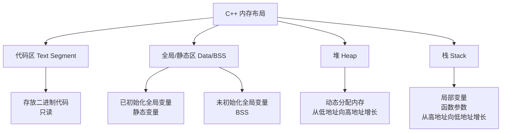

# 内存管理

C++ 提供了灵活而强大的内存管理机制，包括栈、堆、静态存储区和代码区。理解内存管理对编写高效、安全的 C++ 程序至关重要。

::: tip 核心要点
- **栈内存**：自动管理，函数局部变量
- **堆内存**：手动管理，动态分配
- **RAII**：资源获取即初始化，推荐用智能指针
- **内存泄漏**：避免忘记释放分配的内存
:::

## C++ 内存模型



### 内存区域详解

```cpp
#include <iostream>

// 全局变量（已初始化数据区）
int globalInit = 100;

// 全局变量（未初始化 BSS 区）
int globalUninit;

// 静态变量（数据区）
static int staticVar = 200;

// 全局常量（只读数据区）
const int globalConst = 300;

void demonstrateMemory() {
    // 局部变量（栈区）
    int localVar = 10;

    // 静态局部变量（数据区，只初始化一次）
    static int staticLocal = 20;

    // 动态分配（堆区）
    int* heapVar = new int(30);

    std::cout << "局部变量: " << localVar << std::endl;
    std::cout << "静态局部: " << staticLocal << std::endl;
    std::cout << "堆变量: " << *heapVar << std::endl;

    delete heapVar;  // 释放堆内存
}

int main() {
    demonstrateMemory();
    return 0;
}
```

## 栈内存

### 栈的特点

```cpp
#include <iostream>

void functionB() {
    int b = 20;  // functionB 的栈帧
    std::cout << "functionB: b = " << b << std::endl;
}

void functionA() {
    int a = 10;  // functionA 的栈帧
    std::cout << "functionA: a = " << a << std::endl;
    functionB();  // 调用 functionB
    // b 已被销毁
}

int main() {
    functionA();
    return 0;
}
```

### 栈溢出

```cpp
// 递归过深导致栈溢出
int factorial(int n) {
    if (n <= 1) return 1;
    return n * factorial(n - 1);
}

// 迭代版本避免栈溢出
int factorialIterative(int n) {
    int result = 1;
    for (int i = 2; i <= n; ++i) {
        result *= i;
    }
    return result;
}

// 大数组应该分配在堆上
void stackOverflow() {
    // int hugeArray[10000000];  // 栈溢出
    int* hugeArray = new int[10000000];  // OK
    delete[] hugeArray;
}
```

## 堆内存

### new 和 delete

```cpp
#include <iostream>
#include <cstring>

class MyClass {
public:
    int* data;
    size_t size;

    MyClass(size_t s) : size(s) {
        data = new int[size];
        std::cout << "构造: 分配 " << size << " 个 int" << std::endl;
    }

    ~MyClass() {
        delete[] data;
        std::cout << "析构: 释放内存" << std::endl;
    }
};

int main() {
    // 分配单个对象
    int* ptr = new int(42);
    std::cout << "*ptr = " << *ptr << std::endl;
    delete ptr;

    // 分配数组
    int* arr = new int[5]{1, 2, 3, 4, 5};
    for (int i = 0; i < 5; ++i) {
        std::cout << arr[i] << " ";
    }
    std::cout << std::endl;
    delete[] arr;

    // 分配对象
    MyClass* obj = new MyClass(10);
    delete obj;

    // new 不抛出异常版本
    int* ptr2 = new(std::nothrow) int;
    if (ptr2) {
        *ptr2 = 100;
        delete ptr2;
    }

    return 0;
}
```

### 内存泄漏

```cpp
#include <iostream>

class Resource {
public:
    Resource() { std::cout << "资源获取" << std::endl; }
    ~Resource() { std::cout << "资源释放" << std::endl; }
};

void memoryLeakExample() {
    // ❌ 内存泄漏：忘记 delete
    Resource* r1 = new Resource();
    // 函数结束时 r1 被销毁，但对象仍在堆中

    // ❌ 内存泄漏：异常导致跳过 delete
    Resource* r2 = new Resource();
    // throw std::runtime_error("错误");
    delete r2;  // 如果抛出异常，这行不会执行

    // ✅ 使用智能指针自动管理
    #include <memory>
    std::unique_ptr<Resource> r3 = std::make_unique<Resource>();
    // 自动释放
}

void doubleFreeExample() {
    int* ptr = new int(42);

    delete ptr;
    // delete ptr;  // ❌ 重复释放：未定义行为

    // ✅ 解决方案
    ptr = nullptr;  // delete 后置空
    if (ptr) {
        delete ptr;  // 安全
    }
}
```

## RAII 与智能指针

### RAII 原则

RAII（Resource Acquisition Is Initialization）是 C++ 最重要的资源管理惯用法。

```cpp
#include <iostream>
#include <fstream>

// ❌ 手动管理资源
void badFileHandling() {
    std::fstream* file = new std::fstream("test.txt");
    // 如果这里抛出异常，文件不会关闭
    delete file;  // 可能不执行
}

// ✅ RAII 自动管理
void goodFileHandling() {
    std::fstream file("test.txt");
    // 无论是否抛出异常，文件都会在作用域结束时自动关闭
}
```

### unique_ptr 使用

```cpp
#include <memory>
#include <iostream>

class Widget {
public:
    Widget() { std::cout << "Widget 构造" << std::endl; }
    ~Widget() { std::cout << "Widget 析构" << std::endl; }
    void work() { std::cout << "Widget 工作" << std::endl; }
};

int main() {
    // 创建 unique_ptr
    auto w1 = std::make_unique<Widget>();
    w1->work();

    // 所有权转移
    auto w2 = std::move(w1);
    // w1 现在为空

    // 自定义删除器
    auto fileDeleter = [](std::FILE* f) {
        std::cout << "关闭文件" << std::endl;
        std::fclose(f);
    };
    std::unique_ptr<std::FILE, decltype(fileDeleter)> file(
        std::fopen("test.txt", "w"), fileDeleter
    );

    return 0;
}
```

### shared_ptr 与循环引用

```cpp
#include <memory>
#include <iostream>

class B;  // 前向声明

class A {
public:
    std::shared_ptr<B> ptrB;
    ~A() { std::cout << "A 析构" << std::endl; }
};

class B {
public:
    std::shared_ptr<A> ptrA;
    ~B() { std::cout << "B 析构" << std::endl; }
};

void circularReference() {
    auto a = std::make_shared<A>();
    auto b = std::make_shared<B>();

    // ❌ 循环引用导致内存泄漏
    a->ptrB = b;
    b->ptrA = a;

    // a 和 b 的引用计数永远不会变为 0
}

// ✅ 使用 weak_ptr 打破循环
class BFixed {
public:
    std::weak_ptr<A> ptrA;  // 弱引用不增加计数
    ~BFixed() { std::cout << "BFixed 析构" << std::endl; }
};
```

## 自定义内存管理

### 重载 new 和 delete

```cpp
#include <iostream>
#include <cstdlib>

class MyClass {
public:
    // 重载全局 new/delete
    void* operator new(size_t size) {
        std::cout << "自定义 new，大小: " << size << std::endl;
        return ::operator new(size);  // 调用全局 new
    }

    void operator delete(void* ptr) noexcept {
        std::cout << "自定义 delete" << std::endl;
        ::operator delete(ptr);  // 调用全局 delete
    }

    // 数组版本
    void* operator new[](size_t size) {
        std::cout << "自定义 new[]，大小: " << size << std::endl;
        return ::operator new[](size);
    }

    void operator delete[](void* ptr) noexcept {
        std::cout << "自定义 delete[]" << std::endl;
        ::operator delete[](ptr);
    }
};

int main() {
    MyClass* obj = new MyClass();
    delete obj;

    MyClass* arr = new MyClass[3];
    delete[] arr;

    return 0;
}
```

### placement new

```cpp
#include <iostream>
#include <new>

class Widget {
public:
    int value;
    Widget(int v) : value(v) {
        std::cout << "Widget 构造: " << value << std::endl;
    }
    ~Widget() {
        std::cout << "Widget 析构" << std::endl;
    }
};

int main() {
    // 预分配内存
    char buffer[sizeof(Widget) * 2];

    // 在指定位置构造对象
    Widget* w1 = new(buffer) Widget(1);
    Widget* w2 = new(buffer + sizeof(Widget)) Widget(2);

    std::cout << "w1->value = " << w1->value << std::endl;
    std::cout << "w2->value = " << w2->value << std::endl;

    // 必须手动调用析构函数
    w1->~Widget();
    w2->~Widget();

    return 0;
}
```

### 内存池实现

```cpp
#include <iostream>
#include <cstddef>

template<typename T, size_t PoolSize = 1024>
class MemoryPool {
private:
    char buffer[PoolSize];
    size_t offset;

public:
    MemoryPool() : offset(0) {}

    T* allocate(size_t count = 1) {
        size_t size = sizeof(T) * count;
        if (offset + size > PoolSize) {
            throw std::bad_alloc();
        }
        void* ptr = buffer + offset;
        offset += size;
        return static_cast<T*>(ptr);
    }

    void reset() {
        offset = 0;
    }

    size_t used() const {
        return offset;
    }

    size_t available() const {
        return PoolSize - offset;
    }
};

int main() {
    MemoryPool<int> pool;

    int* a = pool.allocate();
    int* b = pool.allocate();
    int* c = pool.allocate(10);

    *a = 1;
    *b = 2;
    for (int i = 0; i < 10; ++i) {
        c[i] = i + 3;
    }

    std::cout << "已使用: " << pool.used() << " 字节" << std::endl;
    std::cout << "可用: " << pool.available() << " 字节" << std::endl;

    return 0;
}
```

## 内存对齐

```cpp
#include <iostream>
#include <iomanip>

struct AlignA {
    char a;    // 1 字节
    // 3 字节填充
    int b;     // 4 字节
};             // 总共 8 字节

struct AlignB {
    int a;     // 4 字节
    char b;    // 1 字节
    // 3 字节填充
    char c;    // 1 字节
    // 2 字节填充
};             // 总共 12 字节

struct alignas(16) AlignC {
    int a;
    char b;
};  // 强制 16 字节对齐

void printAlignInfo() {
    std::cout << std::left << std::setw(20) << "AlignA 大小: " << sizeof(AlignA) << std::endl;
    std::cout << std::left << std::setw(20) << "AlignB 大小: " << sizeof(AlignB) << std::endl;
    std::cout << std::left << std::setw(20) << "AlignC 大小: " << sizeof(AlignC) << std::endl;

    std::cout << std::left << std::setw(20) << "int 对齐: " << alignof(int) << std::endl;
    std::cout << std::left << std::setw(20) << "double 对齐: " << alignof(double) << std::endl;
}

// 对齐的内存分配
int main() {
    printAlignInfo();

    // 对齐分配
    alignas(alignof(double)) unsigned char buffer[sizeof(double)];
    double* d = new(buffer) double(3.14);

    std::cout << "double 地址对齐: "
              << (reinterpret_cast<uintptr_t>(d) % alignof(double) == 0)
              << std::endl;

    return 0;
}
```

## 调试内存问题

### Valgrind 使用

```bash
# 编译带调试信息
g++ -g program.cpp -o program

# 检查内存泄漏
valgrind --leak-check=full ./program

# 输出解释
# ==12345== LEAK SUMMARY:
# ==12345==    definitely lost: 40 bytes in 1 blocks
# ==12345==    indirectly lost: 0 bytes in 2 blocks
# ==12345==    possibly lost: 0 bytes
```

### 地址消毒器

```bash
# 编译时启用
g++ -fsanitize=address -g program.cpp -o program

# 运行
./program
```

## 使用建议

::: tip 最佳实践

1. **优先使用栈**：局部变量优先使用栈
2. **智能指针管理堆**：用 `unique_ptr`/`shared_ptr` 替代裸指针
3. **使用 STL 容器**：`vector`、`string` 管理动态数组
4. **RAII 惯用法**：资源获取即初始化
5. **避免手动 new/delete**：减少内存管理错误
6. **使用工具检查**：valgrind、AddressSanitizer
:::

::: warning 常见错误

1. **内存泄漏**：分配后忘记释放
2. **重复释放**：同一内存释放多次
3. **野指针**：指向已释放的内存
4. **悬空引用**：引用已销毁的对象
5. **栈溢出**：递归过深或大数组
6. **对齐错误**：强制类型转换忽略对齐
:::
