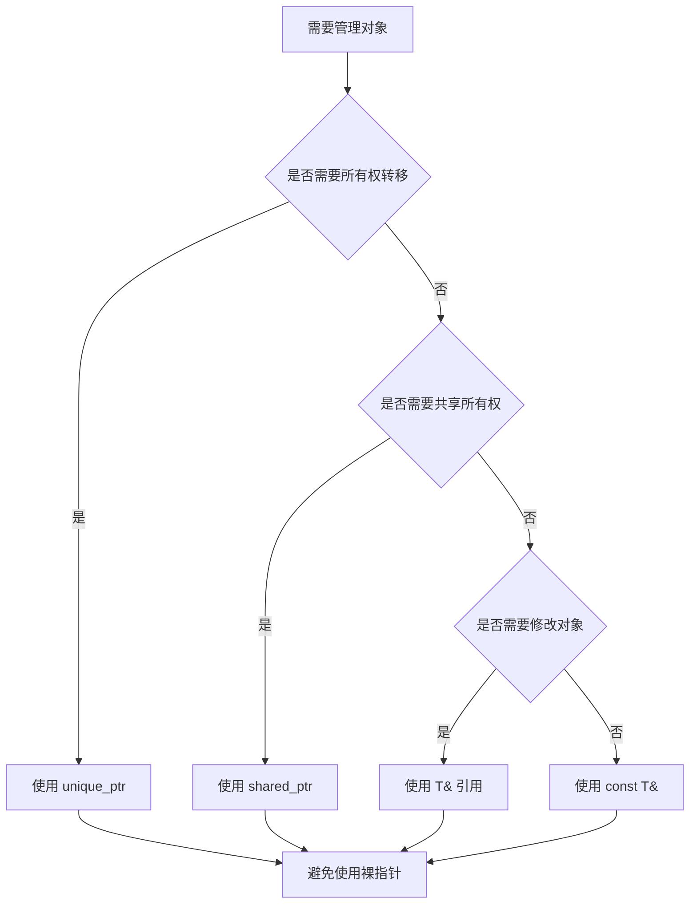

# 指针与引用

指针和引用是 C++ 中最重要的核心概念之一，理解它们的区别和使用场景是掌握 C++ 的关键。

::: tip 核心要点
- **指针**：存储变量地址的变量，支持空值、重新赋值
- **引用**：变量的别名，必须初始化、不可重新绑定
- **智能指针**：现代 C++ 推荐使用，自动管理内存
:::

## 指针基础

### 指针声明与初始化

```cpp
#include <iostream>

int main() {
    int num = 42;

    // 声明指针并初始化
    int* ptr1 = &num;      // 推荐写法：int* ptr
    int *ptr2 = &num;      // 也可以：int *ptr
    int *ptr3 = nullptr;   // C++11：空指针

    // 输出指针的值（地址）
    std::cout << "num 的地址: " << &num << std::endl;
    std::cout << "ptr1 的值: " << ptr1 << std::endl;

    // 通过指针访问值
    std::cout << "*ptr1 = " << *ptr1 << std::endl;  // 解引用

    return 0;
}
```

### 指针运算

```cpp
int arr[] = {10, 20, 30, 40, 50};
int* ptr = arr;  // 数组名退化为指针

// 指针算术运算
std::cout << *ptr << std::endl;      // 10
std::cout << *(ptr + 1) << std::endl; // 20
std::cout << *(ptr + 2) << std::endl; // 30

// 指针递增
ptr++;
std::cout << *ptr << std::endl;      // 20

// 指针相减（计算元素个数）
int* ptr1 = &arr[0];
int* ptr2 = &arr[4];
std::cout << ptr2 - ptr1 << std::endl; // 4
```

### 多级指针

```cpp
int value = 100;
int* ptr = &value;        // 一级指针
int** ptrToPtr = &ptr;    // 二级指针
int*** ptrPtrToPtr = &ptrToPtr;  // 三级指针

// 访问
std::cout << **ptrToPtr << std::endl;      // 100
std::cout << ***ptrPtrToPtr << std::endl;  // 100
```

### 函数指针

```cpp
int add(int a, int b) {
    return a + b;
}

int multiply(int a, int b) {
    return a * b;
}

int main() {
    // 声明函数指针
    int (*funcPtr)(int, int) = add;

    // 使用函数指针
    std::cout << funcPtr(5, 3) << std::endl;  // 8

    // 函数指针数组
    int (*funcs[2])(int, int) = {add, multiply};
    std::cout << funcs[0](5, 3) << std::endl;   // 8
    std::cout << funcs[1](5, 3) << std::endl;   // 15

    // 使用 typedef 简化
    typedef int (*Operation)(int, int);
    Operation op = multiply;
    std::cout << op(4, 3) << std::endl;  // 12

    // C++11 using
    using Op = int(*)(int, int);
    Op op2 = add;
    std::cout << op2(4, 3) << std::endl;  // 7

    return 0;
}
```

## 引用基础

### 引用声明与使用

```cpp
#include <iostream>

int main() {
    int num = 42;

    // 声明引用（必须初始化）
    int& ref = num;  // ref 是 num 的引用

    // 通过引用修改原变量
    ref = 100;
    std::cout << "num = " << num << std::endl;  // 100

    // 引用就是变量的别名
    std::cout << "&num = " << &num << std::endl;  // 地址相同
    std::cout << "&ref = " << &ref << std::endl;

    return 0;
}
```

### 引用作为函数参数

```cpp
// 值传递（拷贝）
void swapByValue(int a, int b) {
    int temp = a;
    a = b;
    b = temp;
    // 不会影响原变量
}

// 指针传递
void swapByPointer(int* a, int* b) {
    int temp = *a;
    *a = *b;
    *b = temp;
}

// 引用传递（推荐）
void swapByReference(int& a, int& b) {
    int temp = a;
    a = b;
    b = temp;
}

int main() {
    int x = 10, y = 20;

    swapByValue(x, y);
    std::cout << "值传递后: x=" << x << ", y=" << y << std::endl;  // 10, 20

    swapByPointer(&x, &y);
    std::cout << "指针传递后: x=" << x << ", y=" << y << std::endl;  // 20, 10

    swapByReference(x, y);
    std::cout << "引用传递后: x=" << x << ", y=" << y << std::endl;  // 10, 20

    return 0;
}
```

### 引用作为函数返回值

```cpp
#include <iostream>

class Array {
private:
    int data[5];

public:
    Array() {
        for (int i = 0; i < 5; i++) {
            data[i] = i * 10;
        }
    }

    // 返回引用，可以修改
    int& operator[](int index) {
        return data[index];
    }

    // const 引用，只读
    const int& operator[](int index) const {
        return data[index];
    }
};

int main() {
    Array arr;

    // 可以作为左值
    arr[2] = 999;
    std::cout << "arr[2] = " << arr[2] << std::endl;  // 999

    return 0;
}
```

### const 引用

```cpp
// const 引用避免拷贝大对象
void printString(const std::string& str) {
    std::cout << str << std::endl;
    // str = "new";  // 错误：不能修改 const 引用
}

// const 引用延长临时对象生命周期
void process() {
    const std::string& ref = std::string("临时对象");
    std::cout << ref << std::endl;  // OK
}

// 右值引用 (C++11)
void acceptRvalue(int&& ref) {
    std::cout << "右值: " << ref << std::endl;
}

int main() {
    std::string s = "Hello";
    printString(s);           // 左值
    printString("World");     // 右值（临时对象）

    acceptRvalue(42);         // 右值
    // acceptRvalue(s);       // 错误：s 是左值
    acceptRvalue(std::move(s));  // OK：显式转换为右值

    return 0;
}
```

## 指针与引用的区别

| 特性 | 指针 | 引用 |
|------|------|------|
| 初始化 | 可不初始化 | 必须初始化 |
| 空值 | 可以为 `nullptr` | 不能为空 |
| 重新赋值 | 可以指向不同对象 | 不能重新绑定 |
| 内存占用 | 占用内存存储地址 | 只是别名，不占额外内存 |
| 间接访问 | 需要解引用 `*ptr` | 直接使用 `ref` |
| 数组支持 | 支持指针数组 | 不支持引用数组 |
| 运算 | 支持指针算术运算 | 不支持 |

```cpp
#include <iostream>

int main() {
    int a = 10, b = 20;

    // 指针可以重新赋值
    int* ptr = &a;
    ptr = &b;  // OK

    // 引用不能重新绑定
    int& ref = a;
    // ref = b;  // 这是赋值，不是重新绑定
    // int& ref2 = ref;  // ref2 是 a 的引用，不是 ref 的引用

    // 指针可以为空
    int* nullPtr = nullptr;
    std::cout << "nullPtr 是否为空: " << (nullPtr == nullptr) << std::endl;

    // 引用不能为空
    // int& nullRef = nullptr;  // 错误

    // 指针数组
    int* ptrArray[3];
    ptrArray[0] = &a;
    ptrArray[1] = &b;

    // 引用数组不存在
    // int& refArray[3];  // 错误

    return 0;
}
```

## 智能指针 (C++11)

现代 C++ 推荐使用智能指针来自动管理内存。

### unique_ptr - 独占所有权

```cpp
#include <memory>
#include <iostream>

class MyClass {
public:
    MyClass() { std::cout << "构造函数" << std::endl; }
    ~MyClass() { std::cout << "析构函数" << std::endl; }
    void doSomething() { std::cout << "做某事" << std::endl; }
};

int main() {
    // 创建 unique_ptr
    std::unique_ptr<MyClass> ptr1(new MyClass());
    auto ptr2 = std::make_unique<MyClass>();  // C++14 推荐

    ptr1->doSomething();

    // 所有权转移
    std::unique_ptr<MyClass> ptr3 = std::move(ptr1);
    // ptr1 现在为空
    if (!ptr1) {
        std::cout << "ptr1 已空" << std::endl;
    }

    // 不能拷贝
    // auto ptr4 = ptr3;  // 错误
    auto ptr4 = std::move(ptr3);  // OK

    return 0;
}
```

### shared_ptr - 共享所有权

```cpp
#include <memory>
#include <iostream>

int main() {
    // 创建 shared_ptr
    auto ptr1 = std::make_shared<int>(42);
    std::cout << "引用计数: " << ptr1.use_count() << std::endl;  // 1

    // 拷贝，共享所有权
    std::shared_ptr<int> ptr2 = ptr1;
    std::cout << "引用计数: " << ptr1.use_count() << std::endl;  // 2

    {
        std::shared_ptr<int> ptr3 = ptr1;
        std::cout << "引用计数: " << ptr1.use_count() << std::endl;  // 3
    }
    // ptr3 离开作用域
    std::cout << "引用计数: " << ptr1.use_count() << std::endl;  // 2

    return 0;
}
```

### weak_ptr - 弱引用

```cpp
#include <memory>
#include <iostream>

int main() {
    auto sptr = std::make_shared<int>(100);

    // 创建 weak_ptr
    std::weak_ptr<int> wptr = sptr;

    // 检查对象是否存活
    if (auto locked = wptr.lock()) {
        std::cout << "值: " << *locked << std::endl;
        std::cout << "引用计数: " << sptr.use_count() << std::endl;  // 1（weak_ptr 不增加）
    }

    return 0;
}
```

## 使用建议

::: tip 最佳实践

1. **优先使用引用**：函数参数优先使用 `const T&` 避免拷贝
2. **使用智能指针**：动态内存使用 `unique_ptr` 或 `shared_ptr`
3. **避免裸指针**：减少使用原始指针 `T*`
4. **明确所有权**：使用 `unique_ptr` 表示独占所有权
5. **使用 `nullptr`**：C++11 及以后用 `nullptr` 代替 `NULL` 或 `0`
:::

::: warning 常见陷阱

1. **悬空指针**：指向已释放的内存
2. **野指针**：未初始化的指针
3. **内存泄漏**：忘记 `delete` 动态分配的内存
4. **重复释放**：多次 `delete` 同一内存
5. **返回局部变量的引用**：返回已销毁对象的引用
:::

---

::: center
**图：指针与引用选择决策树**


:::
