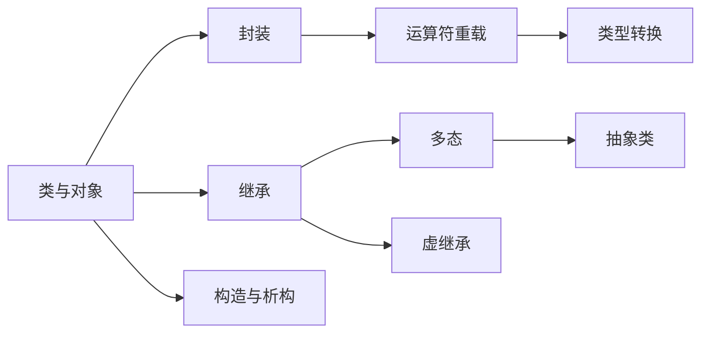

# 面向对象编程 (OOP)

面向对象是 C++ 的核心特性，包括封装、继承、多态三大支柱。

::: tip OOP 三大支柱
- **封装**：隐藏实现细节，暴露接口
- **继承**：代码复用，建立层次关系
- **多态**：同一接口，不同实现
:::

## 学习内容

<VPCard
  title="类与对象"
  desc="类的定义、构造函数、析构函数、成员初始化列表、this 指针"
  logo="https://api.iconify.design/ri/shape-line.svg"
  link="/langs/cpp/03-oop/class-object.md"
/>

<VPCard
  title="继承"
  desc="单继承、多继承、虚继承、访问控制、构造析构顺序"
  logo="https://api.iconify.design/ri/git-branch-line.svg"
  link="/langs/cpp/03-oop/inheritance.md"
/>

<VPCard
  title="多态"
  desc="虚函数、纯虚函数、抽象类、override、final、RTTI"
  logo="https://api.iconify.design/ri/shuffle-line.svg"
  link="/langs/cpp/03-oop/polymorphism.md"
/>

<VPCard
  title="运算符重载"
  desc="算术运算符、关系运算符、赋值运算符、下标运算符、函数调用运算符"
  logo="https://api.iconify.design/ri/calculator-line.svg"
  link="/langs/cpp/03-oop/operator-overloading.md"
/>

## 学习路径



::: center
**图：C++ 面向对象学习路径**
:::

## 核心概念

### 类的定义

```cpp
class MyClass {
public:        // 公有访问
    MyClass(int x) : value(x) {}  // 构造函数
    ~MyClass() {}                   // 析构函数

    void display() const {
        std::cout << value << std::endl;
    }

protected:     // 保护访问
    int getValue() const { return value; }

private:       // 私有访问
    int value;
};
```

### 继承

```cpp
class Derived : public Base {
public:
    Derived(int x) : Base(x) {}

    void overrideMethod() override {
        // 重写基类虚函数
    }
};
```

### 多态

```cpp
// 使用基类指针调用派生类方法
Base* ptr = new Derived();
ptr->virtualMethod();  // 调用 Derived::virtualMethod
delete ptr;
```

## 学习建议

::: tabs

@tab 循序渐进

1. **先学类与对象**：理解封装的基本概念
2. **掌握构造析构**：资源获取即初始化（RAII）
3. **学习继承**：建立类层次结构
4. **深入多态**：虚函数与动态绑定
5. **运算符重载**：使类更自然易用

@tab 重点难点

- **构造函数**：初始化列表、委托构造
- **虚析构函数**：确保正确析构派生类
- **纯虚函数**：定义抽象接口
- **菱形继承**：使用虚继承解决
- **运算符重载**：保持语义一致性

@tab 实践建议

- 遵循 RAII 惯用法管理资源
- 基类析构函数声明为 virtual
- 使用 override 明确重写虚函数
- 优先使用组合而非继承
- 运算符重载保持自然语义

:::
