# 容器知识体系

C++ STL 容器提供了统一的数据结构接口，理解容器体系对于选择合适的数据结构至关重要。

## 容器分类概览

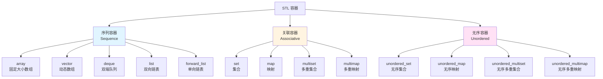

## 容器继承关系

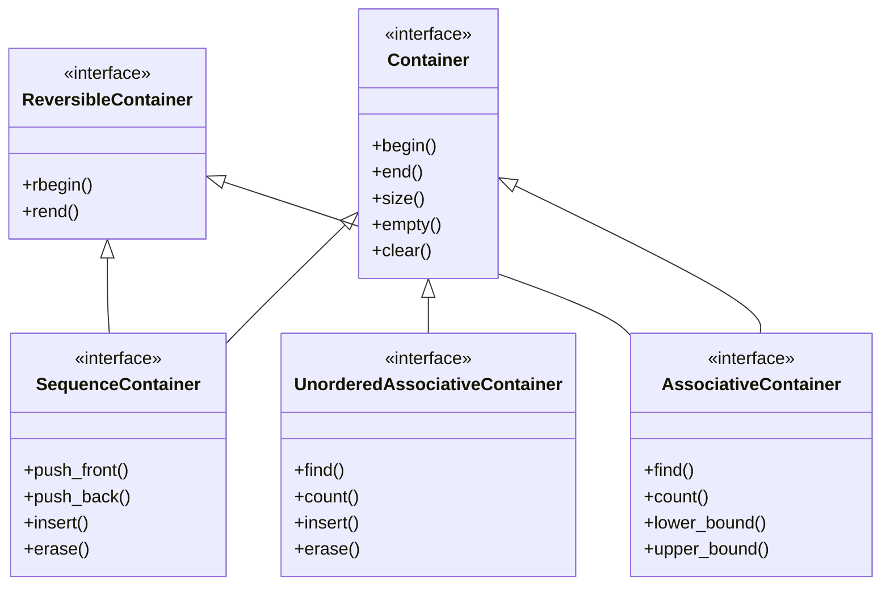

## 容器特性对比

### 基础特性

| 容器 | 数据结构 | 随机访问 | 插入/删除 | 迭代器 | 内存连续 |
|------|----------|----------|-----------|--------|----------|
| **array** | 静态数组 | ✓ | 尾部 O(n) | 随机 | ✓ |
| **vector** | 动态数组 | ✓ | 尾部 O(1)* | 随机 | ✓ |
| **deque** | 双端队列 | ✓ | 头尾 O(1) | 随机 | - |
| **list** | 双向链表 | ✗ | 任意 O(1) | 双向 | ✗ |
| **forward_list** | 单向链表 | ✗ | 任意 O(1)* | 单向 | ✗ |
| **set/map** | 红黑树 | ✗ | O(log n) | 双向 | ✗ |
| **unordered_set/map** | 哈希表 | ✗ | O(1)* | 单向 | ✗ |

> *均摊复杂度

### 时间复杂度对比

::: echarts 常用操作时间复杂度对比

```json
{
  "title": {
    "text": "常用操作时间复杂度对比",
    "left": "center"
  },
  "tooltip": {
    "trigger": "axis",
    "axisPointer": {
      "type": "shadow"
    }
  },
  "legend": {
    "data": ["vector", "deque", "list", "set", "unordered_set"],
    "top": "8%"
  },
  "grid": {
    "left": "3%",
    "right": "4%",
    "bottom": "3%",
    "containLabel": true
  },
  "xAxis": {
    "type": "category",
    "data": ["访问", "头部插入", "尾部插入", "中间插入", "查找", "删除"]
  },
  "yAxis": {
    "type": "category",
    "data": ["O(n)", "O(log n)", "O(1)", "O(1)*"],
    "inverse": true
  },
  "series": [
    {
      "name": "vector",
      "type": "line",
      "data": [0, 3, 0, 3, 3, 3],
      "smooth": true,
      "lineStyle": {
        "width": 3
      }
    },
    {
      "name": "deque",
      "type": "line",
      "data": [0, 0, 0, 3, 3, 3],
      "smooth": true,
      "lineStyle": {
        "width": 3
      }
    },
    {
      "name": "list",
      "type": "line",
      "data": [3, 0, 0, 0, 3, 0],
      "smooth": true,
      "lineStyle": {
        "width": 3
      }
    },
    {
      "name": "set",
      "type": "line",
      "data": [3, 1, 1, 1, 1, 1],
      "smooth": true,
      "lineStyle": {
        "width": 3
      }
    },
    {
      "name": "unordered_set",
      "type": "line",
      "data": [3, 2, 2, 2, 2, 2],
      "smooth": true,
      "lineStyle": {
        "width": 3
      }
    }
  ]
}
```

:::

> **说明**：0=O(1), 2=O(1)均摊, 1=O(log n), 3=O(n)

## 序列容器详解

### vector - 动态数组

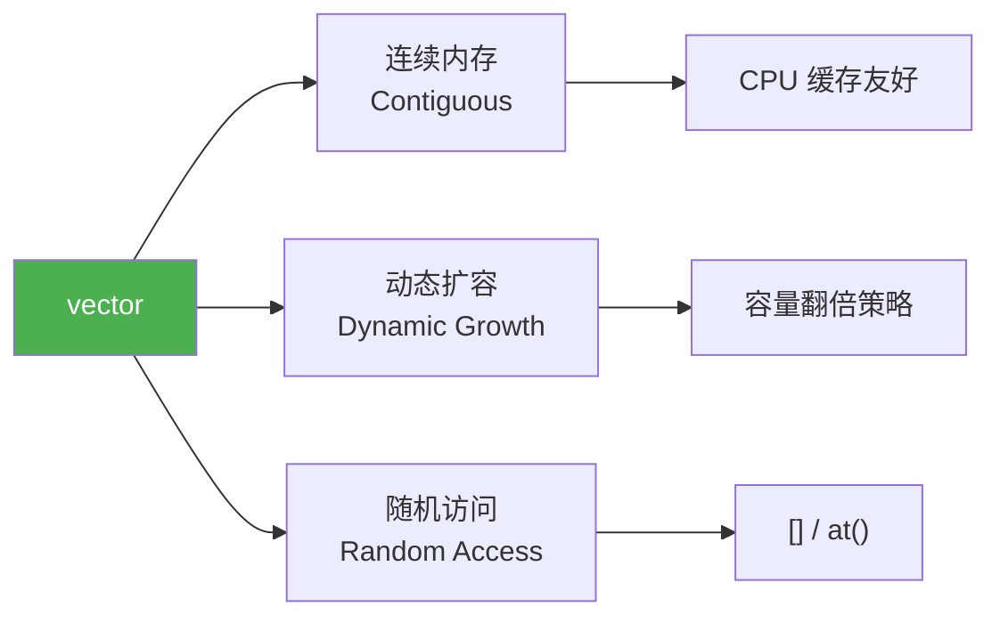

**特性总结：**
- ✓ 随机访问 O(1)
- ✓ 尾部插入/删除 O(1)*
- ✗ 头部/中间插入 O(n)
- ✓ 内存连续，缓存友好
- ✗ 插入时可能失效

### deque - 双端队列

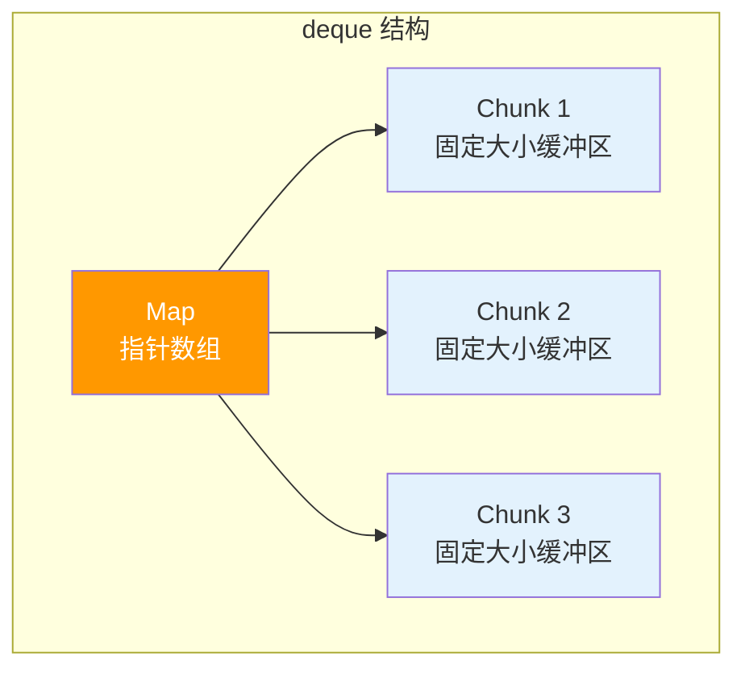

**特性总结：**
- ✓ 随机访问 O(1)
- ✓ 头尾插入/删除 O(1)
- ✗ 中间插入 O(n)
- ✓ 不需要连续内存
- ⚠️ 中间存储有性能损耗

### list - 双向链表

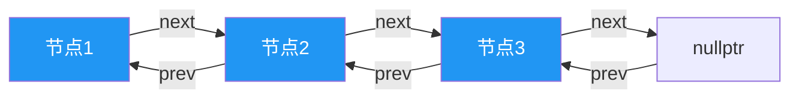

**特性总结：**
- ✗ 无随机访问
- ✓ 任意位置插入/删除 O(1)
- ✓ 插入不失效
- ✓ 稳定迭代器
- ✗ 额外指针开销

### forward_list - 单向链表

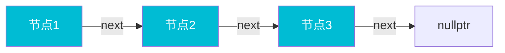

**特性总结：**
- ✗ 无随机访问
- ✓ 任意位置插入/删除 O(1)*
- ✓ 最小内存开销
- ✗ 不支持反向遍历
- ✗ 无 size() 操作

> *需要前驱位置

## 关联容器详解

### set/map - 红黑树实现

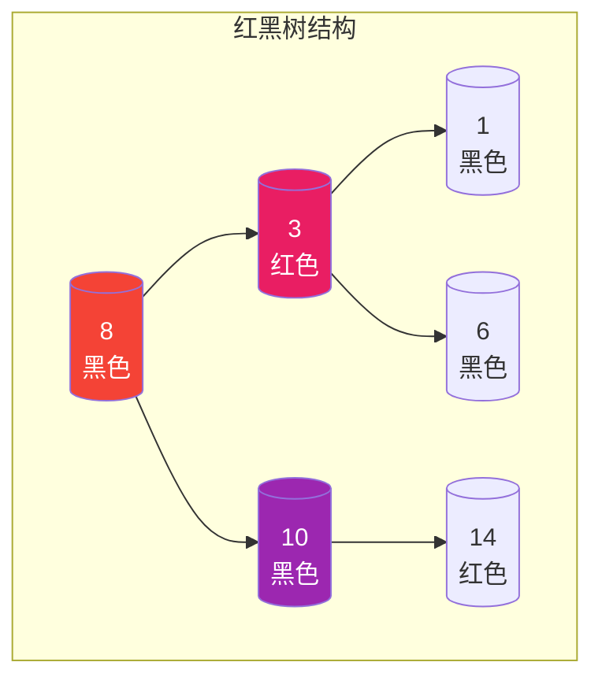

**特性总结：**
- ✓ 有序存储
- ✓ 查找/插入/删除 O(log n)
- ✓ 唯一键 (set) / 允许重复 (multiset)
- ✓ lower_bound/upper_bound
- ⚠️ 红黑树内存开销

### 无序容器 - 哈希表实现

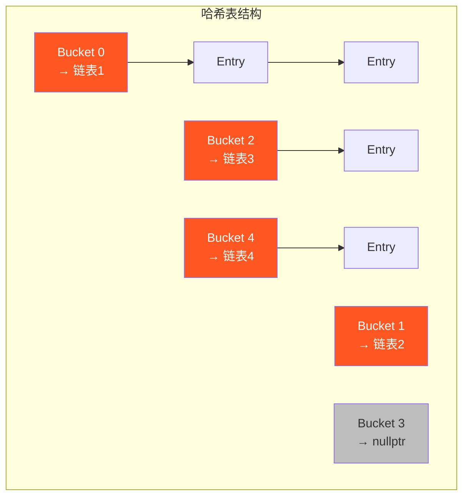

**特性总结：**
- ✓ 平均 O(1) 查找/插入/删除
- ✓ 无序存储
- ✓ 快速查找
- ⚠️ 哈希冲突影响性能
- ⚠️ 最坏情况 O(n)

## 容器适配器

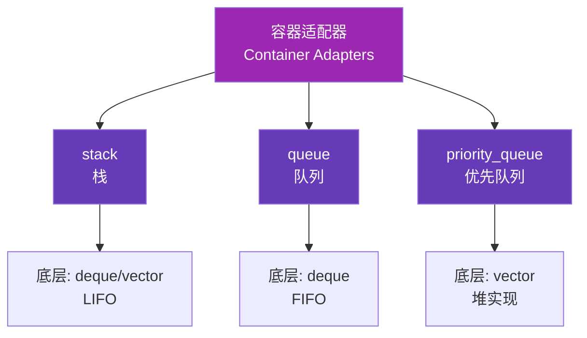

**特性对比：**

| 适配器 | 特点 | 默认底层 | 可用底层 |
|--------|------|----------|----------|
| **stack** | LIFO | deque | vector, list, deque |
| **queue** | FIFO | deque | list, deque |
| **priority_queue** | 优先级 | vector | vector, deque |

## 容器选择决策图

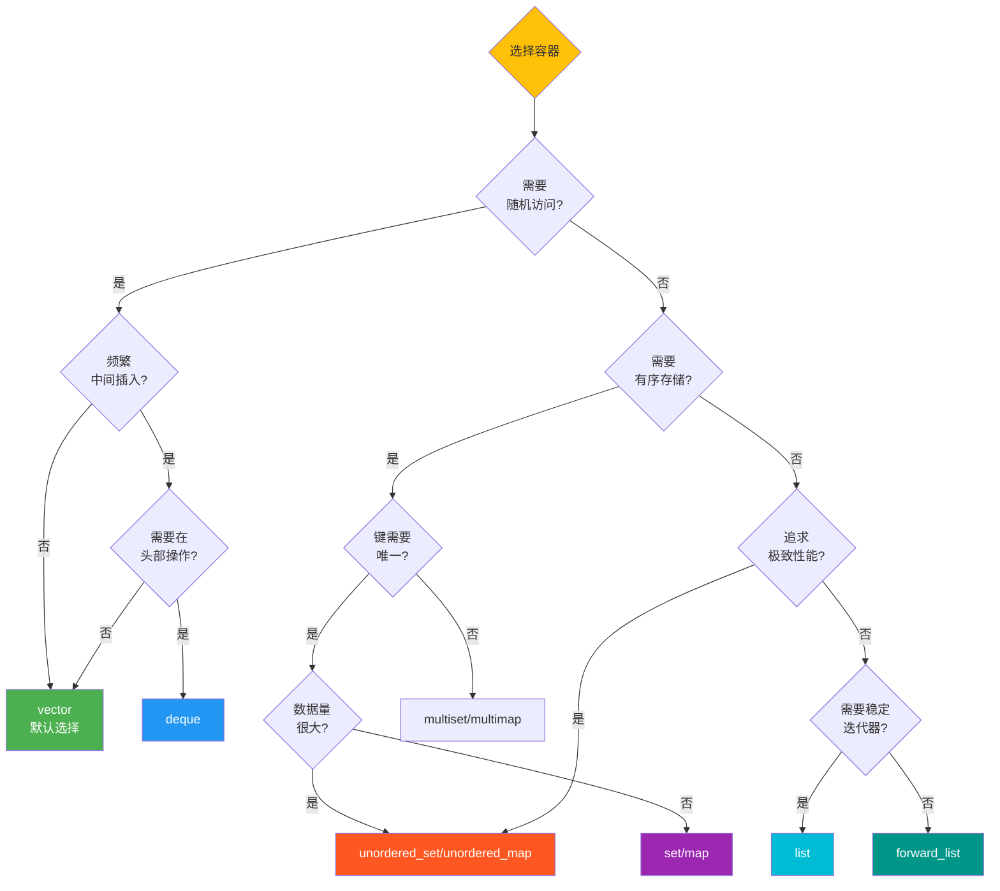

## 使用场景速查

### vector - 通用场景

```cpp
// ✅ 默认首选
std::vector<int> vec = {1, 2, 3};

// ✅ 需要随机访问
int x = vec[2];

// ✅ 尾部频繁添加
vec.push_back(4);
```

### deque - 双端操作

```cpp
// ✅ 头尾都需要操作
std::deque<int> dq;
dq.push_front(1);
dq.push_back(2);

// ✅ 需要 SLAB (滑动窗口)
std::deque<int> window;
```

### list - 稳定迭代器

```cpp
// ✅ 插入后迭代器不能失效
std::list<int> lst = {1, 2, 3};
auto it = lst.begin();
lst.insert(lst.begin(), 0);  // it 仍然有效
```

### set/map - 有序需求

```cpp
// ✅ 需要范围查询
std::set<int> s = {1, 3, 5, 7, 9};
auto range = std::equal_range(s.begin(), s.end(), 5);

// ✅ 需要有序遍历
for (const auto& [key, value] : map) {
    // 自动按键排序
}
```

### unordered_set/map - 性能优先

```cpp
// ✅ 频繁查找，不需要顺序
std::unordered_map<std::string, int> dict;
dict["hello"] = 1;
auto it = dict.find("world");  // O(1)
```

## 性能优化建议

### 内存布局决策

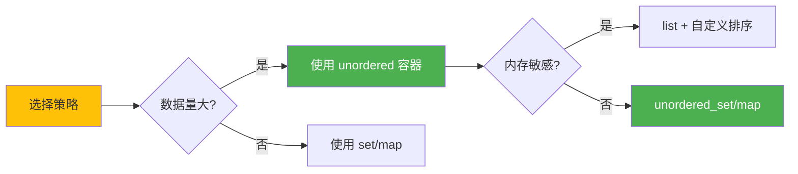

### 容器容量管理

```cpp
// ✅ 预分配容量
std::vector<int> vec;
vec.reserve(1000);  // 避免多次扩容

// ✅ 使用 shrink_to_fit
vec.shrink_to_fit();  // 释放多余内存

// ✅ unordered 容器设置桶数量
std::unordered_set<int> us;
us.reserve(1000);  // 预设桶数量
```

### 迭代器失效预防

```cpp
// ❌ 错误：vector 插入导致迭代器失效
std::vector<int> vec = {1, 2, 3};
auto it = vec.begin() + 1;
vec.insert(vec.begin(), 0);  // it 失效
// std::cout << *it;  // 未定义行为

// ✅ 正确：重新获取
it = vec.begin() + 2;
std::cout << *it;  // OK

// ✅ 使用 list 避免失效
std::list<int> lst = {1, 2, 3};
auto lit = lst.begin();
std::advance(lit, 1);
lst.insert(lst.begin(), 0);  // lit 仍然有效
```

### 容器性能雷达图

::: echarts 各容器综合性能对比

```json
{
  "title": {
    "text": "各容器综合性能对比",
    "left": "center"
  },
  "tooltip": {
    "trigger": "item"
  },
  "legend": {
    "data": ["vector", "deque", "list", "set", "unordered_set"],
    "top": "8%"
  },
  "radar": {
    "indicator": [
      {"name": "随机访问", "max": 100},
      {"name": "插入性能", "max": 100},
      {"name": "删除性能", "max": 100},
      {"name": "查找性能", "max": 100},
      {"name": "内存效率", "max": 100},
      {"name": "缓存友好", "max": 100}
    ]
  },
  "series": [
    {
      "name": "容器性能",
      "type": "radar",
      "data": [
        {
          "value": [100, 40, 40, 20, 95, 100],
          "name": "vector",
          "itemStyle": {"color": "#4CAF50"}
        },
        {
          "value": [100, 70, 70, 20, 85, 75],
          "name": "deque",
          "itemStyle": {"color": "#2196F3"}
        },
        {
          "value": [0, 100, 100, 20, 70, 60],
          "name": "list",
          "itemStyle": {"color": "#00BCD4"}
        },
        {
          "value": [0, 60, 60, 70, 65, 55],
          "name": "set",
          "itemStyle": {"color": "#9C27B0"}
        },
        {
          "value": [0, 95, 95, 95, 60, 50],
          "name": "unordered_set",
          "itemStyle": {"color": "#FF5722"}
        }
      ]
    }
  ]
}
```

:::

---

::: tip 容器选择建议
- **默认使用 vector**：性能好，缓存友好
- **需要头尾操作**：使用 deque
- **频繁中间插入**：使用 list
- **需要有序查找**：使用 set/map
- **追求极致查找性能**：使用 unordered_set/map
- **STL 适配器**：stack/queue/priority_queue
:::
