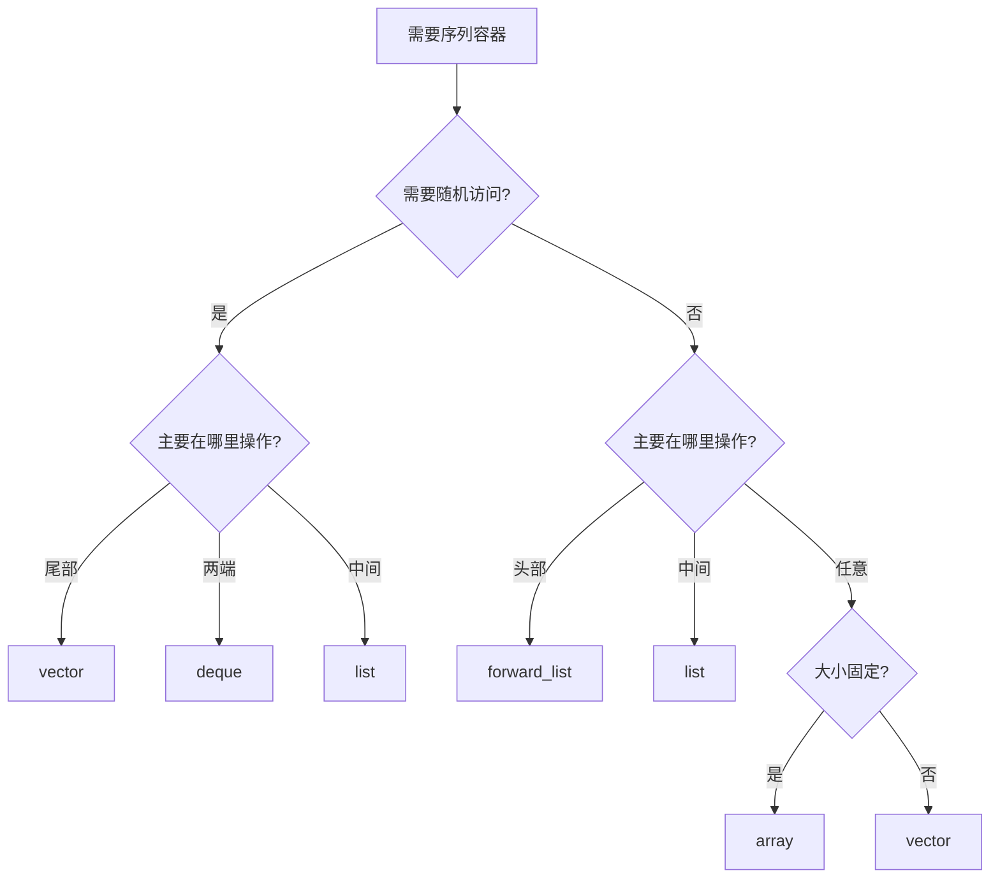

# 序列容器

序列容器按线性顺序存储元素，保持元素的插入顺序。

## std::vector

动态数组，最常用的容器。

### 特性

| 操作 | 时间复杂度 | 说明 |
|------|------------|------|
| 随机访问 | O(1) | 支持下标访问 |
| 尾部插入/删除 | 均摊 O(1) | 可能触发重新分配 |
| 中间插入/删除 | O(n) | 需要移动元素 |
| 查找 | O(n) | 线性查找 |

### 使用示例

```cpp
#include <vector>

// 创建与初始化
std::vector<int> vec1;                          // 空 vector
std::vector<int> vec2(5);                       // 5 个默认值 (0)
std::vector<int> vec3(5, 100);                  // 5 个值为 100
std::vector<int> vec4 = {1, 2, 3, 4, 5};        // 初始化列表
std::vector<int> vec5(vec4);                     // 拷贝构造

// 添加元素
vec1.push_back(10);      // 尾部添加
vec1.emplace_back(20);   // 尾部就地构造 (更高效)

vec1.insert(vec1.begin() + 1, 15);  // 指定位置插入

// 访问元素
int first = vec1[0];           // 不检查边界
int second = vec1.at(1);        // 检查边界，越界抛出异常
int front = vec1.front();       // 第一个元素
int back = vec1.back();         // 最后一个元素
int* data = vec1.data();        // 底层数组指针

// 大小与容量
size_t size = vec1.size();           // 元素数量
bool empty = vec1.empty();            // 是否为空
size_t capacity = vec1.capacity();    // 容量
vec1.reserve(100);                    // 预留容量
vec1.resize(10);                      // 调整大小
vec1.shrink_to_fit();                 // 收缩到合适大小

// 删除元素
vec1.pop_back();                      // 删除最后一个
vec1.erase(vec1.begin());             // 删除指定位置
vec1.erase(vec1.begin(), vec1.begin() + 2);  // 删除范围
vec1.clear();                         // 清空所有元素

// 遍历
// 方式 1: 下标
for (size_t i = 0; i < vec1.size(); i++) {
    std::cout << vec1[i] << " ";
}

// 方式 2: 迭代器
for (auto it = vec1.begin(); it != vec1.end(); it++) {
    std::cout << *it << " ";
}

// 方式 3: 范围 for (推荐)
for (const auto& item : vec1) {
    std::cout << item << " ";
}
```

### 性能优化

```cpp
// 预留容量避免重新分配
std::vector<int> vec;
vec.reserve(1000);  // 一次性分配足够内存

// 使用 emplace_back 避免临时对象
std::vector<std::pair<int, int>> pairs;
pairs.emplace_back(1, 2);  // 就地构造

// 使用移动语义
std::vector<std::string> strings;
std::string str = "Hello";
strings.push_back(std::move(str));  // 移动而非拷贝
```

## std::deque

双端队列，支持头部和尾部的高效插入删除。

### 特性

| 操作 | 时间复杂度 |
|------|------------|
| 随机访问 | O(1) |
| 头/尾插入删除 | O(1) |
| 中间插入删除 | O(n) |

### 使用示例

```cpp
#include <deque>

std::deque<int> dq = {1, 2, 3, 4, 5};

// 双端操作
dq.push_front(0);     // 头部添加
dq.push_back(6);      // 尾部添加
dq.pop_front();        // 头部删除
dq.pop_back();         // 尾部删除

// 随机访问
int item = dq[2];     // O(1)

// 与 vector 相同的接口
int size = dq.size();
bool empty = dq.empty();
dq.clear();
```

### 适用场景

- 需要在两端频繁插入删除
- 不需要元素存储在连续内存中

## std::list

双向链表，支持任意位置的高效插入删除。

### 特性

| 操作 | 时间复杂度 |
|------|------------|
| 随机访问 | O(n) | 不支持下标访问 |
| 任意位置插入删除 | O(1) | 已知位置 |
| 头/尾插入删除 | O(1) |

### 使用示例

```cpp
#include <list>

std::list<int> lst = {1, 2, 3, 4, 5};

// 插入删除
lst.push_front(0);
lst.push_back(6);
lst.insert(lst.begin(), 100);

lst.pop_front();
lst.pop_back();
lst.erase(lst.begin());

// 链表特有操作
lst.sort();                           // 排序
lst.reverse();                        // 反转
lst.unique();                         // 删除连续重复元素
lst.remove(3);                        // 删除所有等于 3 的元素
lst.remove_if([](int n) { return n > 3; });  // 删除满足条件的元素

// 合并 (需要已排序)
std::list<int> other = {10, 20, 30};
lst.sort();
other.sort();
lst.merge(other);                     // 合并后 other 为空

// 拼接
lst.splice(lst.begin(), other);       // 将 other 拼接到 lst

// 遍历 (只能用迭代器或范围 for)
for (auto it = lst.begin(); it != lst.end(); it++) {
    std::cout << *it << " ";
}
```

### 适用场景

- 频繁在中间插入删除
- 不需要随机访问
- 迭代器稳定性要求高（插入删除不失效）

## std::forward_list (C++11)

单向链表，比 `std::list` 更节省内存。

### 使用示例

```cpp
#include <forward_list>

std::forward_list<int> flst = {1, 2, 3, 4, 5};

// 插入
flst.push_front(0);
auto it = flst.begin();
flst.insert_after(it, 10);  // 在 it 之后插入

// 删除
flst.pop_front();
flst.erase_after(it);  // 删除 it 之后的元素

// 没有 size() 方法！
// 可用 std::distance 计算
int size = std::distance(flst.begin(), flst.end());
```

### 适用场景

- 内存敏感场景
- 只需要单向遍历
- 不需要 `size()` 操作

## std::array (C++11)

固定大小数组，性能与原生数组相同。

### 特性

| 特性 | 说明 |
|------|------|
| 大小固定 | 编译期确定 |
| 栈上分配 | 不动态分配内存 |
| 支持 STL 算法 | 与其他容器接口一致 |
| 不会退化 | 不会退化为指针 |

### 使用示例

```cpp
#include <array>

std::array<int, 5> arr = {1, 2, 3, 4, 5};

// 访问
int first = arr[0];
int second = arr.at(1);  // 带边界检查

// 迭代器支持
for (auto it = arr.begin(); it != arr.end(); it++) {
    std::cout << *it << " ";
}

// 大小
int size = arr.size();  // 编译期常量
bool empty = arr.empty();

// 填充
arr.fill(0);  // 所有元素设为 0

// 与原生数组比较
int native_arr[5] = {1, 2, 3, 4, 5};
// std::array 是对原生数组的封装，提供了更多功能
```

### 适用场景

- 大小固定的数组
- 需要 STL 接口
- 替代不安全的原生数组

## 容器对比

| 特性 | vector | deque | list | forward_list | array |
|------|--------|-------|------|--------------|-------|
| 随机访问 | ✅ O(1) | ✅ O(1) | ❌ O(n) | ❌ O(n) | ✅ O(1) |
| 尾部插入 | ✅ O(1) | ✅ O(1) | ✅ O(1) | ✅ O(1) | ❌ |
| 头部插入 | ❌ O(n) | ✅ O(1) | ✅ O(1) | ✅ O(1) | ❌ |
| 中间插入 | ❌ O(n) | ❌ O(n) | ✅ O(1) | ✅ O(1) | ❌ |
| 内存连续 | ✅ | ❌ | ❌ | ❌ | ✅ |
| 大小动态 | ✅ | ✅ | ✅ | ✅ | ❌ |
| 迭代器失效 | 可能 | 部分 | 否 | 否 | 否 |

## 选择建议



### vector

**首选容器**，适合大多数场景：
- 需要随机访问
- 主要在尾部操作
- 需要缓存友好

### deque

- 需要在两端高效插入删除
- 不需要元素连续存储
- 中间操作较少

### list

- 频繁在中间插入删除
- 不需要随机访问
- 需要迭代器稳定性

### forward_list

- 内存敏感
- 只需单向遍历
- 最小的内存开销

### array

- 大小固定
- 替代原生数组
- 需要 STL 接口

---

::: tip 性能建议
- 默认使用 `vector`
- 预留容量 (`reserve`) 避免重新分配
- 使用 `emplace` 比 `insert` 更高效
- 优先使用范围 for 循环遍历
:::
