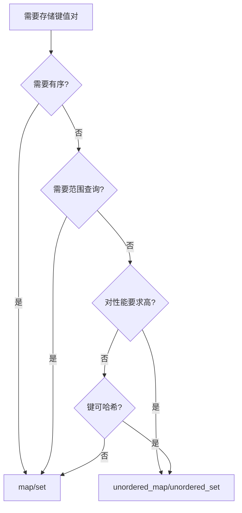

# 无序容器

无序容器基于哈希表实现，提供平均 O(1) 的查找、插入和删除操作，但元素无序。

## std::unordered_set

基于哈希表的集合，元素唯一，无序存储。

### 特性

| 操作 | 平均复杂度 | 最坏复杂度 |
|------|------------|------------|
| 插入 | O(1) | O(n) |
| 删除 | O(1) | O(n) |
| 查找 | O(1) | O(n) |

### 使用示例

```cpp
#include <unordered_set>

// 创建与初始化
std::unordered_set<int> us1;
std::unordered_set<int> us2 = {5, 2, 8, 1, 9};  // 无序

// 插入
us1.insert(3);
us1.insert(1);
us1.insert(2);
us1.insert(1);  // 重复元素不会被插入

// 插入多个
std::vector<int> vec = {6, 4, 7};
us1.insert(vec.begin(), vec.end());

// 查找
auto it = us1.find(3);
if (it != us1.end()) {
    std::cout << "找到: " << *it << std::endl;
}

// 查询元素是否存在
bool exists = us1.count(3) > 0;  // 存在返回 1，否则返回 0

// 删除
us1.erase(3);
us1.erase(us1.begin());

// 大小
int size = us1.size();
bool empty = us1.empty();

// 清空
us1.clear();

// 遍历（无序）
for (const auto& item : us1) {
    std::cout << item << " ";
}

// bucket 操作
int bucket_count = us1.bucket_count();  // bucket 数量
int bucket_size = us1.bucket_size(0);   // 指定 bucket 的大小
```

### 自定义哈希与比较

```cpp
// 自定义类型
struct Person {
    std::string name;
    int age;

    bool operator==(const Person& other) const {
        return name == other.name && age == other.age;
    }
};

// 自定义哈希函数
struct PersonHash {
    std::size_t operator()(const Person& p) const {
        return std::hash<std::string>()(p.name) ^
               (std::hash<int>()(p.age) << 1);
    }
};

// 使用自定义哈希
std::unordered_set<Person, PersonHash> people;
```

## std::unordered_map

基于哈希表的映射，键值对，键唯一，无序存储。

### 特性

| 操作 | 平均复杂度 | 最坏复杂度 |
|------|------------|------------|
| 插入 | O(1) | O(n) |
| 删除 | O(1) | O(n) |
| 查找 | O(1) | O(n) |
| 访问 | O(1) | O(n) |

### 使用示例

```cpp
#include <unordered_map>

// 创建与初始化
std::unordered_map<std::string, int> um1;
std::unordered_map<std::string, int> um2 = {
    {"Alice", 25},
    {"Bob", 30},
    {"Charlie", 35}
};

// 插入
um1["Alice"] = 25;
um1.insert({"Bob", 30});
um1.emplace("Charlie", 35);

// 插入多个
um1.insert(um2.begin(), um2.end());

// 访问
int age1 = um1["Alice"];
int age2 = um1.at("Bob");

// 安全访问
auto it = um1.find("David");
if (it != um1.end()) {
    std::cout << it->first << ": " << it->second << std::endl;
}

// 修改值
um1["Alice"] = 26;

// 删除
um1.erase("Alice");
um1.erase(um1.begin());

// 大小
int size = um1.size();
bool empty = um1.empty();

// 清空
um1.clear();

// 遍历（无序）
for (const auto& pair : um1) {
    std::cout << pair.first << ": " << pair.second << std::endl;
}

// 结构化绑定 (C++17)
for (const auto& [key, value] : um1) {
    std::cout << key << ": " << value << std::endl;
}
```

## std::unordered_multiset

允许重复元素的无序集合。

```cpp
#include <unordered_set>

std::unordered_multiset<int> ums = {1, 2, 2, 3, 3, 3};

// 插入（允许重复）
ums.insert(2);

// 计数
int count = ums.count(2);  // 4

// 删除（只删除一个）
ums.erase(ums.find(2));
```

## std::unordered_multimap

允许重复键的无序映射。

```cpp
#include <unordered_map>

std::unordered_multimap<std::string, int> umm;

// 插入（允许重复键）
umm.insert({"Alice", 25});
umm.insert({"Bob", 30});
umm.insert({"Alice", 26});

// 计数
int count = umm.count("Alice");  // 2

// 查找（返回第一个匹配的位置）
auto it = umm.find("Alice");

// 遍历所有相同键的值
auto range = umm.equal_range("Alice");
for (auto it = range.first; it != range.second; it++) {
    std::cout << it->second << " ";  // 25 26
}
```

## 哈希函数

### 内置哈希

```cpp
// 基本类型
std::hash<int>()(42);           // int
std::hash<std::string>()("hello"); // string
std::hash<float>()(3.14f);       // float

// 指针
int x = 42;
std::hash<int*>()(&x);
```

### 自定义哈希

```cpp
// 方法 1: 函数对象
struct PointHash {
    std::size_t operator()(const std::pair<int, int>& p) const {
        return std::hash<int>()(p.first) ^ (std::hash<int>()(p.second) << 1);
    }
};

std::unordered_set<std::pair<int, int>, PointHash> point_set;

// 方法 2: lambda (C++20)
auto point_hash = [](const std::pair<int, int>& p) {
    return std::hash<int>()(p.first) ^ (std::hash<int>()(p.second) << 1);
};

std::unordered_set<std::pair<int, int>, decltype(point_hash)> point_set2(0, point_hash);
```

## 性能优化

### 预留 bucket 数量

```cpp
std::unordered_set<int> us;
us.reserve(1000);  // 预留空间，避免 rehash

// 或直接指定 bucket 数量
us.max_load_factor(0.5f);  // 调整最大负载因子
```

### 选择合适的哈希函数

```cpp
// 好的哈希函数：分布均匀、计算快速
struct GoodHash {
    std::size_t operator()(int x) const {
        return std::hash<int>()(x);
    }
};

// 坏的哈希函数：冲突多
struct BadHash {
    std::size_t operator()(int x) const {
        return x % 10;  // 只有 10 个不同的哈希值
    }
};
```

### rehash 操作

```cpp
std::unordered_set<int> us;

// 手动触发 rehash
us.rehash(100);

// 根据元素数量调整
us.max_load_factor(0.75f);  // 默认是 1.0
```

## 无序容器 vs 关联容器

| 特性 | 无序容器 | 关联容器 |
|------|----------|----------|
| 底层结构 | 哈希表 | 红黑树 |
| 查找复杂度 | 平均 O(1) | O(log n) |
| 有序性 | ❌ 无序 | ✅ 自动排序 |
| 内存开销 | 较小 | 较大 |
| 范围查询 | ❌ | ✅ |

### 选择决策树



## 使用场景

### 无序容器适用场景

```cpp
// 1. 字典/缓存
std::unordered_map<std::string, int> cache;
cache["result"] = compute("input");

// 2. 去重
std::vector<int> vec = {1, 2, 2, 3, 3, 3};
std::unordered_set<int> unique(vec.begin(), vec.end());

// 3. 快速查找
std::unordered_set<int> blacklist = {123, 456, 789};
if (blacklist.count(user_id)) {
    // 用户在黑名单中
}

// 4. 计数
std::unordered_map<std::string, int> word_count;
std::string word = "hello";
word_count[word]++;

// 5. 分组
std::unordered_multimap<int, std::string> by_age;
by_age.insert({25, "Alice"});
by_age.insert({25, "Bob"});
```

### 关联容器适用场景

```cpp
// 1. 需要范围查询
std::set<int> s = {1, 3, 5, 7, 9};
auto range = s.equal_range(5);  // 所有等于 5 的元素

// 2. 需要顺序遍历
std::map<int, std::string> ordered;
ordered[1] = "first";
ordered[2] = "second";
ordered[3] = "third";
// 按 key 顺序输出

// 3. 需要 nearest 查找
std::set<int> nums = {1, 3, 5, 7, 9};
auto it = nums.lower_bound(6);  // 第一个 >= 6 的元素 (7)

// 4. 需要有序的键
std::map<std::string, int> dict;
dict["apple"] = 1;
dict["banana"] = 2;
dict["cherry"] = 3;
// 自动按字母顺序排序
```

## 性能对比

```cpp
#include <chrono>
#include <set>
#include <unordered_set>

const int N = 1000000;
std::vector<int> data(N);
std::generate(data.begin(), data.end(), std::rand);

// set
std::set<int> s(data.begin(), data.end());
auto start = std::chrono::high_resolution_clock::now();
s.find(42);
auto end = std::chrono::high_resolution_clock::now();
auto set_time = std::chrono::duration_cast<std::chrono::nanoseconds>(end - start);

// unordered_set
std::unordered_set<int> us(data.begin(), data.end());
start = std::chrono::high_resolution_clock::now();
us.find(42);
end = std::chrono::high_resolution_clock::now();
auto us_time = std::chrono::duration_cast<std::chrono::nanoseconds>(end - start);

// unordered_set 通常比 set 快 3-5 倍
```

---

::: tip 选择建议
- **默认选择无序容器**：性能更好
- **需要有序时选择关联容器**
- **需要范围查询时选择关联容器**
- **预分配空间**：`reserve()` / `rehash()`
- **自定义类型时提供好的哈希函数**
:::
