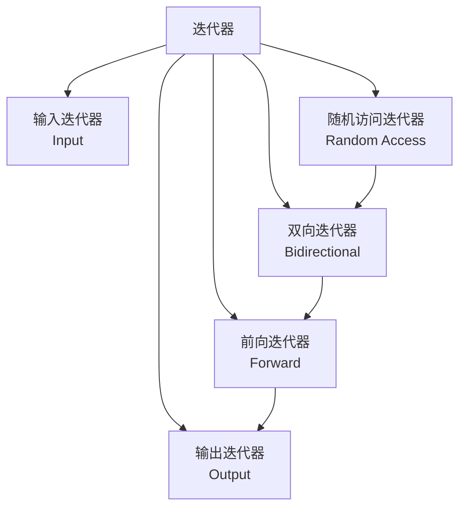

# 迭代器

迭代器 (Iterator) 是 STL 的核心概念，提供统一的方式访问容器中的元素，是算法和容器之间的桥梁。

## 迭代器分类



### 迭代器层次关系

| 类型 | 功能 | 支持 |
|------|------|------|
| **输入迭代器** | 只读，单向 | `*it`, `it->`, `++it`, `it++`, `==`, `!=` |
| **输出迭代器** | 只写，单向 | `*it =`, `++it`, `it++` |
| **前向迭代器** | 读写，单向 | 以上 + 多次遍历 |
| **双向迭代器** | 读写，双向 | 以上 + `--it`, `it--` |
| **随机访问迭代器** | 读写，随机 | 以上 + `it + n`, `it - n`, `it[n]`, `<`, `>` |

### 容器支持的迭代器

| 容器 | 迭代器类型 |
|------|------------|
| `vector`, `deque`, `array` | 随机访问 |
| `list`, `forward_list` | 双向 / 单向 |
| `set`, `map` | 双向 |
| `unordered_set`, `unordered_map` | 前向 |

## 基本用法

### 迭代器声明

```cpp
std::vector<int> vec = {1, 2, 3, 4, 5};

// 完整类型
std::vector<int>::iterator it1 = vec.begin();
std::vector<int>::const_iterator it2 = vec.cbegin();

// auto 关键字 (推荐)
auto it3 = vec.begin();
auto it4 = vec.cbegin();

// const 迭代器（只读）
std::vector<int>::const_iterator cit = vec.begin();
```

### 正向迭代器

```cpp
std::vector<int> vec = {1, 2, 3, 4, 5};

// begin() / end()
for (auto it = vec.begin(); it != vec.end(); it++) {
    std::cout << *it << " ";  // 1 2 3 4 5
}

// cbegin() / cend() (const 迭代器)
for (auto it = vec.cbegin(); it != vec.cend(); it++) {
    std::cout << *it << " ";
    // *it = 10;  // 错误！const 迭代器不能修改
}
```

### 反向迭代器

```cpp
// rbegin() / rend()
for (auto it = vec.rbegin(); it != vec.rend(); it++) {
    std::cout << *it << " ";  // 5 4 3 2 1
}

// crbegin() / crend() (const 反向迭代器)
for (auto it = vec.crbegin(); it != vec.crend(); it++) {
    std::cout << *it << " ";
}
```

### const 迭代器 vs const_iterator

```cpp
std::vector<int> vec = {1, 2, 3};

// const 迭代器（迭代器本身是 const）
const std::vector<int>::iterator it = vec.begin();
*it = 10;     // OK
// it++;       // 错误！

// const_iterator（指向的内容是 const）
std::vector<int>::const_iterator cit = vec.begin();
// *cit = 10;   // 错误！
cit++;         // OK
```

## 迭代器操作

### 移动操作

```cpp
std::vector<int> vec = {1, 2, 3, 4, 5};
auto it = vec.begin();

it++;           // 前进 1
++it;           // 前进 1
it += 2;        // 前进 2 (随机访问)

it--;           // 后退 1 (双向)
--it;           // 后退 1
it -= 2;        // 后退 2 (随机访问)
```

### 算术运算 (随机访问)

```cpp
std::vector<int> vec = {1, 2, 3, 4, 5};
auto it1 = vec.begin();
auto it2 = vec.end();

// 计算距离
int dist = std::distance(it1, it2);  // 5
int dist2 = it2 - it1;              // 5

// 偏移
auto it3 = it1 + 2;  // 指向第 3 个元素
auto it4 = vec.begin() + 3;

// 访问
int value = it3[0];    // 3
int value2 = *(it3 + 1); // 4

// 关系运算
bool b1 = (it1 < it2);   // true
bool b2 = (it1 <= it2);  // true
bool b3 = (it1 > it2);   // false
bool b4 = (it1 >= it2);  // false
bool b5 = (it1 == it2);  // false
```

### 辅助函数

```cpp
std::vector<int> vec = {1, 2, 3, 4, 5};
auto it = vec.begin();

// 前进
std::advance(it, 2);  // it 前进 2

// 距离
auto it1 = vec.begin();
auto it2 = vec.end();
int dist = std::distance(it1, it2);  // 5

// 下一个/上一个
auto next_it = std::next(it1);       // begin + 1
auto prev_it = std::prev(it2);       // end - 1
```

## 迭代器适配器

### 反向迭代器适配器

```cpp
std::vector<int> vec = {1, 2, 3, 4, 5};

// 使用 reverse_iterator
std::reverse_iterator<std::vector<int>::iterator> rev_it(vec.end());
std::reverse_iterator<std::vector<int>::iterator> rev_end(vec.begin());

while (rev_it != rev_end) {
    std::cout << *rev_it << " ";  // 5 4 3 2 1
    rev_it++;
}

// make_reverse_iterator (C++14)
auto rev = std::make_reverse_iterator(vec.end());
```

### 移动迭代器适配器

```cpp
std::vector<std::string> vec = {"Hello", "World"};

// move_iterator
auto move_begin = std::make_move_iterator(vec.begin());
auto move_end = std::make_move_iterator(vec.end());

std::vector<std::string> vec2(move_begin, move_end);
// vec 中的元素被移动到 vec2
```

### 插入迭代器适配器

```cpp
std::vector<int> src = {1, 2, 3};
std::vector<int> dest;

// back_insert_iterator (插入到尾部)
std::copy(src.begin(), src.end(), std::back_inserter(dest));

// front_insert_iterator (插入到头部)
std::deque<int> dq;
std::copy(src.begin(), src.end(), std::front_inserter(dq));

// insert_iterator (插入到指定位置)
std::vector<int> vec = {10, 20, 30};
std::copy(src.begin(), src.end(), std::inserter(vec, vec.begin() + 1));
```

## 流迭代器

### 输入流迭代器

```cpp
#include <iterator>
#include <sstream>

// 从字符串读取
std::string str = "1 2 3 4 5";
std::istringstream iss(str);

std::vector<int> vec;
std::copy(std::istream_iterator<int>(iss),
          std::istream_iterator<int>(),
          std::back_inserter(vec));

// 从标准输入读取
std::vector<int> input;
std::copy(std::istream_iterator<int>(std::cin),
          std::istream_iterator<int>(),
          std::back_inserter(input));
```

### 输出流迭代器

```cpp
// 输出到标准输出
std::vector<int> vec = {1, 2, 3, 4, 5};
std::copy(vec.begin(), vec.end(),
          std::ostream_iterator<int>(std::cout, " "));

// 输出到字符串
std::ostringstream oss;
std::copy(vec.begin(), vec.end(),
          std::ostream_iterator<int>(oss, ","));
// oss: "1,2,3,4,5,"
```

## 迭代器失效

### vector 迭代器失效

```cpp
std::vector<int> vec = {1, 2, 3, 4, 5};
auto it = vec.begin() + 2;  // 指向 3

// 插入/删除导致迭代器失效
vec.insert(vec.begin(), 0);
// it 现在失效！不能使用

// 解决方法：重新获取
it = vec.begin() + 3;  // 需要重新计算位置
```

### list 迭代器稳定

```cpp
std::list<int> lst = {1, 2, 3, 4, 5};
auto it = lst.begin();
std::advance(it, 2);  // 指向 3

// 插入/删除不影响其他迭代器
lst.insert(lst.begin(), 0);
// it 仍然有效！
```

### 规则总结

| 操作 | vector | deque | list | set/map |
|------|--------|-------|------|---------|
| 插入/删除 | 当前位置及之后失效 | 当前位置失效 | 不失效 | 仅被删除元素失效 |
| `resize()` | 若变小则失效 | 若变小则失效 | 不失效 | 不适用 |
| `swap()` | 不失效 | 不失效 | 不失效 | 不失效 |

## 最佳实践

### 使用范围 for (推荐)

```cpp
std::vector<int> vec = {1, 2, 3, 4, 5};

// 只读遍历
for (const auto& item : vec) {
    std::cout << item << " ";
}

// 修改遍历
for (auto& item : vec) {
    item *= 2;
}

// 需要索引时
int index = 0;
for (const auto& item : vec) {
    std::cout << index++ << ": " << item << std::endl;
}
```

### 使用标准算法

```cpp
std::vector<int> vec = {5, 2, 8, 1, 9};

// 查找
auto it = std::find(vec.begin(), vec.end(), 8);

// 计数
int count = std::count(vec.begin(), vec.end(), 5);

// 排序
std::sort(vec.begin(), vec.end());

// 遍历修改
std::for_each(vec.begin(), vec.end(), [](int& n) {
    n *= 2;
});
```

### 避免陷阱

```cpp
// ❌ 错误：比较不同容器的迭代器
std::vector<int> vec1, vec2;
// if (vec1.begin() == vec2.begin()) { }  // 错误！

// ✅ 正确：比较值
if (!vec1.empty() && !vec2.empty() && vec1[0] == vec2[0]) { }

// ❌ 错误：使用失效的迭代器
auto it = vec.begin();
vec.clear();
// if (it != vec.end()) { }  // 错误！it 已失效

// ❌ 错误：空容器解引用
std::vector<int> empty;
// auto it = *empty.begin();  // 未定义行为
```

---

::: tip 迭代器建议
- 优先使用范围 for 循环
- 注意迭代器失效问题
- 使用 `cbegin()`/`cend()` 获取 const 迭代器
- 使用标准算法而非手写循环
:::
