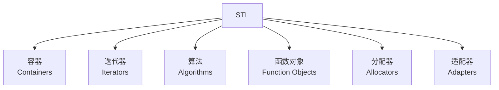
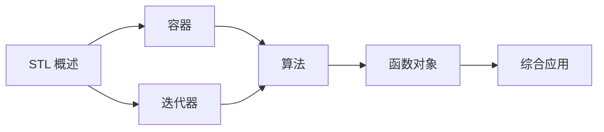

# STL 标准库概述

## 什么是 STL？

STL (Standard Template Library) 是 C++ 标准库的重要组成部分，由 Alexander Stepanov 和 Meng Lee 在 1994 年创建。它提供了一组通用的模板类和函数，实现了常用的数据结构和算法。

## STL 的组成部分



### 1. 容器 (Containers)

用于管理数据的集合，分为三类：

| 类型 | 容器 |
|------|------|
| **序列容器** | `vector`, `deque`, `list`, `forward_list`, `array` |
| **关联容器** | `set`, `map`, `multiset`, `multimap` |
| **无序容器** | `unordered_set`, `unordered_map` |

### 2. 迭代器 (Iterators)

提供统一的方式访问容器中的元素，是算法和容器之间的桥梁。

```cpp
std::vector<int> vec = {1, 2, 3, 4, 5};

// 使用迭代器遍历
for (std::vector<int>::iterator it = vec.begin(); it != vec.end(); it++) {
    std::cout << *it << " ";
}
```

### 3. 算法 (Algorithms)

提供各种常用算法，如查找、排序、修改等。

```cpp
std::vector<int> vec = {5, 2, 8, 1, 9};

// 排序
std::sort(vec.begin(), vec.end());

// 查找
auto it = std::find(vec.begin(), vec.end(), 5);

// 计数
int count = std::count(vec.begin(), vec.end(), 5);
```

### 4. 函数对象 (Function Objects)

也称为仿函数 (Functors)，是可调用的对象。

```cpp
// 内置函数对象
std::multiplies<int> multiply;
int result = multiply(5, 3);  // 15

// 自定义函数对象
struct Add {
    int operator()(int a, int b) const {
        return a + b;
    }
};
```

### 5. 分配器 (Allocators)

负责管理内存的分配和释放。

```cpp
// 使用自定义分配器
template<typename T>
using MyVector = std::vector<T, MyAllocator<T>>;

MyVector<int> vec;
```

### 6. 适配器 (Adapters)

修改或扩展其他组件的接口。

```cpp
// 容器适配器
std::stack<int> stk;       // 栈
std::queue<int> q;         // 队列
std::priority_queue<int> pq; // 优先队列

// 迭代器适配器
std::reverse_iterator<std::vector<int>::iterator> rev_it;

// 函数适配器
std::function<int(int, int)> func = std::plus<int>();
```

## STL 的设计原则

### 泛型编程

STL 基于泛型编程范式，使用模板实现类型无关的代码：

```cpp
template<typename T>
T sum(T a, T b) {
    return a + b;
}

sum(1, 2);        // int
sum(1.5, 2.5);    // double
```

### 效率

STL 注重性能，许多算法都有优化的实现：

```cpp
// vector::reserve 预留容量，避免重新分配
std::vector<int> vec;
vec.reserve(1000);  // 一次性分配足够内存
```

### 可扩展性

用户可以轻松扩展 STL：

```cpp
// 自定义比较函数
struct Person {
    std::string name;
    int age;
};

bool compareByAge(const Person& a, const Person& b) {
    return a.age < b.age;
}

std::vector<Person> people;
std::sort(people.begin(), people.end(), compareByAge);
```

## STL 的优势

### 1. 类型安全

```cpp
// 编译期类型检查
std::vector<int> vec;
vec.push_back("string");  // 编译错误！
```

### 2. 高效

```cpp
// 算法经过高度优化
std::vector<int> vec(1000000);
std::sort(vec.begin(), vec.end());  // 快速排序，O(n log n)
```

### 3. 可复用

```cpp
// 同一套算法适用于不同容器
std::sort(vec.begin(), vec.end());
std::sort(lst.begin(), lst.end());
std::sort(deq.begin(), deq.end());
```

### 4. 标准化

- 跨平台兼容
- 统一的接口
- 丰富的文档

## 学习路径



## 头文件约定

STL 头文件通常不带 `.h` 后缀：

```cpp
#include <vector>      // 容器
#include <algorithm>   // 算法
#include <iterator>    // 迭代器
#include <functional>  // 函数对象
#include <memory>      // 分配器
```

## 命名空间

所有 STL 组件都在 `std` 命名空间中：

```cpp
using namespace std;  // 不推荐，可能造成命名冲突

// 推荐：使用 std:: 前缀
std::vector<int> vec;
std::sort(vec.begin(), vec.end());

// 或者使用 using 声明
using std::vector;
using std::sort;
vector<int> vec;
sort(vec.begin(), vec.end());
```

## 性能考虑

### 选择合适的容器

| 场景 | 推荐容器 | 原因 |
|------|----------|------|
| 随机访问 | `vector` | 连续内存，缓存友好 |
| 两端插入 | `deque` | 两端插入都是 O(1) |
| 中间插入 | `list` | 插入不移动元素 |
| 有序查找 | `set/map` | O(log n) 查找 |
| 快速查找 | `unordered_set/map` | 平均 O(1) 查找 |

### 预留容量

```cpp
std::vector<int> vec;
vec.reserve(1000);  // 避免多次重新分配
```

### 使用移动语义

```cpp
std::vector<std::string> vec;
vec.push_back("Hello");           // 拷贝
vec.emplace_back("World");         // 就地构造，更高效
```

### 使用引用避免拷贝

```cpp
void process(const std::string& str) {  // const 引用
    // ...
}
```

---

::: tip 学习建议
按照"容器 → 迭代器 → 算法 → 函数对象"的顺序学习，每个部分都包含大量实践示例。
:::
