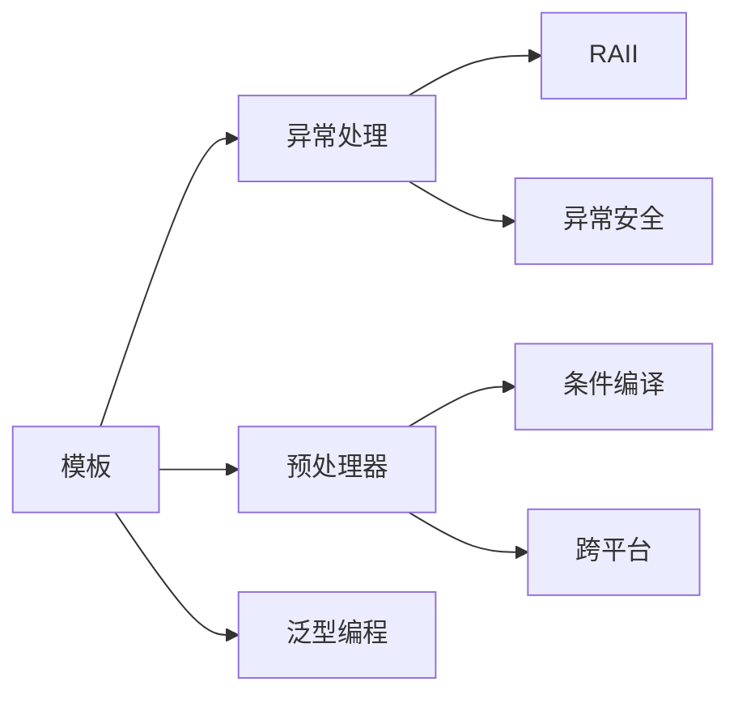

# 进阶特性

掌握 C++ 的进阶特性，包括模板、异常处理、预处理器等。

## 学习内容

<VPCard
  title="模板"
  desc="函数模板、类模板、模板特化、可变参数模板、概念约束"
  logo="https://api.iconify.design/ri/code-box-line.svg"
  link="/langs/cpp/04-advanced/templates.md"
/>

<VPCard
  title="异常处理"
  desc="try-catch、标准异常类、自定义异常、noexcept、异常安全"
  logo="https://api.iconify.design/ri/alert-line.svg"
  link="/langs/cpp/04-advanced/exceptions.md"
/>

<VPCard
  title="预处理器"
  desc="宏定义、条件编译、#include、#pragma 指令"
  logo="https://api.iconify.design/ri/code-s-slash-line.svg"
  link="/langs/cpp/04-advanced/preprocessor.md"
/>

## 学习路径



::: center
**图：C++ 进阶特性学习路径**
:::

## 核心概念

### 函数模板

```cpp
template<typename T>
T maximum(T a, T b) {
    return (a > b) ? a : b;
}

// 使用
int maxInt = maximum(5, 10);
double maxDouble = maximum(3.14, 2.71);
```

### 类模板

```cpp
template<typename T>
class Stack {
    // 实现代码
};

// 使用
Stack<int> intStack;
Stack<std::string> stringStack;
```

### 异常处理

```cpp
try {
    // 可能抛出异常的代码
}
catch (const std::exception& e) {
    // 处理异常
    std::cerr << e.what() << std::endl;
}
```

### 条件编译

```cpp
#ifdef DEBUG_MODE
    std::cout << "调试模式" << std::endl;
#else
    std::cout << "发布模式" << std::endl;
#endif
```

## 学习建议

::: tabs

@tab 循序渐进

1. **学习模板基础**：函数模板、类模板
2. **掌握异常处理**：try-catch、标准异常类
3. **理解预处理器**：宏定义、条件编译
4. **实践泛型编程**：编写可复用代码
5. **异常安全编程**：RAII 惯用法

@tab 重点难点

- **模板实例化**：理解编译期代码生成
- **异常安全**：强异常安全保证
- **宏的陷阱**：副作用、多次求值
- **SFINAE**：替换失败并非错误
- **概念约束**：C++20 模板约束

@tab 实践建议

- 优先使用 `constexpr` 和 `inline` 而非宏
- 使用智能指针确保异常安全
- 自定义异常继承 `std::exception`
- 使用概念约束提高模板可读性
- 条件编译用于平台差异

:::
