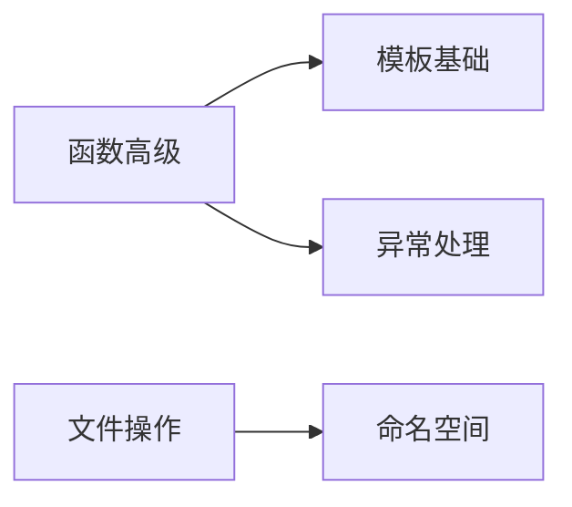

# 进阶特性

掌握 C++ 的进阶特性，包括模板、异常处理、文件操作等。

## 学习内容

<VPCard
  title="函数高级"
  desc="函数重载、函数指针、Lambda 表达式、std::function"
  logo="https://api.iconify.design/ri/function-line.svg"
  link="/langs/cpp/04-advanced/functions/"
/>

<VPCard
  title="模板基础"
  desc="函数模板、类模板、模板特化、概念约束 (C++20)"
  logo="https://api.iconify.design/ri/code-box-line.svg"
  link="/langs/cpp/04-advanced/templates/"
/>

<VPCard
  title="异常处理"
  desc="try-catch、异常类、自定义异常、noexcept"
  logo="https://api.iconify.design/ri/alert-line.svg"
  link="/langs/cpp/04-advanced/exceptions/"
/>

<VPCard
  title="文件操作"
  desc="fstream、文件读写、二进制文件、文件系统 (C++17)"
  logo="https://api.iconify.design/ri/file-text-line.svg"
  link="/langs/cpp/04-advanced/file-io/"
/>

<VPCard
  title="命名空间"
  desc="namespace、using、匿名命名空间"
  logo="https://api.iconify.design/ri/git-branch-line.svg"
  link="/langs/cpp/04-advanced/namespaces/"
/>

## 学习路径

::: center
**图：C++ 进阶特性学习路径**
:::
