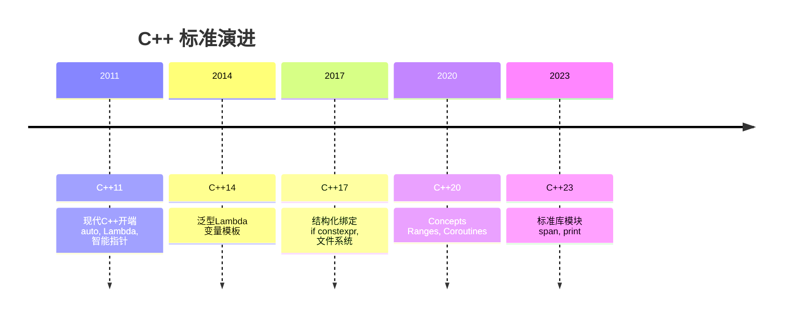

# 现代 C++

探索 C++11/14/17/20/23 的新特性，编写更安全、更高效的现代 C++ 代码。

::: tip 现代 C++ 核心
- **类型推导**：`auto`、`decltype`
- **智能指针**：`unique_ptr`、`shared_ptr`、`weak_ptr`
- **移动语义**：右值引用、完美转发
- **Lambda**：匿名函数与函数式编程
:::

## 学习内容

<VPCard
  title="C++11 核心特性"
  desc="auto、decltype、Lambda、智能指针、移动语义"
  logo="https://api.iconify.design/ri/flashlight-line.svg"
  link="/langs/cpp/06-modern/cpp11/"
/>

<VPCard
  title="C++14/17 增强"
  desc="泛型 Lambda、if constexpr、结构化绑定、折叠表达式"
  logo="https://api.iconify.design/ri/magic-line.svg"
  link="/langs/cpp/06-modern/cpp14-17/"
/>

<VPCard
  title="C++20 新特性"
  desc="Concepts、Ranges、Coroutines、Modules、三向比较"
  logo="https://api.iconify.design/ri/star-smile-line.svg"
  link="/langs/cpp/06-modern/cpp20/"
/>

<VPCard
  title="智能指针详解"
  desc="unique_ptr、shared_ptr、weak_ptr 使用场景"
  logo="https://api.iconify.design/ri/lightbulb-flash-line.svg"
  link="/langs/cpp/06-modern/smart-pointers/"
/>

<VPCard
  title="移动语义与完美转发"
  desc="左值/右值、std::move、std::forward、万能引用"
  logo="https://api.iconify.design/ri/arrow-left-right-line.svg"
  link="/langs/cpp/06-modern/move-semantics/"
/>

## C++ 版本时间线



## 现代 C++ 代码风格对比

::: tabs

@tab 传统风格

```cpp
// 传统 C++98 风格
std::vector<int>* vec = new std::vector<int>();
vec->push_back(1);
vec->push_back(2);

for (std::vector<int>::iterator it = vec->begin();
     it != vec->end(); ++it) {
    std::cout << *it << " ";
}

delete vec;
```

@tab 现代风格

```cpp
// 现代 C++11+ 风格
auto vec = std::make_unique<std::vector<int>>();
vec->push_back(1);
vec->push_back(2);

for (const auto& x : *vec) {
    std::cout << x << " ";
}

// 无需手动 delete
```

:::

## 关键特性速查

| 特性 | 版本 | 说明 |
|------|------|------|
| `auto` | C++11 | 类型推导 |
| `nullptr` | C++11 | 空指针常量 |
| `Lambda` | C++11 | 匿名函数 |
| `decltype` | C++11 | 类型推导 |
| `unique_ptr` | C++11 | 独占所有权智能指针 |
| `std::move` | C++11 | 移动语义 |
| `constexpr` | C++11 | 编译期常量 |
| `struct T { auto x = 0; }` | C++14 | 成员默认初始化 |
| `if constexpr` | C++17 | 编译期条件 |
| `auto [x, y] = pair` | C++17 | 结构化绑定 |
| `std::filesystem` | C++17 | 文件系统库 |
| `Concepts` | C++20 | 模板约束 |
| `std::ranges` | C++20 | 范围库 |
| `co_await` | C++20 | 协程 |
| `std::print` | C++23 | 类型安全打印 |
