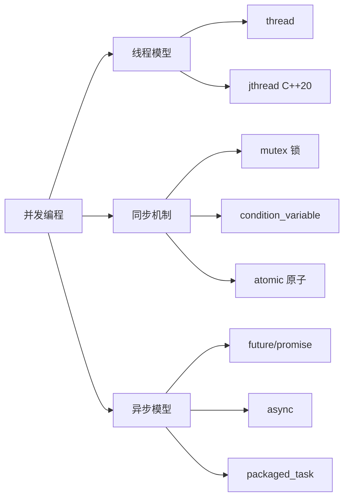

# 并发编程

C++11 引入的并发支持，包括线程、互斥、条件变量、原子操作等。

::: tip 并发编程核心
- **线程**：`std::thread`、`std::jthread` (C++20)
- **同步**：`std::mutex`、`std::lock_guard`、`std::unique_lock`
- **条件变量**：`std::condition_variable`
- **原子操作**：`std::atomic`、内存序
:::

## 学习内容

<VPCard
  title="线程基础"
  desc="std::thread、线程管理、线程参数传递"
  logo="https://api.iconify.design/ri/git-merge-line.svg"
  link="/langs/cpp/07-concurrency/threads/"
/>

<VPCard
  title="互斥与锁"
  desc="mutex、lock_guard、unique_lock、shared_mutex"
  logo="https://api.iconify.design/ri/lock-line.svg"
  link="/langs/cpp/07-concurrency/mutex/"
/>

<VPCard
  title="条件变量"
  desc="condition_variable、生产者消费者模式"
  logo="https://api.iconify.design/ri/pause-line.svg"
  link="/langs/cpp/07-concurrency/condition-variable/"
/>

<VPCard
  title="原子操作"
  desc="std::atomic、内存序、无锁编程"
  logo="https://api.iconify.design/ri/refresh-line.svg"
  link="/langs/cpp/07-concurrency/atomic/"
/>

<VPCard
  title="异步操作"
  desc="std::future、std::promise、std::async、std::packaged_task"
  logo="https://api.iconify.design/ri/time-line.svg"
  link="/langs/cpp/07-concurrency/future/"
/>

## 并发模型



::: center
**图：C++ 并发编程体系**
:::

## 基础示例

### 创建线程

```cpp
#include <thread>
#include <iostream>

void hello() {
    std::cout << "Hello from thread!" << std::endl;
}

int main() {
    // 创建线程
    std::thread t(hello);

    // 等待线程完成
    t.join();

    return 0;
}
```

### 互斥锁

```cpp
#include <thread>
#include <mutex>

std::mutex mtx;
int counter = 0;

void increment() {
    std::lock_guard<std::mutex> lock(mtx);
    ++counter;
}

int main() {
    std::thread t1(increment);
    std::thread t2(increment);

    t1.join();
    t2.join();

    std::cout << "Counter: " << counter << std::endl;
    return 0;
}
```

### 条件变量

```cpp
#include <thread>
#include <mutex>
#include <condition_variable>

std::mutex mtx;
std::condition_variable cv;
bool ready = false;

void worker() {
    std::unique_lock<std::mutex> lock(mtx);
    cv.wait(lock, []{ return ready; });
    // 执行工作
}

void signal() {
    {
        std::lock_guard<std::mutex> lock(mtx);
        ready = true;
    }
    cv.notify_one();
}
```

## 性能建议

::: warning 并发陷阱

1. **死锁**：避免循环等待锁
2. **数据竞争**：确保共享数据的同步访问
3. **过度同步**：锁粒度太大会降低性能
4. **虚假唤醒**：`condition_variable::wait` 要配合谓词
:::

::: tip 最佳实践

1. **使用 RAII 管理锁**：`lock_guard`、`unique_lock`
2. **尽量减少锁的持有时间**
3. **优先使用原子操作**：简单场景下避免锁
4. **使用 `jthread`**（C++20）：自动 join
:::
