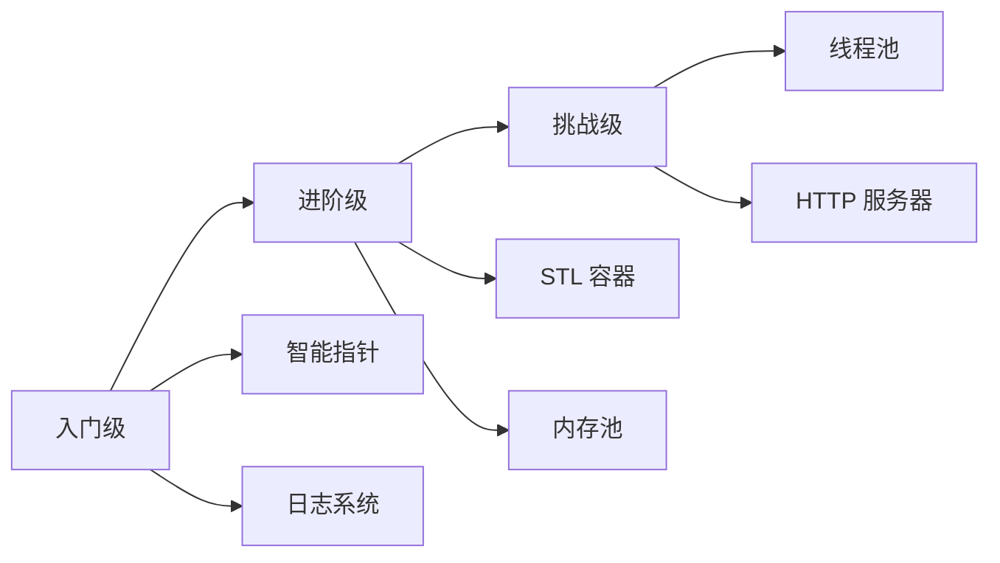

# 实战项目

通过实际项目巩固 C++ 知识，提升编程能力。

## 项目列表

<VPCard
  title="STL 容器实现"
  desc="手写 vector、list、map 等容器，理解底层实现"
  logo="https://api.iconify.design/ri/box-3-line.svg"
  link="/langs/cpp/08-practice/stl-implementation/"
/>

<VPCard
  title="智能指针实现"
  desc="实现 unique_ptr、shared_ptr，理解引用计数"
  logo="https://api.iconify.design/ri/lightbulb-line.svg"
  link="/langs/cpp/08-practice/smart-pointer/"
/>

<VPCard
  title="线程池实现"
  desc="实现高性能线程池，掌握并发编程"
  logo="https://api.iconify.design/ri/git-merge-line.svg"
  link="/langs/cpp/08-practice/thread-pool/"
/>

<VPCard
  title="HTTP 服务器"
  desc="基于 Asio 实现异步 HTTP 服务器"
  logo="https://api.iconify.design/ri/server-line.svg"
  link="/langs/cpp/08-practice/http-server/"
/>

<VPCard
  title="日志系统"
  desc="实现异步日志库，支持多级别、多输出"
  logo="https://api.iconify.design/ri/file-text-line.svg"
  link="/langs/cpp/08-practice/logger/"
/>

<VPCard
  title="内存池"
  desc="实现高性能内存分配器"
  logo="https://api.iconify.design/ri/database-2-line.svg"
  link="/langs/cpp/08-practice/memory-pool/"
/>

## 项目难度

::: center
**图：项目难度分级**
:::

## 学习建议

::: tabs

@tab 循序渐进

从简单项目开始，逐步增加复杂度：

1. **智能指针** → 理解 RAII 和资源管理
2. **STL 容器** → 理解数据结构和算法
3. **日志系统** → 理解多线程和 IO
4. **线程池** → 掌握并发编程
5. **HTTP 服务器** → 综合运用所有知识

@tab 代码质量

- 遵循 C++ Core Guidelines
- 使用 RAII 管理资源
- 编写单元测试
- 使用 valgrind 检查内存泄漏
- 使用 sanitizers 检测未定义行为

@tab 推荐资源

- **书籍**：《Effective C++》、《Effective Modern C++》
- **工具**：clang-tidy、cppcheck、gdb
- **网站**：cppreference.com、 Compiler Explorer

:::
