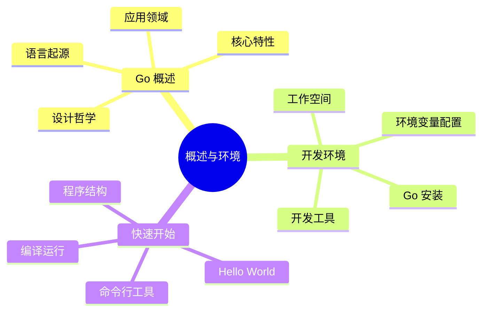
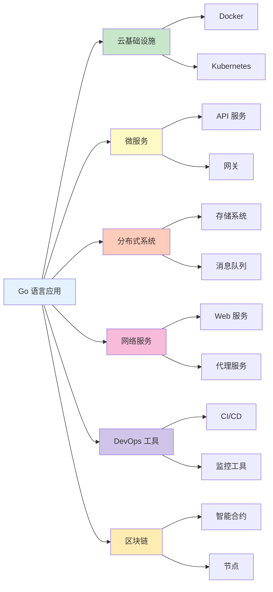

# 概述与环境

欢迎使用 Go 语言技术体系完整指南！本章节将带您快速了解 Go 语言并搭建开发环境。

## 章节导航



## 学习路径

1. **Go 概述** - 了解 Go 语言的历史背景、设计理念和核心特性
2. **环境安装配置** - 搭建完整的 Go 开发环境
3. **Hello World** - 编写第一个 Go 程序，了解基本结构

## 为什么选择 Go？

### 核心优势

| 特性 | 说明 |
|------|------|
| **简洁高效** | 语法简洁，编译快速，执行效率接近 C/C++ |
| **并发原语** | Goroutine 和 Channel 让并发编程变得简单 |
| **静态类型** | 编译时类型检查，减少运行时错误 |
| **垃圾回收** | 自动内存管理，开发更专注于业务逻辑 |
| **跨平台** | 一次编写，到处编译，支持多平台 |
| **丰富标准库** | 内置网络、并发、加密等强大标准库 |

### 应用场景



## Go 生态概览

### 主要框架与工具

| 类别 | 工具/框架 | 用途 |
|------|----------|------|
| **Web 框架** | Gin, Echo, Fiber | HTTP 服务开发 |
| **ORM** | GORM, Ent | 数据库操作 |
| **CLI** | Cobra, Viper | 命令行工具开发 |
| **RPC** | gRPC, Protobuf | 微服务通信 |
| **配置** | Viper | 配置管理 |
| **日志** | Zap, Logrus | 日志记录 |
| **测试** | Testify | 单元测试 |

### 大厂实践

- **Google**: Go 语言发源地，大量核心项目使用 Go
- **字节跳动**: 微服务架构全面采用 Go
- **腾讯**: 云服务、游戏后端使用 Go
- **阿里巴巴**: 基础设施、中间件使用 Go
- **百度**: 云原生、AI 平台使用 Go
- **京东**: 高并发场景使用 Go

## 学习建议

### 前置知识

- 具备至少一门编程语言基础（如 C/C++、Java、Python）
- 了解基本的数据结构和算法
- 熟悉命令行操作

### 学习方法

1. **理论结合实践** - 每个知识点都配合代码示例
2. **由浅入深** - 从基础语法到高级特性逐步学习
3. **项目驱动** - 通过实战项目巩固所学知识
4. **阅读源码** - 学习标准库和优秀开源项目的代码风格

### 推荐资源

**官方资源**
- [Go 官方网站](https://go.dev/)
- [Go 官方文档](https://go.dev/doc/)
- [Go 标准库](https://pkg.go.dev/std)

**书籍推荐**
- 《Go 程序设计语言》- Go 之父所著
- 《Go 语言实战》- 实战导向
- 《Go 语言圣经》- 深入理解 Go

## 快速预览

在开始深入学习之前，先看一段 Go 代码：

```go
package main

import "fmt"

func main() {
    // 定义并发任务
    tasks := []string{"下载文件", "处理数据", "发送通知"}

    // 使用并发处理
    for _, task := range tasks {
        go func(t string) {
            fmt.Printf("正在执行: %s\n", t)
        }(task)
    }

    // 等待用户输入
    fmt.Scanln()
    fmt.Println("所有任务完成！")
}
```

**这段代码展示了 Go 的几个特点：**
- 简洁的语法
- 原生并发支持 (`go` 关键字)
- 强类型但类型推断
- 丰富的标准库

## 下一步

准备好了吗？让我们开始 Go 语言之旅！

- [Go 概述](./go-overview.md) - 深入了解 Go 语言
- [环境安装配置](./go-env.md) - 搭建开发环境
- [Hello World](./hello-world.md) - 编写第一个程序
