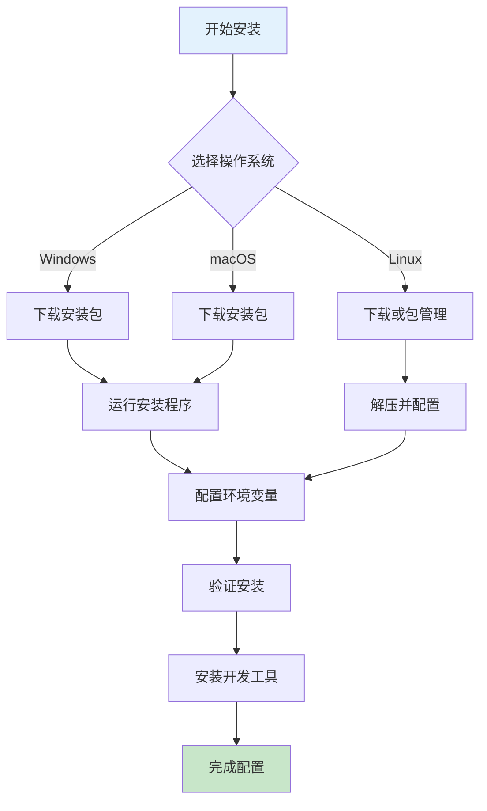
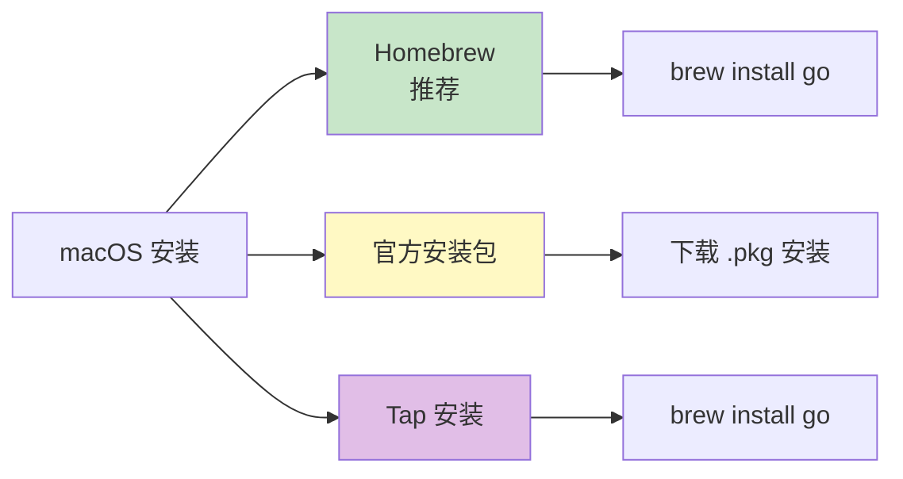

# 环境安装配置

本章节将指导您完成 Go 开发环境的完整配置，包括 Go 安装、环境变量设置和开发工具配置。

## 安装概览



## Windows 安装

### 1. 下载安装包

访问 [Go 官网下载页](https://go.dev/dl/)，下载 Windows 版本：

- **推荐版本**: Go 1.22 或更高
- **文件格式**: `.msi` 安装程序或 `.zip` 压缩包

### 2. 运行安装

**方式一：MSI 安装（推荐）**

```powershell
# 双击运行下载的 .msi 文件
# 按照提示完成安装
# 默认安装路径: C:\Program Files\Go
```

**方式二：ZIP 解压**

```powershell
# 解压到指定目录
# 例如: C:\Go
# 需要手动配置环境变量
```

### 3. 配置环境变量

**系统环境变量**

```powershell
# 添加以下环境变量

# Go 安装目录
GOROOT=C:\Program Files\Go

# Go 工作空间
GOPATH=C:\Users\YourName\go

# Path 中添加
%GOROOT%\bin
%GOPATH%\bin
```

**验证配置**

```powershell
# 打开新的 PowerShell 窗口
go version
# 应该显示: go version go1.22.x windows/amd64

go env
# 查看所有 Go 环境变量
```

## macOS 安装

### 1. 安装方式选择



### 2. Homebrew 安装（推荐）

```bash
# 安装 Homebrew（如果未安装）
/bin/bash -c "$(curl -fsSL https://raw.githubusercontent.com/Homebrew/install/HEAD/install.sh)"

# 安装 Go
brew install go

# 验证安装
go version
```

### 3. 官方安装包

```bash
# 下载 .pkg 文件
# 访问 https://go.dev/dl/
# 下载 macOS 安装包

# 双击 .pkg 文件
# 按照提示完成安装

# 默认安装路径: /usr/local/go
```

### 4. 配置环境

```bash
# 编辑 shell 配置文件
# ~/.zshrc (Zsh) 或 ~/.bash_profile (Bash)

# 添加以下内容
export GOROOT=/usr/local/go
export GOPATH=$HOME/go
export PATH=$PATH:$GOROOT/bin:$GOPATH/bin

# 使配置生效
source ~/.zshrc

# 验证
go version
go env
```

## Linux 安装

### 1. 下载安装

```bash
# 下载 Go 安装包
wget https://go.dev/dl/go1.22.0.linux-amd64.tar.gz

# 或使用 curl
curl -O https://go.dev/dl/go1.22.0.linux-amd64.tar.gz
```

### 2. 解压安装

```bash
# 删除旧版本（如果有）
sudo rm -rf /usr/local/go

# 解压到 /usr/local
sudo tar -C /usr/local -xzf go1.22.0.linux-amd64.tar.gz

# 验证
/usr/local/go/bin/go version
```

### 3. 配置环境变量

```bash
# 编辑 ~/.bashrc 或 ~/.profile
nano ~/.bashrc

# 添加以下内容
export GOROOT=/usr/local/go
export GOPATH=$HOME/go
export PATH=$PATH:$GOROOT/bin:$GOPATH/bin

# 使配置生效
source ~/.bashrc

# 验证
go version
go env
```

### 4. 包管理器安装

**Ubuntu/Debian**

```bash
# 添加 Go 官方 PPA
sudo add-apt-repository ppa:longsleep/golang-backports
sudo apt update
sudo apt install golang-go
```

**Fedora**

```bash
sudo dnf install golang
```

**Arch Linux**

```bash
sudo pacman -S go
```

## 环境变量详解

### 核心环境变量


### GOROOT

Go 安装目录，包含标准库和工具链。

```bash
# 查看当前 GOROOT
go env GOROOT
# 输出: /usr/local/go

# 目录结构
$GOROOT/
├── bin/          # Go 工具（go, gofmt 等）
├── src/          # 标准库源码
├── pkg/          # 标准库编译产物
└── misc/         # 其他文件
```

### GOPATH

Go 工作空间，存储用户代码和依赖。

```bash
# 查看 GOPATH
go env GOPATH
# 输出: /home/user/go

# 目录结构
$GOPATH/
├── src/          # 源码目录
│   ├── github.com/
│   └── golang.org/
├── pkg/          # 编译产物
│   └── $GOOS_$GOARCH/
└── bin/          # 可执行文件
    └── mytool    # 自己安装的工具
```

### GOPROXY

Go 模块代理，用于加速依赖下载。

```bash
# 常用代理
# 官方代理
export GOPROXY=https://proxy.golang.org,direct

# 七牛云国内代理
export GOPROXY=https://goproxy.cn,direct

# 阿里云代理
export GOPROXY=https://mirrors.aliyun.com/goproxy/,direct

# 设置为 direct 表示不使用代理，直接连接
export GOPROXY=direct

# 关闭模块校验（生产环境不推荐）
export GOSUMDB=off
```

### GO111MODULE

模块支持开关（Go 1.16+ 默认为 on）。

```bash
# 启用模块模式（推荐）
go env -w GO111MODULE=on

# 自动模式（根据目录判断）
go env -w GO111MODULE=auto

# 仅使用 GOPATH 模式（已过时）
go env -w GO111MODULE=off
```

### GOMODCACHE

模块下载缓存目录。

```bash
# 查看缓存位置
go env GOMODCACHE
# 输出: /home/user/Library/Caches/go-mod

# 清理缓存
go clean -modcache
```

## 验证安装

### 基础验证

```bash
# 查看 Go 版本
go version
# 输出示例: go version go1.22.0 darwin/amd64

# 查看环境变量
go env

# 查看所有环境变量（详细）
go env -json
```

### 功能验证

创建测试文件 `hello.go`：

```go
package main

import "fmt"

func main() {
    fmt.Println("Hello, Go!")
}
```

运行测试：

```bash
# 直接运行
go run hello.go

# 编译后运行
go build hello.go
./hello

# 安装到 GOPATH/bin
go install hello.go
hello  # 如果 GOPATH/bin 在 PATH 中
```

## 开发工具配置

### Visual Studio Code

**推荐扩展**

| 扩展 | 用途 |
|------|------|
| **Go** | Go 官方扩展（必备） |
| **Go Test Explorer** | 测试管理 |
| **Todo Tree** | TODO 注释管理 |
| **Code Spell Checker** | 拼写检查 |

**安装步骤**

```bash
# 1. 安装 VS Code
# 2. 安装 Go 扩展
# 3. 打开命令面板
 Cmd/Ctrl + Shift + P
# 4. 输入并选择
 Go: Install/Update Tools
# 5. 选择所有工具进行安装
```

**必需工具**

```bash
# 这些工具会被自动安装
gopls          # 语言服务器
dlv            # 调试器
goplay         # Go Playground
gotests        # 测试生成工具
gomodifytags   # 标签管理
impl           # 接口实现
gofumpt        # 格式化工具
go-outline     # 代码大纲
guru           # 代码查询工具
```

### GoLand / IntelliJ IDEA

**配置步骤**

1. 下载安装 [GoLand](https://www.jetbrains.com/go/)
2. 打开 GoLand
3. 配置 Go SDK（Settings → Go → GOROOT）
4. 配置 GOPATH（Settings → Go → GOPATH）

### Vim/Neovim

```vim
" 安装 vim-go 插件
" 使用 vim-plug
Plug 'fatih/vim-go'

" 基本配置
let g:go_fmt_command = "goimports"
let g:go_autodetect_gopath = 1
let g:go_list_type = "quickfix"

" 快捷键
au FileType go nmap <leader>b <Plug>(go-build)
au FileType go nmap <leader>r <Plug>(go-run)
```

### 其他工具

```bash
# 安装常用工具
go install golang.org/x/tools/gopls@latest           # LSP 服务器
go install github.com/go-delve/delve/cmd/dlv@latest  # 调试器
go install github.com/golangci/golangci-lint/cmd/golangci-lint@latest  # 代码检查

# 安装格式化工具
go install golang.org/x/tools/cmd/goimports@latest

# 安装生成工具
go install github.com/matryer/moq@latest    # mock 生成
go install github.com/vektra/mockery/v2@latest  # mock 生成
```

## 常见问题

### 问题 1：命令未找到

```bash
# 错误提示
bash: go: command not found

# 解决方案
# 1. 检查环境变量配置
echo $PATH | grep go

# 2. 确认 Go 安装路径
which go

# 3. 重新加载配置
source ~/.bashrc  # Linux
source ~/.zshrc   # macOS
```

### 问题 2：权限错误

```bash
# Linux/macOS 权限问题
sudo chown -R $USER /usr/local/go

# Windows 权限问题
# 以管理员身份运行 PowerShell
```

### 问题 3：代理设置失败

```bash
# 取消代理设置
go env -w GOPROXY=direct

# 或使用国内代理
go env -w GOPROXY=https://goproxy.cn,direct
```

### 问题 4：模块下载失败

```bash
# 初始化模块
go mod init myproject

# 更新依赖
go mod tidy

# 验证依赖
go mod verify
```

## 最佳实践

### 目录结构推荐

```bash
# 单项目工作区
~/projects/
├── myproject/
│   ├── go.mod
│   ├── main.go
│   ├── internal/    # 私有代码
│   ├── pkg/         # 公共库
│   └── cmd/         # 入口点

# 多项目工作区
~/go/
├── src/
│   ├── github.com/user/project1
│   └── github.com/user/project2
```

### Git 配置

```bash
# 配置 Git 用户信息
git config --global user.name "Your Name"
git config --global user.email "your.email@example.com"

# 配置 Go 专用 Git
# 用于 go get 等命令
git config --global url."git@github.com:".insteadOf "https://github.com/"
```

### 性能优化

```bash
# 加速编译
go env -w GOGC=100

# 并行编译
go build -p=4

# 使用构建缓存
go build -cache
```

## 下一步

环境配置完成后，让我们编写第一个 Go 程序！

::: v-pre

[Hello World](./hello-world.md) → 编写您的第一个 Go 程序

:::
