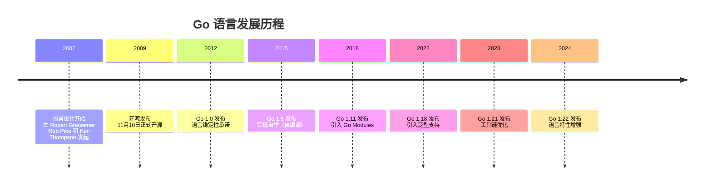
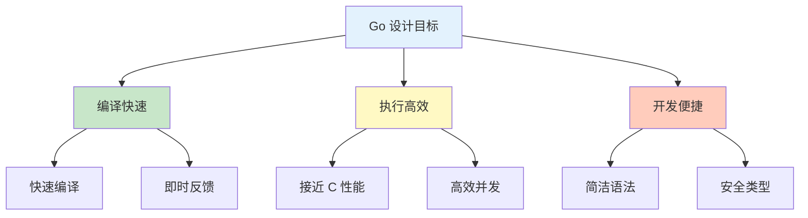
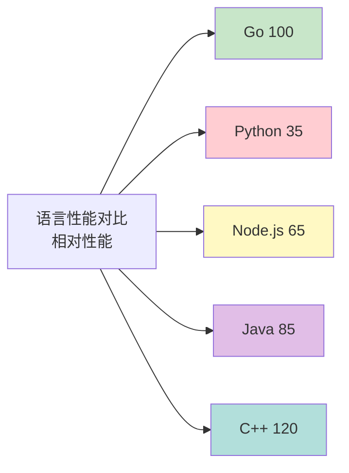
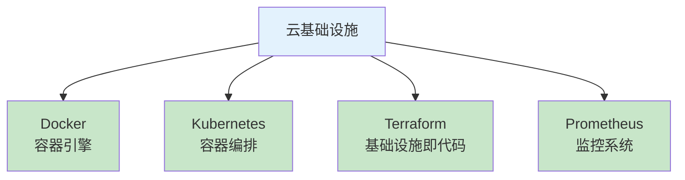
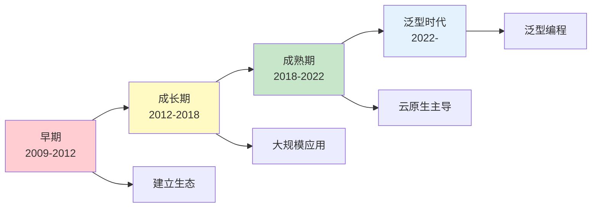

# Go 概述

Go 语言是 Google 在 2007 年开始开发，并于 2009 年正式开源的一种静态强类型、编译型编程语言。

## 语言起源

### 发展历史



### 设计者

| 人物 | 背景 | 贡献 |
|------|------|------|
| **Ken Thompson** | Unix 创始人、B 语言发明者 | 语言设计核心 |
| **Rob Pike** | UTF-8 设计者、Plan 9 作者 | 语言设计与标准库 |
| **Robert Griesemer** | V8 JavaScript 引擎开发者 | 编译器实现 |

## 设计哲学

### 核心理念

Go 语言的设计围绕三个核心目标：



### 设计原则

::: tip 设计原则

1. **简单性优于复杂性**
   - 只有 25 个关键字
   - 最小化特性集
   - 清晰的代码风格

2. **清晰优于聪明**
   - 代码可读性优先
   - 显式优于隐式
   - 一致的代码风格

3. **组合优于继承**
   - 无类型层级
   - 通过组合实现代码复用
   - 接口隐式实现

4. **并发是原语**
   - CSP 并发模型
   - Goroutine 轻量级
   - Channel 类型安全

:::

## 核心特性

### 1. 静态类型与类型推断

```go
// 显式类型声明
var name string = "Go"

// 类型推断（编译器自动推断）
age := 15  // 自动推断为 int

// 短变量声明只能在函数内使用
func main() {
    message := "Hello, Go!"  // 推断为 string
}
```

### 2. 垃圾回收

```go
func main() {
    // 无需手动管理内存
    data := make([]byte, 10_000_000)

    // 使用完毕后自动回收
    processData(data)

    // GC 会在合适的时机回收
}
```

**GC 特性**：
- 三色标记算法
- 并发标记清除
- 低延迟（<1ms）
- 可配置的 GC 参数

### 3. 原生并发

```go
func main() {
    // 启动 goroutine
    go func() {
        fmt.Println("并发任务 1")
    }()

    go func() {
        fmt.Println("并发任务 2")
    }()

    // Channel 通信
    ch := make(chan string)
    go func() {
        ch <- "消息"
    }()
    msg := <-ch
    fmt.Println(msg)
}
```

**并发优势**：
- Goroutine 轻量（2KB 栈）
- Channel 类型安全
- select 多路复用
- 内置竞态检测

### 4. 接口系统

```go
// 接口定义
type Speaker interface {
    Speak() string
}

// 隐式实现（无需显式声明）
type Dog struct {
    Name string
}

func (d Dog) Speak() string {
    return "汪汪"
}

// 多态使用
func MakeSound(s Speaker) {
    fmt.Println(s.Speak())
}
```

**接口特点**：
- 隐式实现（duck typing）
- 空接口可接收任何类型
- 接口组合
- 类型断言和类型 switch

### 5. 丰富的标准库

| 分类 | 主要包 |
|------|--------|
| **网络** | net/http, net/rpc |
| **IO** | io, bufio, os |
| **并发** | sync, context |
| **编码** | encoding/json, encoding/xml |
| **加密** | crypto/aes, crypto/rand |
| **测试** | testing, net/http/httptest |

## 性能特性

### 性能对比



### 性能优势

```go
// 高效的内存布局
type Point struct {
    X, Y float64  // 紧凑排列，无填充
}

// 零成本抽象
func min(a, b int) int {
    if a < b {
        return a
    }
    return b
}
// 内联优化，无函数调用开销

// 逃逸分析优化
func createData() *Data {
    // 如果确定不会逃逸到堆上
    // 直接在栈上分配，函数返回后自动回收
    return &Data{Value: 42}
}
```

## Go vs 其他语言

### 与 Java 对比

| 特性 | Go | Java |
|------|-----|------|
| 类型系统 | 简洁 | 复杂（泛型、通配符） |
| 并发模型 | CSP（Channel） | 共享内存 + 锁 |
| 启动速度 | 毫秒级 | 秒级 |
| 内存占用 | 小（几 MB） | 大（数百 MB） |
| 编译速度 | 极快 | 较慢 |

### 与 Python 对比

| 特性 | Go | Python |
|------|-----|--------|
| 类型 | 静态类型 | 动态类型 |
| 性能 | 接近 C | 较慢（解释执行） |
| 并发 | 原生支持 | GIL 限制 |
| 部署 | 单一二进制 | 需要解释器 |

### 与 C/C++ 对比

| 特性 | Go | C/C++ |
|------|-----|-------|
| 内存管理 | GC | 手动管理 |
| 开发速度 | 快 | 慢 |
| 学习曲线 | 平缓 | 陡峭 |
| 安全性 | 高（类型安全） | 低（内存不安全） |

## 应用领域

### 云计算与基础设施



### 微服务架构

**Go 在微服务中的优势**：
- 高并发处理能力
- 快速启动和部署
- 内存占用低
- 服务网格支持（Istio、Linkerd）

### 网络服务

**典型应用**：
- API 服务
- 网关
- 代理服务器
- WebSocket 服务
- gRPC 服务

### DevOps 工具

**知名项目**：
- Docker
- Kubernetes
- Terraform
- CockroachDB
- Hugo（静态网站生成器）

### 区块链

**应用场景**：
- 以太坊客户端（Geth）
- Hyperledger Fabric
- 智能合约开发（Solidity）
- 区块链基础设施

## 技术趋势

### Go 语言演进



### 未来方向

1. **泛型增强** - 更强大的泛型支持
2. **性能优化** - 持续提升编译和运行性能
3. **工具链** - 更好的开发体验
4. **云原生** - 深度集成云原生技术
5. **AI/ML** - 机器学习应用场景

## 学习 Go 的理由

### 个人层面

- **就业需求旺盛** - 大量公司招聘 Go 工程师
- **薪资水平高** - Go 开发者平均薪资较高
- **学习曲线友好** - 简洁易学，快速上手
- **社区活跃** - 丰富的学习资源和开源项目

### 技术层面

- **现代语言** - 吸取传统语言优点
- **面向未来** - 云原生时代的主流语言
- **适用面广** - 系统编程、Web 后端、DevOps
- **生态完善** - 丰富的第三方库和工具

## 总结

Go 语言是一门专为现代软件开发设计的编程语言：

::: tip Go 的核心价值

- **简洁高效** - 让开发者专注于解决问题
- **原生并发** - 简化并发编程
- **快速可靠** - 编译快、运行快、部署快
- **生态完善** - 云原生时代的首选语言

:::

准备好开始您的 Go 之旅了吗？

::: v-pre

[环境安装配置](./go-env.md) → [Hello World](./hello-world.md)

:::
