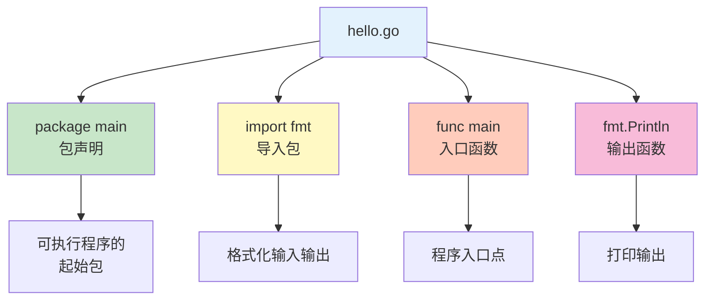
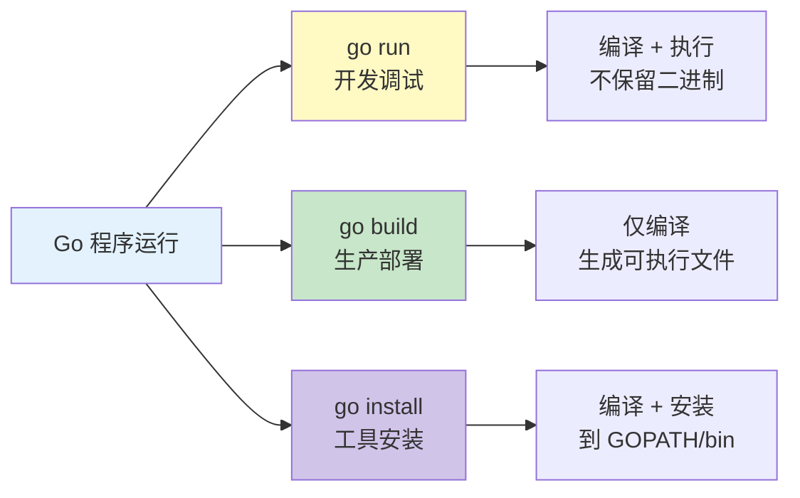

# Hello World

让我们编写您的第一个 Go 程序！通过这个简单的示例，您将了解 Go 程序的基本结构。

## 第一个程序

### 创建程序文件

创建文件 `hello.go`：

```go
package main

import "fmt"

func main() {
    fmt.Println("Hello, World!")
}
```

### 程序解析



**代码结构说明**：

| 部分 | 说明 |
|------|------|
| `package main` | 声明代码所属的包，`main` 包是可执行程序的入口 |
| `import "fmt"` | 导入标准库的格式化输入输出包 |
| `func main()` | 程序的主函数，执行的起点 |
| `fmt.Println()` | 打印输出并换行 |

## 运行程序

### 方式一：直接运行

```bash
go run hello.go
# 输出: Hello, World!
```

### 方式二：编译后运行

```bash
# 编译
go build hello.go

# 运行
./hello  # Linux/macOS
# hello.exe  # Windows
```

### 方式三：安装到 GOPATH

```bash
# 安装到 $GOPATH/bin
go install hello.go

# 运行
hello
```

## 运行方式对比



| 方式 | 输出 | 使用场景 | 编译产物 |
|------|------|----------|----------|
| `go run` | 终端输出 | 开发调试 | 不保留 |
| `go build` | 可执行文件 | 生产部署 | 当前目录 |
| `go install` | 可执行文件 | 安装工具 | `$GOPATH/bin` |

## 代码详解

### package 声明

```go
// 声明当前代码所属的包
package main

// 包命名规则
package main      // 可执行程序入口
package myapp      // 自定义包
package calculator // 包名通常是单数
```

::: tip 包命名规则

- 包名使用小写字母
- 不使用下划线或驼峰
- 包名与目录名保持一致
- 同一目录下所有文件必须属于同一包

:::

### import 导入

```go
// 单个导入
import "fmt"

// 多个导入
import "fmt"
import "os"

// 分组导入（推荐）
import (
    "fmt"
    "os"
    "strings"
)

// 导入别名
import f "fmt"

// 导入但不使用（仅执行初始化）
import _ "database/sql"

// 点导入（不推荐，可能导致命名冲突）
import . "fmt"
```

### main 函数

```go
// 主函数签名固定
func main() {
    // 程序代码
}

// main 函数特点
// 1. 必须在 main 包中
// 2. 必须无参数无返回值
// 3. 是程序执行的起点
// 4. 程序在 main 返回时退出
```

### 输出函数

```go
package main

import "fmt"

func main() {
    // Print 打印不换行
    fmt.Print("Hello, ")
    fmt.Print("World!\n")

    // Println 打印并换行
    fmt.Println("Hello, Go!")

    // Printf 格式化输出
    name := "Go"
    version := 1.22
    fmt.Printf("语言: %s, 版本: %.1f\n", name, version)

    // 输出: 语言: Go, 版本: 1.2
}
```

## 格式化输出

### Printf 动词

| 动词 | 类型 | 示例 |
|------|------|------|
| `%v` | 任意类型 | 默认格式 |
| `%T` | 任意类型 | 类型名称 |
| `%s` | string | 字符串 |
| `%d` | int | 十进制整数 |
| `%f` | float | 浮点数 |
| `%t` | bool | 布尔值 |
| `%p` | 指针 | 内存地址 |

```go
package main

import "fmt"

func main() {
    // 基础类型
    fmt.Printf("整数: %d\n", 42)
    fmt.Printf("浮点: %f\n", 3.14)
    fmt.Printf("字符串: %s\n", "Go")
    fmt.Printf("布尔: %t\n", true)

    // 任意类型
    var x interface{} = 100
    fmt.Printf("值: %v, 类型: %T\n", x, x)
    // 输出: 值: 100, 类型: int

    // 指针
    num := 10
    fmt.Printf("地址: %p\n", &num)
}
```

### 格式化宽度和精度

```go
package main

import "fmt"

func main() {
    // 宽度
    fmt.Printf("|%10s|\n", "Go")    // 右对齐
    fmt.Printf("|%-10s|\n", "Go")   // 左对齐

    // 精度
    fmt.Printf("%.2f\n", 3.14159)   // 3.14

    // 组合
    fmt.Printf("|%8.2f|\n", 3.14159) // |    3.14|
}
```

## 注释

### 单行注释

```go
// 这是单行注释

package main // 声明包

import "fmt" // 导入包

func main() { // 主函数
    fmt.Println("Hello") // 输出
}
```

### 多行注释

```go
/*
这是一个多行注释
可以跨越多行
用于说明复杂的逻辑
*/
package main

import "fmt"

func main() {
    /*
     * main 函数是程序入口
     * 这里打印 Hello World
     */
    fmt.Println("Hello, World!")
}
```

### 文档注释

```go
// Package main 提供了示例程序
// 展示 Go 语言的基本语法
package main

// PrintHello 打印 Hello 消息
// 参数: name - 要打印的名字
func PrintHello(name string) {
    fmt.Printf("Hello, %s!\n", name)
}
```

::: tip 注释约定

- 包注释放在 package 声明之前
- 函数注释放在函数声明之前
- 导出的函数/类型必须添加文档注释
- 注释以函数/类型的名称开头

:::

## 变量声明

```go
package main

import "fmt"

func main() {
    // var 声明
    var name string = "Go"
    var age int = 15

    // 类型推断
    var language = "Go" // 自动推断为 string

    // 短变量声明（只能在函数内）
    version := 1.22

    // 多变量声明
    var (
        x int = 10
        y int = 20
    )

    // 短声明多变量
    a, b := 1, 2

    fmt.Printf("%s %d %.2f %d %d\n", name, age, version, a, b)
}
```

## 基础类型

```go
package main

import "fmt"

func main() {
    // 布尔类型
    var isActive bool = true

    // 数值类型
    var i int = 42
    var f float64 = 3.14

    // 字符串类型
    var s string = "Hello, Go"

    // 字符类型
    var c rune = 'G' // rune 是 int32 的别名，表示 Unicode 码点

    fmt.Printf("布尔: %t\n", isActive)
    fmt.Printf("整数: %d\n", i)
    fmt.Printf("浮点: %f\n", f)
    fmt.Printf("字符串: %s\n", s)
    fmt.Printf("字符: %c\n", c)
}
```

## 常量

```go
package main

import "fmt"

func main() {
    // const 声明
    const Pi = 3.14159
    const Greeting = "Hello, Go"

    // 常量组
    const (
        StatusOK   = 200
        StatusErr  = 500
        MaxRetries = 3
    )

    // iota 枚举
    const (
        Monday = iota + 1  // 1
        Tuesday             // 2
        Wednesday           // 3
        Thursday            // 4
        Friday              // 5
    )

    fmt.Println(Pi, Greeting, StatusOK, Monday)
}
```

## 命令行参数

```go
package main

import (
    "fmt"
    "os"
    "flag"
)

func main() {
    // 方式一：使用 os.Args
    if len(os.Args) > 1 {
        fmt.Println("参数:", os.Args[1])
    }

    // 方式二：使用 flag 包
    name := flag.String("name", "World", "要问候的名字")
    count := flag.Int("count", 1, "问候次数")

    flag.Parse()

    for i := 0; i < *count; i++ {
        fmt.Printf("Hello, %s!\n", *name)
    }
}
```

运行：

```bash
# 使用 os.Args
go run hello.go Go
# 输出: 参数: Go

# 使用 flag
go run hello.go -name=Go -count=3
# 输出:
# Hello, Go!
# Hello, Go!
# Hello, Go!
```

## 完整示例

```go
package main

import (
    "fmt"
    "os"
    "time"
)

// ProgramInfo 程序信息
type ProgramInfo struct {
    Name    string
    Version float64
    Author  string
}

// PrintInfo 打印程序信息
func PrintInfo(info ProgramInfo) {
    fmt.Println("=== 程序信息 ===")
    fmt.Printf("名称: %s\n", info.Name)
    fmt.Printf("版本: %.1f\n", info.Version)
    fmt.Printf("作者: %s\n", info.Author)
    fmt.Println("==============")
}

// GetCurrentTime 获取当前时间
func GetCurrentTime() string {
    return time.Now().Format("2006-01-02 15:04:05")
}

func main() {
    // 程序信息
    info := ProgramInfo{
        Name:    "Hello Go",
        Version: 1.0,
        Author:  "Gopher",
    }

    // 打印信息
    PrintInfo(info)

    // 打印问候
    fmt.Println("\nHello, World!")
    fmt.Printf("当前时间: %s\n", GetCurrentTime())

    // 命令行参数
    if len(os.Args) > 1 {
        fmt.Printf("命令行参数: %s\n", os.Args[1])
    }
}
```

## 编译选项

```bash
# 指定输出文件名
go build -o myapp hello.go

# 减小二进制大小
go build -ldflags="-s -w" hello.go

# 交叉编译
GOOS=linux GOARCH=amd64 go build -o hello-linux hello.go
GOOS=windows GOARCH=amd64 go build -o hello.exe hello.go

# 查看编译信息
go build -x hello.go
```

## 常见错误

### 错误 1：缺少 package

```go
// ❌ 错误
import "fmt"

func main() {
    fmt.Println("Hello")
}

// ✅ 正确
package main

import "fmt"

func main() {
    fmt.Println("Hello")
}
```

### 错误 2：未使用的导入

```go
package main

import (
    "fmt"
    "os" // ❌ 未使用的导入会报错
)

func main() {
    fmt.Println("Hello")
}

// ✅ 使用 _ 忽略未使用的导入
package main

import (
    "fmt"
    _ "os" // ✅ 不会报错
)

func main() {
    fmt.Println("Hello")
}
```

### 错误 3：main 函数签名错误

```go
// ❌ 错误：main 不能有参数
func main(args []string) {
}

// ❌ 错误：main 不能有返回值
func main() error {
    return nil
}

// ✅ 正确
func main() {
    fmt.Println("Hello")
}
```

## 最佳实践

::: tip 编码规范

1. **格式化** - 使用 `gofmt` 格式化代码
2. **命名** - 使用驼峰命名，导出名称首字母大写
3. **注释** - 导出的函数和类型必须添加文档注释
4. **错误处理** - 不要忽略错误返回值
5. **简洁** - 优先使用简洁的语法

:::

```bash
# 格式化代码
gofmt -w hello.go

# 或使用 goimports（自动处理导入）
goimports -w hello.go
```

## 下一步

恭喜您完成了第一个 Go 程序！

::: v-pre

[基础语法](/langs/go/01-basics/) - 学习 Go 的基础语法

:::
