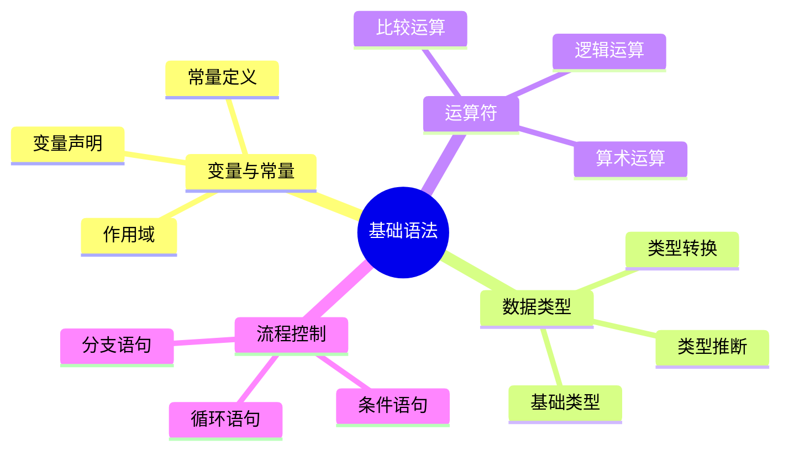
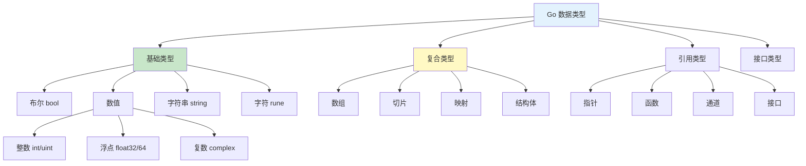
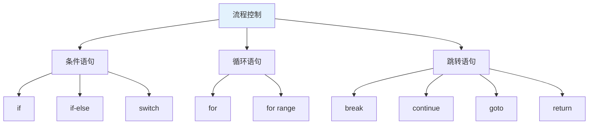
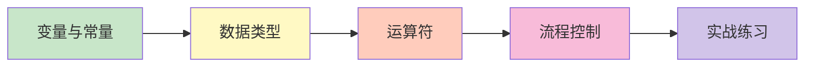

# 基础语法

欢迎来到 Go 语言基础语法章节！本章节将系统地介绍 Go 语言的核心语法知识。

## 章节导航



## 知识体系

### 1. 变量与常量

```go
// 变量声明
var name string = "Go"
age := 15
const Pi = 3.14159
```

### 2. 数据类型



### 3. 运算符

| 类别 | 运算符 |
|------|--------|
| **算术** | `+` `-` `*` `/` `%` `++` `--` |
| **比较** | `==` `!=` `<` `>` `<=` `>=` |
| **逻辑** | `&&` `\|\|` `!` |
| **位运算** | `&` `\|` `^` `&^` `<<` `>>` |
| **赋值** | `=` `+=` `-=` `*=` `/=` 等 |

### 4. 流程控制



## 学习路线



## 快速预览

### 变量声明

```go
// 标准声明
var name string
name = "Go"

// 短声明（函数内）
age := 15

// 批量声明
var (
    x int = 10
    y int = 20
)
```

### 基础类型

```go
// 布尔
var isActive bool = true

// 整数
var count int = 100

// 浮点
var price float64 = 99.99

// 字符串
var message string = "Hello, Go"

// 字符（Unicode码点）
var ch rune = 'G' // int32
```

### 运算符

```go
// 算术运算
sum := 10 + 20
product := 5 * 6

// 比较运算
isEqual := (10 == 10)

// 逻辑运算
isTrue := true && false
```

### 条件语句

```go
if age >= 18 {
    fmt.Println("成年")
} else if age >= 13 {
    fmt.Println("青少年")
} else {
    fmt.Println("儿童")
}
```

### 循环语句

```go
// for 循环
for i := 0; i < 10; i++ {
    fmt.Println(i)
}

// while 风格
n := 10
for n > 0 {
    n /= 2
}

// 遍历
names := []string{"Alice", "Bob"}
for i, name := range names {
    fmt.Println(i, name)
}
```

## 重要概念

### 零值

Go 中每个类型都有默认的零值：

| 类型 | 零值 |
|------|------|
| `bool` | `false` |
| `int/float` | `0` |
| `string` | `""` |
| `pointer` | `nil` |
| `slice/map/channel` | `nil` |

```go
var b bool     // false
var i int      // 0
var s string   // ""
var p *int     // nil
```

### 类型推断

```go
// 自动推断类型
name := "Go"    // string
age := 15       // int
price := 9.99   // float64

// 显式指定类型
var version float32 = 1.2
```

### 短变量声明

```go
// 只能在函数内使用
func main() {
    message := "Hello"  // ✅
}

// 全局变量必须用 var
var global = "World"    // ✅
```

## 代码规范

### 命名规则

```go
// 包名：小写单词，无下划线
package main
package myapp

// 导出名称：首字母大写
type MyStruct struct {}
func MyFunction() {}

// 私有名称：首字母小写
type internalStruct {}
func internalFunction() {}

// 常量：驼峰命名
const MaxRetries = 3
const DefaultTimeout = 30
```

### 格式化

```bash
# 格式化代码
gofmt -w main.go

# 或使用 goimports（自动处理导入）
goimports -w main.go
```

## 实践建议

::: tip 学习建议

1. **动手实践** - 每个知识点都编写代码测试
2. **理解零值** - 掌握各类型的默认值
3. **类型匹配** - 注意类型转换和推断
4. **代码规范** - 遵循 Go 编码规范
5. **错误处理** - 不要忽略返回的错误

:::

## 示例代码

### 综合示例

```go
package main

import "fmt"

// Person 人员结构
type Person struct {
    Name string
    Age  int
}

// IsAdult 判断是否成年
func (p Person) IsAdult() bool {
    return p.Age >= 18
}

func main() {
    // 变量声明
    var count int = 5
    name := "Alice"

    // 结构体
    person := Person{Name: name, Age: 20}

    // 条件判断
    if person.IsAdult() {
        fmt.Printf("%s 是成年人\n", person.Name)
    }

    // 循环
    for i := 0; i < count; i++ {
        fmt.Printf("第 %d 次循环\n", i+1)
    }
}
```

## 学习检查

完成本章节学习后，您应该能够：

- [ ] 熟练使用 `var` 和 `:=` 声明变量
- [ ] 理解 Go 的基础类型系统
- [ ] 掌握常用运算符的使用
- [ ] 熟练使用 `if`、`for`、`switch` 控制流程
- [ ] 遵循 Go 的命名和格式规范
- [ ] 编写格式良好的 Go 代码

## 下一步

让我们开始深入学习基础语法的各个部分！

::: v-pre

[变量与常量](./variables.md) → [数据类型](./data-types.md) → [运算符](./operators.md) → [流程控制](./control-flow.md)

:::
