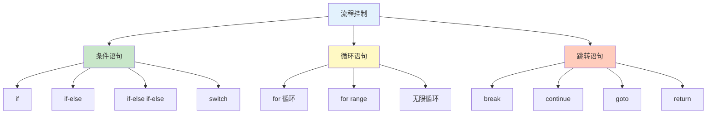

# 流程控制

流程控制语句用于控制程序的执行流程。Go 提供了 if、switch、for 等控制语句。

## 控制语句概览



## if 条件语句

### 基本语法

```go
// 单分支
if condition {
    // 条件为 true 时执行
}

// 双分支
if condition {
    // 条件为 true 时执行
} else {
    // 条件为 false 时执行
}

// 多分支
if condition1 {
    // condition1 为 true
} else if condition2 {
    // condition2 为 true
} else {
    // 所有条件都为 false
}
```

### if 使用示例

```go
package main

import "fmt"

func main() {
    age := 18

    // 单分支
    if age >= 18 {
        fmt.Println("成年")
    }

    // 双分支
    if age >= 18 {
        fmt.Println("成年")
    } else {
        fmt.Println("未成年")
    }

    // 多分支
    if age >= 60 {
        fmt.Println("老年")
    } else if age >= 18 {
        fmt.Println("成年")
    } else {
        fmt.Println("未成年")
    }
}
```

### if 语句作用域

```go
// if 短语句中声明的变量作用域仅限于 if 块
if x := computeValue(); x > 0 {
    fmt.Println(x)  // ✅ 可以访问
}
// fmt.Println(x)  // ❌ 超出作用域

// 多个分支共享变量
if x := 10; x > 5 {
    fmt.Println("大于5")
} else if x > 0 {
    fmt.Println("大于0")
} else {
    fmt.Println("小于等于0")
}
```

### if 与初始化

```go
// if 带初始化语句
if err := doSomething(); err != nil {
    fmt.Println("错误:", err)
    return
}

// 多初始化
if a, b := getData(); a != nil && b != nil {
    process(a, b)
}
```

## switch 语句

### 基本语法

```go
// 值匹配
switch value {
case v1:
    // value == v1 时执行
case v2, v3:
    // value == v2 或 v3 时执行
default:
    // 所有 case 都不匹配时执行
}

// 表达式匹配
switch expression {
case condition1:
    // condition1 为 true
case condition2:
    // condition2 为 true
default:
    // 所有条件都不满足
}
```

### switch 示例

```go
package main

import "fmt"

func main() {
    // 值匹配
    day := 3
    switch day {
    case 1:
        fmt.Println("星期一")
    case 2:
        fmt.Println("星期二")
    case 3, 4, 5:
        fmt.Println("工作日")
    case 6, 7:
        fmt.Println("周末")
    default:
        fmt.Println("未知")
    }

    // 表达式匹配
    score := 85
    switch {
    case score >= 90:
        fmt.Println("优秀")
    case score >= 80:
        fmt.Println("良好")
    case score >= 60:
        fmt.Println("及格")
    default:
        fmt.Println("不及格")
    }
}
```

### fallthrough

```go
// 默认情况下，Go 的 switch 不需要 break
// 如果需要继续执行下一个 case，使用 fallthrough
switch value {
case 1:
    fmt.Println("1")
    fallthrough  // 继续执行下一个 case
case 2:
    fmt.Println("2")
default:
    fmt.Println("默认")
}

// value = 1 时输出:
// 1
// 2
```

### 类型 switch

```go
// 类型断言 switch
func printType(v interface{}) {
    switch t := v.(type) {
    case int:
        fmt.Println("整数:", t)
    case string:
        fmt.Println("字符串:", t)
    case bool:
        fmt.Println("布尔:", t)
    case []int:
        fmt.Println("整数切片:", t)
    default:
        fmt.Println("未知类型")
    }
}

printType(42)        // 整数: 42
printType("Go")      // 字符串: Go
printType(true)     // 布尔: true
```

## for 循环

### 基本语法

```go
// 标准三部分
for init; condition; post {
    // 循环体
}

// 类似 while
for condition {
    // 循环体
}

// 无限循环
for {
    // 需要内部 break 或 return
}

// for range 遍历
for index, value := range collection {
    // 处理元素
}
```

### for 循环示例

```go
package main

import "fmt"

func main() {
    // 标准 for 循环
    for i := 0; i < 5; i++ {
        fmt.Println(i)
    }
    // 输出: 0 1 2 3 4

    // while 风格
    n := 5
    for n > 0 {
        fmt.Println(n)
        n--
    }
    // 输出: 5 4 3 2 1

    // 无限循环（需要 break）
    count := 0
    for {
        if count >= 3 {
            break
        }
        fmt.Println("无限循环", count)
        count++
    }
}
```

### for range 遍历

```go
// 遍历数组/切片
nums := []int{1, 2, 3}
for i, num := range nums {
    fmt.Printf("索引: %d, 值: %d\n", i, num)
}

// 只要值
for _, num := range nums {
    fmt.Println("值:", num)
}

// 只要索引
for i := range nums {
    fmt.Println("索引:", i)
}

// 遍历 map
ages := map[string]int{"Alice": 25, "Bob": 30}
for name, age := range ages {
    fmt.Printf("%s: %d\n", name, age)
}

// 遍历字符串
for i, ch := range "Hello" {
    fmt.Printf("位置: %d, 字符: %c\n", i, ch)
}

// 遍历通道
ch := make(chan int, 3)
ch <- 1
ch <- 2
ch <- 3
close(ch)

for value := range ch {
    fmt.Println("接收:", value)
}
```

## 跳转语句

### break

```go
// 跳出循环
for i := 0; i < 10; i++ {
    if i == 5 {
        break  // 跳出循环
    }
    fmt.Println(i)
}
// 输出: 0 1 2 3 4

// 跳出 switch
switch value {
case 1:
    // ...
    break  // 跳出 switch
default:
    // ...
}

// 带标签的 break（跳出多层循环）
outer:
for i := 0; i < 3; i++ {
    for j := 0; j < 3; j++ {
        if i == 1 && j == 1 {
            break outer  // 跳出外层循环
        }
        fmt.Printf("i=%d, j=%d\n", i, j)
    }
}
// 输出:
// i=0, j=0
// i=0, j=1
// i=0, j=2
// i=1, j=0
```

### continue

```go
// 跳过本次迭代
for i := 0; i < 10; i++ {
    if i%2 == 0 {
        continue  // 跳过偶数
    }
    fmt.Println(i)
}
// 输出: 1 3 5 7 9

// 带标签的 continue
outer:
for i := 0; i < 3; i++ {
    for j := 0; j < 3; j++ {
        if j == 1 {
            continue outer  // 继续外层循环的下一次迭代
        }
        fmt.Printf("i=%d, j=%d\n", i, j)
    }
}
// 输出:
// i=0, j=0
// i=1, j=0
// i=2, j=0
```

### goto

```go
// goto 跳转（谨慎使用）
func main() {
    i := 0

start:  // 标签
    if i < 5 {
        fmt.Println(i)
        i++
        goto start  // 跳转到 start 标签
    }
}
// 输出: 0 1 2 3 4

// 跳出多层嵌套
func process() {
    for i := 0; i < 10; i++ {
        for j := 0; j < 10; j++ {
            if shouldStop(i, j) {
                goto end  // 跳转到 end 标签
            }
            // 处理逻辑
        }
    }
end:
    fmt.Println("处理完成")
}
```

### return

```go
// 返回函数
func add(a, b int) int {
    return a + b
}

// 提前返回
func divide(a, b int) (int, error) {
    if b == 0 {
        return 0, fmt.Errorf("除数不能为零")
    }
    return a / b, nil
}

// main 函数中的 return
func main() {
    result := add(1, 2)
    if result > 100 {
        return  // 退出程序
    }
    fmt.Println(result)
}
```

## 延迟执行

### defer 语句

```go
// defer 延迟执行到函数返回前
func main() {
    defer fmt.Println("最后执行")
    defer fmt.Println("倒数第二执行")
    fmt.Println("首先执行")
}
// 输出:
// 首先执行
// 倒数第二执行
// 最后执行

// defer 与参数求值
func printValue(x int) {
    fmt.Println(x)
}

func main() {
    value := 10
    defer printValue(value)  // 10（立即求值）
    value = 20
    fmt.Println(value)
}
// 输出:
// 20
// 10
```

### defer 常见用途

```go
// 资源清理
func readFile(filename string) error {
    file, err := os.Open(filename)
    if err != nil {
        return err
    }
    defer file.Close()  // 确保文件关闭

    // 处理文件
    return nil
}

// 恢复 panic
func doWork() {
    if err := recover(); err != nil {
        fmt.Println("恢复:", err)
    }
}

defer doWork()
```

## 实战示例

### 成绩等级判断

```go
package main

import "fmt"

func getGrade(score int) string {
    switch {
    case score >= 90:
        return "A"
    case score >= 80:
        return "B"
    case score >= 70:
        return "C"
    case score >= 60:
        return "D"
    default:
        return "F"
    }
}

func main() {
    fmt.Println(getGrade(85))  // B
    fmt.Println(getGrade(95))  // A
    fmt.Println(getGrade(55))  // F
}
```

### 数组遍历

```go
package main

import "fmt"

func main() {
    numbers := []int{1, 2, 3, 4, 5}

    // 只读值
    fmt.Println("只读值:")
    for _, num := range numbers {
        fmt.Print(num, " ")
    }

    // 需要索引
    fmt.Println("\n需要索引:")
    for i, num := range numbers {
        fmt.Printf("numbers[%d] = %d\n", i, num)
    }
}
```

### 菜单系统

```go
package main

import "fmt"

func main() {
    for {
        fmt.Println("\n=== 菜单 ===")
        fmt.Println("1. 选项一")
        fmt.Println("2. 选项二")
        fmt.Println("3. 退出")

        var choice int
        fmt.Print("请选择 (1-3): ")
        fmt.Scanln(&choice)

        switch choice {
        case 1:
            fmt.Println("选择了选项一")
        case 2:
            fmt.Println("选择了选项二")
        case 3:
            fmt.Println("退出程序")
            return
        default:
            fmt.Println("无效选择")
        }
    }
}
```

## 最佳实践

::: tip 使用建议

1. **优先使用 if** - 简单条件用 if
2. **switch 清晰** - 多个值比较用 switch
3. **for range** - 遍历集合用 range
4. **defer 清理** - 资源清理用 defer
5. **避免 goto** - goto 降低可读性

:::

### 代码规范

```go
// ✅ 推荐：清晰的条件
if err != nil {
    return err
}

// ❌ 避免：复杂的嵌套
if a > 0 {
    if b > 0 {
        if c > 0 {
            // 太深的嵌套
        }
    }
}

// ✅ 扁平化
if a <= 0 || b <= 0 || c <= 0 {
    return
}
```

## 总结

| 语句类型 | 主要用途 | 特点 |
|---------|---------|------|
| **if** | 条件判断 | 灵活，支持初始化 |
| **switch** | 多分支 | 类型安全，无需 break |
| **for** | 循环控制 | 唯一循环语句 |
| **break** | 跳出循环/switch | 可指定标签 |
| **continue** | 跳过本次迭代 | 可指定标签 |
| **defer** | 延迟执行 | LIFO 顺序 |

::: v-pre

[复合类型](/langs/go/02-composite-types/) → 下一章节

:::
