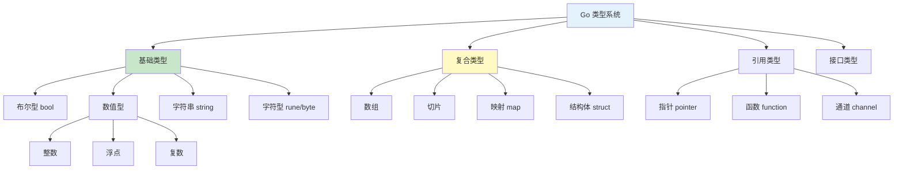
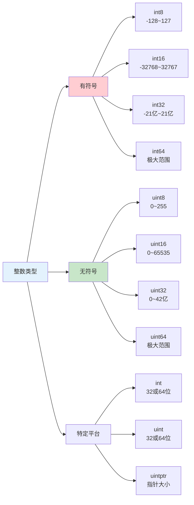

# 数据类型

Go 语言是静态类型语言，每个变量都有明确的数据类型。本章节详细介绍 Go 的类型系统。

## 类型体系



## 布尔类型

```go
// 布尔类型只有两个值: true 和 false
var isActive bool = true
var isClosed bool = false

// 布尔运算
result := true && false  // false
result = true || false   // true
result = !true           // false
```

## 数值类型

### 整数类型



```go
// 有符号整数
var i8 int8 = 127
var i16 int16 = 32767
var i32 int32 = 1000000
var i64 int64 = 9000000000

// 无符号整数
var u8 uint8 = 255
var u16 uint16 = 65535
var u32 uint32 = 1000000
var u64 uint64 = 9000000000

// 平台相关（32/64 位自动适配）
var i int = 100       // 32位系统是int32, 64位是int64
var u uint = 100      // 32位系统是uint32, 64位是uint64
var p uintptr = 0x100  // 指针大小的无符号整数

// 使用别名
var b byte = 255        // uint8 的别名
var r rune = 'A'        // int32 的别名，表示 Unicode 码点
```

::: tip 类型选择

- **int**: 大多数整数场景（默认选择）
- **int64**: 需要大整数或保证 64 位
- **int32/16/8**: 节省内存，明确范围
- **uint**: 位操作或非负数

:::

### 浮点类型

```go
// float32: 32 位浮点数，精度约 6-7 位小数
var f32 float32 = 3.14159

// float64: 64 位浮点数，精度约 15 位小数（默认）
var f64 float64 = 3.14159265358979

// 浮点数表示
var pi = 3.14159           // float64
var e = 2.718281828         // float64
var avogadro = 6.022e23     // 科学计数法

// 特殊值
var posInf = math.Inf(1)     // +∞
var negInf = math.Inf(-1)    // -∞
var nan = math.NaN()         // NaN
```

### 复数类型

```go
// complex64: 32 位实部 + 32 位虚部
var c64 complex64 = 3 + 4i

// complex128: 64 位实部 + 64 位虚部
var c128 complex128 = 3 + 4i

// 创建复数
c := complex(3, 4)     // complex128
real := real(c)        // 3.0
imag := imag(c)        // 4.0
```

## 字符串类型

### 字符串基础

```go
// 字符串是不可变的字节序列
var s1 string = "Hello, Go"
s2 := "世界"

// 多行字符串
s3 := `第一行
第二行
第三行`

// 原始字符串（不处理转义）
path := `C:\Users\Go\bin`
```

### 字符串操作

```go
s := "Hello, Go"

// 长度
fmt.Println(len(s))  // 9（字节数）

// 访问（只读）
fmt.Println(s[0])  // 72（'H' 的 ASCII）
// s[0] = 'h'  // ❌ 字符串不可变

// 切片
substr := s[0:5]  // "Hello"

// 遍历字节
for i := 0; i < len(s); i++ {
    fmt.Printf("%c", s[i])
}

// 遍历 rune（正确处理 Unicode）
for _, r := range s {
    fmt.Printf("%c", r)
}
```

### 字符串函数

```go
import (
    "strings"
    "strconv"
)

s := "Hello, Go"

// 包含
strings.Contains(s, "Go")  // true

// 前缀/后缀
strings.HasPrefix(s, "Hello")  // true
strings.HasSuffix(s, "Go")    // true

// 分割
parts := strings.Split("a,b,c", ",")  // ["a" "b" "c"]

// 连接
joined := strings.Join([]string{"a", "b", "c"}, ",")  // "a,b,c"

// 替换
replaced := strings.Replace(s, "Go", "World", 1)  // "Hello, World"

// 大小写
strings.ToUpper("go")   // "GO"
strings.ToLower("GO")   // "go"

// 去除空格
strings.TrimSpace("  hello  ")  // "hello"

// 数值转换
strconv.Atoi("42")      // 42, nil
strconv.Itoa(42)       // "42"
strconv.ParseFloat("3.14", 64)  // 3.14
```

## 字符类型

### byte 和 rune

```go
// byte: uint8 的别名，表示 ASCII 字符
var b byte = 'A'  // 65

// rune: int32 的别名，表示 Unicode 码点
var r rune = '中'  // 20013

// 字符串遍历
s := "Hello, 世界"

// 按 byte 遍历
for i := 0; i < len(s); i++ {
    fmt.Printf("%d: %c\n", i, s[i])
}

// 按 rune 遍历
for i, r := range s {
    fmt.Printf("%d: %c (U+%04X)\n", i, r, r)
}
```

## 类型转换

### 数值类型转换

```go
// 整数之间转换
var i32 int32 = 100
var i64 int64 = int64(i32)

// 浮点数转换
var f32 float32 = 3.14
var f64 float64 = float64(f32)

// 整数转浮点
i := 42
f := float64(i)  // 42.0

// 浮点转整数（截断）
f := 3.9
i = int(f)  // 3

// 注意：大类型转小类型可能溢出
var big int64 = 1 << 40
var small int32 = int32(big)  // 溢出
```

### 字符串与数值转换

```go
import "strconv"

// 整数转字符串
s1 := strconv.Itoa(42)            // "42"
s2 := strconv.FormatInt(42, 10)   // "42"
s3 := strconv.FormatInt(42, 16)   // "2a"

// 字符串转整数
i1, _ := strconv.Atoi("42")        // 42
i2, _ := strconv.ParseInt("2a", 16, 64)  // 42

// 浮点转字符串
s4 := strconv.FormatFloat(3.14, 'f', 2, 64)  // "3.14"

// 字符串转浮点
f, _ := strconv.ParseFloat("3.14", 64)  // 3.14
```

## 自定义类型

### 类型别名

```go
// 类型定义（创建新类型）
type MyInt int
type Age int

// 类型别名（兼容原类型）
type MyInt2 = int

var m1 MyInt = 10
var m2 MyInt2 = 10

// m1 和 int 不能直接运算
var i int = 20
// sum := m1 + i  // ❌ 类型不匹配
sum := int(m1) + i  // ✅ 需要转换

// m2 和 int 可以直接运算
sum2 := m2 + i  // ✅
```

### 类型方法

```go
type Age int

func (a Age) IsAdult() bool {
    return a >= 18
}

func main() {
    age := Age(25)
    fmt.Println(age.IsAdult())  // true
}
```

## 类型推断

### var 类型推断

```go
// 根据值推断类型
var i = 42           // int
var f = 3.14         // float64
var b = true         // bool
var s = "hello"      // string

// 根据表达式推断
var result = i + f   // float64
```

### := 短声明推断

```go
name := "Go"     // string
count := 100      // int
price := 99.9     // float64
active := true    // bool

// 函数返回值推断
func getValue() int {
    return 42
}
v := getValue()  // int
```

## 类型系统特性

### 静态类型

```go
var x int        // 编译时确定类型
x = 10          // ✅
// x = "hello"   // ❌ 编译错误

// 但接口可以持有任意类型
var any interface{}
any = 10
any = "hello"
```

### 强类型

```go
// 需要显式转换
var i int = 42
var f float64 = float64(i)  // 需要转换

// 不同类型不能混合运算
var a int = 10
var b float64 = 3.14
// sum := a + b  // ❌ 编译错误
sum := float64(a) + b  // ✅
```

## 总结

| 类型类别 | 主要类型 | 使用场景 |
|---------|---------|----------|
| **布尔** | `bool` | 条件判断 |
| **整数** | `int`, `int64` | 计数、索引 |
| **浮点** | `float64` | 小数计算 |
| **字符串** | `string` | 文本处理 |
| **字符** | `rune`, `byte` | 单个字符 |
| **复数** | `complex128` | 数学计算 |

::: v-pre

[运算符](./operators.md) → [流程控制](./control-flow.md)

:::
