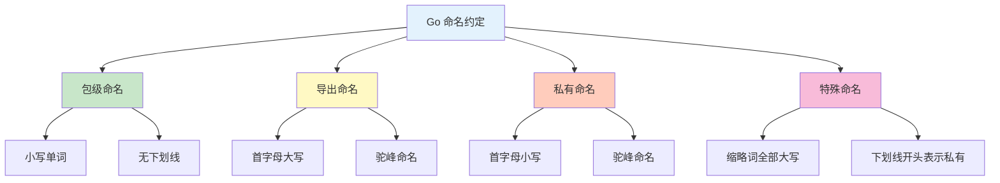

# 变量与常量

变量和常量是程序的基本组成单元。本章节详细介绍 Go 语言中变量和常量的声明与使用。

## 变量声明

### 标准声明格式

```go
// 语法: var 变量名 类型 = 表达式
var name string = "Go"
var age int = 15
var isActive bool = true

// 批量声明
var (
    username string = "admin"
    password string = "123456"
    count     int    = 0
)
```

### 类型推断

```go
// 省略类型，由编译器推断
var name = "Go"          // 推断为 string
var age = 15             // 推断为 int
var price = 99.9         // 推断为 float64
var isActive = true      // 推断为 bool

// 零值
var message string       // ""（空字符串）
var number int           // 0
var flag bool           // false
```

### 短变量声明

```go
// 只能在函数内使用
name := "Go"     // 自动推断类型
age := 15
price := 99.9

// 多变量短声明
x, y := 10, 20
name, age := "Alice", 25

// 注意：至少有一个新变量
count := 0
count, sum := 1, 2  // ✅ sum 是新变量
count, sum = 2, 3    // ❌ 都是旧变量，不能使用 :=
```

## 变量命名

### 命名规则

```go
// ✅ 合法命名
var userName string
var _internal int
var UserID uint64
var MAX_SIZE int

// ❌ 非法命名
var 123abc int     // 不能以数字开头
var user-name int  // 不能使用连字符
var class int      // 不能使用关键字
```

### 命名约定



```go
// 包名：小写，简洁
package main
package http
package strings

// 导出的常量、变量、函数、类型：首字母大写
const MaxRetries int = 3
var GlobalCount int
func PublicFunction() {}
type PublicType struct {}

// 私有的：首字母小写
const defaultTimeout int = 30
var internalCount int
func privateFunction() {}
type privateType struct {}

// 缩略词保持大写
var HTTPServer *http.Server
var XMLParser xml.Parser
var UserID int

// 特殊情况：下划线开头（通常用于测试或生成代码）
var _private int
var _ = fmt.Println // 表示有意不使用
```

## 变量作用域

### 局部变量

```go
func main() {
    // 函数内声明的变量
    message := "Hello"
    fmt.Println(message)  // ✅ 可以访问
}

func other() {
    // fmt.Println(message)  // ❌ 无法访问
}
```

### 块作用域

```go
func main() {
    x := 10

    if true {
        y := 20
        fmt.Println(x, y)  // ✅ 可以访问外层的 x
    }

    // fmt.Println(y)  // ❌ 超出作用域
}
```

### 包级变量

```go
package main

var packageVar int = 100  // 包级变量

func main() {
    fmt.Println(packageVar)  // ✅ 可以访问
}

func other() {
    fmt.Println(packageVar)  // ✅ 可以访问
}
```

### 变量遮蔽

```go
func main() {
    x := 10

    if true {
        x := 20  // 遮蔽外层的 x
        fmt.Println(x)  // 20
    }

    fmt.Println(x)  // 10
}
```

## 常量

### 常量声明

```go
// const 声明
const Pi = 3.14159
const Greeting = "Hello, Go"

// 常量组
const (
    StatusOK       = 200
    StatusNotFound = 404
    StatusErr      = 500
)

// 类型常量
const (
    MaxInt int = 1<<31 - 1
    MinInt int = -1 << 31
)
```

### iota 枚举

```go
const (
    Monday = iota + 1  // 1
    Tuesday             // 2
    Wednesday           // 3
    Thursday            // 4
    Friday              // 5
    Saturday            // 6
    Sunday              // 7
)

// iota 高级用法
const (
    _  = iota             // 0
    KB = 1 << (10 * iota) // 1024
    MB                    // 1048576
    GB                    // 1073741824
)

// 位掩码
const (
    Read  = 1 << iota  // 1
    Write               // 2
    Execute             // 4
)
```

## 类型转换

### 显式转换

```go
var i int = 42
var f float64 = float64(i)  // 42.0

var s string = string(i)      // "42"
var b byte = byte(i)          // 42

// 注意：不是所有类型都能转换
// var p *int = int(f)  // ❌ 不能转换
```

### 数值转换

```go
// 整数转浮点
i := 10
f := float64(i)  // 10.0

// 浮点转整数（截断小数）
f := 3.9
i := int(f)  // 3

// 不同大小的整数
var i32 int32 = 100
var i64 int64 = int64(i32)

// 注意溢出
var big int64 = 1 << 40
var small int32 = int32(big)  // ⚠️ 可能溢出
```

### 字符串转换

```go
import "strconv"

// 数字转字符串
s1 := strconv.Itoa(42)           // "42"
s2 := strconv.FormatFloat(3.14, 'f', 2, 64)  // "3.14"

// 字符串转数字
i, _ := strconv.Atoi("42")        // 42
f, _ := strconv.ParseFloat("3.14", 64)  // 3.14

// 字节切片转字符串
data := []byte{'H', 'i'}
s := string(data)  // "Hi"
```

## 零值

### 类型零值表

| 类型 | 零值 |
|------|------|
| `bool` | `false` |
| `int/int8/16/32/64` | `0` |
| `uint/uint8/16/32/64` | `0` |
| `float32/64` | `0.0` |
| `string` | `""` |
| `pointer` | `nil` |
| `slice` | `nil` |
| `map` | `nil` |
| `channel` | `nil` |
| `function` | `nil` |
| `interface` | `nil` |

```go
var b bool           // false
var i int            // 0
var f float64        // 0.0
var s string         // ""
var p *int           // nil
var slice []int      // nil
var m map[string]int // nil
var ch chan int      // nil
```

## 变量生命周期

### 堆与栈

```go
func main() {
    // 栈上分配（函数返回后回收）
    x := 10

    // 可能逃逸到堆上
    p := createPointer()
    fmt.Println(*p)
}

func createPointer() *int {
    x := 42
    return &x  // x 逃逸到堆上
}
```

### 变量逃逸

```go
// 不逃逸
func add(a, b int) int {
    return a + b  // a, b 都在栈上
}

// 逃逸
func createSlice() []int {
    return []int{1, 2, 3}  // 切片逃逸到堆上
}

// 查看逃逸分析
// go build -gcflags="-m" main.go
```

## 最佳实践

::: tip 编码建议

1. **优先使用短声明** - 在函数内使用 `:=`
2. **明确类型** - 包级变量明确指定类型
3. **有意义命名** - 避免单字母变量（除循环变量）
4. **就近声明** - 变量在靠近使用处声明
5. **常量组** - 相关常量使用 const 组
6. **注意作用域** - 避免变量遮蔽

:::

### 示例对比

```go
// ❌ 不推荐
var a int = 10
var b int = 20
var c int = 30

// ✅ 推荐
const (
    a = 10
    b = 20
    c = 30
)

// ✅ 推荐：短声明
name := "Go"
age := 15
```

## 实战示例

### 配置常量

```go
package config

const (
    // 服务器配置
    Host    string = "localhost"
    Port    int    = 8080
    Timeout int    = 30

    // 业务配置
    MaxRetries int = 3
    BatchSize  int = 100
)
```

### 变量初始化

```go
package main

import "fmt"

type Config struct {
    Host     string
    Port     int
    Debug    bool
}

func NewConfig() *Config {
    return &Config{
        Host:  "localhost",
        Port:  8080,
        Debug: false,
    }
}

func main() {
    cfg := NewConfig()
    fmt.Printf("配置: %+v\n", cfg)
}
```

## 总结

| 概念 | 关键点 |
|------|--------|
| **变量声明** | `var` 标准声明，`:=` 短声明 |
| **常量声明** | `const` 声明，`iota` 枚举 |
| **类型推断** | 编译器自动推断类型 |
| **类型转换** | 显式转换，`Type(value)` |
| **零值** | 类型默认值 |
| **作用域** | 局部、块、包级 |

::: v-pre

[数据类型](./data-types.md) → [运算符](./operators.md) → [流程控制](./control-flow.md)

:::
