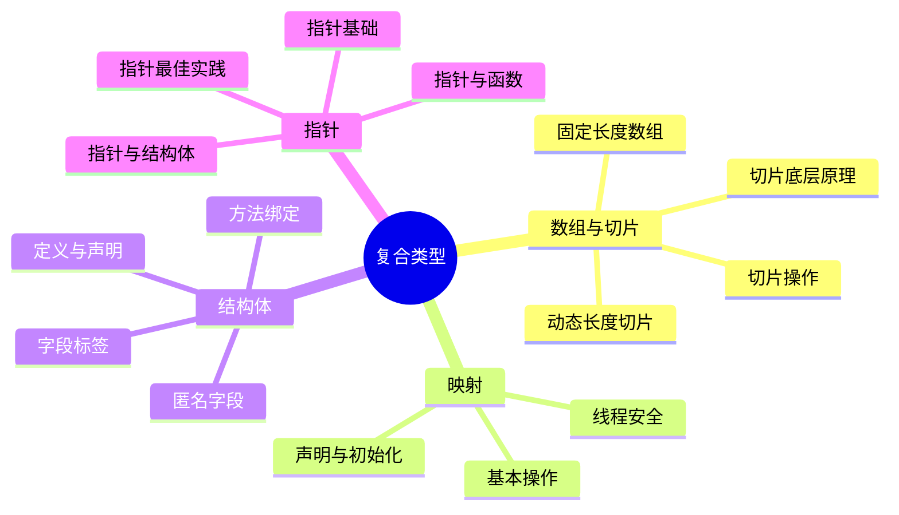
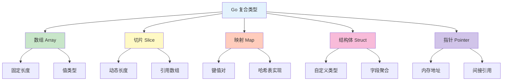
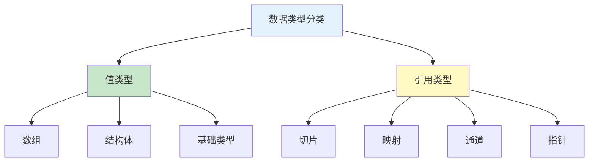

# 复合类型

欢迎来到 Go 语言复合类型章节！本章节将详细介绍 Go 的复合数据类型。

## 章节导航



## 知识体系

### 复合类型概览

Go 语言的复合类型用于组合和存储多个值：



### 类型对比

| 类型 | 长度 | 内存 | 特点 | 使用场景 |
|------|------|------|------|----------|
| **数组** | 固定 | 连续 | 值类型 | 固定大小集合 |
| **切片** | 动态 | 引用 | 引用数组 | 动态集合 |
| **映射** | 动态 | 哈希 | 键值对 | 查找表 |
| **结构体** | 固定 | 连续 | 值类型 | 数据聚合 |
| **指针** | 固定 | 地址 | 引用类型 | 共享数据 |

## 学习路线


## 快速预览

### 数组

```go
// 固定长度数组
var arr [5]int = [5]int{1, 2, 3, 4, 5}
fmt.Println(arr)        // [1 2 3 4 5]
fmt.Println(arr[0])     // 1
fmt.Println(len(arr))   // 5
```

### 切片

```go
// 动态长度切片
nums := []int{1, 2, 3}
nums = append(nums, 4)  // 追加元素
fmt.Println(nums)       // [1 2 3 4]

// 切片操作
slice := nums[1:3]      // [2 3]
slice = append(slice, 5)
```

### 映射

```go
// 键值对集合
ages := map[string]int{
    "Alice": 25,
    "Bob":   30,
}
ages["Charlie"] = 35    // 添加
fmt.Println(ages["Alice"])  // 25
delete(ages, "Bob")     // 删除
```

### 结构体

```go
// 自定义类型
type Person struct {
    Name string
    Age  int
}

p := Person{Name: "Alice", Age: 25}
fmt.Println(p.Name)     // Alice
```

### 指针

```go
// 内存地址
x := 42
p := &x                // p 指向 x
fmt.Println(*p)        // 42
*p = 100               // 修改 x
fmt.Println(x)         // 100
```

## 核心概念

### 值类型 vs 引用类型



**值类型**：直接存储数据，复制时复制整个值
**引用类型**：存储数据的引用，复制时只复制引用

### 内存布局

```go
// 数组：连续内存
arr := [3]int{1, 2, 3}
// 内存: [1][2][3]

// 切片：引用数组
slice := []int{1, 2, 3}
// 内存: 指针 → [1][2][3]

// 指针：存储地址
x := 42
p := &x
// 内存: p → 42
```

## 实践建议

::: tip 学习建议

1. **理解底层** - 掌握复合类型的内存布局
2. **注意引用** - 区分值类型和引用类型
3. **切片优先** - 优先使用切片而非数组
4. **结构体组合** - 使用结构体组织相关数据
5. **谨慎指针** - 指针用于共享和修改

:::

## 学习检查

完成本章节学习后，您应该能够：

- [ ] 理解数组和切片的区别
- [ ] 熟练使用切片的各种操作
- [ ] 掌握映射的基本用法
- [ ] 定义和使用结构体
- [ ] 正确使用指针
- [ ] 理解值类型和引用类型的区别

## 下一步

让我们开始深入学习复合类型的各个部分！

::: v-pre

[数组与切片](./arrays.md) → [映射](./maps.md) → [结构体](./structs.md) → [指针](./pointers.md)

:::
