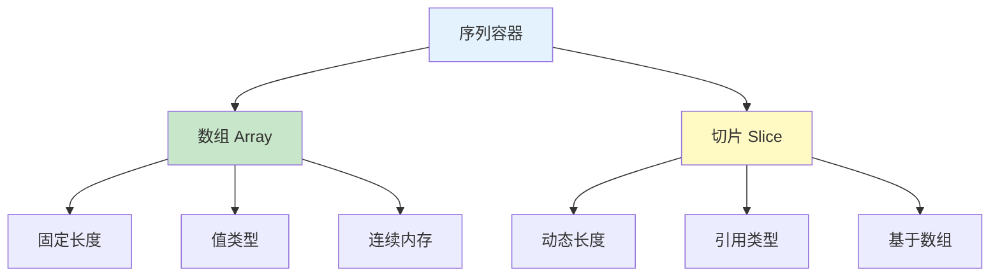
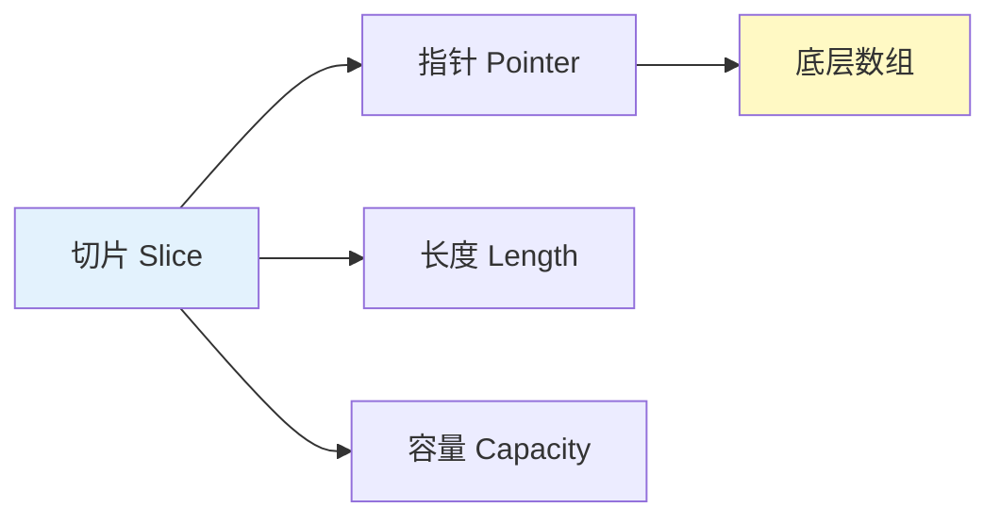
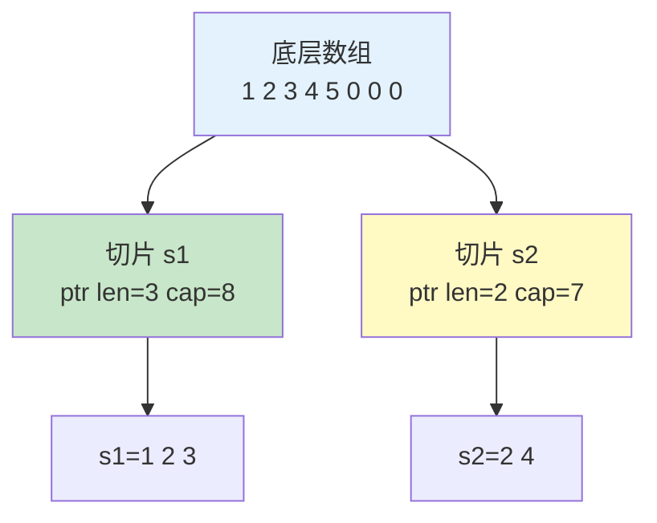

# 数组与切片

数组和切片是 Go 中存储多个相同类型值的数据结构。

## 类型概览



## 数组

### 基本语法

```go
// 声明数组
var arr1 [5]int                    // 零值数组 [0 0 0 0 0]
var arr2 = [5]int{1, 2, 3, 4, 5}    // 初始化
arr3 := [5]string{"a", "b", "c"}   // 短声明

// 自动推断长度
arr4 := [...]int{1, 2, 3, 4, 5}    // 长度为 5

// 指定索引初始化
arr5 := [5]int{1: 10, 3: 30}       // [0 10 0 30 0]
```

### 数组操作

```go
arr := [5]int{10, 20, 30, 40, 50}

// 访问元素
fmt.Println(arr[0])    // 10
fmt.Println(arr[4])    // 50

// 修改元素
arr[0] = 100
fmt.Println(arr)       // [100 20 30 40 50]

// 获取长度
fmt.Println(len(arr))  // 5

// 遍历数组
for i, v := range arr {
    fmt.Printf("索引: %d, 值: %d\n", i, v)
}

// 只要值
for _, v := range arr {
    fmt.Println(v)
}

// 只要索引
for i := range arr {
    fmt.Println(i)
}
```

### 数组特点

```go
// 1. 固定长度
var arr [3]int
// arr = [4]int{1, 2, 3, 4}  // ❌ 编译错误：类型不匹配

// 2. 值类型（复制时复制整个数组）
arr1 := [3]int{1, 2, 3}
arr2 := arr1
arr2[0] = 100
fmt.Println(arr1)  // [1 2 3]（原数组不变）
fmt.Println(arr2)  // [100 2 3]

// 3. 可以比较
a1 := [3]int{1, 2, 3}
a2 := [3]int{1, 2, 3}
fmt.Println(a1 == a2)  // true

// 4. 数组作为函数参数
func process(arr [5]int) {
    arr[0] = 999  // 只影响副本
}

func main() {
    arr := [5]int{1, 2, 3, 4, 5}
    process(arr)
    fmt.Println(arr)  // [1 2 3 4 5]（原数组不变）
}
```

### 多维数组

```go
// 二维数组
var matrix [3][4]int

// 初始化
matrix := [3][4]int{
    {1, 2, 3, 4},
    {5, 6, 7, 8},
    {9, 10, 11, 12},
}

// 访问
fmt.Println(matrix[0][0])  // 1
fmt.Println(matrix[2][3])  // 12

// 遍历
for i := 0; i < len(matrix); i++ {
    for j := 0; j < len(matrix[i]); j++ {
        fmt.Printf("%d ", matrix[i][j])
    }
    fmt.Println()
}

// 使用 range
for _, row := range matrix {
    for _, val := range row {
        fmt.Printf("%d ", val)
    }
    fmt.Println()
}
```

## 切片

### 基本语法

```go
// 声明切片
var s1 []int                    // nil 切片
s2 := []int{}                   // 空切片
s3 := []int{1, 2, 3, 4, 5}      // 初始化切片
s4 := make([]int, 5)            // 创建长度为 5 的切片
s5 := make([]int, 3, 10)        // 长度 3，容量 10

// 从数组创建切片
arr := [5]int{1, 2, 3, 4, 5}
slice := arr[1:4]               // [2 3 4]

// 从切片创建切片
s := []int{1, 2, 3, 4, 5}
s1 := s[1:3]                    // [2 3]
s2 := s[:3]                     // [1 2 3]
s3 := s[2:]                     // [3 4 5]
s4 := s[:]                      // [1 2 3 4 5]（完整切片）
```

### 切片结构



```go
// 切片内部结构
type slice struct {
    ptr unsafe.Pointer  // 指向底层数组的指针
    len  int             // 切片长度
    cap  int             // 切片容量
}

// 查看切片信息
s := make([]int, 3, 10)
fmt.Println(len(s))  // 3
fmt.Println(cap(s))  // 10
fmt.Println(s)       // [0 0 0]
```

### 切片操作

#### 添加元素

```go
// append 追加元素
s := []int{1, 2, 3}

// 追加一个元素
s = append(s, 4)
fmt.Println(s)  // [1 2 3 4]

// 追加多个元素
s = append(s, 5, 6, 7)
fmt.Println(s)  // [1 2 3 4 5 6 7]

// 追加另一个切片
s2 := []int{8, 9}
s = append(s, s2...)
fmt.Println(s)  // [1 2 3 4 5 6 7 8 9]

// append 会自动扩容
s = make([]int, 0, 3)
fmt.Println(len(s), cap(s))  // 0 3
s = append(s, 1, 2, 3)
fmt.Println(len(s), cap(s))  // 3 3
s = append(s, 4)             // 触发扩容
fmt.Println(len(s), cap(s))  // 4 6（容量翻倍）
```

#### 删除元素

```go
// Go 没有内置删除，需要用 append 和切片
s := []int{1, 2, 3, 4, 5}

// 删除索引 i 的元素
i := 2
s = append(s[:i], s[i+1:]...)
fmt.Println(s)  // [1 2 4 5]

// 删除开头元素
s = s[1:]              // [2 4 5]
s = append(s[:0], s[1:]...)  // [4 5]

// 删除结尾元素
s = s[:len(s)-1]        // [4]
```

#### 插入元素

```go
// 在索引 i 处插入元素
s := []int{1, 2, 4, 5}
i := 2
s = append(s[:i], append([]int{3}, s[i:]...)...)
fmt.Println(s)  // [1 2 3 4 5]

// 更高效的方式
func insert(slice []int, index int, value int) []int {
    if len(slice) == index {
        return append(slice, value)
    }
    slice = append(slice[:index+1], slice[index:]...)
    slice[index] = value
    return slice
}
```

#### 复制切片

```go
// 使用 copy 复制
src := []int{1, 2, 3, 4, 5}
dst := make([]int, len(src))
copy(dst, src)
fmt.Println(dst)  // [1 2 3 4 5]

// 修改副本不影响原切片
dst[0] = 100
fmt.Println(src)  // [1 2 3 4 5]
fmt.Println(dst)  // [100 2 3 4 5]

// 部分复制
src := []int{1, 2, 3, 4, 5}
dst := make([]int, 3)
copy(dst, src)
fmt.Println(dst)  // [1 2 3]

// 注意：直接赋值是引用
s1 := []int{1, 2, 3}
s2 := s1
s2[0] = 100
fmt.Println(s1)  // [100 2 3]（原切片被修改）
```

### 切片底层原理



```go
// 共享底层数组
arr := [8]int{1, 2, 3, 4, 5, 0, 0, 0}
s1 := arr[0:3:8]  // [1 2 3], len=3, cap=8
s2 := arr[1:5:8]  // [2 3 4 5], len=4, cap=7

// 修改会影响其他切片
s1[1] = 100
fmt.Println(s1)  // [1 100 3]
fmt.Println(s2)  // [2 100 3 4]（s2 也被修改）

// 三索引切片 [low:high:max]
// low: 起始索引
// high: 结束索引（不包含）
// max: 容量限制（最大可访问到 max-1）
s := arr[0:3:5]  // len=3, cap=5
```

### 切片扩容机制

```go
// 扩容策略
s := make([]int, 0)

for i := 0; i < 20; i++ {
    s = append(s, i)
    fmt.Printf("len=%d, cap=%d\n", len(s), cap(s))
}

// 输出（示例）：
// len=1, cap=1
// len=2, cap=2
// len=3, cap=4
// len=4, cap=4
// len=5, cap=8
// len=6, cap=8
// len=7, cap=8
// len=8, cap=8
// len=9, cap=16
// ...

// 扩容规则（Go 1.18+）：
// - 新容量 = 旧容量 * (增长因子)
// - 增长因子从 2.0 开始，随容量增长逐渐减小
// - 对于小切片，可能直接分配指定大小
```

## 数组 vs 切片

| 特性 | 数组 | 切片 |
|------|------|------|
| **长度** | 固定 | 动态 |
| **类型** | 值类型 | 引用类型 |
| **比较** | 可以 | 不能直接比较 |
| **作为参数** | 复制整个数组 | 复制切片头 |
| **使用场景** | 固定大小数据 | 动态集合 |

## 实战示例

### 实现栈

```go
package main

type Stack struct {
    data []int
}

func (s *Stack) Push(v int) {
    s.data = append(s.data, v)
}

func (s *Stack) Pop() int {
    if len(s.data) == 0 {
        return -1
    }
    v := s.data[len(s.data)-1]
    s.data = s.data[:len(s.data)-1]
    return v
}

func (s *Stack) Peek() int {
    if len(s.data) == 0 {
        return -1
    }
    return s.data[len(s.data)-1]
}

func main() {
    stack := Stack{}
    stack.Push(1)
    stack.Push(2)
    stack.Push(3)
    fmt.Println(stack.Pop())   // 3
    fmt.Println(stack.Peek())  // 2
}
```

### 动态数组

```go
package main

type DynamicArray struct {
    data     []int
    size     int
    capacity int
}

func NewDynamicArray(capacity int) *DynamicArray {
    return &DynamicArray{
        data:     make([]int, 0, capacity),
        size:     0,
        capacity: capacity,
    }
}

func (da *DynamicArray) Add(v int) {
    if da.size == da.capacity {
        // 扩容
        newCapacity := da.capacity * 2
        if da.capacity == 0 {
            newCapacity = 1
        }
        newData := make([]int, da.size, newCapacity)
        copy(newData, da.data)
        da.data = newData
        da.capacity = newCapacity
    }
    da.data = append(da.data, v)
    da.size++
}

func (da *DynamicArray) Get(index int) int {
    if index < 0 || index >= da.size {
        panic("index out of range")
    }
    return da.data[index]
}
```

## 最佳实践

::: tip 使用建议

1. **优先使用切片** - 数组主要用于底层实现
2. **预分配容量** - 已知大小时使用 make 预分配
3. **注意共享** - 切片共享底层数组
4. **使用 copy** - 需要独立副本时用 copy
5. **避免频繁扩容** - 预估容量减少扩容

:::

```go
// 预分配容量
// ❌ 频繁扩容
s := []int{}
for i := 0; i < 1000000; i++ {
    s = append(s, i)  // 多次扩容
}

// 预分配容量
// ✅ 一次分配
s := make([]int, 0, 1000000)
for i := 0; i < 1000000; i++ {
    s = append(s, i)
}
```

## 总结

| 概念 | 关键点 |
|------|--------|
| **数组** | 固定长度，值类型 |
| **切片** | 动态长度，引用数组 |
| **append** | 自动扩容，返回新切片 |
| **copy** | 独立副本 |
| **切片头** | 指针、长度、容量 |

::: v-pre

[复合类型总览](./README.md) → [映射](./maps.md)

:::
