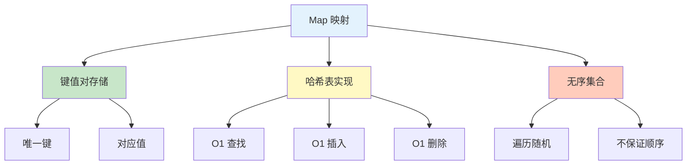

# 映射 Map

Map 是 Go 中无序的键值对集合，类似于其他语言的哈希表或字典。

## 类型概览



## 基本语法

### 声明与初始化

```go
// 声明 map（nil map）
var m1 map[string]int

// 初始化 map
m2 := map[string]int{}
m3 := make(map[string]int)
m4 := make(map[string]int, 10)  // 指定初始容量

// 声明并初始化
ages := map[string]int{
    "Alice":   25,
    "Bob":     30,
    "Charlie": 35,
}

// 空结构体作为值（集合）
set := map[string]struct{}{
    "apple":  {},
    "banana": {},
}
```

### Map 操作

#### 添加和修改

```go
ages := make(map[string]int)

// 添加元素
ages["Alice"] = 25
ages["Bob"] = 30
fmt.Println(ages)  // map[Alice:25 Bob:30]

// 修改元素
ages["Alice"] = 26
fmt.Println(ages)  // map[Alice:26 Bob:30]

// 修改不存在的键会添加
ages["Charlie"] = 35
fmt.Println(ages)  // map[Alice:26 Bob:30 Charlie:35]
```

#### 读取元素

```go
ages := map[string]int{
    "Alice": 25,
    "Bob":   30,
}

// 直接读取
age1 := ages["Alice"]
fmt.Println(age1)  // 25

// 读取不存在的键返回零值
age2 := ages["Charlie"]
fmt.Println(age2)  // 0（但无法区分是不存在还是值为 0）

// 使用 comma ok 模式判断键是否存在
age, ok := ages["Bob"]
if ok {
    fmt.Println("Bob 的年龄:", age)
}

age, ok = ages["Charlie"]
if !ok {
    fmt.Println("Charlie 不存在")
}

// 常用模式
if age, ok := ages["Alice"]; ok {
    fmt.Printf("Alice: %d\n", age)
}
```

#### 删除元素

```go
ages := map[string]int{
    "Alice":   25,
    "Bob":     30,
    "Charlie": 35,
}

// 删除元素
delete(ages, "Bob")
fmt.Println(ages)  // map[Alice:25 Charlie:35]

// 删除不存在的键不会报错
delete(ages, "David")  // 无操作
```

## 遍历 Map

### range 遍历

```go
ages := map[string]int{
    "Alice":   25,
    "Bob":     30,
    "Charlie": 35,
}

// 遍历键值对（注意：顺序不确定）
for name, age := range ages {
    fmt.Printf("%s: %d\n", name, age)
}

// 只遍历键
for name := range ages {
    fmt.Println(name)
}

// 只遍历值
for _, age := range ages {
    fmt.Println(age)
}
```

### 有序遍历

```go
ages := map[string]int{
    "Charlie": 35,
    "Alice":   25,
    "Bob":     30,
}

// 获取所有键并排序
names := make([]string, 0, len(ages))
for name := range ages {
    names = append(names, name)
}
sort.Strings(names)

// 按键的顺序遍历
for _, name := range names {
    fmt.Printf("%s: %d\n", name, ages[name])
}

// 输出：
// Alice: 25
// Bob: 30
// Charlie: 35
```

## Map 特性

### 零值

```go
// nil map
var m map[string]int
fmt.Println(m == nil)  // true
fmt.Println(m)         // map[]

// nil map 不能写入
// m["key"] = 1  // 运行时 panic

// nil map 可以读取
val := m["key"]
fmt.Println(val)  // 0

// nil map 可以删除（无操作）
delete(m, "key")  // 无操作

// 使用 make 初始化
m = make(map[string]int)
m["key"] = 1  // OK
```

### 引用类型

```go
// map 是引用类型
m1 := map[string]int{"a": 1}
m2 := m1
m2["a"] = 100
fmt.Println(m1)  // map[a:100]（原 map 被修改）

// 作为函数参数
func modify(m map[string]int) {
    m["key"] = 999
}

func main() {
    m := map[string]int{}
    modify(m)
    fmt.Println(m)  // map[key:999]
}
```

### 不可比较

```go
// map 不能直接比较
m1 := map[string]int{"a": 1}
m2 := map[string]int{"a": 1}

// fmt.Println(m1 == m2)  // ❌ 编译错误

// 只能和 nil 比较
fmt.Println(m1 == nil)  // false

// 判断两个 map 是否相等
func equal(m1, m2 map[string]int) bool {
    if len(m1) != len(m2) {
        return false
    }
    for k, v := range m1 {
        if v2, ok := m2[k]; !ok || v != v2 {
            return false
        }
    }
    return true
}
```

## Map 进阶

### 嵌套 Map

```go
// 嵌套 map
users := map[string]map[string]int{
    "user1": {
        "age":  25,
        "score": 100,
    },
    "user2": {
        "age":  30,
        "score": 95,
    },
}

// 访问
fmt.Println(users["user1"]["age"])  // 25

// 添加内层 map 需要先初始化
users := make(map[string]map[string]int)
if _, ok := users["user3"]; !ok {
    users["user3"] = make(map[string]int)
}
users["user3"]["age"] = 35

// 或使用辅助函数
func getUsers() map[string]map[string]int {
    return map[string]map[string]int{
        "user1": {"age": 25, "score": 100},
        "user2": {"age": 30, "score": 95},
    }
}
```

### Map 作为 Set

```go
// 使用 map 实现 set
type Set struct {
    data map[string]struct{}
}

func NewSet() *Set {
    return &Set{
        data: make(map[string]struct{}),
    }
}

func (s *Set) Add(item string) {
    s.data[item] = struct{}{}
}

func (s *Set) Remove(item string) {
    delete(s.data, item)
}

func (s *Set) Contains(item string) bool {
    _, ok := s.data[item]
    return ok
}

func (s *Set) Size() int {
    return len(s.data)
}

func main() {
    set := NewSet()
    set.Add("apple")
    set.Add("banana")
    fmt.Println(set.Contains("apple"))  // true
    fmt.Println(set.Size())             // 2
}
```

### 并发安全

```go
// map 不是并发安全的
var m = make(map[string]int)

// 并发写入会 panic
// go func() { m["key1"] = 1 }()
// go func() { m["key2"] = 2 }()

// 方案1: 使用 sync.Mutex
import "sync"

type SafeMap struct {
    mu sync.RWMutex
    m  map[string]int
}

func NewSafeMap() *SafeMap {
    return &SafeMap{
        m: make(map[string]int),
    }
}

func (sm *SafeMap) Set(key string, value int) {
    sm.mu.Lock()
    defer sm.mu.Unlock()
    sm.m[key] = value
}

func (sm *SafeMap) Get(key string) (int, bool) {
    sm.mu.RLock()
    defer sm.mu.RUnlock()
    val, ok := sm.m[key]
    return val, ok
}

// 方案2: 使用 sync.Map（Go 1.9+）
var m sync.Map

m.Store("key1", "value1")
value, ok := m.Load("key1")
if ok {
    fmt.Println(value)
}
m.Delete("key1")
```

## 性能优化

### 预分配容量

```go
// 预分配可以减少扩容开销
// ❌ 动态扩容
m := make(map[string]int)
for i := 0; i < 1000; i++ {
    m[fmt.Sprintf("key%d", i)] = i
}

// 预分配容量
// ✅ 性能更好
m := make(map[string]int, 1000)
for i := 0; i < 1000; i++ {
    m[fmt.Sprintf("key%d", i)] = i
}
```

### 键类型选择

```go
// 使用基本类型作为键
// ✅ 推荐
m1 := map[int]string{}      // int 键
m2 := map[string]int{}      // string 键

// ❌ 避免
m3 := map[[]byte]int{}      // 切片不能作为键（不可比较）
m4 := map[map[int]int]int{} // map 不能作为键

// 可比较的类型才能作为键
// - 布尔、数值、字符串、指针、通道、接口
// - 只包含可比较类型的数组、结构体
```

## 实战示例

### 统计词频

```go
func wordCount(text string) map[string]int {
    words := strings.Fields(text)
    count := make(map[string]int)

    for _, word := range words {
        count[word]++
    }

    return count
}

func main() {
    text := "go is great go is powerful"
    counts := wordCount(text)
    for word, count := range counts {
        fmt.Printf("%s: %d\n", word, count)
    }
    // go: 2
    // is: 2
    // great: 1
    // powerful: 1
}
```

### 缓存实现

```go
type Cache struct {
    data map[string]interface{}
    ttl  map[string]time.Time
    mu   sync.RWMutex
}

func NewCache() *Cache {
    return &Cache{
        data: make(map[string]interface{}),
        ttl:  make(map[string]time.Time),
    }
}

func (c *Cache) Set(key string, value interface{}, duration time.Duration) {
    c.mu.Lock()
    defer c.mu.Unlock()

    c.data[key] = value
    c.ttl[key] = time.Now().Add(duration)
}

func (c *Cache) Get(key string) (interface{}, bool) {
    c.mu.RLock()
    defer c.mu.RUnlock()

    // 检查是否过期
    if expiry, ok := c.ttl[key]; ok && time.Now().After(expiry) {
        return nil, false
    }

    val, ok := c.data[key]
    return val, ok
}
```

## 最佳实践

::: tip 使用建议

1. **预分配容量** - 已知大小时指定容量
2. **检查键存在** - 使用 comma ok 模式
3. **并发保护** - 使用 sync.Mutex 或 sync.Map
4. **避免可变键** - 键应该是不可变类型
5. **清理 nil map** - 使用前确保 map 已初始化

:::

```go
// 检查键是否存在再删除
if _, ok := m["key"]; ok {
    delete(m, "key")
}

// 初始化嵌套 map
m := make(map[string]map[string]int)
if m["key"] == nil {
    m["key"] = make(map[string]int)
}

// 使用值类型作为键
type Key struct {
    ID   int
    Name string
}

m := map[Key]string{}
m[Key{ID: 1, Name: "test"}] = "value"
```

## 总结

| 概念 | 关键点 |
|------|--------|
| **声明** | `make(map[K]V)` 或 `map[K]V{}` |
| **零值** | nil map（只读） |
| **读取** | `m[key]` 或 `v, ok := m[key]` |
| **删除** | `delete(m, key)` |
| **引用类型** | 函数内修改会影响原 map |
| **非并发安全** - 需要加锁保护 |

::: v-pre

[数组与切片](./arrays.md) → [结构体](./structs.md)

:::
