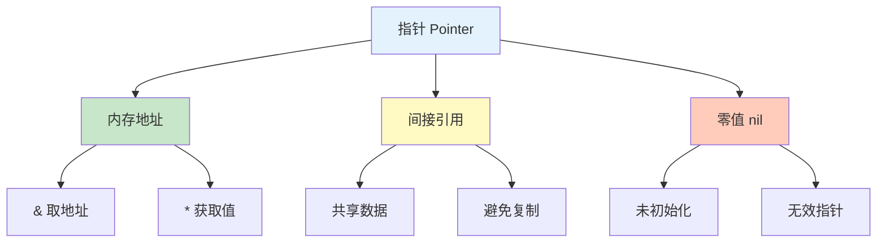
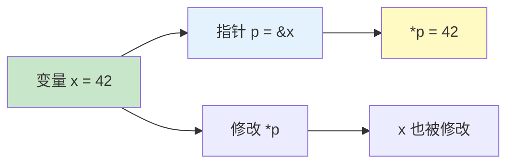
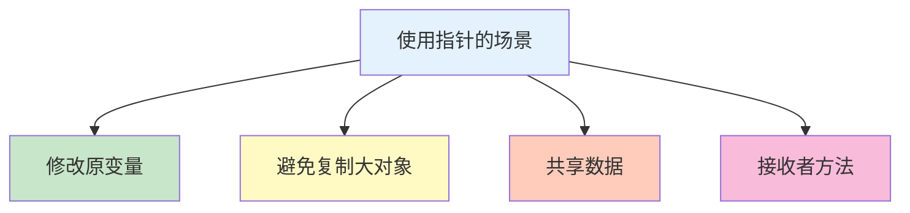

# 指针 Pointer

指针存储变量的内存地址，用于间接访问和修改数据。

## 类型概览



## 指针基础

### 声明与初始化

```go
// 声明指针（零值为 nil）
var p *int
fmt.Println(p == nil)  // true

// 取地址操作符 &
x := 42
p = &x
fmt.Println(p)        // 内存地址，如 0xc0000140a0

// 解引用操作符 *
fmt.Println(*p)       // 42

// 修改指针指向的值
*p = 100
fmt.Println(x)        // 100
fmt.Println(*p)       // 100

// 短声明
y := 3.14
py := &y
fmt.Println(*py)      // 3.14
```

### 指针与值



```go
// 指针与原变量的关系
x := 42
p := &x

fmt.Println("x =", x)    // x = 42
fmt.Println("*p =", *p)  // *p = 42
fmt.Println("p =", p)    // p = 0xc0000140a0

// 通过指针修改原变量
*p = 100
fmt.Println("x =", x)    // x = 100
fmt.Println("*p =", *p)  // *p = 100

// 修改原变量，指针的值也会变
x = 200
fmt.Println("*p =", *p)  // *p = 200
```

## 指针与函数

### 值传递 vs 指针传递

```go
// 值传递：复制整个值
func modifyValue(x int) {
    x = 100  // 只修改副本
}

// 指针传递：传递地址
func modifyPointer(x *int) {
    *x = 100  // 修改原变量
}

func main() {
    a := 50

    modifyValue(a)
    fmt.Println(a)  // 50（不变）

    modifyPointer(&a)
    fmt.Println(a)  // 100（被修改）
}
```

### 指针作为返回值

```go
// 返回局部变量的指针（逃逸到堆）
func createValue() *int {
    x := 42
    return &x  // x 逃逸到堆上
}

func main() {
    p := createValue()
    fmt.Println(*p)  // 42

    *p = 100
    fmt.Println(*p)  // 100
}

// 返回堆上分配的变量
func newInt(value int) *int {
    return &value
}

// 返回已存在变量的指针
func getPointer(x int) *int {
    return &x
}
```

### 指针参数

```go
type Rectangle struct {
    Width, Height int
}

// 值参数（复制整个结构体）
func area(r Rectangle) int {
    return r.Width * r.Height
}

// 指针参数（避免复制）
func scale(r *Rectangle, factor int) {
    r.Width *= factor
    r.Height *= factor
}

func main() {
    r := Rectangle{Width: 10, Height: 5}

    // 值传递
    a := area(r)  // r 被复制

    // 指针传递
    scale(&r, 2)  // 传递地址，修改原结构体
    fmt.Println(r)  // {20 10}
}
```

## 指针与结构体

### 结构体指针

```go
type Person struct {
    Name string
    Age  int
}

// 创建结构体指针
p1 := &Person{Name: "Alice", Age: 25}
p2 := new(Person)
p2.Name = "Bob"
p2.Age = 30

// 访问字段（自动解引用）
fmt.Println(p1.Name)  // Alice（等价于 (*p1).Name）
p1.Age = 26           // 自动解引用赋值

// 比较结构体指针
p3 := &Person{Name: "Alice", Age: 25}
fmt.Println(p1 == p3)  // false（比较地址）
fmt.Println(*p1 == *p3)  // true（比较值）
```

### 结构体字段指针

```go
type Point struct {
    X, Y int
}

p := Point{X: 10, Y: 20}

// 获取字段指针
px := &p.X
py := &p.Y

// 通过指针修改字段
*px = 100
*py = 200
fmt.Println(p)  // {100 200}

// 在函数中使用
func setX(p *Point, x int) {
    (*p).X = x  // 或 p.X = x（自动解引用）
}
```

## 指针运算

### Go 指针的限制

```go
// Go 不支持指针运算（不同于 C/C++）
arr := [3]int{1, 2, 3}
p := &arr[0]

// ❌ 以下操作不支持
// p++       // 编译错误
// p + 1     // 编译错误
// p -= 1    // 编译错误

// ✅ 使用切片实现类似功能
slice := arr[:]
for i, v := range slice {
    fmt.Printf("arr[%d] = %d\n", i, v)
}
```

### unsafe 包（谨慎使用）

```go
import "unsafe"

// 指针转换（不安全）
arr := [3]int{1, 2, 3}
p := &arr[0]

// 转换为 unsafe.Pointer
up := unsafe.Pointer(p)

// 转换为 uintptr
addr := uintptr(up)

// 指针运算（危险）
next := *(*int)(unsafe.Pointer(addr + unsafe.Sizeof(arr[0])))
fmt.Println(next)  // 2

// ⚠️ 警告：unsafe 可能导致内存安全问题
// 仅在必要时使用，并确保理解其风险
```

## 指针与切片

### 切片指针

```go
// 切片已经是引用类型
nums := []int{1, 2, 3, 4, 5}

// 切片指针（不常见）
p := &nums
(*p)[0] = 100  // 或 p[0] = 100
fmt.Println(nums)  // [100 2 3 4 5]

// 更好的方式：直接使用切片
modify := func(s []int) {
    s[0] = 200
}
modify(nums)
fmt.Println(nums)  // [200 2 3 4 5]
```

### 切片底层数组指针

```go
// 切片内部包含指向数组的指针
slice := []int{1, 2, 3}

// 获取底层数组指针
data := unsafe.SliceData(slice)
fmt.Println((*data)[0])  // 1

// 获取切片的容量和长度
ptr := unsafe.Pointer(&slice[0])
len := slice.Len()
cap := slice.Cap()
```

## 指针与 map

### map 值指针

```go
// map 的值是指针
m := map[string]*Person{
    "alice": {Name: "Alice", Age: 25},
    "bob":   {Name: "Bob", Age: 30},
}

// 修改 map 中的值
m["alice"].Age = 26
fmt.Println(m["alice"])  // &{Alice 26}

// 添加新值
m["charlie"] = &Person{Name: "Charlie", Age: 35}
```

### 指针作为 map 键

```go
// ❌ 指针不能作为 map 键（不可比较）
// m := map[*int]string{}  // 编译错误

// ✅ 使用值作为键
type Key struct {
    ID int
}

m := map[Key]string{
    {ID: 1}: "value1",
}
```

## 指针与接口

### 指针实现接口

```go
type Speaker interface {
    Speak() string
}

type Dog struct {
    Name string
}

// 值接收者
func (d Dog) Speak() string {
    return "Woof!"
}

func main() {
    // Dog 和 *Dog 都可以实现接口
    var s1 Speaker = Dog{Name: "Buddy"}
    var s2 Speaker = &Dog{Name: "Max"}

    fmt.Println(s1.Speak())  // Woof!
    fmt.Println(s2.Speak())  // Woof!
}
```

### 接口与 nil

```go
type Speaker interface {
    Speak() string
}

type Dog struct {
    Name string
}

func (d Dog) Speak() string {
    return "Woof!"
}

// ⚠️ 注意：包含 nil 指针的接口不是 nil
var s Speaker
var d *Dog
s = d  // d 是 nil

fmt.Println(s == nil)  // false（接口持有类型信息）
fmt.Println(d == nil)  // true

// 正确的 nil 检查
var s2 Speaker
fmt.Println(s2 == nil)  // true
```

## 指针最佳实践

### 何时使用指针



```go
// 1. 需要修改原变量
func increment(x *int) {
    *x++
}

// 2. 避免复制大结构体
type LargeStruct struct {
    data [1024]int
}

func process(ls *LargeStruct) {
    // 处理逻辑
}

// 3. 共享数据
type Cache struct {
    data map[string]string
}

func NewCache() *Cache {
    return &Cache{
        data: make(map[string]string),
    }
}

// 4. 方法接收者
func (c *Counter) Increment() {
    c.count++
}
```

### 避免滥用指针

```go
// ❌ 不必要的指针
func add(a, b *int) int {
    return *a + *b
}

// ✅ 直接使用值
func add(a, b int) int {
    return a + b
}

// ❌ 小类型用指针
type Point struct {
    X, Y int
}

func distance(p *Point) float64 {  // 指针无意义
    // ...
}

// ✅ 值类型更简单
func distance(p Point) float64 {
    // ...
}
```

### 空指针检查

```go
func processPerson(p *Person) error {
    // 检查空指针
    if p == nil {
        return fmt.Errorf("person is nil")
    }

    fmt.Println(p.Name)
    return nil
}

// 多重检查
type Config struct {
    Database *DatabaseConfig
}

type DatabaseConfig struct {
    Host string
}

func getHost(cfg *Config) string {
    if cfg == nil || cfg.Database == nil {
        return "default"
    }
    return cfg.Database.Host
}
```

## 实战示例

### 链表节点

```go
type Node struct {
    Data int
    Next *Node
}

func NewNode(data int) *Node {
    return &Node{Data: data}
}

func (n *Node) Append(data int) {
    for n.Next != nil {
        n = n.Next
    }
    n.Next = &Node{Data: data}
}
```

### 二叉树

```go
type TreeNode struct {
    Val   int
    Left  *TreeNode
    Right *TreeNode
}

func NewTreeNode(val int) *TreeNode {
    return &TreeNode{Val: val}
}

func (n *TreeNode) Insert(val int) {
    if val < n.Val {
        if n.Left == nil {
            n.Left = &TreeNode{Val: val}
        } else {
            n.Left.Insert(val)
        }
    } else {
        if n.Right == nil {
            n.Right = &TreeNode{Val: val}
        } else {
            n.Right.Insert(val)
        }
    }
}
```

## 总结

| 概念 | 关键点 |
|------|--------|
| **声明** | `var p *Type` |
| **取地址** | `p = &variable` |
| **解引用** | `value = *p` |
| **零值** | `nil` |
| **用途** | 修改原变量、避免复制 |
| **限制** | 不支持指针运算 |

::: v-pre

[结构体](./structs.md) → [函数基础](/langs/go/03-functions/) →

:::
