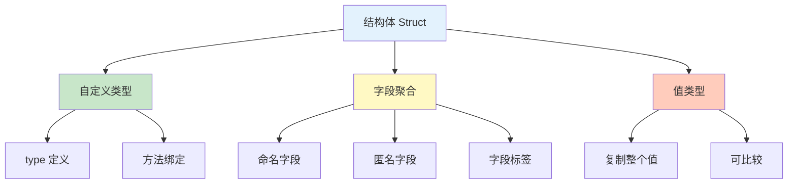
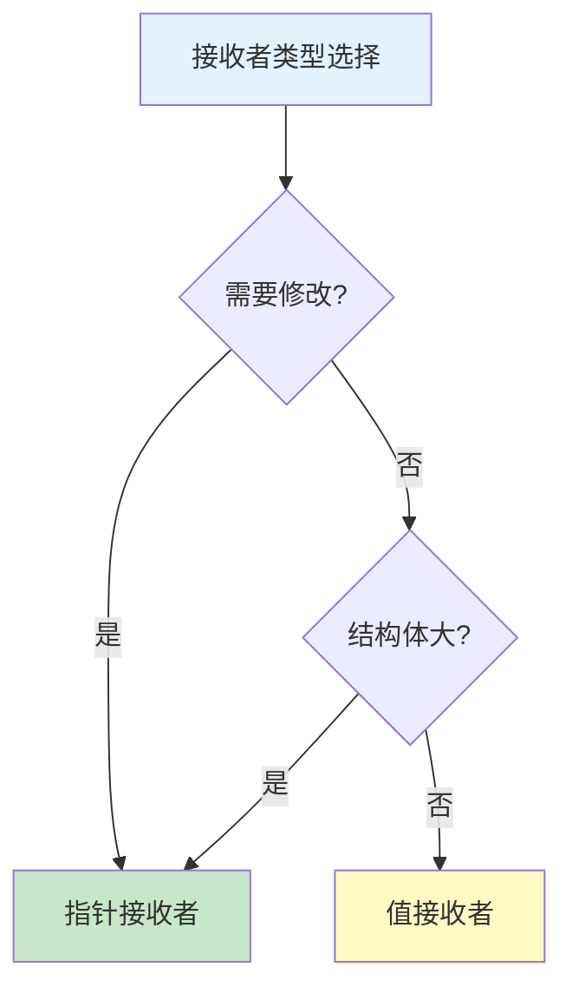

# 结构体 Struct

结构体是 Go 中聚合不同类型数据的方式，类似于其他语言的类或对象。

## 类型概览



## 定义结构体

### 基本语法

```go
// 定义结构体
type Person struct {
    Name string
    Age  int
}

// 声明结构体变量
var p1 Person
p1.Name = "Alice"
p1.Age = 25

// 短声明初始化
p2 := Person{Name: "Bob", Age: 30}

// 按顺序初始化（不推荐，易出错）
p3 := Person{"Charlie", 35}

// 部分字段初始化（零值）
p4 := Person{Name: "David"}
fmt.Println(p4.Age)  // 0

// 使用 new 创建（返回指针）
p5 := new(Person)
p5.Name = "Eve"      // 等价于 (*p5).Name
fmt.Println(*p5)     // {Eve 0}
```

### 字段

```go
// 字段类型
type Address struct {
    City    string
    Country string
}

type Person struct {
    // 基本类型字段
    Name string
    Age  int

    // 指针字段
    Address *Address

    // 切片字段
    Hobbies []string

    // map 字段
    Metadata map[string]interface{}

    // 结构体字段
    Home Address

    // 接口字段
    Writer io.Writer
}

// 初始化
p := Person{
    Name: "Alice",
    Age:  25,
    Address: &Address{
        City:    "Beijing",
        Country: "China",
    },
    Hobbies: []string{"reading", "coding"},
    Metadata: map[string]interface{}{
        "created": time.Now(),
    },
}
```

### 匿名字段

```go
// 嵌入结构体
type Address struct {
    City    string
    Country string
}

type Person struct {
    Name string
    Age  int
    Address  // 匿名字段（嵌入）
}

// 访问匿名字段
p := Person{
    Name: "Alice",
    Age:  25,
    Address: Address{
        City:    "Beijing",
        Country: "China",
    },
}

// 直接访问嵌入字段
fmt.Println(p.City)       // Beijing（提升）
fmt.Println(p.Address.City)  // Beijing（完整路径）

// 多重嵌入
type Contact struct {
    Email string
    Phone string
}

type Person struct {
    Name string
    Address
    Contact
}

// 字段名冲突时必须使用完整路径
p := Person{
    Name: "Alice",
    Address: Address{City: "Beijing"},
    Contact: Contact{Email: "alice@example.com"},
}
fmt.Println(p.Address.City)  // OK
fmt.Println(p.Email)         // OK（提升）
```

### 字段标签

```go
// 字段标签用于元数据
type Person struct {
    Name     string `json:"name" db:"name" xml:"name"`
    Age      int    `json:"age" db:"age"`
    Password string `json:"-" db:"password"` // json 忽略
    Internal string `json:"internal,omitempty"` // 空值时省略
}

// 反射读取标签
import "reflect"

func printTags(p interface{}) {
    t := reflect.TypeOf(p)
    for i := 0; i < t.NumField(); i++ {
        field := t.Field(i)
        fmt.Printf("%s: %q\n", field.Name, field.Tag)
    }
}

// JSON 序列化
import "encoding/json"

p := Person{Name: "Alice", Age: 25}
data, _ := json.Marshal(p)
fmt.Println(string(data))
// {"name":"Alice","age":25"}
```

## 结构体操作

### 访问和修改

```go
type Point struct {
    X, Y int
}

p := Point{X: 10, Y: 20}

// 访问字段
fmt.Println(p.X)  // 10

// 修改字段
p.X = 100
fmt.Println(p)    // {100 20}

// 指针访问
pp := &p
pp.X = 200        // 等价于 (*pp).X = 200
fmt.Println(p)    // {200 20}
```

### 比较结构体

```go
type Point struct {
    X, Y int
}

// 结构体可以比较
p1 := Point{X: 10, Y: 20}
p2 := Point{X: 10, Y: 20}
p3 := Point{X: 10, Y: 30}

fmt.Println(p1 == p2)  // true
fmt.Println(p1 == p3)  // false

// 包含不可比较字段的结构体不能比较
type Item struct {
    Data []int  // 切片不可比较
}

// i1 := Item{Data: []int{1, 2}}
// i2 := Item{Data: []int{1, 2}}
// fmt.Println(i1 == i2)  // ❌ 编译错误

// 可以使用 reflect.DeepEqual
import "reflect"
fmt.Println(reflect.DeepEqual(i1, i2))  // true
```

### 复制结构体

```go
type Person struct {
    Name    string
    Age     int
    Friends []string
}

// 值复制（浅拷贝）
p1 := Person{
    Name:    "Alice",
    Age:     25,
    Friends: []string{"Bob", "Charlie"},
}

p2 := p1  // 复制整个结构体
p2.Name = "Bob"
p2.Friends[0] = "David"

fmt.Println(p1.Name)         // Alice（基本字段独立）
fmt.Println(p1.Friends[0])   // David（引用字段共享）

// 深拷贝
func deepCopy(p Person) Person {
    friends := make([]string, len(p.Friends))
    copy(friends, p.Friends)

    return Person{
        Name:    p.Name,
        Age:     p.Age,
        Friends: friends,
    }
}
```

## 结构体与函数

### 作为参数

```go
type Point struct {
    X, Y int
}

// 值传递（复制整个结构体）
func distance(p1, p2 Point) float64 {
    dx := p1.X - p2.X
    dy := p1.Y - p2.Y
    return math.Sqrt(float64(dx*dx + dy*dy))
}

// 指针传递（避免复制）
func move(p *Point, dx, dy int) {
    p.X += dx
    p.Y += dy
}

func main() {
    p := Point{X: 10, Y: 20}

    // 值传递，原结构体不变
    d := distance(p, Point{X: 0, Y: 0})

    // 指针传递，修改原结构体
    move(&p, 5, 5)
    fmt.Println(p)  // {15 25}
}
```

### 作为返回值

```go
// 返回结构体
func newPoint(x, y int) Point {
    return Point{X: x, Y: y}
}

// 返回结构体指针
func newPointPtr(x, y int) *Point {
    return &Point{X: x, Y: y}
}

// 返回多个结构体
func getPoints() (Point, Point) {
    return Point{X: 0, Y: 0}, Point{X: 10, Y: 10}
}
```

## 方法

### 定义方法

```go
type Rectangle struct {
    Width, Height float64
}

// 值接收者
func (r Rectangle) Area() float64 {
    return r.Width * r.Height
}

// 指针接收者
func (r *Rectangle) Scale(factor float64) {
    r.Width *= factor
    r.Height *= factor
}

func main() {
    r := Rectangle{Width: 10, Height: 5}

    // 值接收者方法
    area := r.Area()
    fmt.Println(area)  // 50

    // 指针接收者方法
    r.Scale(2)
    fmt.Println(r)  // {20 10}

    // 自动解引用/取引用
    r.Scale(2)      // 等价于 (&r).Scale(2)
    p := &Rectangle{Width: 5, Height: 3}
    area = p.Area() // 等价于 (*p).Area()
}
```

### 值接收者 vs 指针接收者



```go
type Counter struct {
    count int
}

// 值接收者：不修改原结构体
func (c Counter) Value() int {
    return c.count
}

// 指针接收者：修改原结构体
func (c *Counter) Increment() {
    c.count++
}

// 选择建议
type LargeStruct struct {
    data [1024]int
}

// ✅ 使用值接收者
func (ls LargeStruct) Sum() int {
    sum := 0
    for _, v := range ls.data {
        sum += v
    }
    return sum
}

// ✅ 使用指针接收者（避免复制大结构体）
func (ls *LargeStruct) Process() {
    // 处理逻辑
}
```

## 结构体组合

### 模拟继承

```go
// 基础结构体
type Animal struct {
    Name string
    Age  int
}

func (a Animal) Speak() {
    fmt.Println("...")
}

func (a Animal) Eat() {
    fmt.Println(a.Name, "is eating")
}

// 派生结构体
type Dog struct {
    Animal       // 匿名嵌入
    Breed string
}

// 重写方法
func (d Dog) Speak() {
    fmt.Println("Woof!")
}

// 新增方法
func (d Dog) Fetch() {
    fmt.Println(d.Name, "is fetching")
}

func main() {
    dog := Dog{
        Animal: Animal{Name: "Buddy", Age: 3},
        Breed:  "Golden Retriever",
    }

    // 使用基类方法
    dog.Eat()     // Buddy is eating

    // 使用派生类方法
    dog.Speak()   // Woof!
    dog.Fetch()   // Buddy is fetching
}
```

### 接口实现

```go
type Speaker interface {
    Speak() string
}

type Dog struct {
    Name string
}

func (d Dog) Speak() string {
    return "Woof!"
}

type Cat struct {
    Name string
}

func (c Cat) Speak() string {
    return "Meow!"
}

func main() {
    // 结构体隐式实现接口
    var speaker Speaker

    speaker = Dog{Name: "Buddy"}
    fmt.Println(speaker.Speak())  // Woof!

    speaker = Cat{Name: "Whiskers"}
    fmt.Println(speaker.Speak())  // Meow!
}
```

## 实战示例

### 配置结构体

```go
type Config struct {
    Host     string `json:"host"`
    Port     int    `json:"port"`
    Debug    bool   `json:"debug"`
    Database struct {
        Driver   string `json:"driver"`
        Host     string `json:"host"`
        Port     int    `json:"port"`
        Database string `json:"database"`
        User     string `json:"user"`
        Password string `json:"password"`
    } `json:"database"`
}

func LoadConfig(path string) (*Config, error) {
    data, err := os.ReadFile(path)
    if err != nil {
        return nil, err
    }

    var cfg Config
    if err := json.Unmarshal(data, &cfg); err != nil {
        return nil, err
    }

    return &cfg, nil
}
```

### 链表实现

```go
type Node struct {
    Data int
    Next *Node
}

type LinkedList struct {
    head *Node
    size int
}

func (ll *LinkedList) Append(data int) {
    newNode := &Node{Data: data}

    if ll.head == nil {
        ll.head = newNode
    } else {
        current := ll.head
        for current.Next != nil {
            current = current.Next
        }
        current.Next = newNode
    }
    ll.size++
}

func (ll *LinkedList) Print() {
    current := ll.head
    for current != nil {
        fmt.Print(current.Data, " ")
        current = current.Next
    }
    fmt.Println()
}
```

## 最佳实践

::: tip 使用建议

1. **字段小写** - 私有字段首字母小写
2. **指针接收者** - 需要修改或结构体大时使用
3. **构造函数** - 提供 NewXXX 构造函数
4. **字段标签** - 使用标签提供元数据
5. **组合优于继承** - 使用嵌入实现代码复用

:::

```go
// 构造函数
func NewPerson(name string, age int) *Person {
    return &Person{
        Name: name,
        Age:  age,
    }
}

// 使用组合而非继承
type Reader struct {
    io.Reader
}

type Writer struct {
    io.Writer
}

type ReadWriter struct {
    Reader
    Writer
}
```

## 总结

| 概念 | 关键点 |
|------|--------|
| **定义** | `type Name struct {...}` |
| **初始化** | `Type{Field: value}` 或 `new(Type)` |
| **匿名字段** | 嵌入实现代码复用 |
| **方法** | 值接收者 vs 指针接收者 |
| **值类型** | 复制整个结构体 |

::: v-pre

[映射](./maps.md) → [指针](./pointers.md)

:::
