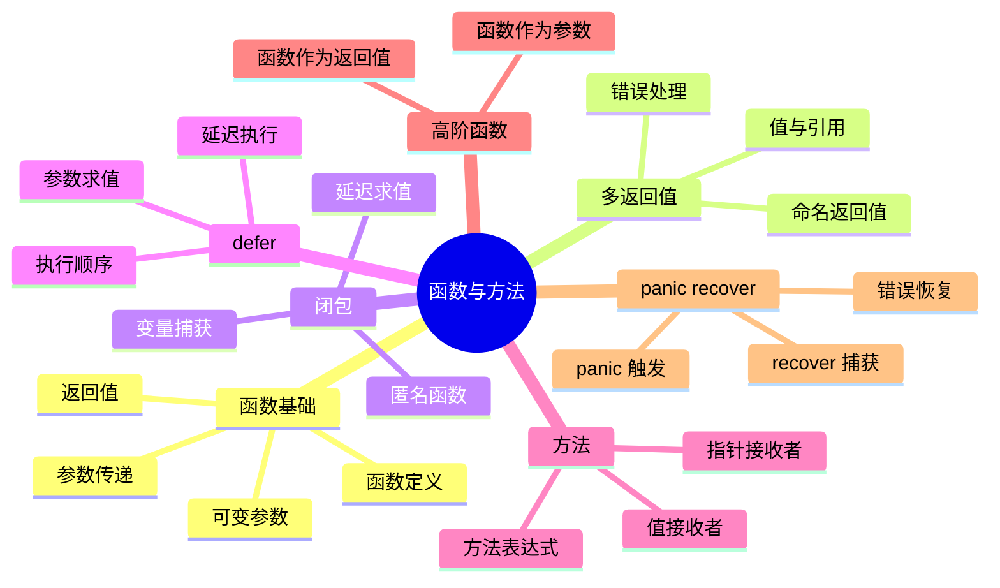
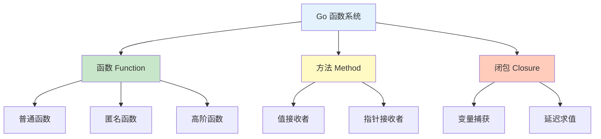
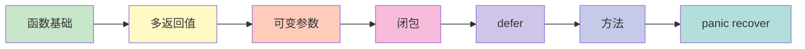

# 函数与方法

欢迎来到 Go 语言函数与方法章节！本章节将详细介绍 Go 的函数定义、方法绑定和高级特性。

## 章节导航



## 知识体系

### 函数概览



## 学习路线



## 快速预览

### 函数定义

```go
// 基本语法
func add(a, b int) int {
    return a + b
}

// 多返回值
func divide(a, b int) (int, error) {
    if b == 0 {
        return 0, fmt.Errorf("除数不能为零")
    }
    return a / b, nil
}
```

### 可变参数

```go
// 可变参数
func sum(nums ...int) int {
    total := 0
    for _, num := range nums {
        total += num
    }
    return total
}

sum(1, 2, 3)  // 6
sum(1, 2, 3, 4, 5)  // 15
```

### 闭包

```go
// 闭包函数
func makeAdder(x int) func(int) int {
    return func(y int) int {
        return x + y
    }
}

add10 := makeAdder(10)
add10(5)  // 15
```

### defer

```go
// 延迟执行
func process() {
    defer fmt.Println("最后执行")
    fmt.Println("首先执行")
}
// 输出：
// 首先执行
// 最后执行
```

### 方法

```go
type Counter struct {
    count int
}

// 指针接收者方法
func (c *Counter) Increment() {
    c.count++
}

// 值接收者方法
func (c Counter) Value() int {
    return c.count
}
```

## 核心概念

### 函数签名

```go
// 函数签名类型
type Operation func(int, int) int

func add(a, b int) int {
    return a + b
}

func apply(op Operation, a, b int) int {
    return op(a, b)
}

apply(add, 10, 20)  // 30
```

### 一等公民

```go
// 函数可以作为值
var f func(int) int
f = func(x int) int {
    return x * 2
}
f(5)  // 10

// 函数可以作为参数
func mapInts(nums []int, f func(int) int) []int {
    result := make([]int, len(nums))
    for i, num := range nums {
        result[i] = f(num)
    }
    return result
}

// 函数可以作为返回值
func makeMultiplier(factor int) func(int) int {
    return func(x int) int {
        return x * factor
    }
}
```

## 实践建议

::: tip 学习建议

1. **掌握基础** - 熟练掌握函数定义和调用
2. **理解多返回值** - Go 错误处理的基础
3. **正确使用 defer** - 资源清理的标准方式
4. **理解闭包** - 变量捕获和作用域
5. **方法选择** - 值接收者 vs 指针接收者

:::

## 学习检查

完成本章节学习后，您应该能够：

- [ ] 定义和使用各种形式的函数
- [ ] 熟练使用多返回值和错误处理
- [ ] 理解和运用可变参数
- [ ] 编写和使用闭包函数
- [ ] 正确使用 defer 延迟执行
- [ ] 为类型定义方法
- [ ] 使用 panic/recover 处理异常

## 下一步

让我们开始深入学习函数与方法的各个部分！

::: v-pre

[函数基础](./function-basics.md) → [多返回值](./multiple-return.md) → [可变参数](./variadic.md) → [闭包](./closures.md) → [defer](./defer.md) → [方法](./methods.md) → [panic recover](./panic-recover.md)

:::
