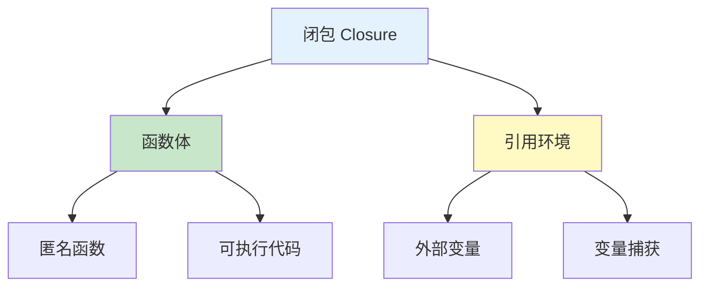

# 闭包

闭包是函数与其引用环境的组合，允许函数访问其定义作用域外的变量。

## 闭包基础

### 基本概念



```go
// 闭包：函数引用外部变量
func makeAdder(x int) func(int) int {
    // 返回的函数捕获了 x
    return func(y int) int {
        return x + y
    }
}

add10 := makeAdder(10)
add20 := makeAdder(20)

fmt.Println(add10(5))  // 15 (10 + 5)
fmt.Println(add20(5))  // 25 (20 + 5)

// 每个闭包有自己独立的 x
```

### 变量捕获

```go
// 捕获局部变量
func counter() func() int {
    count := 0
    return func() int {
        count++
        return count
    }
}

c1 := counter()
fmt.Println(c1())  // 1
fmt.Println(c1())  // 2
fmt.Println(c1())  // 3

c2 := counter()
fmt.Println(c2())  // 1（独立的 count）
fmt.Println(c1())  // 4（c1 继续计数）
```

## 闭包特性

### 变量生命周期延长

```go
// 局部变量在函数返回后仍然存在
func createMultiplier(factor int) func(int) int {
    // factor 被闭包捕获，生命周期延长
    return func(x int) int {
        return x * factor
    }
}

times3 := createMultiplier(3)
times10 := createMultiplier(10)

fmt.Println(times3(5))   // 15
fmt.Println(times10(5))   // 50

// 即使 createMultiplier 已返回，factor 仍然存在
```

### 捕获变量 vs 捕获值

```go
// 捕获变量（引用）
func accumulator() func(int) int {
    sum := 0
    return func(x int) int {
        sum += x
        return sum
    }
}

acc := accumulator()
fmt.Println(acc(1))  // 1
fmt.Println(acc(2))  // 3
fmt.Println(acc(3))  // 6

// 循环变量捕获陷阱
// ❌ 错误：所有 goroutine 共享同一个变量
for i := 0; i < 3; i++ {
    go func() {
        fmt.Println(i)  // 可能输出 3, 3, 3
    }()
}

// ✅ 正确：传递变量副本
for i := 0; i < 3; i++ {
    go func(n int) {
        fmt.Println(n)  // 输出 0, 1, 2
    }(i)
}

// 或使用闭包参数
for i := 0; i < 3; i++ {
    i := i  // 创建新变量
    go func() {
        fmt.Println(i)
    }()
}
```

## 闭包应用

### 函数工厂

```go
// 创建不同比较函数
func makeComparator(comparator string) func(int, int) bool {
    switch comparator {
    case ">":
        return func(a, b int) bool { return a > b }
    case "<":
        return func(a, b int) bool { return a < b }
    case "==":
        return func(a, b int) bool { return a == b }
    default:
        return func(a, b int) bool { return false }
    }
}

greaterThan := makeComparator(">")
fmt.Println(greaterThan(5, 3))  // true

lessThan := makeComparator("<")
fmt.Println(lessThan(5, 3))     // false
```

### 数据过滤

```go
// 创建过滤函数
func makeFilter(predicate func(int) bool) func([]int) []int {
    return func(nums []int) []int {
        result := []int{}
        for _, num := range nums {
            if predicate(num) {
                result = append(result, num)
            }
        }
        return result
    }
}

// 使用
isEven := func(n int) bool { return n%2 == 0 }
isPositive := func(n int) bool { return n > 0 }

filterEven := makeFilter(isEven)
filterPositive := makeFilter(isPositive)

nums := []int{-2, -1, 0, 1, 2, 3, 4}
fmt.Println(filterEven(nums))      // [0 2 4]
fmt.Println(filterPositive(nums))  // [1 2 3 4]
```

### 装饰器模式

```go
// 函数装饰器
func withLogging(fn func(int) int) func(int) int {
    return func(x int) int {
        fmt.Printf("Input: %d\n", x)
        result := fn(x)
        fmt.Printf("Output: %d\n", result)
        return result
    }
}

func square(x int) int {
    return x * x
}

// 使用装饰器
loggedSquare := withLogging(square)
loggedSquare(5)
// Input: 5
// Output: 25

// 多层装饰
func withTiming(fn func(int) int) func(int) int {
    return func(x int) int {
        start := time.Now()
        result := fn(x)
        duration := time.Since(start)
        fmt.Printf(" took %v\n", duration)
        return result
    }
}

decorated := withTiming(withLogging(square))
decorated(5)
// Input: 5
// Output: 25
//  took xxx
```

### 延迟计算

```go
// 生成器模式
func sequenceGenerator() func() int {
    i := 0
    return func() int {
        i++
        return i
    }
}

next := sequenceGenerator()
fmt.Println(next())  // 1
fmt.Println(next())  // 2
fmt.Println(next())  // 3

// 斐波那契生成器
func fibonacciGenerator() func() int {
    a, b := 0, 1
    return func() int {
        result := a
        a, b = b, a+b
        return result
    }
}

fib := fibonacciGenerator()
for i := 0; i < 10; i++ {
    fmt.Print(fib(), " ")
}
// 0 1 1 2 3 5 8 13 21 34
```

## 闭包陷阱

### 循环变量问题

```go
// ❌ 常见错误
funcs := []func(){}
for i := 0; i < 3; i++ {
    funcs = append(funcs, func() {
        fmt.Println(i)  // 所有函数共享同一个 i
    })
}

for _, f := range funcs {
    f()  // 输出: 3, 3, 3
}

// ✅ 解决方案 1：传递参数
funcs = []func(){}
for i := 0; i < 3; i++ {
    i := i  // 创建新变量（Go 1.22+ 不需要）
    funcs = append(funcs, func() {
        fmt.Println(i)
    })
}

for _, f := range funcs {
    f()  // 输出: 0, 1, 2
}

// ✅ 解决方案 2：作为参数传递
for i := 0; i < 3; i++ {
    funcs = append(funcs, func(n int) func() {
        return func() {
            fmt.Println(n)
        }
    }(i))
}
```

### defer 闭包

```go
// defer 捕获变量
func example() {
    x := 10
    defer func() {
        fmt.Println(x)  // 输出: 20（defer 执行时的值）
    }()
    x = 20
}
example()

// defer 的参数立即求值
func example2() {
    x := 10
    defer fmt.Println(x)  // 输出: 10（参数立即求值）
    x = 20
}
example2()

// 闭包参数
func example3() {
    x := 10
    defer func(n int) {
        fmt.Println(n)  // 输出: 10
    }(x)
    x = 20
}
example3()
```

## 实战示例

### 请求中间件

```go
type Middleware func(http.Handler) http.Handler

func withAuth(authToken string) Middleware {
    return func(next http.Handler) http.Handler {
        return http.HandlerFunc(func(w http.ResponseWriter, r *http.Request) {
            token := r.Header.Get("Authorization")
            if token != authToken {
                http.Error(w, "Unauthorized", http.StatusUnauthorized)
                return
            }
            next.ServeHTTP(w, r)
        })
    }
}

func withLogging(next http.Handler) http.Handler {
    return http.HandlerFunc(func(w http.ResponseWriter, r *http.Request) {
        start := time.Now()
        log.Printf("Started %s %s", r.Method, r.URL.Path)
        next.ServeHTTP(w, r)
        log.Printf("Completed in %v", time.Since(start))
    })
}

// 使用中间件
handler := http.HandlerFunc(func(w http.ResponseWriter, r *http.Request) {
    fmt.Fprintf(w, "Hello, World!")
})

wrapped := withLogging(withAuth("secret-token")(handler))
```

### 缓存装饰器

```go
func memoize(fn func(int) int) func(int) int {
    cache := make(map[int]int)
    return func(x int) int {
        if val, ok := cache[x]; ok {
            return val
        }
        result := fn(x)
        cache[x] = result
        return result
    }
}

func expensiveCalculation(n int) int {
    fmt.Printf("Calculating for %d\n", n)
    time.Sleep(100 * time.Millisecond)
    return n * n
}

cachedCalc := memoize(expensiveCalculation)
fmt.Println(cachedCalc(5))  // 第一次：执行计算
fmt.Println(cachedCalc(5))  // 第二次：从缓存读取
fmt.Println(cachedCalc(5))  // 第三次：从缓存读取
```

### 回调管理

```go
type EventEmitter struct {
    listeners map[string][]func(interface{})
}

func NewEventEmitter() *EventEmitter {
    return &EventEmitter{
        listeners: make(map[string][]func(interface{})),
    }
}

func (e *EventEmitter) On(event string, callback func(interface{})) {
    e.listeners[event] = append(e.listeners[event], callback)
}

func (e *EventEmitter) Emit(event string, data interface{}) {
    if callbacks, ok := e.listeners[event]; ok {
        for _, callback := range callbacks {
            go callback(data)  // 异步调用
        }
    }
}

// 使用
emitter := NewEventEmitter()
emitter.On("data", func(data interface{}) {
    fmt.Println("Received:", data)
})
emitter.Emit("data", "Hello")
```

## 最佳实践

::: tip 使用建议

1. **注意循环变量** - Go 1.22+ 自动处理，旧版本需要手动创建新变量
2. **避免内存泄漏** - 闭包会延长变量生命周期
3. **清晰命名** - 闭包参数应该有清晰的名称
4. **适度使用** - 不要过度使用闭包，影响可读性
5. **理解捕获** - 理解是捕获引用还是值

:::

## 总结

| 概念 | 关键点 |
|------|--------|
| **定义** | 函数 + 引用的外部变量 |
| **变量捕获** | 捕获变量的引用，不是值 |
| **生命周期** | 闭包延长了变量的生命周期 |
| **循环变量** - 注意循环变量捕获问题 |
| **应用** | 函数工厂、装饰器、中间件 |

::: v-pre

[可变参数](./variadic.md) → [defer](./defer.md)

:::
