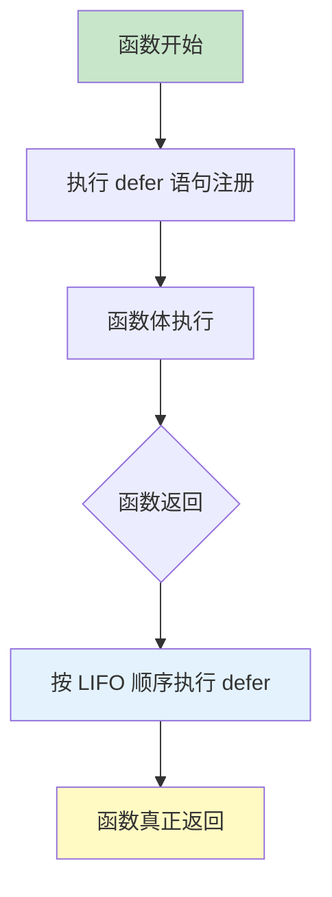

# defer 延迟执行

defer 语句用于延迟函数的执行，直到包含它的函数返回前才执行。

## defer 基础

### 基本语法

```go
// defer 延迟执行到函数返回前
func example() {
    defer fmt.Println("最后执行")
    fmt.Println("首先执行")
    fmt.Println("中间执行")
}

example()
// 输出：
// 首先执行
// 中间执行
// 最后执行

// 多个 defer：后进先出（LIFO）
func multipleDefer() {
    defer fmt.Println("1")
    defer fmt.Println("2")
    defer fmt.Println("3")
    fmt.Println("开始")
}

multipleDefer()
// 输出：
// 开始
// 3
// 2
// 1
```

### defer 执行时机



```go
// defer 的执行时机
func detailed() (result int) {
    // 1. 注册 defer（此时参数已求值）
    defer func() {
        fmt.Println("defer1:", result)
    }()

    result = 10

    // 2. 注册第二个 defer
    defer func() {
        fmt.Println("defer2:", result)
    }()

    result = 20

    // 3. 函数返回前执行 defer
    // defer2: 20（先执行后注册的）
    // defer1: 20
    return result
}

detailed()
// defer2: 20
// defer1: 20
```

## 参数求值

### 立即求值

```go
// defer 的参数在注册时立即求值
func immediateEvaluation() {
    x := 10
    // x 的值在 defer 注册时确定
    defer fmt.Println("x =", x)

    x = 20
    fmt.Println("x changed to", x)
}

immediateEvaluation()
// x changed to 20
// x = 10（defer 使用注册时的值）
```

### 闭包捕获

```go
// 使用闭包捕获变量的当前值
func closureCapture() {
    x := 10
    // 闭包捕获变量引用
    defer func() {
        fmt.Println("x =", x)
    }()

    x = 20
    fmt.Println("x changed to", x)
}

closureCapture()
// x changed to 20
// x = 20（闭包捕获变量引用，使用执行时的值）
```

## 常见用途

### 资源清理

```go
// 文件关闭
func readFile(filename string) error {
    file, err := os.Open(filename)
    if err != nil {
        return err
    }
    // 确保文件被关闭
    defer file.Close()

    // 处理文件
    // ...

    return nil
}

// 即使发生 panic 也会执行
func safeRead(filename string) (err error) {
    file, err := os.Open(filename)
    if err != nil {
        return err
    }
    defer file.Close()

    // 可能发生 panic 的代码
    // ...

    return nil
}
```

### 互斥锁释放

```go
type SafeCounter struct {
    mu    sync.Mutex
    count map[string]int
}

func (c *SafeCounter) Increment(key string) {
    c.mu.Lock()
    // 确保解锁
    defer c.mu.Unlock()

    c.count[key]++
}

// 即使发生 panic 也会解锁
func (c *SafeCounter) Value(key string) int {
    c.mu.Lock()
    defer c.mu.Unlock()

    return c.count[key]
}
```

### 恢复 panic

```go
// 使用 defer recover 捕获 panic
func safeOperation() (err error) {
    defer func() {
        if r := recover(); r != nil {
            err = fmt.Errorf("panic recovered: %v", r)
        }
    }()

    // 可能 panic 的代码
    panic("something went wrong")

    return nil
}

err := safeOperation()
fmt.Println(err)  // panic recovered: something went wrong
```

### 记录执行时间

```go
// 记录函数执行时间
func timedOperation(name string) {
    defer func() {
        fmt.Printf("%s completed\n", name)
    }()

    start := time.Now()
    defer func() {
        fmt.Printf("took %v\n", time.Since(start))
    }()

    // 操作
    time.Sleep(100 * time.Millisecond)
}

timedOperation("operation")
// operation completed
// took 100ms
```

### 修改返回值

```go
// 使用命名返回值 + defer 修改返回值
func example() (result int) {
    defer func() {
        result *= 2  // 返回前修改返回值
    }()

    result = 10
    return result  // 实际返回 20
}

fmt.Println(example())  // 20

// 实际应用：追踪函数调用
func trace(name string) func() {
    start := time.Now()
    fmt.Printf("enter %s\n", name)

    return func() {
        fmt.Printf("exit %s (took %v)\n", name, time.Since(start))
    }
}

func process() (result int) {
    defer trace("process")()
    result = 42
    return result
}
```

## defer 注意事项

### 循环中的 defer

```go
// ❌ 错误：循环中的 defer 会累积到函数返回
func processFiles(filenames []string) error {
    for _, filename := range filenames {
        file, err := os.Open(filename)
        if err != nil {
            return err
        }
        defer file.Close()  // 所有文件等到函数结束才关闭

        // 处理文件...
    }
    // 所有文件同时打开，可能耗尽文件描述符
    return nil
}

// ✅ 正确：使用匿名函数限制 defer 作用域
func processFiles(filenames []string) error {
    for _, filename := range filenames {
        if err := func() error {
            file, err := os.Open(filename)
            if err != nil {
                return err
            }
            defer file.Close()  // 每次循环结束就关闭

            // 处理文件...
            return nil
        }(); err != nil {
            return err
        }
    }
    return nil
}
```

### defer 与返回值

```go
// 命名返回值可以被 defer 修改
func returnNamed() (result int) {
    defer func() {
        result += 10
    }()
    return 5  // 返回 15
}

// 非命名返回值不能被修改
func returnUnnamed() int {
    result := 5
    defer func() {
        result += 10  // 无效
    }()
    return result  // 返回 5
}

// defer 可以修改命名的 error 返回值
func process() (err error) {
    defer func() {
        if r := recover(); r != nil {
            err = fmt.Errorf("panic: %v", r)
        }
    }()

    // 可能 panic 的代码
    return nil
}
```

## 实战示例

### 数据库事务

```go
func (db *DB) TransferMoney(from, to int, amount float64) error {
    // 开始事务
    tx, err := db.Begin()
    if err != nil {
        return err
    }

    // 确保事务处理
    defer func() {
        if p := recover(); p != nil {
            // 发生 panic，回滚
            tx.Rollback()
            panic(p)  // 重新抛出
        } else if err != nil {
            // 发生错误，回滚
            tx.Rollback()
        } else {
            // 成功，提交
            err = tx.Commit()
        }
    }()

    // 执行转账操作
    if _, err = tx.Exec("UPDATE accounts SET balance = balance - ? WHERE id = ?", amount, from); err != nil {
        return err
    }

    if _, err = tx.Exec("UPDATE accounts SET balance = balance + ? WHERE id = ?", amount, to); err != nil {
        return err
    }

    return nil
}
```

### HTTP 响应处理

```go
func handleRequest(w http.ResponseWriter, r *http.Request) {
    // 设置响应头
    w.Header().Set("Content-Type", "application/json")

    // 记录响应状态
    var status int
    defer func() {
        log.Printf("Response status: %d", status)
    }()

    // 处理请求
    data, err := processRequest(r)
    if err != nil {
        status = http.StatusBadRequest
        http.Error(w, err.Error(), status)
        return
    }

    status = http.StatusOK
    json.NewEncoder(w).Encode(data)
}
```

### 资源追踪

```go
type ResourceTracker struct {
    resources []string
    mu        sync.Mutex
}

func (rt *ResourceTracker) Acquire(name string) func() {
    rt.mu.Lock()
    rt.resources = append(rt.resources, name)
    rt.mu.Unlock()

    // 返回释放函数
    return func() {
        rt.mu.Lock()
        defer rt.mu.Unlock()

        for i, r := range rt.resources {
            if r == name {
                rt.resources = append(rt.resources[:i], rt.resources[i+1:]...)
                break
            }
        }
    }
}

func (rt *ResourceTracker) List() []string {
    rt.mu.Lock()
    defer rt.mu.Unlock()

    result := make([]string, len(rt.resources))
    copy(result, rt.resources)
    return result
}

// 使用
tracker := &ResourceTracker{}
defer tracker.Acquire("resource1")()
defer tracker.Acquire("resource2")()
```

## 最佳实践

::: tip 使用建议

1. **及时释放** - 资源获取后立即 defer 释放
2. **避免循环 defer** - 在循环中使用匿名函数
3. **理解求值** - 区分参数求值和闭包捕获
4. **LIFO 顺序** - 记住 defer 是后进先出
5. **适度使用** - 不要过度使用 defer

:::

```go
// ✅ 好的模式
func processFile(path string) error {
    f, err := os.Open(path)
    if err != nil {
        return err
    }
    defer f.Close()  // 紧跟资源获取

    // 处理文件
    return nil
}

// ❌ 避免
func processFile(path string) error {
    f, err := os.Open(path)
    if err != nil {
        return err
    }

    // 大量代码...

    defer f.Close()  // defer 距离资源获取太远

    // 更多代码...
    return nil
}
```

## 总结

| 概念 | 关键点 |
|------|--------|
| **执行时机** | 函数返回前 |
| **执行顺序** | 后进先出（LIFO） |
| **参数求值** | 注册时立即求值 |
| **闭包** | 捕获变量引用 |
| **主要用途** | 资源清理、解锁、恢复 panic |

::: v-pre

[闭包](./closures.md) → [方法](./methods.md)

:::
