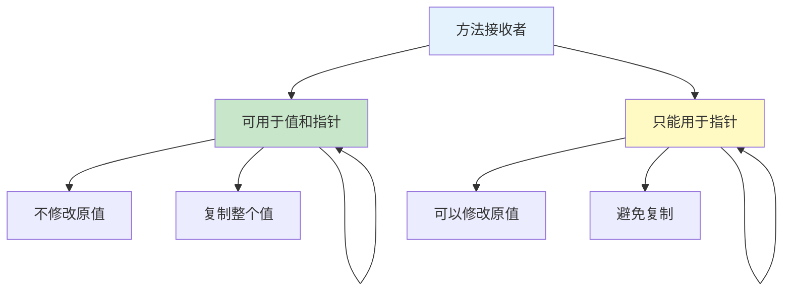

# 方法

方法是绑定到特定类型的函数，允许通过类型实例调用函数。

## 方法基础

### 定义方法

```go
// 类型定义
type Rectangle struct {
    Width, Height float64
}

// 定义方法（值接收者）
func (r Rectangle) Area() float64 {
    return r.Width * r.Height
}

// 定义方法（指针接收者）
func (r *Rectangle) Scale(factor float64) {
    r.Width *= factor
    r.Height *= factor
}

func main() {
    // 创建实例
    rect := Rectangle{Width: 10, Height: 5}

    // 调用方法
    area := rect.Area()  // 50
    fmt.Println(area)

    // 修改方法需要指针
    rect.Scale(2)
    fmt.Println(rect)  // {20 10}
}
```

### 接收者类型



```go
type Counter struct {
    count int
}

// 值接收者：不能修改原结构体
func (c Counter) Value() int {
    return c.count
}

// 指针接收者：可以修改原结构体
func (c *Counter) Increment() {
    c.count++
}

// 使用
counter := Counter{count: 0}

// 值接收者方法
val := counter.Value()  // 0

// 指针接收者方法
counter.Increment()
fmt.Println(counter.Value())  // 1

// 通过指针调用（自动取地址）
ptr := &counter
ptr.Increment()
fmt.Println(counter.Value())  // 2
```

## 值接收者 vs 指针接收者

### 选择指南

```go
// 值接收者适用场景
func (p Point) String() string {
    return fmt.Sprintf("(%d, %d)", p.X, p.Y)
}

// 1. 不需要修改接收者
func (r Rectangle) Area() float64 {
    return r.Width * r.Height
}

// 2. 小结构体（复制开销小）
type Point struct {
    X, Y int
}

// 3. 基本类型
type MyInt int
func (m MyInt) Double() MyInt {
    return m * 2
}

// 指针接收者适用场景
func (c *Counter) Increment() {
    c.count++
}

// 1. 需要修改接收者
func (c *Config) SetDebug(debug bool) {
    c.Debug = debug
}

// 2. 大结构体（避免复制）
type LargeStruct struct {
    data [1024]int
}

func (ls *LargeStruct) Process() {
    // 处理逻辑
}

// 3. 一致性：如果有指针接收者方法，其他方法也用指针
type MyType struct {
    value int
}

func (m *MyType) SetValue(v int) {
    m.value = v
}

func (m *MyType) GetValue() int {
    return m.value  // 保持一致
}
```

### 混合使用

```go
type Counter struct {
    count int
}

// 值接收者：读取
func (c Counter) Count() int {
    return c.count
}

// 指针接收者：修改
func (c *Counter) SetCount(count int) {
    c.count = count
}

func (c *Counter) Increment() {
    c.count++
}

func main() {
    counter := Counter{count: 0}

    // 值接收者可以从值或指针调用
    fmt.Println(counter.Count())  // 0
    fmt.Println((&counter).Count())  // 0

    // 指针接收者自动解引用
    counter.Increment()  // 自动取地址
    fmt.Println(counter.Count())  // 1
}
```

## 方法表达式与值

### 方法表达式

```go
type Rectangle struct {
    Width, Height float64
}

func (r Rectangle) Area() float64 {
    return r.Width * r.Height
}

// 方法表达式：函数值
areaFunc := Rectangle.Area
// 类型：func(Rectangle) float64

rect := Rectangle{Width: 10, Height: 5}

// 显式传递接收者
result := areaFunc(rect)
fmt.Println(result)  // 50

// 指针接收者方法表达式
func (r *Rectangle) Scale(factor float64) {
    r.Width *= factor
    r.Height *= factor
}

scaleFunc := (*Rectangle).Scale
// 类型：func(*Rectangle, float64)

scaleFunc(&rect, 2)
fmt.Println(rect)  // {20 10}
```

### 方法值

```go
// 方法值：绑定到接收者
rect := Rectangle{Width: 10, Height: 5}

// 方法值（隐式绑定接收者）
areaMethod := rect.Area
result := areaMethod()
fmt.Println(result)  // 50

// 指针方法值
scaleMethod := rect.Scale
scaleMethod(2)
fmt.Println(rect)  // {20 10}
```

## 方法与接口

### 实现接口

```go
type Speaker interface {
    Speak() string
}

type Dog struct {
    Name string
}

// 值接收者实现接口
func (d Dog) Speak() string {
    return "Woof!"
}

type Cat struct {
    Name string
}

// 指针接收者实现接口
func (c *Cat) Speak() string {
    return "Meow!"
}

func main() {
    // Dog 值和指针都可以
    var s1 Speaker = Dog{Name: "Buddy"}
    var s2 Speaker = &Dog{Name: "Max"}

    // Cat 只能使用指针
    var s3 Speaker = &Cat{Name: "Whiskers"}
    // var s4 Speaker = Cat{Name: "Whiskers"}  // ❌ 编译错误

    fmt.Println(s1.Speak())  // Woof!
    fmt.Println(s2.Speak())  // Woof!
    fmt.Println(s3.Speak())  // Meow!
}
```

### 空接口与方法

```go
type Printer interface {
    Print()
}

type MyType struct {
    Value int
}

func (m MyType) Print() {
    fmt.Println(m.Value)
}

func printAny(p interface{}) {
    // 需要类型断言
    if printer, ok := p.(Printer); ok {
        printer.Print()
    } else {
        fmt.Println("Not a printer")
    }
}

func main() {
    m := MyType{Value: 42}
    printAny(m)  // 42
    printAny("string")  // Not a printer
}
```

## 特殊类型的方法

### 基本类型

```go
// 为基本类型定义别名
type MyInt int

// 为别名定义方法
func (m MyInt) Double() MyInt {
    return m * 2
}

func (m MyInt) String() string {
    return strconv.Itoa(int(m))
}

func main() {
    var x MyInt = 10
    fmt.Println(x.Double())  // 20
    fmt.Println(x.String())  // "10"
}
```

### 切片方法

```go
type IntSlice []int

// 为切片定义方法
func (s IntSlice) Sum() int {
    total := 0
    for _, v := range s {
        total += v
    }
    return total
}

func (s *IntSlice) Append(values ...int) {
    *s = append(*s, values...)
}

func main() {
    nums := IntSlice{1, 2, 3, 4, 5}
    fmt.Println(nums.Sum())  // 15

    nums.Append(6, 7, 8)
    fmt.Println(nums.Sum())  // 36
}
```

### map 方法

```go
type StringMap map[string]string

func (sm StringMap) Get(key string) string {
    return sm[key]
}

func (sm *StringMap) Set(key, value string) {
    if *sm == nil {
        *sm = make(map[string]string)
    }
    (*sm)[key] = value
}

func main() {
    m := make(StringMap)
    m.Set("name", "Alice")
    fmt.Println(m.Get("name"))  // Alice
}
```

## 方法集

### 方法集规则

```go
// T 类型的方法集包含所有接收者为 T 的方法
// *T 类型的方法集包含所有接收者为 T 和 *T 的方法

type T struct {
    value int
}

func (t T) Method1() int {
    return t.value
}

func (t *T) Method2() {
    t.value = 100
}

// T 的方法集：Method1
// *T 的方法集：Method1, Method2

// 接口实现规则
type Interface1 interface {
    Method1() int
}

type Interface2 interface {
    Method2()
}

// T 实现 Interface1
// *T 实现 Interface1 和 Interface2
```

### 方法集与接口

```go
type Interface interface {
    ValueMethod()
    PointerMethod()
}

type MyType struct {
    data int
}

func (m MyType) ValueMethod() {
    fmt.Println("value method")
}

func (m *MyType) PointerMethod() {
    fmt.Println("pointer method")
}

// MyType 不实现 Interface（缺少 PointerMethod）
// *MyType 实现 Interface

func useInterface(i Interface) {
    i.ValueMethod()
    i.PointerMethod()
}

func main() {
    m := MyType{data: 42}
    useInterface(&m)  // ✅ 使用指针

    // useInterface(m)  // ❌ 值不实现接口
}
```

## 实战示例

### Builder 模式

```go
type SQLBuilder struct {
    query string
}

func NewSQLBuilder() *SQLBuilder {
    return &SQLBuilder{}
}

func (b *SQLBuilder) Select(columns ...string) *SQLBuilder {
    b.query = "SELECT " + strings.Join(columns, ", ")
    return b
}

func (b *SQLBuilder) From(table string) *SQLBuilder {
    b.query += " FROM " + table
    return b
}

func (b *SQLBuilder) Where(condition string) *SQLBuilder {
    b.query += " WHERE " + condition
    return b
}

func (b *SQLBuilder) Build() string {
    return b.query
}

// 使用
query := NewSQLBuilder().
    Select("id", "name", "email").
    From("users").
    Where("age > 18").
    Build()
fmt.Println(query)
// SELECT id, name, email FROM users WHERE age > 18
```

### 链式调用

```go
type Validator struct {
    value string
    errors []string
}

func NewValidator(value string) *Validator {
    return &Validator{value: value}
}

func (v *Validator) NotEmpty() *Validator {
    if v.value == "" {
        v.errors = append(v.errors, "cannot be empty")
    }
    return v
}

func (v *Validator) MinLength(min int) *Validator {
    if len(v.value) < min {
        v.errors = append(v.errors,
            fmt.Sprintf("must be at least %d characters", min))
    }
    return v
}

func (v *Validator) Email() *Validator {
    if !strings.Contains(v.value, "@") {
        v.errors = append(v.errors, "must be a valid email")
    }
    return v
}

func (v *Validator) Validate() []string {
    return v.errors
}

// 使用
errors := NewValidator("test@example.com").
    NotEmpty().
    MinLength(5).
    Email().
    Validate()
```

## 最佳实践

::: tip 使用建议

1. **一致性** - 同类型的方法使用相同类型的接收者
2. **指针优先** - 需要修改时必须用指针接收者
3. **考虑大小** - 大结构体优先使用指针接收者
4. **接口实现** - 注意接口方法集的规则
5. **方法命名** - 使用清晰的命名，避免冗余

:::

```go
// ✅ 好的命名
type User struct {
    Name string
    Age  int
}

func (u *User) SetName(name string) {
    u.Name = name
}

func (u *User) GetAge() int {
    return u.Age
}

// ❌ 冗余命名
func (u *User) UserName() string {  // 不必要的前缀
    return u.Name
}
```

## 总结

| 概念 | 关键点 |
|------|--------|
| **值接收者** | 不修改原值，可用在值和指针 |
| **指针接收者** | 可修改原值，只能用在指针 |
| **方法表达式** | 函数值，显式传递接收者 |
| **方法值** | 绑定接收者 |
| **方法集** | T 包含 T 的方法，*T 包含 T 和 *T 的方法 |

::: v-pre

[defer](./defer.md) → [panic recover](./panic-recover.md)

:::
