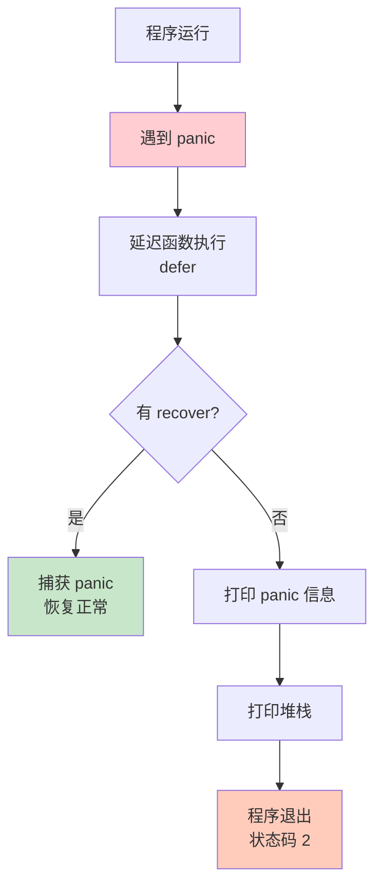
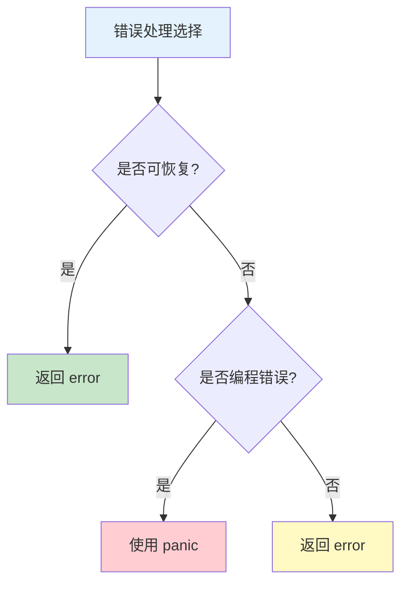

# panic 和 recover

panic 和 recover 是 Go 的异常处理机制，用于处理运行时错误和恢复。

## panic 基础

### 触发 panic

```go
// 内置 panic
func example1() {
    panic("something went wrong")
}

// 数组越界会 panic
func example2() {
    arr := [3]int{1, 2, 3}
    fmt.Println(arr[10])  // panic: index out of range
}

// 空指针解引用会 panic
func example3() {
    var p *int
    fmt.Println(*p)  // panic: nil pointer dereference
}

// 向关闭的 channel 发送会 panic
func example4() {
    ch := make(chan int)
    close(ch)
    ch <- 1  // panic: send on closed channel
}
```

### panic 流程



```go
func demonstratePanic() {
    fmt.Println("1. 开始")

    // defer 会在 panic 时执行
    defer func() {
        fmt.Println("3. defer 执行")
    }()

    fmt.Println("2. 触发 panic")
    panic("出现错误")

    // 下面的代码不会执行
    fmt.Println("4. 不会执行")
}

demonstratePanic()
// 输出：
// 1. 开始
// 2. 触发 panic
// 3. defer 执行
// panic: 出现错误
// ...堆栈信息...
```

## recover 基础

### 捕获 panic

```go
// recover 只能在 defer 函数中有效
func safeOperation() (err error) {
    defer func() {
        if r := recover(); r != nil {
            // 捕获 panic
            err = fmt.Errorf("panic recovered: %v", r)
        }
    }()

    // 可能 panic 的代码
    panic("something bad happened")

    return nil
}

err := safeOperation()
fmt.Println(err)  // panic recovered: something bad happened
```

### recover 返回值

```go
func recoverExample() {
    defer func() {
        switch r := recover(); r {
        case nil:
            fmt.Println("没有 panic")
        case int:
            fmt.Printf("捕获 int panic: %v\n", r)
        case string:
            fmt.Printf("捕获 string panic: %v\n", r)
        default:
            fmt.Printf("捕获其他类型 panic: %v\n", r)
        }
    }()

    panic(42)  // 尝试不同类型
}

recoverExample()
// 捕获 int panic: 42
```

## panic 使用场景

### 不可恢复的错误

```go
// 程序初始化失败
func initConfig() {
    config, err := loadConfig()
    if err != nil {
        panic(fmt.Sprintf("Failed to load config: %v", err))
        // 配置加载失败，程序无法继续运行
    }
}

// 不变式违反
func processArray(arr []int, index int) int {
    if index < 0 || index >= len(arr) {
        panic(fmt.Sprintf("index %d out of bounds", index))
        // 这是编程错误，应该 panic
    }
    return arr[index]
}
```

### 开发阶段

```go
// TODO: 未实现的功能
func unimplemented() {
    panic("not implemented yet")
}

// 不应该到达的代码路径
func switchExample(value int) string {
    switch value {
    case 1:
        return "one"
    case 2:
        return "two"
    default:
        panic(fmt.Sprintf("unexpected value: %d", value))
    }
}
```

## recover 使用场景

### 服务器不崩溃

```go
// HTTP 服务器捕获 panic
func handler(w http.ResponseWriter, r *http.Request) {
    defer func() {
        if err := recover(); err != nil {
            log.Printf("Panic in handler: %v\n", err)
            debug.PrintStack()
            http.Error(w, "Internal Server Error", 500)
        }
    }()

    // 处理请求
    processRequest(r)
}

func processRequest(r *http.Request) {
    // 即使这里 panic，服务器也不会崩溃
    // 可能导致 panic 的代码
}
```

### Goroutine 恢复

```go
// goroutine 内部捕获 panic
func worker() {
    defer func() {
        if err := recover(); err != nil {
            log.Printf("Worker panic recovered: %v", err)
        }
    }()

    // 可能 panic 的工作
}

func main() {
    for i := 0; i < 10; i++ {
        go worker()
    }
    // 即使 worker panic，主程序继续运行
}
```

### 资源清理

```go
func withFile(filename string, fn func(*os.File) error) (err error) {
    file, err := os.Open(filename)
    if err != nil {
        return err
    }

    defer func() {
        if r := recover(); r != nil {
            err = fmt.Errorf("panic: %v", r)
        }
        file.Close()  // 确保文件关闭
    }()

    err = fn(file)
    return err
}

// 使用
err := withFile("data.txt", func(f *os.File) error {
    // 处理文件，可能 panic
    // ...
    return nil
})
```

## panic 最佳实践

### 何时使用 panic

```go
// ✅ 适合 panic 的场景

// 1. 程序初始化失败
func init() {
    essential := os.Getenv("ESSENTIAL_VAR")
    if essential == "" {
        panic("ESSENTIAL_VAR not set")
    }
}

// 2. 编程错误（不应该发生）
func divide(a, b int) int {
    if b == 0 {
        panic("division by zero")  // 这是编程错误
    }
    return a / b
}

// 3. 不变式违反
type State int

const (
    StateIdle State = iota
    StateRunning
)

func (s *State) Stop() {
    if *s != StateRunning {
        panic("can only stop from running state")
    }
    *s = StateIdle
}

// ❌ 不适合 panic 的场景

// 1. 可预期的错误
func readFile(path string) ([]byte, error) {
    // panic("file not found")  // ❌ 错误
    return nil, fmt.Errorf("file not found")  // ✅ 正确
}

// 2. 外部输入错误
func parseInput(input string) (int, error) {
    value, err := strconv.Atoi(input)
    if err != nil {
        // panic(err)  // ❌ 错误
        return 0, fmt.Errorf("invalid input: %w", err)  // ✅ 正确
    }
    return value, nil
}
```

### panic 与错误



```go
// 可恢复的错误 -> 返回 error
func connectDB(url string) (*DB, error) {
    if url == "" {
        return nil, fmt.Errorf("empty URL")
    }
    // 连接数据库
    return &DB{}, nil
}

// 不可恢复的编程错误 -> panic
func mustConnectDB(url string) *DB {
    db, err := connectDB(url)
    if err != nil {
        panic(err)  // 只在初始化时使用
    }
    return db
}

// 标准库的模式
var db = mustConnectDB(os.Getenv("DB_URL"))
```

## 实战示例

### Web 服务器

```go
func makeSafeHandler(fn http.HandlerFunc) http.HandlerFunc {
    return func(w http.ResponseWriter, r *http.Request) {
        defer func() {
            if err := recover(); err != nil {
                log.Printf("Panic: %v\n%s", err, debug.Stack())
                http.Error(w, "Internal Server Error", 500)
            }
        }()
        fn(w, r)
    }
}

func main() {
    http.HandleFunc("/", makeSafeHandler(func(w http.ResponseWriter, r *http.Request) {
        // 处理请求，即使 panic 也会被捕获
    }))
    http.ListenAndServe(":8080", nil)
}
```

### 工作池

```go
func worker(id int, jobs <-chan int, results chan<- int) {
    defer func() {
        if r := recover(); r != nil {
            log.Printf("Worker %d panic recovered: %v", id, r)
        }
    }()

    for job := range jobs {
        // 处理任务
        results <- job * 2
    }
}

func main() {
    jobs := make(chan int, 100)
    results := make(chan int, 100)

    // 启动工作 goroutine
    for i := 1; i <= 3; i++ {
        go worker(i, jobs, results)
    }

    // 发送任务
    for j := 1; j <= 5; j++ {
        jobs <- j
    }
    close(jobs)

    // 收集结果
    for i := 1; i <= 5; i++ {
        <-results
    }
}
```

## 注意事项

### recover 限制

```go
// recover 只能捕获当前 goroutine 的 panic
func main() {
    // ❌ 无法捕获子 goroutine 的 panic
    defer func() {
        recover()  // 无法捕获下面的 panic
    }()

    go func() {
        panic("goroutine panic")
    }()

    time.Sleep(time.Second)
}

// ✅ 在 goroutine 内部 recover
func main() {
    go func() {
        defer func() {
            if r := recover(); r != nil {
                log.Printf("Recovered: %v", r)
            }
        }()
        panic("goroutine panic")
    }()
    time.Sleep(time.Second)
}
```

### defer 与 panic

```go
// 多个 defer 的执行顺序
func example() {
    defer fmt.Println("1")
    defer fmt.Println("2")
    defer fmt.Println("3")

    panic("panic")
    // 输出：
    // 3
    // 2
    // 1
    // panic: panic
}

// defer 中修改 panic 值
func example2() {
    defer func() {
        if r := recover(); r != nil {
            panic(fmt.Sprintf("wrapped: %v", r))
        }
    }()

    panic("original error")
    // 输出：panic: wrapped: original error
}
```

## 最佳实践

::: tip 使用建议

1. **谨慎 panic** - 只用于真正不可恢复的错误
2. **总是 recover** - 在顶层或 goroutine 中 recover
3. **记录日志** - panic 时记录完整的堆栈信息
4. **清理资源** - 使用 defer 确保资源清理
5. **包装错误** - recover 后重新 panic 时添加上下文

:::

```go
// ✅ 好的模式
func safeOperation() (err error) {
    defer func() {
        if r := recover(); r != nil {
            // 记录完整堆栈
            log.Printf("Panic: %v\n%s", r, debug.Stack())
            // 包装为错误
            err = fmt.Errorf("operation failed: %v", r)
        }
    }()

    // 操作
    return nil
}

// ❌ 不好的模式
func badOperation() {
    // 无差别 recover
    defer recover()  // 吞掉了所有 panic
    panic("error")
}
```

## 总结

| 概念 | 关键点 |
|------|--------|
| **panic** | 用于不可恢复的错误 |
| **recover** | 只能在 defer 中使用 |
| **作用域** - 只捕获当前 goroutine 的 panic |
| **LIFO** - defer 后进先出执行 |
| **错误 vs panic** - 可预期错误用 error，编程错误用 panic |

::: v-pre

[方法](./methods.md) → [接口类型系统](/langs/go/04-interfaces/) →

:::
