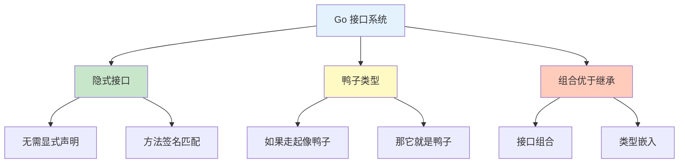
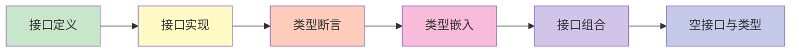

# 接口与类型系统

欢迎来到 Go 语言接口与类型系统章节！本章节将详细介绍 Go 的接口系统和鸭子类型。

## 章节导航

```mermaid
mindmap
  root((接口与类型系统))
    接口定义
      接口声明
      方法签名
      空接口
      标准库接口
    接口实现
      隐式实现
      值与指针
      接口组合
    类型断言
      Type Assertion
      Type Switch
      Comma Ok 模式
    类型嵌入
      匿名字段
      方法提升
      多重嵌入
    接口组合
      组合多个接口
      接口嵌套
      选择性实现
    空接口与类型
      interface{}
      类型查询
      反射基础
```

## 知识体系

### 接口概览



## 学习路线



## 快速预览

### 接口定义

```go
// 定义接口
type Speaker interface {
    Speak() string
}

// 实现（隐式）
type Dog struct {
    Name string
}

func (d Dog) Speak() string {
    return "Woof!"
}
```

### 接口使用

```go
// 使用接口
var s Speaker = Dog{Name: "Buddy"}
fmt.Println(s.Speak())  // Woof!

// 接口变量可以持有任何实现该接口的类型
s = Cat{Name: "Whiskers"}
fmt.Println(s.Speak())  // Meow!
```

### 类型断言

```go
// 类型断言
if dog, ok := s.(Dog); ok {
    fmt.Println(dog.Name)
}

// 类型 switch
switch v := s.(type) {
case Dog:
    fmt.Println("It's a dog")
case Cat:
    fmt.Println("It's a cat")
}
```

### 空接口

```go
// 空接口可以持有任何类型
var any interface{}
any = 42
any = "hello"
any = Dog{Name: "Buddy"}

// 类型查询
if v, ok := any.(int); ok {
    fmt.Println("Integer:", v)
}
```

## 核心概念

### 鸭子类型

```go
// "如果它走起像鸭子，叫起来像鸭子，那它就是鸭子"
// 不需要显式声明实现了接口

type Writer interface {
    Write([]byte) (int, error)
}

// File 实现了 Writer
func (f *File) Write(data []byte) (int, error) {
    // 写入文件
    return len(data), nil
}

// Buffer 实现了 Writer
func (b *Buffer) Write(data []byte) (int, error) {
    b.data = append(b.data, data...)
    return len(data), nil
}

// 两者都可用于需要 Writer 的地方
func writeTo(w Writer, data []byte) {
    w.Write(data)
}
```

### 接口组合

```go
// 基础接口
type Reader interface {
    Read(p []byte) (n int, err error)
}

type Writer interface {
    Write(p []byte) (n int, err error)
}

// 组合接口
type ReadWriter interface {
    Reader
    Writer
}

// ReadWriter 拥有 Read 和 Write 两个方法
```

## 实践建议

::: tip 学习建议

1. **理解鸭子类型** - Go 接口是隐式实现的
2. **小接口原则** - 接口应该小而专注
3. **接受接口返回结构体** - 函数参数用接口，返回具体类型
4. **避免空接口** - 优先使用具体接口
5. **组合优于继承** - 使用接口组合实现代码复用

:::

## 学习检查

完成本章节学习后，您应该能够：

- [ ] 定义和使用 Go 接口
- [ ] 理解隐式接口实现机制
- [ ] 正确使用类型断言和类型 switch
- [ ] 使用接口组合创建复杂接口
- [ ] 理解空接口的用途和限制
- [ ] 使用类型嵌入实现代码复用

## 下一步

让我们开始深入学习接口与类型系统的各个部分！

::: v-pre

[接口定义](./interface-definition.md) → [接口实现](./interface-implementation.md) → [类型断言](./type-assertion.md) → [类型嵌入](./type-embedding.md) → [接口组合](./interface-composition.md) → [空接口与类型](./interface-any.md)

:::
