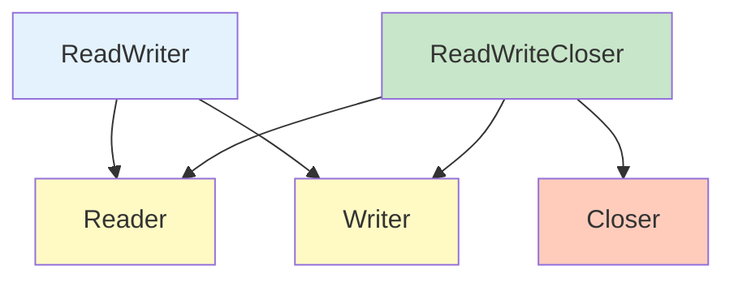

# 接口组合

接口组合通过嵌入多个接口，创建更复杂的新接口。

## 基本组合

### 嵌入接口

```go
// 定义基础接口
type Reader interface {
    Read(p []byte) (n int, err error)
}

type Writer interface {
    Write(p []byte) (n int, err error)
}

// 组合多个接口
type ReadWriter interface {
    Reader  // 嵌入 Reader
    Writer  // 嵌入 Writer
}

// ReadWriter 包含 Read 和 Write 两个方法
```

### 组合层次



```go
type Closer interface {
    Close() error
}

// 三层组合
type ReadWriteCloser interface {
    Reader
    Writer
    Closer
}

func useAll(rwc ReadWriteCloser) {
    rwc.Read(nil)
    rwc.Write(nil)
    rwc.Close()
}
```

## 接口组合模式

### 线性组合

```go
type Stringer interface {
    String() string
}

type Logger interface {
    Log(msg string)
}

type LoggerWriter interface {
    Stringer
    Writer
    Logger
}

// LoggerWriter 拥有 String、Write 和 Log 三个方法
```

### 选择性组合

```go
type ReadCloser interface {
    Reader
    Closer
}

type WriteCloser interface {
    Writer
    Closer
}

// 需要读写的接口
type ReadWriteCloser interface {
    Reader
    Writer
    Closer
}
```

### 扩展接口

```go
// 基础接口
type Scanner interface {
    Scan() error
}

// 扩展接口
type AdvancedScanner interface {
    Scanner
    ScanBytes() ([]byte, error)
    ScanString() (string, error)
}

func useAdvanced(s AdvancedScanner) {
    s.Scan()
    data, _ := s.ScanBytes()
    str, _ := s.ScanString()
    _ = data
    _ = str
}
```

## 标准库组合

### io 包

```go
// io 包中的接口组合
type ReadWriter interface {
    Reader
    Writer
}

type ReadCloser interface {
    Reader
    Closer
}

type WriteCloser interface {
    Writer
    Closer
}

type ReadWriteCloser interface {
    Reader
    Writer
    Closer
}
```

### 自定义组合

```go
type Validator interface {
    Validate() error
}

type Persister interface {
    Save() error
}

type Repository interface {
    Validator
    Persister
}

func (r *Repository) Save() error {
    if err := r.Validate(); err != nil {
        return err
    }
    // 保存逻辑
    return nil
}
```

## 接口组合规则

### 方法唯一性

```go
type Reader interface {
    Read(p []byte) (n int, err error)
}

type BinaryReader interface {
    Read(p []byte) (n int, err error)
}

type CombinedReader interface {
    Reader
    BinaryReader
}

// ✅ 相同方法签名，只出现一次

// 不同签名会冲突
type Writer interface {
    Write(p []byte) (n int, err error)
}

type TextWriter interface {
    Write(s string) (n int, err error)
}

// ❌ 不能同时嵌入（Write 方法签名不同）
// type Bad interface {
//     Writer
//     TextWriter
// }
```

### 命名冲突

```go
type A interface {
    Method()
}

type B interface {
    Method()
}

type C interface {
    A
    B
}

// ✅ A 和 B 有相同的 Method，C 只有一个 Method

type D interface {
    A
    B
    DifferentMethod()
}
```

## 组合 vs 继承

### 组合的优势

```go
// 小接口，易于实现
type Reader interface {
    Read(p []byte) (n int, err error)
}

type Writer interface {
    Write(p []byte) (n int, err error)
}

type Flusher interface {
    Flush() error
}

// 按需组合
type WriteFlusher interface {
    Writer
    Flusher
}

type ReadWriteFlusher interface {
    Reader
    Writer
    Flusher
}
```

### 灵活组合

```go
// 定义小而专注的接口
type Stringer interface {
    String() string
}

type Logger interface {
    Log(level string, msg string)
}

type ErrorHandler interface {
    Handle(err error)
}

// 根据需要组合
type LoggerWithErrorHandler interface {
    Logger
    ErrorHandler
}

type StringLogger interface {
    Stringer
    Logger
}
```

## 实战示例

### 文件操作

```go
// 定义文件操作接口
type FileReader interface {
    io.Reader
    io.Seeker
    io.Closer
}

type FileWriter interface {
    io.Writer
    io.Closer
}

type File interface {
    FileReader
    FileWriter
}

func processFile(f File) error {
    // 可以使用 Read、Write、Seek、Close
    if _, err := f.Seek(0, io.SeekStart); err != nil {
        return err
    }

    data := make([]byte, 1024)
    if _, err := f.Read(data); err != nil {
        return err
    }

    if _, err := f.Write(data); err != nil {
        return err
    }

    return f.Close()
}
```

### HTTP 中间件

```go
type Handler interface {
    ServeHTTP(w http.ResponseWriter, r *http.Request)
}

type Middleware interface {
    Wrap(next Handler) Handler
}

type AuthMiddleware struct{}

func (am *AuthMiddleware) Wrap(next Handler) Handler {
    return HandlerFunc(func(w http.ResponseWriter, r *http.Request) {
        // 认证逻辑
        next.ServeHTTP(w, r)
    })
}

type LoggingMiddleware struct{}

func (lm *LoggingMiddleware) Wrap(next Handler) Handler {
    return HandlerFunc(func(w http.ResponseWriter, r *http.Request) {
        log.Printf("Request: %s %s", r.Method, r.URL)
        next.ServeHTTP(w, r)
    })
}
```

## 接口组合模式

### 装饰器模式

```go
type Component interface {
    Operation() string
}

type ConcreteComponent struct{}

func (cc *ConcreteComponent) Operation() string {
    return "ConcreteComponent"
}

type Decorator interface {
    Component
}

type ConcreteDecorator struct {
    component Component
}

func (cd *ConcreteDecorator) Operation() string {
    return "ConcreteDecorator(" + cd.component.Operation() + ")"
}
```

### 适配器模式

```go
type USB interface {
    Connect()
}

type TypeC struct{}

func (tc *TypeC) Connect() {
    fmt.Println("Type-C connected")
}

type USBAdapter struct {
    usb USB
}

func (ua *USBAdapter) Connect() {
    // 适配逻辑
    ua.usb.Connect()
}
```

## 最佳实践

::: tip 设计建议

1. **小接口** - 保持接口小而专注
2. **按需组合** - 根据需要组合接口
3. **避免冗余** - 不要在接口中重复方法
4. **语义清晰** - 组合后的接口应有清晰语义
5. **文档说明** - 为组合接口添加文档

:::

```go
// ✅ 好的接口设计
type Reader interface {
    Read(p []byte) (n int, err error)
}

type Writer interface {
    Write(p []byte) (n int, err error)
}

type ReadWriter interface {
    Reader
    Writer
}

// ❌ 避免大接口
type FileOperation interface {
    Read(p []byte) (n int, err error)
    Write(p []byte) (n int, err error)
    Seek(offset int64, whence int) (int64, error)
    Close() error
    Stat() (os.FileInfo, error)
    Sync() error
    // ... 太多方法
}
```

## 总结

| 概念 | 关键点 |
|------|--------|
| **基本语法** | 在接口中嵌入其他接口 |
| **方法合并** - 相同方法只保留一个 |
| **扩展** - 通过组合创建更大的接口 |
| **小接口** - 保持接口小而专注 |
| **按需组合** - 根据需要组合接口 |

::: v-pre

[类型嵌入](./type-embedding.md) → [空接口与类型](./interface-any.md)

:::
