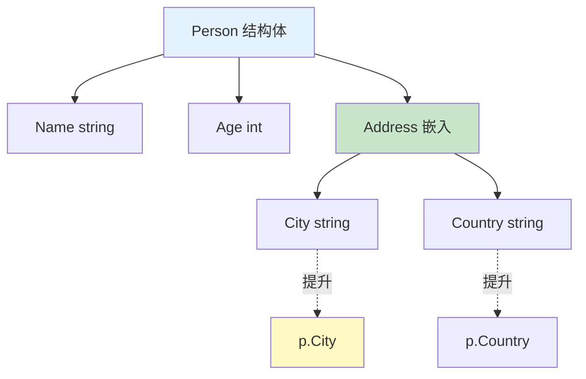

# 类型嵌入

类型嵌入通过在结构体中嵌入匿名类型，实现代码复用和方法提升。

## 嵌入基础

### 基本语法

```go
// 定义基础结构体
type Address struct {
    City    string
    Country string
}

// 嵌入 Address
type Person struct {
    Name string
    Age  int
    Address  // 匿名字段（嵌入）
}

func main() {
    p := Person{
        Name: "Alice",
        Age:  25,
        Address: Address{
            City:    "Beijing",
            Country: "China",
        },
    }

    // 访问嵌入字段
    fmt.Println(p.City)      // Beijing（提升）
    fmt.Println(p.Address.City)  // Beijing（完整路径）
}
```

### 字段提升



```go
// 嵌入字段的方法会被提升
type Address struct {
    City    string
    Country string
}

func (a Address) FullAddress() string {
    return fmt.Sprintf("%s, %s", a.City, a.Country)
}

type Person struct {
    Name string
    Address
}

func main() {
    p := Person{
        Name: "Alice",
        Address: Address{
            City:    "Beijing",
            Country: "China",
        },
    }

    // 调用提升的方法
    fmt.Println(p.FullAddress())  // Beijing, China

    // 等价于
    fmt.Println(p.Address.FullAddress())  // Beijing, China
}
```

## 嵌入类型

### 嵌入结构体

```go
type Base struct {
    ID        int
    CreatedAt time.Time
}

func (b *Base) Init() {
    b.CreatedAt = time.Now()
}

func (b *Base) Age() time.Duration {
    return time.Since(b.CreatedAt)
}

type User struct {
    Base    // 嵌入基础结构体
    Name    string
    Email   string
}

func main() {
    u := User{}
    u.Init()  // 调用嵌入结构体的方法

    fmt.Println(u.ID)        // 0
    fmt.Println(u.CreatedAt) // 时间戳
    fmt.Println(u.Age())     // 持续时间
}
```

### 嵌入接口

```go
type Reader interface {
    Read(p []byte) (n int, err error)
}

type Writer interface {
    Write(p []byte) (n int, err error)
}

// ReadWriter 组合了 Reader 和 Writer
type ReadWriter struct {
    Reader  // 嵌入 Reader 接口
    Writer  // 嵌入 Writer 接口
}

func main() {
    // ReadWriter 实现了 Read 和 Write
    var rw ReadWriter

    // 可以调用 Read 和 Write
    rw.Read(nil)
    rw.Write(nil)
}
```

### 嵌入指针

```go
type Counter struct {
    count int
}

func (c *Counter) Increment() {
    c.count++
}

func (c *Counter) Value() int {
    return c.count
}

type Stats struct {
    *Counter  // 嵌入指针
    min int
    max int
}

func main() {
    s := Stats{
        Counter: &Counter{},
        min: 0,
        max: 100,
    }

    s.Increment()  // 调用嵌入指针的方法
    fmt.Println(s.Value())  // 1
}
```

## 方法提升

### 提升规则

```go
type Base struct {
    Value int
}

func (b Base) Show() {
    fmt.Printf("Base Value: %d\n", b.Value)
}

func (b *Base) SetValue(v int) {
    b.Value = v
}

type Derived struct {
    Base
    Name string
}

func (d Derived) ShowName() {
    fmt.Printf("Derived Name: %s\n", d.Name)
}

func main() {
    d := Derived{
        Base: Base{Value: 10},
        Name: "test",
    }

    // 调用提升的方法
    d.Show()      // Base Value: 10
    d.SetValue(20)
    d.Show()      // Base Value: 20

    // 调用自己的方法
    d.ShowName()  // Derived Name: test
}
```

### 方法遮蔽

```go
type Base struct {
    Value int
}

func (b Base) Show() {
    fmt.Printf("Base Show: %d\n", b.Value)
}

type Derived struct {
    Base
}

// 遮蔽嵌入的方法
func (d Derived) Show() {
    fmt.Printf("Derived Show: %d\n", d.Value)
}

func main() {
    d := Derived{Base: Base{Value: 10}}

    d.Show()  // Derived Show: 10
    // 调用的是 Derived.Show，不是 Base.Show

    // 仍然可以调用 Base.Show
    d.Base.Show()  // Base Show: 10
}
```

## 多重嵌入

### 嵌入多个类型

```go
type Logger struct {
    prefix string
}

func (l *Logger) Log(msg string) {
    fmt.Printf("[%s] %s\n", l.prefix, msg)
}

type Counter struct {
    count int
}

func (c *Counter) Increment() {
    c.count++
}

func (c *Counter) Value() int {
    return c.count
}

type Service struct {
    *Logger   // 嵌入指针
    *Counter  // 嵌入指针
    Name      string
}

func main() {
    s := Service{
        Logger:  &Logger{prefix: "SERVICE"},
        Counter: &Counter{},
        Name:    "MyService",
    }

    // 方法提升
    s.Log("started")    // [SERVICE] started
    s.Increment()
    s.Increment()
    fmt.Println(s.Value())  // 2
}
```

### 字段名冲突

```go
type Type1 struct {
    ID int
}

type Type2 struct {
    ID int
}

type Combined struct {
    Type1
    Type2
    // ID int  // ❌ 冲突：不能有同名显式字段
}

func main() {
    c := Combined{
        Type1: Type1{ID: 1},
        Type2: Type2{ID: 2},
    }

    // 必须使用完整路径访问冲突字段
    fmt.Println(c.Type1.ID)  // 1
    fmt.Println(c.Type2.ID)  // 2

    // fmt.Println(c.ID)  // ❌ 歧义错误
}
```

## 嵌入 vs 继承

### 组合优于继承

```go
// 模拟继承（不推荐）
type Animal struct {
    Name string
}

func (a Animal) Speak() string {
    return "..."
}

type Dog struct {
    Animal  // 嵌入 Animal
    Breed string
}

func (d Dog) Speak() string {
    return "Woof!"
}

// 使用
d := Dog{
    Animal: Animal{Name: "Buddy"},
    Breed:  "Golden Retriever",
}

fmt.Println(d.Name)   // Buddy（从 Animal 提升）
fmt.Println(d.Speak()) // Woof!（Dog 的方法）
```

### 接口嵌入

```go
type Reader interface {
    Read(p []byte) (n int, err error)
}

type Writer interface {
    Write(p []byte) (n int, err error)
}

type Closer interface {
    Close() error
}

// 通过嵌入组合接口
type ReadWriter interface {
    Reader
    Writer
}

type ReadWriteCloser interface {
    Reader
    Writer
    Closer
}

// ReadWriteCloser 拥有所有方法
func use(rwc ReadWriteCloser) {
    rwc.Read(nil)
    rwc.Write(nil)
    rwc.Close()
}
```

## 实战示例

### HTTP 处理器

```go
type LoggingMiddleware struct {
    handler http.Handler
    logger  *log.Logger
}

func (lm *LoggingMiddleware) ServeHTTP(w http.ResponseWriter, r *http.Request) {
    start := time.Now()
    lm.logger.Printf("Started %s %s", r.Method, r.URL.Path)

    lm.handler.ServeHTTP(w, r)

    lm.logger.Printf("Completed in %v", time.Since(start))
}

// 嵌入 http.Handler
func NewLoggingHandler(h http.Handler, logger *log.Logger) http.Handler {
    return &LoggingMiddleware{
        handler: h,
        logger:  logger,
    }
}
```

### 配置管理

```go
type BaseConfig struct {
    Debug   bool
    Timeout time.Duration
}

type DatabaseConfig struct {
    BaseConfig
    Host     string
    Port     int
    Database string
}

type ServerConfig struct {
    BaseConfig
    Address string
}

func main() {
    dbCfg := DatabaseConfig{
        BaseConfig: BaseConfig{
            Debug:   true,
            Timeout: 30 * time.Second,
        },
        Host:     "localhost",
        Port:     5432,
        Database: "mydb",
    }

    fmt.Println(dbCfg.Debug)  // true（从 BaseConfig 提升）
}
```

## 最佳实践

::: tip 使用建议

1. **优先组合** - 使用嵌入而非继承
2. **避免冲突** - 注意字段名冲突
3. **理解提升** - 理解方法和字段的提升规则
4. **接口嵌入** - 用于组合接口
5. **适度使用** - 不要过度使用嵌入

:::

```go
// ✅ 好的嵌入
type ReadWriter struct {
    Reader  // 嵌入接口
    Writer  // 嵌入接口
}

// ✅ 清晰的层次
type UserService struct {
    * BaseService  // 嵌入基础服务
    repo          Repository  // 显式依赖
}

// ❌ 过度嵌入
type MegaType struct {
    Type1
    Type2
    Type3
    Type4
    Type5
    // 难以理解，难以维护
}
```

## 总结

| 概念 | 关键点 |
|------|--------|
| **字段提升** | 嵌入字段的方法和字段会被提升 |
| **方法遮蔽** - 可以遮蔽嵌入的方法 |
| **接口嵌入** - 组合多个接口 |
| **冲突处理** - 字段冲突需要显式路径 |
| **组合** - 嵌入实现组合而非继承 |

::: v-pre

[类型断言](./type-assertion.md) → [接口组合](./interface-composition.md)

:::
