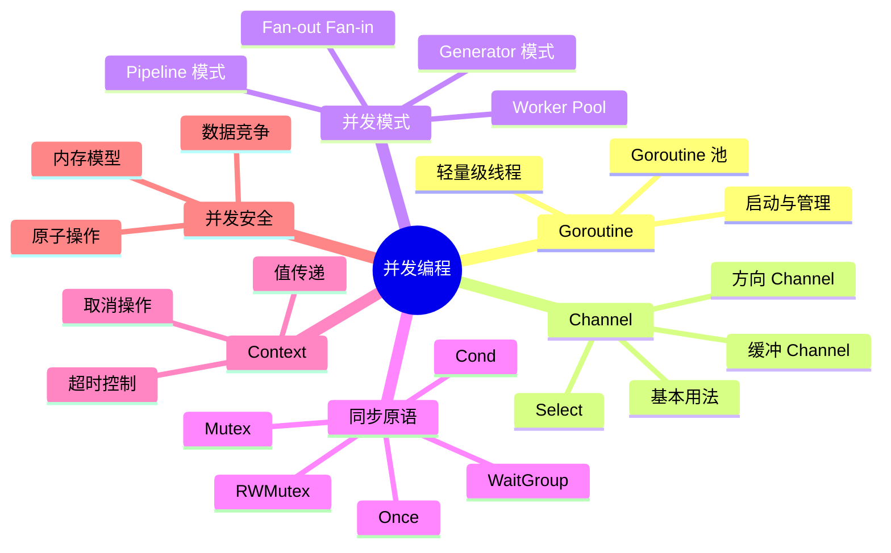
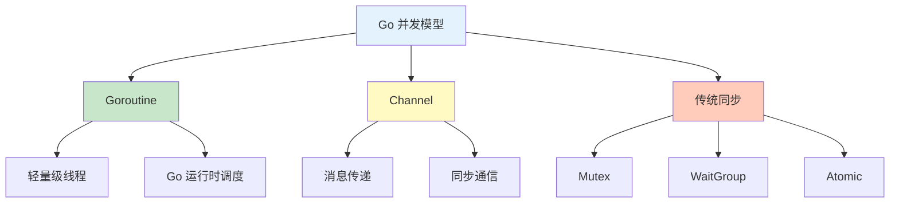
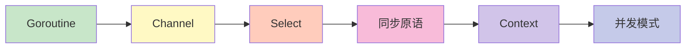
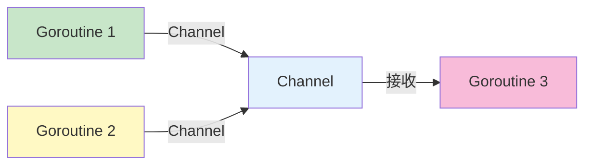

# 并发编程

欢迎来到 Go 语言并发编程章节！Go 的并发是其最强大的特性之一。

## 章节导航



## 知识体系

### 并发概览



## 学习路线



## 快速预览

### Goroutine

```go
// 启动 goroutine
go func() {
    fmt.Println("Hello from goroutine")
}()

// 等待 goroutine 完成
time.Sleep(time.Second)
```

### Channel

```go
// 创建 channel
ch := make(chan int)

// 发送
go func() {
    ch <- 42
}()

// 接收
value := <-ch
fmt.Println(value)  // 42
```

### Select

```go
// 多 channel 操作
select {
case v := <-ch1:
    fmt.Println("From ch1:", v)
case v := <-ch2:
    fmt.Println("From ch2:", v)
case <-time.After(time.Second):
    fmt.Println("Timeout")
}
```

### WaitGroup

```go
var wg sync.WaitGroup

wg.Add(1)
go func() {
    defer wg.Done()
    // 执行任务
}()

wg.Wait()
```

## 核心概念

### CSP 模型



**不要通过共享内存来通信，而要通过通信来共享内存**

### 并发 vs 并行

- **并发**: 同时处理多个任务（时间片轮转）
- **并行**: 同时执行多个任务（多核同时执行）

```go
// 并发（单核也能执行）
go task1()
go task2()

// 并行（需要多核）
runtime.GOMAXPROCS(4)  // 使用 4 个 CPU
```

## 实践建议

::: tip 学习建议

1. **理解 Goroutine** - 轻量级线程，由 Go 运行时调度
2. **掌握 Channel** - Go 并发的核心通信机制
3. **使用 Select** - 多 channel 操作的协调
4. **同步原语** - 熟练使用 WaitGroup、Mutex 等
5. **Context** - 理解取消和超时控制

:::

## 学习检查

完成本章节学习后，您应该能够：

- [ ] 创建和管理 Goroutine
- [ ] 熟练使用 Channel 进行通信
- [ ] 使用 Select 协调多个 Channel
- [ ] 使用同步原语保护共享数据
- [ ] 使用 Context 控制超时和取消
- [ ] 理解常见的并发模式
- [ ] 避免常见的并发陷阱

## 下一步

让我们开始深入学习并发编程的各个部分！

::: v-pre

[Goroutine](./goroutines.md) → [Channel](./channels.md) → [Select](./select.md) → [同步原语](./sync-atomic.md) → [Context](./context.md) → [并发模式](./patterns.md)

:::
