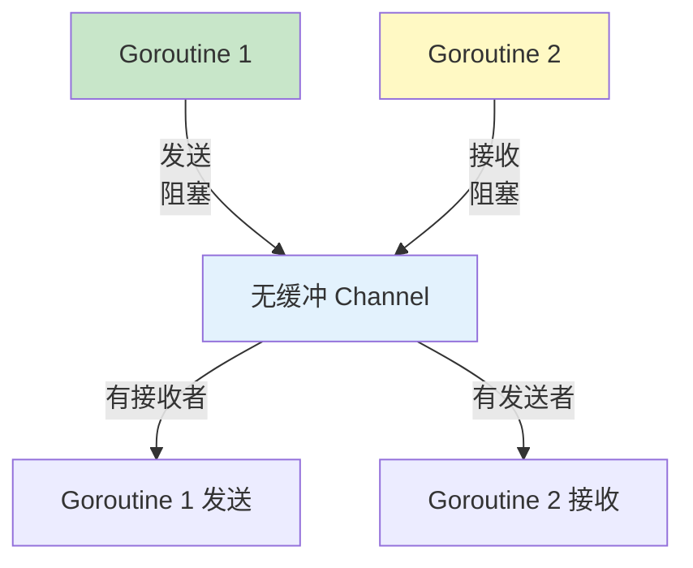

# Channel 通道

Channel 是 Go 语言中 goroutine 之间通信的管道，遵循 "不要通过共享内存来通信，而要通过通信来共享内存" 的理念。

## Channel 基础

### 创建 Channel

```go
// 创建 channel
ch := make(chan int)        // 无缓冲 channel
ch := make(chan int, 10)    // 缓冲 channel

// 发送和接收
ch <- 42     // 发送
value := <-ch  // 接收

// 关闭 channel
close(ch)
```

### Channel 方向

```go
// 只发送 channel
type Sender chan<- int

// 只接收 channel
type Receiver <-chan int

// 双向 channel
type Bidirectional chan int

func producer(ch chan<- int) {
    ch <- 42
    // ch := <-ch  // 编译错误
}

func consumer(ch <-chan int) {
    value := <-ch
    fmt.Println(value)
    // ch <- 42  // 编译错误
}
```

## 无缓冲 Channel

### 同步通信



```go
// 无缓冲 channel：发送和接收必须同步
func main() {
    ch := make(chan int)

    // 发送会阻塞，直到有接收者
    go func() {
        fmt.Println("Sending...")
        ch <- 42
        fmt.Println("Sent!")
    }()

    time.Sleep(time.Second)
    fmt.Println("Receiving...")
    value := <-ch
    fmt.Println("Received:", value)
}
```

### 同步模式

```go
// 使用无缓冲 channel 实现同步
func doWork(done chan struct{}) {
    time.Sleep(time.Second)
    fmt.Println("Work done")
    close(done)
}

func main() {
    done := make(chan struct{})

    go doWork(done)

    // 等待完成
    <-done
    fmt.Println("Main finished")
}
```

## 缓冲 Channel

### 异步通信

```go
// 缓冲 channel：发送不阻塞（除非缓冲满）
func main() {
    ch := make(chan int, 3)

    // 可以发送多个值而不阻塞
    ch <- 1
    ch <- 2
    ch <- 3

    fmt.Println("Sent 3 values")

    // 接收
    fmt.Println(<-ch)  // 1
    fmt.Println(<-ch)  // 2
    fmt.Println(<-ch)  // 3
}
```

### 缓冲大小选择

```go
// 缓冲大小 = 1（类似信号量）
semaphore := make(chan struct{}, 1)

func criticalSection() {
    semaphore <- struct{}{}  // 获取
    defer func() { <-semaphore }()  // 释放

    // 临界区代码
}

// 缓冲大小 = 生产者-消费者速率差
func producerConsumer() {
    // 生产者快，消费者慢
    ch := make(chan int, 100)  // 较大缓冲
}
```

## 遍历 Channel

### range 遍历

```go
func producer(ch chan<- int) {
    for i := 0; i < 5; i++ {
        ch <- i
    }
    close(ch)
}

func consumer(ch <-chan int) {
    // range 自动检测 channel 关闭
    for value := range ch {
        fmt.Println("Received:", value)
    }
    fmt.Println("Channel closed")
}

func main() {
    ch := make(chan int)

    go producer(ch)
    consumer(ch)
}
```

### 检测关闭

```go
func consumer(ch <-chan int) {
    for {
        value, ok := <-ch
        if !ok {
            fmt.Println("Channel closed")
            return
        }
        fmt.Println("Received:", value)
    }
}
```

## Select 多路复用

### 基本 Select

```go
func selectExample() {
    ch1 := make(chan string)
    ch2 := make(chan int)

    go func() {
        time.Sleep(100 * time.Millisecond)
        ch1 <- "one"
    }()

    go func() {
        time.Sleep(200 * time.Millisecond)
        ch2 <- 2
    }()

    // select 等待多个 channel
    select {
    case val := <-ch1:
        fmt.Println("From ch1:", val)
    case val := <-ch2:
        fmt.Println("From ch2:", val)
    }
}
```

### 超时处理

```go
func withTimeout() {
    ch := make(chan int)

    go func() {
        time.Sleep(2 * time.Second)
        ch <- 42
    }()

    select {
    case val := <-ch:
        fmt.Println("Received:", val)
    case <-time.After(1 * time.Second):
        fmt.Println("Timeout!")
    }
}
```

### 默认分支

```go
func nonBlockingSelect(ch chan int) {
    // 添加 default 使 select 非阻塞
    select {
    case val := <-ch:
        fmt.Println("Received:", val)
    default:
        fmt.Println("No value available")
    }
}
```

## Channel 关闭

### 关闭 Channel

```go
func producer(ch chan<- int) {
    for i := 0; i < 5; i++ {
        ch <- i
    }
    close(ch)  // 发送完毕，关闭 channel
}

func consumer(ch <-chan int) {
    for value := range ch {
        fmt.Println(value)
    }
}

// ⚠️ 注意：
// 1. 只能在发送端关闭
// 2. 不要关闭已关闭的 channel
// 3. 向关闭的 channel 发送会 panic
```

### 检测关闭

```go
func checkClose(ch <-chan int) {
    // 方法 1: comma ok
    value, ok := <-ch
    if !ok {
        fmt.Println("Channel is closed")
        return
    }
    fmt.Println("Received:", value)

    // 方法 2: range 自动检测
    for value := range ch {
        fmt.Println(value)
    }
}
```

## Channel 模式

### Fan-Out

```go
// 分发任务到多个 worker
func fanOut(in <-chan int, workerCount int) []<-chan int {
    outs := make([]<-chan int, workerCount)

    for i := 0; i < workerCount; i++ {
        out := make(chan int)
        outs[i] = out

        go func(out chan<- int) {
            for val := range in {
                out <- val * 2
            }
            close(out)
        }(out)
    }

    return outs
}
```

### Fan-In

```go
// 合并多个 channel 到一个
func fanIn(inputs ...<-chan int) <-chan int {
    out := make(chan int)

    for _, in := range inputs {
        go func(ch <-chan int) {
            for val := range ch {
                out <- val
            }
        }(in)
    }

    return out
}
```

### Pipeline

```go
// 阶段 1: 生成数字
func generator(nums ...int) <-chan int {
    out := make(chan int)
    go func() {
        defer close(out)
        for _, n := range nums {
            out <- n
        }
    }()
    return out
}

// 阶段 2: 平方
func square(in <-chan int) <-chan int {
    out := make(chan int)
    go func() {
        defer close(out)
        for n := range in {
            out <- n * n
        }
    }()
    return out
}

// 使用
func main() {
    // 构建管道
    numbers := generator(1, 2, 3, 4, 5)
    squared := square(numbers)

    // 消费结果
    for n := range squared {
        fmt.Println(n)  // 1, 4, 9, 16, 25
    }
}
```

## 实战示例

### 生产者-消费者

```go
func producer(id int, items <-chan int, wg *sync.WaitGroup) {
    defer wg.Done()

    for item := range items {
        fmt.Printf("Producer %d: %d\n", id, item)
        time.Sleep(time.Millisecond * 100)
    }
}

func consumer(id int, items chan<- int, wg *sync.WaitGroup) {
    defer wg.Done()

    for item := range items {
        fmt.Printf("Consumer %d: %d\n", id, item)
        time.Sleep(time.Millisecond * 150)
    }
}

func main() {
    items := make(chan int, 10)
    var wg sync.WaitGroup

    // 启动生产者
    for i := 1; i <= 2; i++ {
        wg.Add(1)
        go producer(i, items, &wg)
    }

    // 启动消费者
    for i := 1; i <= 3; i++ {
        wg.Add(1)
        go consumer(i, items, &wg)
    }

    // 发送任务
    for i := 1; i <= 10; i++ {
        items <- i
    }
    close(items)

    wg.Wait()
}
```

### 超时控制

```go
func withTimeout(fn func() error, timeout time.Duration) error {
    errCh := make(chan error, 1)

    go func() {
        errCh <- fn()
    }()

    select {
    case err := <-errCh:
        return err
    case <-time.After(timeout):
        return fmt.Errorf("timeout after %v", timeout)
    }
}

func main() {
    err := withTimeout(func() error {
        time.Sleep(2 * time.Second)
        return nil
    }, time.Second)

    if err != nil {
        fmt.Println("Error:", err)
    }
}
```

## 最佳实践

::: tip 使用建议

1. **优先无缓冲** - 同步通信更安全
2. **谁创建谁关闭** - 明确 channel 的所有权
3. **避免泄漏** - 确保所有 goroutine 都能退出
4. **使用 select** - 处理多个 channel
5. **关闭前发送** - 确保所有数据都已发送

:::

```go
// ✅ 好的模式
func process() {
    ch := make(chan int, 10)
    go func() {
        defer close(ch)  // 创建者关闭
        for i := 0; i < 10; i++ {
            ch <- i
        }
    }()

    for val := range ch {
        fmt.Println(val)
    }
}

// ❌ 不好的模式
func leak() {
    ch := make(chan int)
    go func() {
        <-ch  // 永远阻塞
    }()
    // ch 从未关闭，goroutine 泄漏
}
```

## 总结

| 概念 | 关键点 |
|------|--------|
| **无缓冲** - 同步通信，发送阻塞 |
| **缓冲** - 异步通信，大小灵活 |
| **方向** - `chan<-` 只发，`<-chan` 只收 |
| **关闭** - `close()`，只能发送端关闭 |
| **Select** - 多 channel 复用 |

::: v-pre

[Goroutine](./goroutines.md) → [Select](./select.md)

:::
