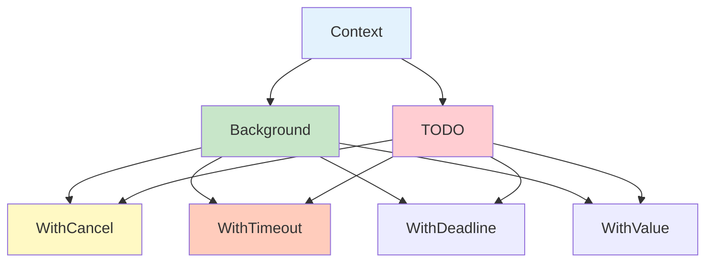
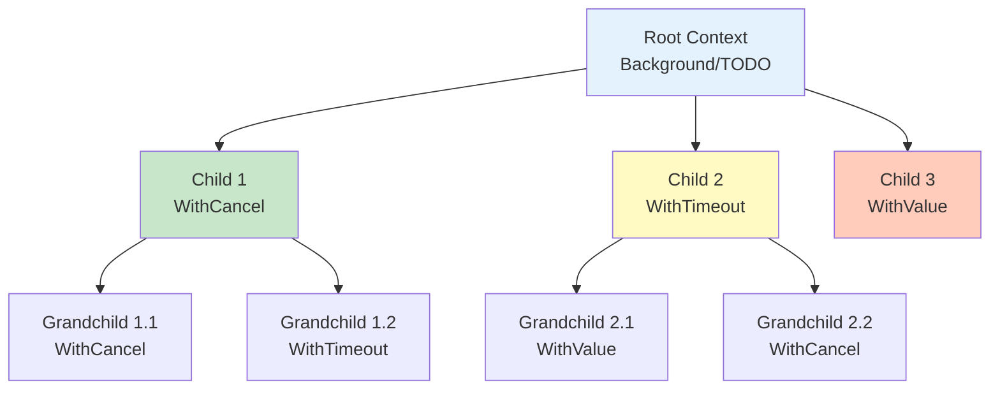

# Context 上下文

Context 包提供了一种在 goroutine 之间传递取消信号、超时时间和请求范围值的标准方法。

## Context 基础

### 基本概念

```go
// Context 接口
type Context interface {
    // 当 context 被取消时返回关闭的 channel
    Deadline() (deadline time.Time, ok bool)

    // 当 context 被取消时返回关闭的 channel
    Done() <-chan struct{}

    // 返回取消原因
    Err() error

    // 获取 key 对应的值
    Value(key interface{}) interface{}
}
```

### Context 类型



```go
// 1. Background - 根 context，永不取消
ctx := context.Background()

// 2. TODO - 尚未确定用途的 context
ctx := context.TODO()

// 3. WithCancel - 可手动取消的 context
ctx, cancel := context.WithCancel(context.Background())

// 4. WithTimeout - 超时自动取消
ctx, cancel := context.WithTimeout(context.Background(), time.Second)

// 5. WithDeadline - 在指定时间取消
ctx, cancel := context.WithDeadline(context.Background(), time.Now().Add(time.Hour))

// 6. WithValue - 携带值的 context
ctx := context.WithValue(context.Background(), "key", "value")
```

## 取消 Context

### WithCancel

```go
func operation(ctx context.Context) {
    for {
        select {
        case <-ctx.Done():
            // context 被取消
            fmt.Println("Operation cancelled:", ctx.Err())
            return
        default:
            // 继续工作
            fmt.Println("Working...")
            time.Sleep(500 * time.Millisecond)
        }
    }
}

func main() {
    ctx, cancel := context.WithCancel(context.Background())

    go operation(ctx)

    // 1 秒后取消
    time.Sleep(time.Second)
    cancel()

    time.Sleep(time.Second)
    fmt.Println("Main finished")
}
```

### 传播取消

```go
func parentContext() {
    ctx, cancel := context.WithCancel(context.Background())
    defer cancel()

    // 子 context
    childCtx, childCancel := context.WithCancel(ctx)
    defer childCancel()

    go func() {
        <-childCtx.Done()
        fmt.Println("Child cancelled:", childCtx.Err())
    }()

    // 取消父 context
    time.Sleep(time.Second)
    cancel()  // 同时取消所有子 context

    time.Sleep(time.Second)
}
```

## 超时 Context

### WithTimeout

```go
func withTimeout() {
    // 2 秒超时
    ctx, cancel := context.WithTimeout(context.Background(), 2*time.Second)
    defer cancel()  // 确保资源被释放

    ch := make(chan string)

    go func() {
        time.Sleep(3 * time.Second)  // 模拟耗时操作
        ch <- "result"
    }()

    select {
    case result := <-ch:
        fmt.Println("Received:", result)
    case <-ctx.Done():
        fmt.Println("Timeout:", ctx.Err())  // context deadline exceeded
    }
}
```

### WithDeadline

```go
func withDeadline() {
    // 在特定时间点取消
    deadline := time.Now().Add(1 * time.Second)
    ctx, cancel := context.WithDeadline(context.Background(), deadline)
    defer cancel()

    ch := make(chan string)

    go func() {
        time.Sleep(2 * time.Second)
        ch <- "result"
    }()

    select {
    case result := <-ch:
        fmt.Println("Received:", result)
    case <-ctx.Done():
        fmt.Println("Deadline exceeded:", ctx.Err())
    }
}
```

### Timeout 比较

```go
// WithTimeout - 相对时间
func relativeTimeout() {
    ctx, cancel := context.WithTimeout(context.Background(), 5*time.Second)
    defer cancel()

    // 5 秒后自动取消
    doWork(ctx)
}

// WithDeadline - 绝对时间
func absoluteDeadline() {
    deadline := time.Date(2024, 12, 31, 23, 59, 59, 0, time.UTC)
    ctx, cancel := context.WithDeadline(context.Background(), deadline)
    defer cancel()

    // 在指定时间点取消
    doWork(ctx)
}

func doWork(ctx context.Context) {
    for {
        select {
        case <-ctx.Done():
            fmt.Println("Cancelled:", ctx.Err())
            return
        default:
            // 执行工作
            time.Sleep(time.Second)
        }
    }
}
```

## 值 Context

### WithValue

```go
// 定义 context key 类型
type contextKey string

const (
    userIDKey   contextKey = "userID"
    requestIDKey contextKey = "requestID"
)

func processRequest(ctx context.Context) {
    // 获取值
    userID := ctx.Value(userIDKey)
    requestID := ctx.Value(requestIDKey)

    fmt.Printf("UserID: %v, RequestID: %v\n", userID, requestID)
}

func main() {
    // 创建带值的 context
    ctx := context.WithValue(context.Background(), userIDKey, 12345)
    ctx = context.WithValue(ctx, requestIDKey, "req-abc-123")

    processRequest(ctx)
}
```

### 使用模式

```go
// 1. 请求范围数据
type RequestContext struct {
    TraceID   string
    UserID    int64
    RequestAt time.Time
}

func handler(w http.ResponseWriter, r *http.Request) {
    ctx := context.WithValue(r.Context(), "request", RequestContext{
        TraceID:   uuid.New().String(),
        UserID:    12345,
        RequestAt: time.Now(),
    })

    processRequest(ctx)
}

// 2. 配置传递
type Config struct {
    Timeout time.Duration
    Retry   int
}

func withConfig(ctx context.Context, cfg Config) context.Context {
    return context.WithValue(ctx, "config", cfg)
}

// 3. 日志上下文
func withLogger(ctx context.Context, logger *Logger) context.Context {
    return context.WithValue(ctx, "logger", logger)
}

func logInfo(ctx context.Context, msg string) {
    if logger, ok := ctx.Value("logger").(*Logger); ok {
        logger.Info(msg)
    }
}
```

### 值传递注意事项

```go
// ❌ 不推荐：使用内置类型
ctx := context.WithValue(context.Background(), "key", "value")

// ✅ 推荐：自定义类型避免冲突
type contextKey string
const userKey contextKey = "user"

ctx := context.WithValue(context.Background(), userKey, User{ID: 123})

// ✅ 推荐：使用结构体作为 key
type contextKey struct{}

var userKey = struct{}{}

ctx := context.WithValue(context.Background(), userKey, User{ID: 123})
```

## Context 树

### Context 层次



```go
func contextTree() {
    // 根 context
    rootCtx := context.Background()

    // 一级子 context
    child1, cancel1 := context.WithCancel(rootCtx)
    child2, cancel2 := context.WithTimeout(rootCtx, time.Second*2)
    child3 := context.WithValue(rootCtx, "key", "value")

    // 二级子 context
    grandchild1, _ := context.WithCancel(child1)
    grandchild2, _ := context.WithTimeout(child2, time.Second)

    // 取消父 context 影响所有子 context
    cancel1()  // 同时取消 child1 和 grandchild1
    cancel2()  // 同时取消 child2 和 grandchild2

    // child3 没有取消函数
    _ = child3
}
```

### Context 传播

```go
func serviceA(ctx context.Context) {
    // 添加超时
    ctx, cancel := context.WithTimeout(ctx, time.Second)
    defer cancel()

    // 调用 serviceB
    serviceB(ctx)
}

func serviceB(ctx context.Context) {
    // 添加值
    ctx = context.WithValue(ctx, "service", "B")

    // 调用 serviceC
    serviceC(ctx)
}

func serviceC(ctx context.Context) {
    select {
    case <-ctx.Done():
        fmt.Println("Service C cancelled:", ctx.Err())
        return
    default:
        fmt.Println("Service C working")
    }
}
```

## HTTP 请求 Context

### 服务器端

```go
func handler(ctx context.Context, w http.ResponseWriter, r *http.Request) {
    // 从请求获取 context
    ctx = r.Context()

    // 设置超时
    ctx, cancel := context.WithTimeout(ctx, 5*time.Second)
    defer cancel()

    // 调用下游服务
    data, err := callDownstream(ctx)
    if err != nil {
        if errors.Is(err, context.DeadlineExceeded) {
            http.Error(w, "Request timeout", http.StatusGatewayTimeout)
            return
        }
        http.Error(w, err.Error(), http.StatusInternalServerError)
        return
    }

    fmt.Fprintf(w, "Result: %v", data)
}

func callDownstream(ctx context.Context) (string, error) {
    // 模拟调用
    select {
    case <-time.After(3 * time.Second):
        return "success", nil
    case <-ctx.Done():
        return "", ctx.Err()
    }
}
```

### 客户端

```go
func httpClient() error {
    // 创建带超时的 context
    ctx, cancel := context.WithTimeout(context.Background(), 3*time.Second)
    defer cancel()

    // 创建请求
    req, err := http.NewRequestWithContext(ctx, "GET", "https://api.example.com", nil)
    if err != nil {
        return err
    }

    // 发送请求
    client := &http.Client{}
    resp, err := client.Do(req)
    if err != nil {
        if errors.Is(err, context.DeadlineExceeded) {
            return fmt.Errorf("request timeout")
        }
        return err
    }
    defer resp.Body.Close()

    // 处理响应
    return nil
}
```

## 数据库 Context

### 数据库操作

```go
func queryWithContext(ctx context.Context, db *sql.DB) error {
    // 带超时的查询
    ctx, cancel := context.WithTimeout(ctx, 5*time.Second)
    defer cancel()

    query := "SELECT id, name FROM users WHERE active = ?"
    rows, err := db.QueryContext(ctx, query, true)
    if err != nil {
        if errors.Is(err, context.DeadlineExceeded) {
            return fmt.Errorf("query timeout")
        }
        return err
    }
    defer rows.Close()

    for rows.Next() {
        var id int
        var name string
        if err := rows.Scan(&id, &name); err != nil {
            return err
        }
        fmt.Printf("ID: %d, Name: %s\n", id, name)
    }

    return rows.Err()
}
```

### 事务处理

```go
func transactionWithContext(ctx context.Context, db *sql.DB) error {
    // 开始事务
    tx, err := db.BeginTx(ctx, nil)
    if err != nil {
        return err
    }
    defer tx.Rollback()  // 失败时回滚

    // 执行操作
    _, err = tx.ExecContext(ctx, "INSERT INTO users (name) VALUES (?)", "Alice")
    if err != nil {
        return err
    }

    _, err = tx.ExecContext(ctx, "UPDATE stats SET user_count = user_count + 1")
    if err != nil {
        return err
    }

    // 提交事务
    return tx.Commit()
}
```

## 最佳实践

### Context 传递

```go
// ✅ 好的模式：第一个参数是 context
func ProcessOrder(ctx context.Context, orderID int) error {
    // 检查是否已取消
    if err := ctx.Err(); err != nil {
        return err
    }

    // 调用其他函数传递 context
    if err := validateOrder(ctx, orderID); err != nil {
        return err
    }

    if err := saveOrder(ctx, orderID); err != nil {
        return err
    }

    return nil
}

// ❌ 不好的模式：不传递 context
func ProcessOrder(orderID int) error {
    // 无法取消，无法超时
    if err := validateOrder(orderID); err != nil {
        return err
    }
    return nil
}
```

### 资源清理

```go
// ✅ 总是调用 cancel
func goodCancel() {
    ctx, cancel := context.WithTimeout(context.Background(), time.Second)
    defer cancel()  // 确保资源被释放

    doWork(ctx)
}

// ❌ 忘记调用 cancel
func badCancel() {
    ctx, _ := context.WithTimeout(context.Background(), time.Second)
    // 如果在 deadline 前返回，资源不会被释放
    doWork(ctx)
}
```

### Context 选择

```go
// Background: 用于主函数、初始化、测试
func main() {
    ctx := context.Background()
    runApp(ctx)
}

// TODO: 尚未确定用途
func uncertainFunction() {
    ctx := context.TODO()
    // 后续替换为合适的 context
}

// WithCancel: 需要手动取消时
func withCancelUsage() {
    ctx, cancel := context.WithCancel(context.Background())
    go func() {
        // 在某些条件下取消
        if shouldCancel() {
            cancel()
        }
    }()
    doWork(ctx)
}

// WithTimeout: 有时间限制的操作
func withTimeoutUsage() {
    ctx, cancel := context.WithTimeout(context.Background(), 5*time.Second)
    defer cancel()

    result, err := doLongRunningOperation(ctx)
    if err != nil {
        log.Fatal(err)
    }
    _ = result
}

// WithDeadline: 有明确截止时间的操作
func withDeadlineUsage() {
    deadline := time.Date(2024, 12, 31, 23, 59, 59, 0, time.UTC)
    ctx, cancel := context.WithDeadline(context.Background(), deadline)
    defer cancel()

    doWork(ctx)
}

// WithValue: 传递请求范围数据
func withValueUsage() {
    ctx := context.WithValue(context.Background(), userIDKey, 12345)
    handleRequest(ctx)
}
```

## 总结

| 概念 | 关键点 |
|------|--------|
| **Background** - 根 context，永不取消 |
| **TODO** - 尚未确定用途的 context |
| **WithCancel** - 可手动取消 |
| **WithTimeout** - 超时自动取消 |
| **WithDeadline** - 指定时间取消 |
| **WithValue** - 携带请求范围值 |
| **传播** - 父 context 取消影响所有子 context |

::: v-pre

[同步原语](./sync-atomic.md) → [并发模式](./patterns.md)

:::
