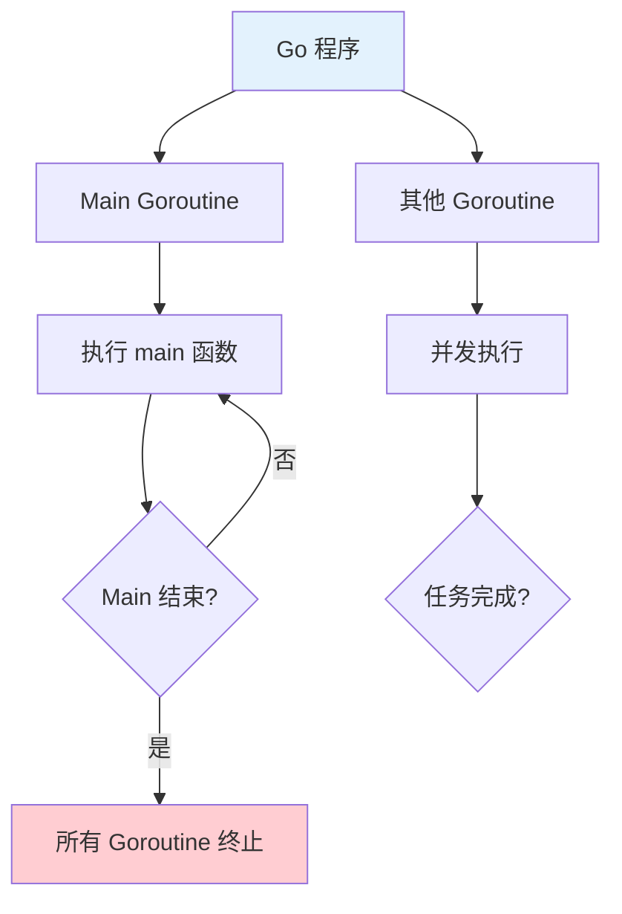

# Goroutine 协程

Goroutine 是 Go 的轻量级线程，由 Go 运行时管理，是实现并发的基础。

## Goroutine 基础

### 启动 Goroutine

```go
// 基本语法：go 函数调用
func sayHello() {
    fmt.Println("Hello from goroutine")
}

// 启动 goroutine
go sayHello()

// 匿名函数 goroutine
go func() {
    fmt.Println("Anonymous goroutine")
}()

// 带参数的 goroutine
func greet(name string) {
    fmt.Printf("Hello, %s!\n", name)
}

go greet("Alice")
go greet("Bob")

// main 函数继续执行
fmt.Println("Main function")
```

### Goroutine 特性



```go
// Goroutine 特点
// 1. 轻量级：栈初始大小仅 2KB
// 2. Go 运行时调度：非操作系统线程
// 3. M:N 调度：M 个 goroutine 映射到 N 个 OS 线程

func main() {
    // 启动多个 goroutine
    for i := 0; i < 10; i++ {
        go func(n int) {
            fmt.Printf("Goroutine %d\n", n)
        }(i)
    }

    // main 函数结束时，所有 goroutine 都会终止
    time.Sleep(time.Second)  // 等待 goroutine 执行
}
```

## Goroutine 生命周期

### 启动与终止

```go
func worker(id int) {
    fmt.Printf("Worker %d started\n", id)
    time.Sleep(time.Second)
    fmt.Printf("Worker %d finished\n", id)
}

func main() {
    // 启动 goroutine
    go worker(1)

    // 如果 main 函数立即结束，worker 1 可能来不及执行
    // 需要等待
    time.Sleep(2 * time.Second)
}
```

### 使用 WaitGroup

```go
func worker(id int, wg *sync.WaitGroup) {
    defer wg.Done()  // 完成时通知

    fmt.Printf("Worker %d started\n", id)
    time.Sleep(time.Second)
    fmt.Printf("Worker %d finished\n", id)
}

func main() {
    var wg sync.WaitGroup

    // 启动多个 goroutine
    for i := 1; i <= 3; i++ {
        wg.Add(1)  // 增加计数
        go worker(i, &wg)
    }

    // 等待所有 goroutine 完成
    wg.Wait()
    fmt.Println("All workers finished")
}
```

## Goroutine 调度

### 调度器模型

```mermaid
graph TD
    A[Go 运行时] --> B[Goroutines 队列]
    A --> C[OS 线程 M]

    B --> D[Goroutine 1]
    B --> E[Goroutine 2]
    B --> F[Goroutine 3]

    C --> G[执行 Goroutine]
    G --> H{完成?}
    H -->|是| I[下一个 Goroutine}

    style A fill:#e3f2fd
    style C fill:#c8e6c9
```

```go
// 查看 goroutine 数量
func main() {
    fmt.Println("Goroutines:", runtime.NumGoroutine())

    for i := 0; i < 10; i++ {
        go func() {
            time.Sleep(time.Second)
        }()
    }

    fmt.Println("Goroutines:", runtime.NumGoroutine())
    time.Sleep(2 * time.Second)
}
```

### Gosched

```go
// Gosched 提示调度器切换 goroutine
func main() {
    go func() {
        for i := 0; i < 5; i++ {
            fmt.Println("Goroutine:", i)
            runtime.Gosched()  // 让出 CPU
        }
    }()

    for i := 0; i < 5; i++ {
        fmt.Println("Main:", i)
        runtime.Gosched()
    }
}
```

## Goroutine 通信

### Channel 通信

```go
func producer(ch chan<- int) {
    for i := 0; i < 5; i++ {
        ch <- i
        fmt.Println("Produced:", i)
    }
    close(ch)
}

func consumer(ch <-chan int) {
    for value := range ch {
        fmt.Println("Consumed:", value)
    }
}

func main() {
    ch := make(chan int)

    go producer(ch)
    go consumer(ch)

    time.Sleep(time.Second)
}
```

### 共享内存（不推荐）

```go
// ❌ 不推荐：共享内存需要加锁
var counter int
var mu sync.Mutex

func increment() {
    mu.Lock()
    counter++
    mu.Unlock()
}

// ✅ 推荐：使用 channel 通信
type Counter struct {
    ch chan int
}

func NewCounter() *Counter {
    c := &Counter{ch: make(chan int)}
    go c.run()
    return c
}

func (c *Counter) run() {
    count := 0
    for delta := range c.ch {
        count += delta
    }
}

func (c *Counter) Increment(delta int) {
    c.ch <- delta
}
```

## Goroutine 泄漏

### 泄漏原因

```go
// ❌ Goroutine 泄漏
func leakyFunction() {
    ch := make(chan int)

    // 启动 goroutine 永久阻塞
    go func() {
        val := <-ch
        fmt.Println(val)
    }()

    // ch 永远不会发送数据
    // goroutine 永远阻塞
}

// ✅ 使用 context 取消
func properFunction(ctx context.Context) {
    ch := make(chan int)

    go func() {
        select {
        case val := <-ch:
            fmt.Println(val)
        case <-ctx.Done():
            return
        }
    }()
}
```

### 检测泄漏

```go
// 检查 goroutine 数量
func checkGoroutines() {
    before := runtime.NumGoroutine()

    // 执行可能泄漏的代码
    // ...

    time.Sleep(time.Second)
    after := runtime.NumGoroutine()

    if after > before {
        fmt.Printf("Possible leak: %d -> %d\n", before, after)
    }
}
```

## 实战示例

### Worker Pool

```go
func worker(id int, jobs <-chan int, results chan<- int) {
    for job := range jobs {
        fmt.Printf("Worker %d processing job %d\n", id, job)
        time.Sleep(time.Second)
        results <- job * 2
    }
}

func main() {
    jobs := make(chan int, 100)
    results := make(chan int, 100)

    // 启动 3 个 worker
    for i := 1; i <= 3; i++ {
        go worker(i, jobs, results)
    }

    // 发送任务
    for j := 1; j <= 5; j++ {
        jobs <- j
    }
    close(jobs)

    // 收集结果
    for i := 1; i <= 5; i++ {
        <-results
    }
}
```

### 并行下载

```go
func downloadURL(url string, wg *sync.WaitGroup) {
    defer wg.Done()

    resp, err := http.Get(url)
    if err != nil {
        log.Printf("Error downloading %s: %v\n", url, err)
        return
    }
    defer resp.Body.Close()

    fmt.Printf("Downloaded %s: %d bytes\n", url, resp.ContentLength)
}

func main() {
    urls := []string{
        "https://example.com",
        "https://golang.org",
        "https://google.com",
    }

    var wg sync.WaitGroup

    for _, url := range urls {
        wg.Add(1)
        go downloadURL(url, &wg)
    }

    wg.Wait()
    fmt.Println("All downloads completed")
}
```

## 最佳实践

::: tip 使用建议

1. **使用 WaitGroup** - 等待 goroutine 完成
2. **Channel 通信** - 优先使用 channel 而非共享内存
3. **Context 取消** - 使用 context 控制 goroutine 生命周期
4. **避免泄漏** - 确保 goroutine 能够退出
5. **限制数量** - 避免创建过多 goroutine

:::

```go
// ✅ 好的模式
func process(ctx context.Context, data []string) error {
    var wg sync.WaitGroup
    errCh := make(chan error, len(data))

    for _, item := range data {
        wg.Add(1)
        go func(item string) {
            defer wg.Done()
            if err := processItem(item); err != nil {
                errCh <- err
            }
        }(item)
    }

    go func() {
        wg.Wait()
        close(errCh)
    }()

    select {
    case err := <-errCh:
        return err
    case <-ctx.Done():
        return ctx.Err()
    }
}
```

## 总结

| 概念 | 关键点 |
|------|--------|
| **启动** | `go function()` |
| **轻量级** - 栈仅 2KB，由 Go 运行时调度 |
| **WaitGroup** - 等待多个 goroutine 完成 |
| **Channel** - goroutine 间通信的首选方式 |
| **Context** - 控制 goroutine 生命周期 |

::: v-pre

[并发编程总览](./README.md) → [Channel](./channels.md)

:::
