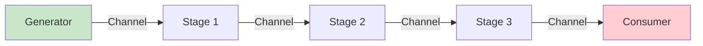
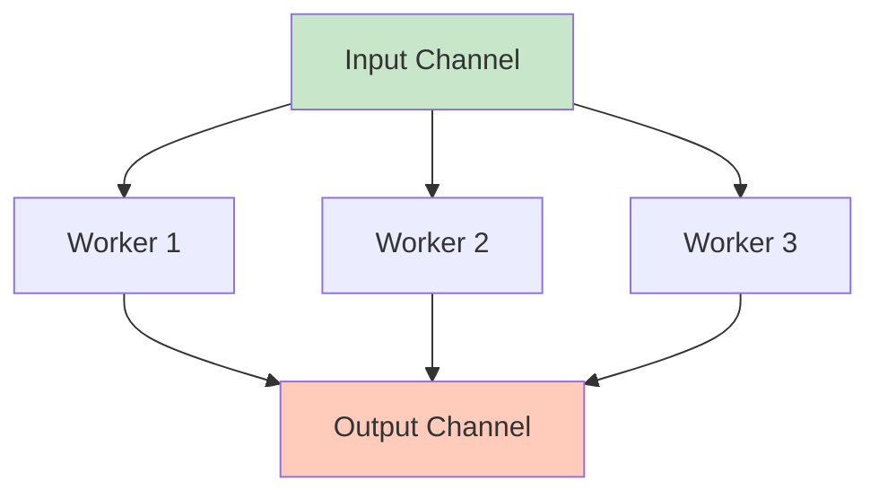
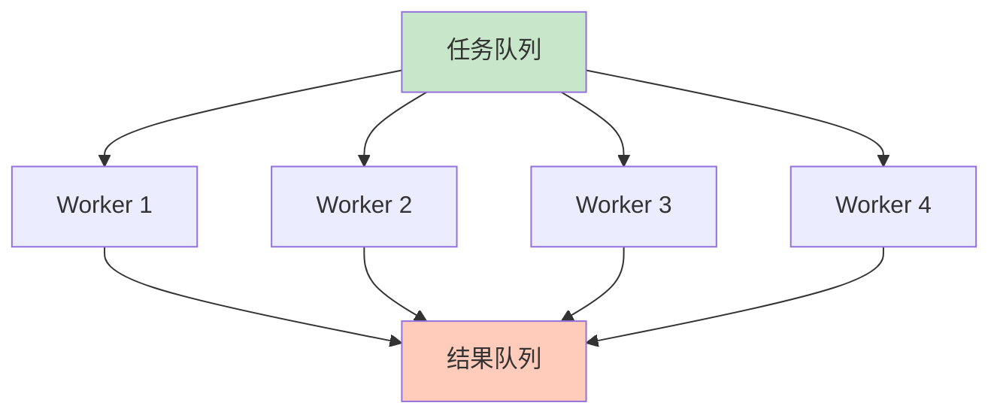

# 并发模式

Go 语言中有许多经典的并发模式，这些模式充分利用了 goroutine 和 channel 的特性。

## Generator 模式

### 基本 Generator

```go
// Generator: 生成数据流
func generator(nums ...int) <-chan int {
    out := make(chan int)

    go func() {
        defer close(out)
        for _, n := range nums {
            out <- n
        }
    }()

    return out
}

func main() {
    // 使用 generator
    ch := generator(1, 2, 3, 4, 5)

    for n := range ch {
        fmt.Println(n)
    }
}
```

### 无限序列

```go
// 无限整数序列
func integers() <-chan int {
    ch := make(chan int)

    go func() {
        for i := 0; ; i++ {
            ch <- i
        }
    }()

    return ch
}

// 斐波那契数列
func fibonacci() <-chan int {
    ch := make(chan int)

    go func() {
        a, b := 0, 1
        for {
            ch <- a
            a, b = b, a+b
        }
    }()

    return ch
}

func main() {
    // 生成前 10 个整数
    ints := integers()
    for i := 0; i < 10; i++ {
        fmt.Println(<-ints)
    }

    // 生成前 10 个斐波那契数
    fibs := fibonacci()
    for i := 0; i < 10; i++ {
        fmt.Println(<-fibs)
    }
}
```

## Pipeline 模式

### 基本 Pipeline



```go
// 阶段 1: 生成数字
func generate(nums ...int) <-chan int {
    out := make(chan int)
    go func() {
        defer close(out)
        for _, n := range nums {
            out <- n
        }
    }()
    return out
}

// 阶段 2: 平方
func square(in <-chan int) <-chan int {
    out := make(chan int)
    go func() {
        defer close(out)
        for n := range in {
            out <- n * n
        }
    }()
    return out
}

// 阶段 3: 过滤
func filter(in <-chan int, predicate func(int) bool) <-chan int {
    out := make(chan int)
    go func() {
        defer close(out)
        for n := range in {
            if predicate(n) {
                out <- n
            }
        }
    }()
    return out
}

func main() {
    // 构建 pipeline
    numbers := generate(1, 2, 3, 4, 5, 6, 7, 8, 9, 10)
    squared := square(numbers)
    filtered := filter(squared, func(n int) bool {
        return n > 20
    })

    // 消费结果
    for result := range filtered {
        fmt.Println(result)  // 25, 36, 49, 64, 100
    }
}
```

### 复杂 Pipeline

```go
// 阶段 1: 生成随机数
func randomGenerator(count int) <-chan int {
    out := make(chan int)
    go func() {
        defer close(out)
        for i := 0; i < count; i++ {
            out <- rand.Intn(100)
        }
    }()
    return out
}

// 阶段 2: 去重
func unique(in <-chan int) <-chan int {
    out := make(chan int)
    go func() {
        defer close(out)
        seen := make(map[int]bool)
        for n := range in {
            if !seen[n] {
                seen[n] = true
                out <- n
            }
        }
    }()
    return out
}

// 阶段 3: 排序
func sort(in <-chan int) <-chan int {
    out := make(chan int)
    go func() {
        defer close(out)
        var nums []int
        for n := range in {
            nums = append(nums, n)
        }
        sort.Ints(nums)
        for _, n := range nums {
            out <- n
        }
    }()
    return out
}

// 阶段 4: 批处理
func batch(in <-chan int, size int) <-chan []int {
    out := make(chan []int)
    go func() {
        defer close(out)
        batch := make([]int, 0, size)
        for n := range in {
            batch = append(batch, n)
            if len(batch) == size {
                out <- batch
                batch = make([]int, 0, size)
            }
        }
        if len(batch) > 0 {
            out <- batch
        }
    }()
    return out
}

func main() {
    // 完整 pipeline
    pipeline := batch(
        sort(
            unique(
                randomGenerator(20),
            ),
        ),
        5,
    )

    for batch := range pipeline {
        fmt.Println(batch)
    }
}
```

## Fan-Out/Fan-In 模式

### Fan-Out



```go
// Fan-Out: 分发任务到多个 worker
func fanOut(in <-chan int, workerCount int) []<-chan int {
    outs := make([]<-chan int, workerCount)

    for i := 0; i < workerCount; i++ {
        outs[i] = worker(in, i)
    }

    return outs
}

func worker(in <-chan int, id int) <-chan int {
    out := make(chan int)
    go func() {
        defer close(out)
        for n := range in {
            fmt.Printf("Worker %d processing %d\n", id, n)
            time.Sleep(time.Millisecond * 100)
            out <- n * 2
        }
    }()
    return out
}

func main() {
    // 输入
    in := make(chan int)
    go func() {
        defer close(in)
        for i := 1; i <= 10; i++ {
            in <- i
        }
    }()

    // Fan-out 到 3 个 worker
    outs := fanOut(in, 3)

    // 收集结果
    for _, out := range outs {
        for result := range out {
            fmt.Println("Result:", result)
        }
    }
}
```

### Fan-In

```go
// Fan-In: 合并多个 channel 到一个
func fanIn(inputs ...<-chan int) <-chan int {
    out := make(chan int)

    for _, in := range inputs {
        go func(ch <-chan int) {
            for n := range ch {
                out <- n
            }
        }(in)
    }

    return out
}

func main() {
    // 创建多个输入 channel
    ch1 := make(chan int)
    ch2 := make(chan int)
    ch3 := make(chan int)

    // 启动生产者
    go func() {
        defer close(ch1)
        for i := 0; i < 5; i++ {
            ch1 <- i
        }
    }()

    go func() {
        defer close(ch2)
        for i := 5; i < 10; i++ {
            ch2 <- i
        }
    }()

    go func() {
        defer close(ch3)
        for i := 10; i < 15; i++ {
            ch3 <- i
        }
    }()

    // Fan-in
    merged := fanIn(ch1, ch2, ch3)

    // 消费合并后的数据
    for n := range merged {
        fmt.Println(n)
    }
}
```

### 完整 Fan-Out/Fan-In

```go
// Fan-Out: 分发任务
func fanOut(in <-chan int, workers int) []<-chan int {
    outs := make([]<-chan int, workers)
    for i := 0; i < workers; i++ {
        outs[i] = process(in)
    }
    return outs
}

// 处理函数
func process(in <-chan int) <-chan int {
    out := make(chan int)
    go func() {
        defer close(out)
        for n := range in {
            out <- n * n
        }
    }()
    return out
}

// Fan-In: 合并结果
func fanIn(inputs ...<-chan int) <-chan int {
    var wg sync.WaitGroup
    out := make(chan int)

    output := func(ch <-chan int) {
        defer wg.Done()
        for n := range ch {
            out <- n
        }
    }

    wg.Add(len(inputs))
    for _, in := range inputs {
        go output(in)
    }

    go func() {
        wg.Wait()
        close(out)
    }()

    return out
}

func main() {
    // 输入
    in := make(chan int)
    go func() {
        defer close(in)
        for i := 1; i <= 10; i++ {
            in <- i
        }
    }()

    // Fan-Out
    outs := fanOut(in, 3)

    // Fan-In
    merged := fanIn(outs...)

    // 结果
    for result := range merged {
        fmt.Println(result)
    }
}
```

## Worker Pool 模式

### 基本 Worker Pool



```go
func worker(id int, jobs <-chan int, results chan<- int) {
    for job := range jobs {
        fmt.Printf("Worker %d processing job %d\n", id, job)
        time.Sleep(time.Second)
        results <- job * 2
    }
}

func main() {
    const numJobs = 10
    const numWorkers = 3

    jobs := make(chan int, numJobs)
    results := make(chan int, numJobs)

    // 启动 workers
    for i := 1; i <= numWorkers; i++ {
        go worker(i, jobs, results)
    }

    // 发送任务
    for j := 1; j <= numJobs; j++ {
        jobs <- j
    }
    close(jobs)

    // 收集结果
    for i := 1; i <= numJobs; i++ {
        <-results
    }

    fmt.Println("All jobs completed")
}
```

### 高级 Worker Pool

```go
type Job struct {
    ID   int
    Data interface{}
}

type Result struct {
    JobID  int
    Output interface{}
    Error  error
}

type WorkerPool struct {
    maxWorkers int
    jobQueue   chan Job
    resultCh   chan Result
    wg         sync.WaitGroup
}

func NewWorkerPool(maxWorkers int) *WorkerPool {
    return &WorkerPool{
        maxWorkers: maxWorkers,
        jobQueue:   make(chan Job, 100),
        resultCh:   make(chan Result, 100),
    }
}

func (p *WorkerPool) Start() {
    for i := 0; i < p.maxWorkers; i++ {
        p.wg.Add(1)
        go p.worker(i)
    }
}

func (p *WorkerPool) worker(id int) {
    defer p.wg.Done()

    for job := range p.jobQueue {
        fmt.Printf("Worker %d processing job %d\n", id, job.ID)

        // 处理任务
        result := Result{
            JobID:  job.ID,
            Output: fmt.Sprintf("Processed by worker %d", id),
        }

        p.resultCh <- result
    }
}

func (p *WorkerPool) Submit(job Job) {
    p.jobQueue <- job
}

func (p *WorkerPool) Results() <-chan Result {
    return p.resultCh
}

func (p *WorkerPool) Stop() {
    close(p.jobQueue)
    p.wg.Wait()
    close(p.resultCh)
}

func main() {
    pool := NewWorkerPool(3)
    pool.Start()

    // 提交任务
    for i := 1; i <= 10; i++ {
        pool.Submit(Job{ID: i})
    }

    // 收集结果
    go func() {
        for result := range pool.Results() {
            fmt.Printf("Job %d: %v\n", result.JobID, result.Output)
        }
    }()

    time.Sleep(time.Second)
    pool.Stop()
}
```

## Semaphore 模式

### 有缓冲 Channel 作为信号量

```go
// 信号量：限制并发数
func semaphore() {
    const maxConcurrency = 3
    sem := make(chan struct{}, maxConcurrency)

    tasks := []string{"task1", "task2", "task3", "task4", "task5", "task6"}

    var wg sync.WaitGroup

    for _, task := range tasks {
        wg.Add(1)
        sem <- struct{}{} // 获取信号量

        go func(t string) {
            defer wg.Done()
            defer func() { <-sem }() // 释放信号量

            fmt.Printf("Starting %s\n", t)
            time.Sleep(time.Second)
            fmt.Printf("Completed %s\n", t)
        }(task)
    }

    wg.Wait()
}
```

### 超时控制

```go
// 带超时的信号量
func semaphoreWithTimeout() {
    sem := make(chan struct{}, 2)

    acquire := func(timeout time.Duration) bool {
        select {
        case sem <- struct{}{}:
            return true
        case <-time.After(timeout):
            return false
        }
    }

    release := func() {
        <-sem
    }

    // 使用
    if acquire(time.Second) {
        defer release()
        // 执行任务
        fmt.Println("Task executed")
    } else {
        fmt.Println("Timeout acquiring semaphore")
    }
}
```

## Pub/Sub 模式

### 简单发布订阅

```go
type Broker struct {
    subscribers []chan interface{}
    mu          sync.RWMutex
}

func NewBroker() *Broker {
    return &Broker{
        subscribers: make([]chan interface{}, 0),
    }
}

func (b *Broker) Subscribe() chan interface{} {
    b.mu.Lock()
    defer b.mu.Unlock()

    ch := make(chan interface{}, 10)
    b.subscribers = append(b.subscribers, ch)
    return ch
}

func (b *Broker) Unsubscribe(ch chan interface{}) {
    b.mu.Lock()
    defer b.mu.Unlock()

    for i, subscriber := range b.subscribers {
        if subscriber == ch {
            b.subscribers = append(b.subscribers[:i], b.subscribers[i+1:]...)
            close(ch)
            break
        }
    }
}

func (b *Broker) Publish(msg interface{}) {
    b.mu.RLock()
    defer b.mu.RUnlock()

    for _, subscriber := range b.subscribers {
        select {
        case subscriber <- msg:
        default:
            fmt.Println("Subscriber channel full, message dropped")
        }
    }
}

func main() {
    broker := NewBroker()

    // 订阅者 1
    sub1 := broker.Subscribe()
    go func() {
        for msg := range sub1 {
            fmt.Println("Subscriber 1:", msg)
        }
    }()

    // 订阅者 2
    sub2 := broker.Subscribe()
    go func() {
        for msg := range sub2 {
            fmt.Println("Subscriber 2:", msg)
        }
    }()

    // 发布消息
    broker.Publish("Hello")
    broker.Publish("World")

    time.Sleep(time.Second)
    broker.Unsubscribe(sub1)
    broker.Unsubscribe(sub2)
}
```

## Future/Promise 模式

### Future 实现

```go
type Future struct {
    result chan interface{}
    err    chan error
}

func NewFuture() *Future {
    return &Future{
        result: make(chan interface{}, 1),
        err:    make(chan error, 1),
    }
}

func (f *Future) Get() (interface{}, error) {
    select {
    case res := <-f.result:
        return res, nil
    case err := <-f.err:
        return nil, err
    }
}

func (f *Future) GetWithTimeout(timeout time.Duration) (interface{}, error) {
    select {
    case res := <-f.result:
        return res, nil
    case err := <-f.err:
        return nil, err
    case <-time.After(timeout):
        return nil, fmt.Errorf("timeout")
    }
}

func (f *Future) Set(result interface{}) {
    f.result <- result
}

func (f *Future) SetError(err error) {
    f.err <- err
}

// 使用
func asyncOperation() *Future {
    future := NewFuture()

    go func() {
        time.Sleep(2 * time.Second)
        future.Set("Operation completed")
    }()

    return future
}

func main() {
    future := asyncOperation()

    // 做其他事情
    fmt.Println("Doing other work...")

    // 获取结果
    result, err := future.GetWithTimeout(3 * time.Second)
    if err != nil {
        fmt.Println("Error:", err)
        return
    }

    fmt.Println("Result:", result)
}
```

## 最佳实践

::: tip 使用建议

1. **Pipeline** - 适合数据流处理
2. **Fan-Out/Fan-In** - 适合并行处理独立任务
3. **Worker Pool** - 适合限制并发数
4. **Semaphore** - 限制资源访问
5. **Pub/Sub** - 事件驱动架构
6. **Generator** - 懒生成数据序列

:::

```go
// ✅ 好的模式

// 1. 使用 channel 通信
func goodPattern() {
    ch := make(chan int)
    go func() {
        ch <- compute()
    }()
    result := <-ch
    _ = result
}

// 2. 优雅关闭
func gracefulShutdown() {
    ch := make(chan int)
    go func() {
        defer close(ch)
        for i := 0; i < 10; i++ {
            ch <- i
        }
    }()

    for v := range ch {
        fmt.Println(v)
    }
}

// 3. 错误处理
func withErrors() {
    errCh := make(chan error, 1)
    go func() {
        errCh <- doWork()
    }()

    if err := <-errCh; err != nil {
        log.Fatal(err)
    }
}
```

## 总结

| 模式 | 适用场景 |
|------|---------|
| **Generator** | 生成数据序列 |
| **Pipeline** | 数据流处理 |
| **Fan-Out** | 并行处理 |
| **Fan-In** | 合并结果 |
| **Worker Pool** | 限制并发数 |
| **Semaphore** | 资源访问控制 |
| **Pub/Sub** | 事件驱动 |
| **Future** | 异步结果 |

::: v-pre

[Context](./context.md) → [错误处理](/langs/go/06-error-testing/)

:::
