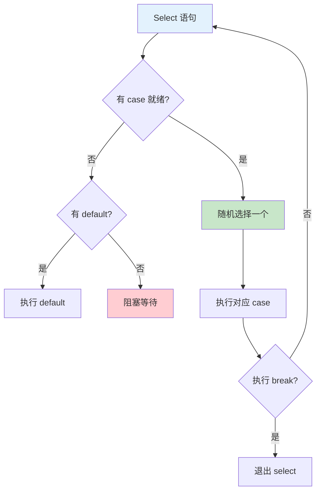

# Select 多路复用

Select 语句让 goroutine 可以同时等待多个 Channel 操作。

## Select 基础

### 基本语法

```go
// select 等待多个 channel
select {
case val := <-ch1:
    // 从 ch1 接收
case ch2 <- value:
    // 向 ch2 发送
case <-time.After(time.Second):
    // 超时
default:
    // 没有准备好的 channel
}
```

### Select 规则



```go
// select 随机选择准备好的 case
func randomSelect() {
    ch1 := make(chan int, 1)
    ch2 := make(chan int, 1)

    ch1 <- 1
    ch2 <- 2

    select {
    case val := <-ch1:
        fmt.Println("From ch1:", val)
    case val := <-ch2:
        fmt.Println("From ch2:", val)
    }
    // 随机输出 ch1 或 ch2
}
```

## 超时处理

### time.After

```go
func withTimeout() {
    ch := make(chan int)

    go func() {
        time.Sleep(2 * time.Second)
        ch <- 42
    }()

    select {
    case val := <-ch:
        fmt.Println("Received:", val)
    case <-time.After(time.Second):
        fmt.Println("Timeout!")
    }
}
```

### time.Ticker

```go
func tickerExample() {
    ticker := time.NewTicker(500 * time.Millisecond)
    defer ticker.Stop()

    ch := make(chan int)

    go func() {
        time.Sleep(2 * time.Second)
        ch <- 42
        close(ch)
    }()

    for {
        select {
        case <-ticker.C:
            fmt.Println("Tick...")
        case val, ok := <-ch:
            if ok {
                fmt.Println("Received:", val)
            }
            return
        }
    }
}
```

## 非阻塞操作

### Default 分支

```go
func nonBlocking(ch <-chan int) {
    select {
    case val := <-ch:
        fmt.Println("Received:", val)
    default:
        fmt.Println("No value available")
    }
}

func main() {
    ch := make(chan int)

    // 非阻塞接收
    nonBlocking(ch)

    // 非阻塞发送
    select {
    case ch <- 42:
        fmt.Println("Sent")
    default:
        fmt.Println("Channel full or unbuffered")
    }
}
```

### 轮询模式

```go
func poll(ch <-chan int) {
    for {
        select {
        case val := <-ch:
            fmt.Println("Received:", val)
            return
        default:
            fmt.Println("Waiting...")
            time.Sleep(100 * time.Millisecond)
        }
    }
}
```

## 多 Channel 操作

### 同时等待多个

```go
func waitForAny(ch1, ch2 <-chan int) {
    select {
    case val := <-ch1:
        fmt.Println("From ch1:", val)
    case val := <-ch2:
        fmt.Println("From ch2:", val)
    }
}
```

### 等待所有完成

```go
func waitForAll(channels ...<-chan int) []int {
    results := make([]int, len(channels))

    for i, ch := range channels {
        go func(idx int, c <-chan int) {
            results[idx] = <-c
        }(i, ch)
    }

    // 使用 select 等待所有
    done := make(chan struct{})
    for i := range channels {
        go func(ch <-chan int) {
            <-ch
            done <- struct{}{}
        }(channels[i])
    }

    for i := 0; i < len(channels); i++ {
        <-done
    }

    return results
}
```

## Channel 操作

### 发送接收

```go
func sendOrTimeout(ch chan<- int, value int, timeout time.Duration) error {
    select {
    case ch <- value:
        return nil
    case <-time.After(timeout):
        return fmt.Errorf("send timeout")
    }
}

func receiveOrTimeout(ch <-chan int, timeout time.Duration) (int, error) {
    select {
    case val := <-ch:
        return val, nil
    case <-time.After(timeout):
        return 0, fmt.Errorf("receive timeout")
    }
}
```

### 检测 Channel

```go
func isChannelClosed(ch <-chan int) bool {
    select {
    case <-ch:
        return false  // 能读取，说明未关闭
    case <-time.After(time.Nanosecond):
        return true  // 超时，说明已关闭
    }
}
```

## 实战示例

### 命令服务器

```go
func commandServer(commands <-chan string, results chan<- string) {
    for cmd := range commands {
        switch cmd {
        case "ping":
            results <- "pong"
        case "time":
            results <- time.Now().String()
        case "quit":
            results <- "bye"
            return
        default:
            results <- "unknown command"
        }
    }
}

func main() {
    commands := make(chan string)
    results := make(chan string)

    go commandServer(commands, results)

    commands <- "ping"
    fmt.Println(<-results)  // pong

    commands <- "time"
    fmt.Println(<-results)  // 当前时间

    close(commands)
    <-results  // bye
}
```

### 心跳检测

```go
func heartbeat(interval time.Duration, stop <-chan struct{}) {
    ticker := time.NewTicker(interval)
    defer ticker.Stop()

    for {
        select {
        case <-ticker.C:
            fmt.Println("Ping")
        case <-stop:
            fmt.Println("Heartbeat stopped")
            return
        }
    }
}

func main() {
    stop := make(chan struct{})

    go heartbeat(time.Second, stop)

    time.Sleep(3 * time.Second)
    close(stop)
    time.Sleep(time.Second)
}
```

### 优先级选择

```go
func prioritySelect(high, low <-chan int) {
    for {
        select {
        case val := <-high:
            fmt.Println("High priority:", val)
        case val := <-low:
            select {
            case val := <-high:
                // 再次检查高优先级
                fmt.Println("High priority:", val)
            default:
                fmt.Println("Low priority:", val)
            }
        }
    }
}
```

## 最佳实践

::: tip 使用建议

1. **超时控制** - 总是为 select 添加超时
2. **非阻塞** - 使用 default 实现非阻塞
3. **资源清理** - select 中处理 context.Done()
4. **避免死锁** - 确保至少有一个 case 可以执行
5. **随机公平** - select 随机选择准备好的 case

:::

```go
// ✅ 好的模式
func withTimeoutAndCancel(ctx context.Context, ch <-chan int) error {
    select {
    case val := <-ch:
        fmt.Println(val)
        return nil
    case <-ctx.Done():
        return ctx.Err()
    }
}

// ❌ 可能死锁
func deadlock(ch <-chan int) {
    select {
    case val := <-ch:
        fmt.Println(val)
    // 没有 default，如果 ch 没有数据会永远阻塞
    }
}
```

## 总结

| 概念 | 关键点 |
|------|--------|
| **基本语法** - `select { case ... }` |
| **随机选择** - 随机选择准备好的 case |
| **阻塞** - 没有 default 时阻塞等待 |
| **非阻塞** - 使用 default 实现非阻塞 |
| **超时** - 使用 `time.After` 设置超时 |

::: v-pre

[Channel](./channels.md) → [同步原语](./sync-atomic.md)

:::
