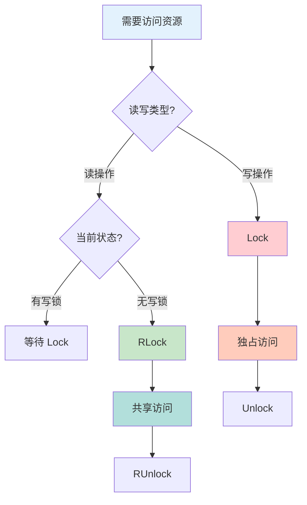

# 同步原语

Go 的 `sync` 包提供了多种同步原语，用于协调 goroutine 之间的访问和通信。

## Mutex 互斥锁

### 基本用法

```go
var (
    counter int
    mu      sync.Mutex
)

func increment() {
    mu.Lock()         // 获取锁
    defer mu.Unlock() // 释放锁

    counter++
}

func main() {
    var wg sync.WaitGroup

    for i := 0; i < 1000; i++ {
        wg.Add(1)
        go func() {
            defer wg.Done()
            increment()
        }()
    }

    wg.Wait()
    fmt.Println("Counter:", counter) // 1000
}
```

### Lock 与 RLock



```go
// Mutex: 独占锁
type SafeCounter struct {
    mu    sync.Mutex
    value int
}

func (c *SafeCounter) Add(v int) {
    c.mu.Lock()
    defer c.mu.Unlock()
    c.value += v
}

// RWMutex: 读写锁
type SafeMap struct {
    mu   sync.RWMutex
    data map[string]int
}

func (m *SafeMap) Get(key string) int {
    m.mu.RLock()         // 读锁
    defer m.mu.RUnlock()
    return m.data[key]
}

func (m *SafeMap) Set(key string, value int) {
    m.mu.Lock()         // 写锁
    defer m.mu.Unlock()
    m.data[key] = value
}
```

### 锁的选择

```go
// Mutex: 适合写多读少
type WriteHeavy struct {
    mu    sync.Mutex
    data  map[string]int
}

// RWMutex: 适合读多写少
type ReadHeavy struct {
    mu   sync.RWMutex
    data map[string]int
}

func benchmark() {
    // 写多读少场景
    writeHeavy := &WriteHeavy{data: make(map[string]int)}

    // 读多写少场景
    readHeavy := &ReadHeavy{data: make(map[string]int)}
}
```

## WaitGroup

### 基本用法

```go
func worker(id int, wg *sync.WaitGroup) {
    defer wg.Done() // 完成时减少计数

    fmt.Printf("Worker %d starting\n", id)
    time.Sleep(time.Second)
    fmt.Printf("Worker %d done\n", id)
}

func main() {
    var wg sync.WaitGroup

    for i := 1; i <= 3; i++ {
        wg.Add(1) // 增加计数
        go worker(i, &wg)
    }

    wg.Wait() // 等待所有 goroutine 完成
    fmt.Println("All workers completed")
}
```

### 使用模式

```go
// 模式 1: 简单等待
func simpleWait() {
    var wg sync.WaitGroup

    for i := 0; i < 5; i++ {
        wg.Add(1)
        go func(n int) {
            defer wg.Done()
            process(n)
        }(i)
    }

    wg.Wait()
}

// 模式 2: 结果收集
func collectResults() []int {
    var wg sync.WaitGroup
    results := make([]int, 5)

    for i := 0; i < 5; i++ {
        wg.Add(1)
        go func(idx int) {
            defer wg.Done()
            results[idx] = compute(idx)
        }(i)
    }

    wg.Wait()
    return results
}

// 模式 3: 错误收集
func withErrors() error {
    var wg sync.WaitGroup
    errCh := make(chan error, 5)

    for i := 0; i < 5; i++ {
        wg.Add(1)
        go func(n int) {
            defer wg.Done()
            if err := processItem(n); err != nil {
                errCh <- err
            }
        }(i)
    }

    go func() {
        wg.Wait()
        close(errCh)
    }()

    for err := range errCh {
        if err != nil {
            return err
        }
    }

    return nil
}
```

## Once

### 单次执行

```go
var (
    instance *Database
    once     sync.Once
)

func GetDatabase() *Database {
    once.Do(func() {
        // 只执行一次
        instance = &Database{
            connection: "localhost:5432",
        }
        fmt.Println("Database initialized")
    })

    return instance
}

func main() {
    var wg sync.WaitGroup

    for i := 0; i < 10; i++ {
        wg.Add(1)
        go func() {
            defer wg.Done()
            db := GetDatabase()
            _ = db
        }()
    }

    wg.Wait()
    // Output: Database initialized (只打印一次)
}
```

### 使用场景

```go
// 1. 单例模式
type Singleton struct {
    config Config
}

var (
    instance *Singleton
    once     sync.Once
)

func GetInstance() *Singleton {
    once.Do(func() {
        instance = &Singleton{
            config: loadConfig(),
        }
    })
    return instance
}

// 2. 初始化资源
type Cache struct {
    data map[string]string
    once sync.Once
}

func (c *Cache) Init() {
    c.once.Do(func() {
        c.data = make(map[string]string)
        // 加载初始数据
    })
}

// 3. 只执行一次的清理
func cleanup() {
    var once sync.Once
    // 多次调用只执行一次
    once.Do(func() {
        fmt.Println("Cleaning up...")
    })
}
```

## Cond 条件变量

### 基本用法

```go
type Queue struct {
    items []int
    cond  *sync.Cond
}

func NewQueue() *Queue {
    return &Queue{
        cond: sync.NewCond(&sync.Mutex{}),
    }
}

func (q *Queue) Push(item int) {
    q.cond.L.Lock()
    defer q.cond.L.Unlock()

    q.items = append(q.items, item)
    q.cond.Signal() // 通知一个等待者
}

func (q *Queue) Pop() int {
    q.cond.L.Lock()
    defer q.cond.L.Unlock()

    for len(q.items) == 0 {
        q.cond.Wait() // 等待信号
    }

    item := q.items[0]
    q.items = q.items[1:]
    return item
}
```

### 生产者-消费者

```go
type BoundedBuffer struct {
    buffer []int
    size   int
    cond   *sync.Cond
}

func NewBoundedBuffer(size int) *BoundedBuffer {
    return &BoundedBuffer{
        buffer: make([]int, 0, size),
        size:   size,
        cond:   sync.NewCond(&sync.Mutex{}),
    }
}

func (b *BoundedBuffer) Put(item int) {
    b.cond.L.Lock()
    defer b.cond.L.Unlock()

    for len(b.buffer) == b.size {
        b.cond.Wait() // 缓冲满，等待
    }

    b.buffer = append(b.buffer, item)
    b.cond.Signal() // 通知消费者
}

func (b *BoundedBuffer) Get() int {
    b.cond.L.Lock()
    defer b.cond.L.Unlock()

    for len(b.buffer) == 0 {
        b.cond.Wait() // 缓冲空，等待
    }

    item := b.buffer[0]
    b.buffer = b.buffer[1:]
    b.cond.Signal() // 通知生产者
    return item
}
```

## Map

### 基本用法

```go
var m sync.Map

// 存储
m.Store("key1", "value1")
m.Store("key2", 42)

// 读取
if value, ok := m.Load("key1"); ok {
    fmt.Println(value.(string)) // value1
}

// 读取或存储
actual, loaded := m.LoadOrStore("key3", "new value")
fmt.Println(actual, loaded) // new value false

// 删除
m.Delete("key1")

// 遍历
m.Range(func(key, value interface{}) bool {
    fmt.Printf("Key: %v, Value: %v\n", key, value)
    return true // 返回 false 停止遍历
})
```

### 使用场景

```go
// 1. 缓存
type Cache struct {
    data sync.Map
}

func (c *Cache) Get(key string) (interface{}, bool) {
    return c.data.Load(key)
}

func (c *Cache) Set(key string, value interface{}) {
    c.data.Store(key, value)
}

// 2. 动态注册表
type Registry struct {
    items sync.Map
}

func (r *Registry) Register(name string, item interface{}) {
    r.items.Store(name, item)
}

func (r *Registry) Get(name string) (interface{}, bool) {
    return r.items.Load(name)
}

// 3. 计数器
type Counter struct {
    counts sync.Map
}

func (c *Counter) Increment(key string) {
    value, _ := c.counts.LoadOrStore(key, 0)
    count := value.(int) + 1
    c.counts.Store(key, count)
}
```

## 原子操作

### 基本类型

```go
import "sync/atomic"

var (
    counter int64
    flag    int32
)

func atomicIncrement() {
    // 原子加
    atomic.AddInt64(&counter, 1)

    // 原子读取
    value := atomic.LoadInt64(&counter)

    // 原子写入
    atomic.StoreInt64(&counter, 100)

    // 原子交换
    old := atomic.SwapInt64(&counter, 200)

    // 比较并交换
    atomic.CompareAndSwapInt64(&counter, 200, 300)
}

func atomicFlag() {
    // 设置
    atomic.StoreInt32(&flag, 1)

    // 读取
    if atomic.LoadInt32(&flag) == 1 {
        fmt.Println("Flag is set")
    }

    // 清除
    atomic.StoreInt32(&flag, 0)
}
```

### Value 类型

```go
type Config struct {
    atomic.Value
}

func NewConfig() *Config {
    c := &Config{}
    c.Store(map[string]string{
        "host": "localhost",
        "port": "8080",
    })
    return c
}

func (c *Config) Get() map[string]string {
    return c.Load().(map[string]string)
}

func (c *Config) Update(newConfig map[string]string) {
    c.Store(newConfig)
}

func main() {
    config := NewConfig()

    // 读取
    cfg := config.Get()
    fmt.Println(cfg["host"]) // localhost

    // 原子更新
    go func() {
        newCfg := map[string]string{
            "host": "remotehost",
            "port": "9090",
        }
        config.Update(newCfg)
    }()

    time.Sleep(time.Second)
    cfg = config.Get()
    fmt.Println(cfg["host"]) // remotehost
}
```

### 原子操作 vs 锁

```go
// ❌ 使用锁（有开销）
type CounterWithLock struct {
    mu    sync.Mutex
    value int64
}

func (c *CounterWithLock) Add(v int64) {
    c.mu.Lock()
    defer c.mu.Unlock()
    c.value += v
}

// ✅ 使用原子操作（更快）
type CounterWithAtomic struct {
    value int64
}

func (c *CounterWithAtomic) Add(v int64) {
    atomic.AddInt64(&c.value, v)
}
```

## Pool 对象池

### 基本用法

```go
var bufferPool = sync.Pool{
    New: func() interface{} {
        return new(bytes.Buffer)
    },
}

func getBuffer() *bytes.Buffer {
    return bufferPool.Get().(*bytes.Buffer)
}

func putBuffer(buf *bytes.Buffer) {
    buf.Reset()           // 重置
    bufferPool.Put(buf)   // 放回池中
}

func processData(data string) string {
    buf := getBuffer()
    defer putBuffer(buf)

    buf.WriteString("Processed: ")
    buf.WriteString(data)
    return buf.String()
}
```

### 使用场景

```go
// 1. 减少内存分配
var (
    bufferPool = sync.Pool{
        New: func() interface{} {
            return make([]byte, 1024)
        },
    }
)

func processWithPool() {
    buf := bufferPool.Get().([]byte)
    defer bufferPool.Put(buf)

    // 使用 buf
    _ = buf
}

// 2. 连接池
type Connection struct {
    ID int
}

var connPool = sync.Pool{
    New: func() interface{} {
        return &Connection{ID: rand.Int()}
    },
}

func getConnection() *Connection {
    return connPool.Get().(*Connection)
}

func releaseConnection(conn *Connection) {
    connPool.Put(conn)
}

// 3. 临时对象
var tempPool = sync.Pool{
    New: func() interface{} {
        return make(map[string]string)
    },
}

func useTempMap() {
    m := tempPool.Get().(map[string]string)
    defer func() {
        // 清空并放回
        for k := range m {
            delete(m, k)
        }
        tempPool.Put(m)
    }()

    // 使用 m
    m["key"] = "value"
}
```

## 最佳实践

::: tip 使用建议

1. **优先 Channel** - 优先使用 channel 而非共享内存
2. **锁的范围** - 尽量减小锁的持有时间
3. **避免死锁** - 确保锁的获取顺序一致
4. **读写分离** - 读多写少场景使用 RWMutex
5. **原子操作** - 简单计数使用 atomic

:::

```go
// ✅ 好的模式

// 1. 使用 defer 释放锁
func safeAccess() {
    mu.Lock()
    defer mu.Unlock()
    // 操作
}

// 2. 限制锁的范围
func goodScope() {
    mu.Lock()
    value := sharedValue
    mu.Unlock()

    // 不持有锁时处理
    result := process(value)

    mu.Lock()
    sharedValue = result
    mu.Unlock()
}

// 3. 使用 channel
func channelPreferred() {
    ch := make(chan int)
    go func() {
        ch <- compute()
    }()
    result := <-ch
}

// ❌ 不好的模式

// 1. 忘记释放锁
func forgotUnlock() {
    mu.Lock()
    // 如果 panic，锁不会被释放
    value := sharedValue
    mu.Unlock()
}

// 2. 锁的范围过大
func badScope() {
    mu.Lock()
    defer mu.Unlock()

    value := sharedValue
    result := process(value)  // 持有锁时处理
    sharedValue = result
}

// 3. 死锁
func deadlock() {
    mu1.Lock()
    mu2.Lock()
    // 如果另一个 goroutine 以相反顺序获取锁，会死锁
    mu2.Unlock()
    mu1.Unlock()
}
```

## 总结

| 概念 | 关键点 |
|------|--------|
| **Mutex** - 互斥锁，独占访问 |
| **RWMutex** - 读写锁，支持并发读 |
| **WaitGroup** - 等待多个 goroutine 完成 |
| **Once** - 确保函数只执行一次 |
| **Cond** - 条件变量，等待/通知机制 |
| **Map** - 并发安全的 map |
| **Atomic** - 原子操作，无锁编程 |
| **Pool** - 对象池，减少分配 |

::: v-pre

[Select](./select.md) → [Context](./context.md)

:::
